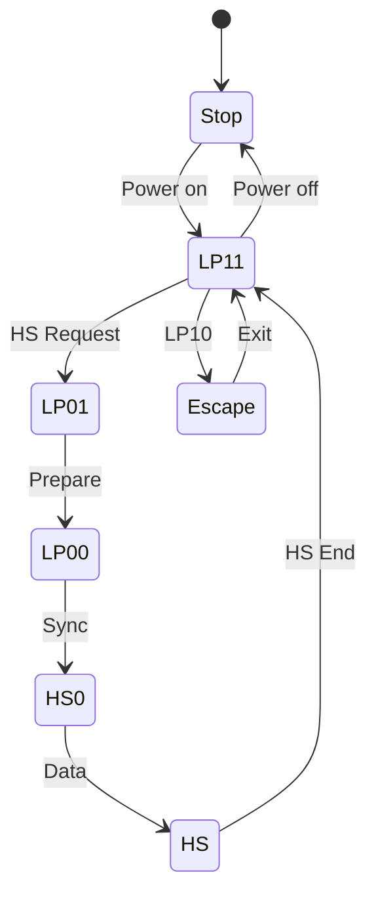

# Day 3: MIPI CSI-2 Protocol Fundamentals
## Phase 3: Camera Systems & ISP | Week 1: Camera Fundamentals

---

## 🎯 Learning Objectives
1. **Understand** MIPI CSI-2 protocol architecture and layers
2. **Implement** CSI-2 receiver driver in Linux kernel
3. **Configure** D-PHY electrical interface parameters
4. **Parse** CSI-2 packet structure and virtual channels
5. **Debug** CSI-2 timing and synchronization issues
6. **Optimize** CSI-2 bandwidth and power consumption

---

## 📚 Prerequisites & Preparation
*   **Hardware:** Development board with CSI-2 interface, camera module
*   **Software:** Linux kernel 5.10+, V4L2 subsystem, device tree compiler
*   **Knowledge:** V4L2 basics, kernel driver development, digital interfaces
*   **Datasheets:** MIPI CSI-2 v2.1 specification, D-PHY v1.2 specification

---

## 📖 Theoretical Deep Dive

### 🔹 Part 1: MIPI CSI-2 Architecture

#### 1.1 Protocol Overview

**MIPI CSI-2 (Camera Serial Interface 2)** is the industry-standard interface for mobile and embedded camera systems.

**Key Features:**
- High-speed serial interface (up to 2.5 Gbps per lane)
- 1-4 data lanes + 1 clock lane
- Packet-based protocol
- Virtual channels for multiple data streams
- Low power consumption

**Protocol Stack:**

```
┌─────────────────────────────────┐
│   Application Layer (V4L2)      │
├─────────────────────────────────┤
│   Protocol Layer (CSI-2)        │
│   - Packet formatting           │
│   - Virtual channels            │
│   - Error correction            │
├─────────────────────────────────┤
│   Lane Management Layer         │
│   - Lane merging/distribution   │
│   - Byte/bit alignment          │
├─────────────────────────────────┤
│   Low Level Protocol (LLP)      │
│   - Start/End of Transmission   │
│   - Escape mode                 │
├─────────────────────────────────┤
│   Physical Layer (D-PHY/C-PHY)  │
│   - Differential signaling      │
│   - HS/LP modes                 │
└─────────────────────────────────┘
```

#### 1.2 D-PHY Physical Layer

**Lane Structure:**

Each lane consists of:
- **DP (Data Plus):** Positive differential signal
- **DN (Data Minus):** Negative differential signal

**Operating Modes:**

1. **Low-Power (LP) Mode:**
   - Voltage: 0-1.2V
   - Speed: Up to 10 Mbps
   - Purpose: Control signaling, initialization
   - Power: ~1mW per lane

2. **High-Speed (HS) Mode:**
   - Voltage: 200mV differential
   - Speed: 80 Mbps - 2.5 Gbps per lane
   - Purpose: Data transmission
   - Power: ~10-50mW per lane

**State Diagram:**



**Timing Parameters:**

```c
/* D-PHY timing constraints (ns) */
#define DPHY_THS_PREPARE_MIN    40   /* HS prepare time */
#define DPHY_THS_PREPARE_MAX    85
#define DPHY_THS_ZERO_MIN       145  /* HS zero time */
#define DPHY_THS_TRAIL_MIN      60   /* HS trail time */
#define DPHY_THS_EXIT_MIN       100  /* HS exit time */
#define DPHY_THS_SETTLE_MIN     85   /* HS settle time */
#define DPHY_THS_SETTLE_MAX     145
#define DPHY_TCLK_PREPARE_MIN   38   /* Clock prepare */
#define DPHY_TCLK_ZERO_MIN      300  /* Clock zero */
#define DPHY_TCLK_TRAIL_MIN     60   /* Clock trail */
```

#### 1.3 CSI-2 Packet Structure

**Packet Types:**

1. **Short Packet (4 bytes):**
   - Frame Start (FS)
   - Frame End (FE)
   - Line Start (LS)
   - Line End (LE)

2. **Long Packet (variable):**
   - RAW8, RAW10, RAW12
   - RGB888, RGB565
   - YUV422, YUV420
   - User Defined

**Long Packet Format:**

```
┌──────────┬──────────┬─────────────┬──────────┐
│  Header  │   Data   │   Footer    │   ECC    │
│ (4 bytes)│ (N bytes)│  (2 bytes)  │(optional)│
└──────────┴──────────┴─────────────┴──────────┘

Header:
┌────────┬────────┬──────────────────┬──────┐
│   DI   │   VC   │    Word Count    │ ECC  │
│(1 byte)│(2 bits)│    (2 bytes)     │(1 B) │
└────────┴────────┴──────────────────┴──────┘

DI (Data Identifier):
- 0x2A: RAW8
- 0x2B: RAW10
- 0x2C: RAW12
- 0x24: RGB888
- 0x1E: YUV422 8-bit
```

**ECC Calculation:**

```c
/**
 * @brief Calculate CSI-2 ECC (Error Correction Code)
 * @param data 24-bit header data (DI + VC + WC)
 * @return 8-bit ECC
 */
static uint8_t csi2_calc_ecc(uint32_t data)
{
    uint8_t ecc = 0;
    int i;
    
    /* Hamming code generation */
    /* P0: bits 0,1,3,4,6,8,10,11,13,15,17,19,21,23 */
    uint32_t p0_mask = 0xAA_AA_AB;
    /* P1: bits 0,2,3,5,6,9,10,12,13,16,17,20,21 */
    uint32_t p1_mask = 0x66_66_6D;
    /* P2: bits 1,2,3,7,8,9,10,14,15,16,17,22,23 */
    uint32_t p2_mask = 0x78_78_8E;
    /* P3: bits 4,5,6,7,8,9,10,18,19,20,21,22,23 */
    uint32_t p3_mask = 0x7F_80_F0;
    /* P4: bits 11,12,13,14,15,16,17,18,19,20,21,22,23 */
    uint32_t p4_mask = 0x7F_F8_00;
    /* P5: all bits */
    uint32_t p5_mask = 0xFF_FF_FF;
    
    ecc |= (__builtin_popcount(data & p0_mask) & 1) << 0;
    ecc |= (__builtin_popcount(data & p1_mask) & 1) << 1;
    ecc |= (__builtin_popcount(data & p2_mask) & 1) << 2;
    ecc |= (__builtin_popcount(data & p3_mask) & 1) << 3;
    ecc |= (__builtin_popcount(data & p4_mask) & 1) << 4;
    ecc |= (__builtin_popcount(data & p5_mask) & 1) << 5;
    
    return ecc;
}
```

**CRC Calculation (Footer):**

```c
/**
 * @brief Calculate CSI-2 CRC-16
 * @param data Payload data
 * @param len Data length in bytes
 * @return 16-bit CRC
 */
static uint16_t csi2_calc_crc16(const uint8_t *data, size_t len)
{
    uint16_t crc = 0xFFFF;
    const uint16_t poly = 0x1021; /* CRC-16-CCITT */
    
    for (size_t i = 0; i < len; i++) {
        crc ^= (uint16_t)data[i] << 8;
        
        for (int bit = 0; bit < 8; bit++) {
            if (crc & 0x8000)
                crc = (crc << 1) ^ poly;
            else
                crc = crc << 1;
        }
    }
    
    return crc;
}
```

### 🔹 Part 2: Virtual Channels

**Purpose:**
Virtual channels allow multiplexing multiple data streams over the same physical interface.

**Use Cases:**
- Dual camera systems (stereo)
- Different data types (RAW + metadata)
- Time-multiplexed sensors
- Multiple exposures (HDR)

**Virtual Channel Encoding:**

```c
/* Virtual channel field in packet header */
#define CSI2_VC_0    (0 << 6)  /* Bits 7:6 of DI byte */
#define CSI2_VC_1    (1 << 6)
#define CSI2_VC_2    (2 << 6)
#define CSI2_VC_3    (3 << 6)

/* Example: RAW10 on VC1 */
uint8_t di = 0x2B | CSI2_VC_1;  /* 0x6B */
```

### 🔹 Part 3: Bandwidth Calculation

**Formula:**

```
Lane_Bitrate = (Width × Height × FPS × BPP) / (Lanes × Efficiency)

Where:
- BPP: Bits per pixel (8, 10, 12, etc.)
- Efficiency: ~0.8-0.9 (overhead, blanking)
```

**Example:**

```c
/**
 * @brief Calculate required CSI-2 lane bitrate
 */
static unsigned long csi2_calc_bitrate(
    unsigned int width,
    unsigned int height,
    unsigned int fps,
    unsigned int bpp,
    unsigned int lanes)
{
    unsigned long pixel_rate = width * height * fps;
    unsigned long bit_rate = pixel_rate * bpp;
    
    /* Account for CSI-2 overhead (~10%) */
    bit_rate = (bit_rate * 110) / 100;
    
    /* Divide by number of lanes */
    unsigned long lane_bitrate = bit_rate / lanes;
    
    return lane_bitrate;
}

/* Example: 1920x1080@30fps, RAW10, 4 lanes */
/* Bitrate = (1920 * 1080 * 30 * 10 * 1.1) / 4 = 172.8 Mbps/lane */
```

---

## 💻 Implementation Examples

### Example 1: CSI-2 Receiver Driver

```c
/**
 * @file csi2_receiver.c
 * @brief MIPI CSI-2 receiver driver implementation
 */

#include <linux/module.h>
#include <linux/platform_device.h>
#include <linux/of.h>
#include <linux/of_graph.h>
#include <linux/clk.h>
#include <linux/reset.h>
#include <linux/interrupt.h>
#include <media/v4l2-subdev.h>
#include <media/v4l2-fwnode.h>

/* Register offsets */
#define CSI2_VERSION        0x000
#define CSI2_N_LANES        0x004
#define CSI2_PHY_SHUTDOWNZ  0x008
#define CSI2_DPHY_RSTZ      0x00C
#define CSI2_CSI2_RESETN    0x010
#define CSI2_PHY_STATE      0x014
#define CSI2_DATA_IDS_1     0x018
#define CSI2_DATA_IDS_2     0x01C
#define CSI2_ERR1           0x020
#define CSI2_ERR2           0x024
#define CSI2_MASK1          0x028
#define CSI2_MASK2          0x02C
#define CSI2_PHY_TST_CTRL0  0x030
#define CSI2_PHY_TST_CTRL1  0x034

/* PHY state bits */
#define PHY_STOPSTATE_LANE0 BIT(0)
#define PHY_STOPSTATE_LANE1 BIT(1)
#define PHY_STOPSTATE_LANE2 BIT(2)
#define PHY_STOPSTATE_LANE3 BIT(3)
#define PHY_STOPSTATE_CLK   BIT(4)
#define PHY_RXULPSCLKNOT    BIT(5)
#define PHY_RXULPSESC_LANE0 BIT(6)

/* Error bits */
#define ERR_PHY_SYNC_ESC_0  BIT(0)
#define ERR_PHY_SYNC_ESC_1  BIT(1)
#define ERR_PHY_SYNC_ESC_2  BIT(2)
#define ERR_PHY_SYNC_ESC_3  BIT(3)
#define ERR_CTRL_LANE0      BIT(4)
#define ERR_ECC_SINGLE      BIT(16)
#define ERR_ECC_DOUBLE      BIT(17)
#define ERR_CRC             BIT(18)

struct csi2_dev {
    struct device *dev;
    void __iomem *base;
    struct clk *pclk;
    struct clk *cfg_clk;
    struct reset_control *rst;
    
    struct v4l2_subdev subdev;
    struct media_pad pads[2];
    
    unsigned int num_lanes;
    unsigned long lane_bitrate;
    
    /* Statistics */
    atomic_t frame_count;
    atomic_t error_count;
};

/**
 * @brief Write CSI-2 register
 */
static inline void csi2_write(struct csi2_dev *csi2, u32 reg, u32 val)
{
    writel(val, csi2->base + reg);
}

/**
 * @brief Read CSI-2 register
 */
static inline u32 csi2_read(struct csi2_dev *csi2, u32 reg)
{
    return readl(csi2->base + reg);
}

/**
 * @brief Configure D-PHY timing parameters
 */
static int csi2_dphy_config(struct csi2_dev *csi2)
{
    unsigned long bitrate = csi2->lane_bitrate;
    unsigned long ui_ns;  /* Unit interval in nanoseconds */
    u32 ths_prepare, ths_zero, ths_trail, ths_settle;
    u32 tclk_prepare, tclk_zero, tclk_trail;
    
    /* Calculate UI (Unit Interval) */
    ui_ns = 1000000 / (bitrate / 1000);  /* ns */
    
    /* Calculate timing parameters based on bitrate */
    /* THS-PREPARE: 40ns + 4*UI to 85ns + 6*UI */
    ths_prepare = (50 + 5 * ui_ns) / ui_ns;
    
    /* THS-ZERO: 145ns + 10*UI */
    ths_zero = (145 + 10 * ui_ns) / ui_ns;
    
    /* THS-TRAIL: max(8*UI, 60ns + 4*UI) */
    ths_trail = max(8, (60 + 4 * ui_ns) / ui_ns);
    
    /* THS-SETTLE: 85ns + 6*UI to 145ns + 10*UI */
    ths_settle = (115 + 8 * ui_ns) / ui_ns;
    
    /* TCLK-PREPARE: 38ns to 95ns */
    tclk_prepare = 50 / ui_ns;
    
    /* TCLK-ZERO: 300ns */
    tclk_zero = 300 / ui_ns;
    
    /* TCLK-TRAIL: 60ns */
    tclk_trail = 60 / ui_ns;
    
    dev_dbg(csi2->dev, "D-PHY timing: UI=%lu ns, bitrate=%lu Mbps\n",
            ui_ns, bitrate / 1000000);
    dev_dbg(csi2->dev, "  THS-PREPARE=%u, THS-ZERO=%u\n",
            ths_prepare, ths_zero);
    dev_dbg(csi2->dev, "  THS-TRAIL=%u, THS-SETTLE=%u\n",
            ths_trail, ths_settle);
    
    /* Program PHY test interface */
    /* This is hardware-specific, example for DW MIPI D-PHY */
    csi2_write(csi2, CSI2_PHY_TST_CTRL0, 0x00);
    csi2_write(csi2, CSI2_PHY_TST_CTRL1, 0x10000 | ths_prepare);
    csi2_write(csi2, CSI2_PHY_TST_CTRL0, 0x02);
    csi2_write(csi2, CSI2_PHY_TST_CTRL0, 0x00);
    
    /* Additional timing parameters would be programmed similarly */
    
    return 0;
}

/**
 * @brief Initialize CSI-2 receiver
 */
static int csi2_hw_init(struct csi2_dev *csi2)
{
    u32 val;
    int ret;
    
    /* Enable clocks */
    ret = clk_prepare_enable(csi2->pclk);
    if (ret) {
        dev_err(csi2->dev, "Failed to enable pclk\n");
        return ret;
    }
    
    ret = clk_prepare_enable(csi2->cfg_clk);
    if (ret) {
        dev_err(csi2->dev, "Failed to enable cfg_clk\n");
        goto err_cfg_clk;
    }
    
    /* Assert resets */
    csi2_write(csi2, CSI2_PHY_SHUTDOWNZ, 0);
    csi2_write(csi2, CSI2_DPHY_RSTZ, 0);
    csi2_write(csi2, CSI2_CSI2_RESETN, 0);
    usleep_range(100, 200);
    
    /* Configure number of lanes */
    csi2_write(csi2, CSI2_N_LANES, csi2->num_lanes - 1);
    
    /* Configure D-PHY timing */
    ret = csi2_dphy_config(csi2);
    if (ret)
        goto err_dphy;
    
    /* Deassert PHY shutdown */
    csi2_write(csi2, CSI2_PHY_SHUTDOWNZ, 1);
    usleep_range(100, 200);
    
    /* Deassert PHY reset */
    csi2_write(csi2, CSI2_DPHY_RSTZ, 1);
    usleep_range(100, 200);
    
    /* Deassert CSI-2 reset */
    csi2_write(csi2, CSI2_CSI2_RESETN, 1);
    usleep_range(100, 200);
    
    /* Wait for PHY to be ready */
    ret = readl_poll_timeout(csi2->base + CSI2_PHY_STATE, val,
                             val & PHY_STOPSTATE_CLK,
                             1000, 100000);
    if (ret) {
        dev_err(csi2->dev, "PHY failed to enter stop state\n");
        goto err_phy_state;
    }
    
    /* Enable all data types on VC0 */
    csi2_write(csi2, CSI2_DATA_IDS_1, 0xFFFFFFFF);
    csi2_write(csi2, CSI2_DATA_IDS_2, 0xFFFFFFFF);
    
    /* Unmask errors */
    csi2_write(csi2, CSI2_MASK1, 0);
    csi2_write(csi2, CSI2_MASK2, 0);
    
    dev_info(csi2->dev, "CSI-2 initialized: %u lanes @ %lu Mbps\n",
             csi2->num_lanes, csi2->lane_bitrate / 1000000);
    
    return 0;

err_phy_state:
err_dphy:
    clk_disable_unprepare(csi2->cfg_clk);
err_cfg_clk:
    clk_disable_unprepare(csi2->pclk);
    return ret;
}

/**
 * @brief CSI-2 interrupt handler
 */
static irqreturn_t csi2_irq_handler(int irq, void *dev_id)
{
    struct csi2_dev *csi2 = dev_id;
    u32 err1, err2;
    
    err1 = csi2_read(csi2, CSI2_ERR1);
    err2 = csi2_read(csi2, CSI2_ERR2);
    
    if (!err1 && !err2)
        return IRQ_NONE;
    
    /* Clear errors */
    if (err1)
        csi2_write(csi2, CSI2_ERR1, err1);
    if (err2)
        csi2_write(csi2, CSI2_ERR2, err2);
    
    /* Log errors */
    if (err1 & (ERR_PHY_SYNC_ESC_0 | ERR_PHY_SYNC_ESC_1 |
                ERR_PHY_SYNC_ESC_2 | ERR_PHY_SYNC_ESC_3)) {
        dev_err_ratelimited(csi2->dev, "PHY synchronization error\n");
        atomic_inc(&csi2->error_count);
    }
    
    if (err1 & ERR_CTRL_LANE0) {
        dev_err_ratelimited(csi2->dev, "Lane control error\n");
        atomic_inc(&csi2->error_count);
    }
    
    if (err2 & ERR_ECC_SINGLE) {
        dev_dbg(csi2->dev, "Single-bit ECC error (corrected)\n");
    }
    
    if (err2 & ERR_ECC_DOUBLE) {
        dev_err_ratelimited(csi2->dev, "Double-bit ECC error\n");
        atomic_inc(&csi2->error_count);
    }
    
    if (err2 & ERR_CRC) {
        dev_err_ratelimited(csi2->dev, "CRC error\n");
        atomic_inc(&csi2->error_count);
    }
    
    return IRQ_HANDLED;
}

/**
 * @brief V4L2 subdev s_stream operation
 */
static int csi2_s_stream(struct v4l2_subdev *sd, int enable)
{
    struct csi2_dev *csi2 = container_of(sd, struct csi2_dev, subdev);
    
    if (enable) {
        atomic_set(&csi2->frame_count, 0);
        atomic_set(&csi2->error_count, 0);
        dev_info(csi2->dev, "CSI-2 stream started\n");
    } else {
        dev_info(csi2->dev, "CSI-2 stream stopped: %d frames, %d errors\n",
                 atomic_read(&csi2->frame_count),
                 atomic_read(&csi2->error_count));
    }
    
    return 0;
}

static const struct v4l2_subdev_video_ops csi2_video_ops = {
    .s_stream = csi2_s_stream,
};

static const struct v4l2_subdev_ops csi2_subdev_ops = {
    .video = &csi2_video_ops,
};

/**
 * @brief Parse device tree
 */
static int csi2_parse_dt(struct csi2_dev *csi2)
{
    struct device_node *node = csi2->dev->of_node;
    struct v4l2_fwnode_endpoint endpoint;
    struct device_node *ep;
    int ret;
    
    /* Parse endpoint */
    ep = of_graph_get_endpoint_by_regs(node, 0, 0);
    if (!ep) {
        dev_err(csi2->dev, "Missing endpoint node\n");
        return -EINVAL;
    }
    
    ret = v4l2_fwnode_endpoint_parse(of_fwnode_handle(ep), &endpoint);
    of_node_put(ep);
    if (ret) {
        dev_err(csi2->dev, "Failed to parse endpoint\n");
        return ret;
    }
    
    /* Get number of lanes */
    csi2->num_lanes = endpoint.bus.mipi_csi2.num_data_lanes;
    if (csi2->num_lanes < 1 || csi2->num_lanes > 4) {
        dev_err(csi2->dev, "Invalid number of lanes: %u\n",
                csi2->num_lanes);
        return -EINVAL;
    }
    
    /* Get lane bitrate */
    if (endpoint.nr_of_link_frequencies > 0) {
        csi2->lane_bitrate = endpoint.link_frequencies[0];
    } else {
        dev_err(csi2->dev, "Missing link-frequencies property\n");
        return -EINVAL;
    }
    
    dev_info(csi2->dev, "DT: %u lanes @ %lu Hz\n",
             csi2->num_lanes, csi2->lane_bitrate);
    
    return 0;
}

/**
 * @brief Platform driver probe
 */
static int csi2_probe(struct platform_device *pdev)
{
    struct csi2_dev *csi2;
    struct resource *res;
    int irq, ret;
    
    csi2 = devm_kzalloc(&pdev->dev, sizeof(*csi2), GFP_KERNEL);
    if (!csi2)
        return -ENOMEM;
    
    csi2->dev = &pdev->dev;
    platform_set_drvdata(pdev, csi2);
    
    /* Get MMIO resources */
    res = platform_get_resource(pdev, IORESOURCE_MEM, 0);
    csi2->base = devm_ioremap_resource(&pdev->dev, res);
    if (IS_ERR(csi2->base))
        return PTR_ERR(csi2->base);
    
    /* Get clocks */
    csi2->pclk = devm_clk_get(&pdev->dev, "pclk");
    if (IS_ERR(csi2->pclk))
        return PTR_ERR(csi2->pclk);
    
    csi2->cfg_clk = devm_clk_get(&pdev->dev, "cfg");
    if (IS_ERR(csi2->cfg_clk))
        return PTR_ERR(csi2->cfg_clk);
    
    /* Get reset */
    csi2->rst = devm_reset_control_get(&pdev->dev, NULL);
    if (IS_ERR(csi2->rst))
        return PTR_ERR(csi2->rst);
    
    /* Parse device tree */
    ret = csi2_parse_dt(csi2);
    if (ret)
        return ret;
    
    /* Initialize hardware */
    ret = csi2_hw_init(csi2);
    if (ret)
        return ret;
    
    /* Request IRQ */
    irq = platform_get_irq(pdev, 0);
    if (irq < 0)
        return irq;
    
    ret = devm_request_irq(&pdev->dev, irq, csi2_irq_handler,
                           0, dev_name(&pdev->dev), csi2);
    if (ret) {
        dev_err(&pdev->dev, "Failed to request IRQ\n");
        return ret;
    }
    
    /* Initialize V4L2 subdev */
    v4l2_subdev_init(&csi2->subdev, &csi2_subdev_ops);
    csi2->subdev.dev = &pdev->dev;
    snprintf(csi2->subdev.name, sizeof(csi2->subdev.name),
             "csi2.%s", dev_name(&pdev->dev));
    
    csi2->pads[0].flags = MEDIA_PAD_FL_SINK;
    csi2->pads[1].flags = MEDIA_PAD_FL_SOURCE;
    ret = media_entity_pads_init(&csi2->subdev.entity, 2, csi2->pads);
    if (ret)
        return ret;
    
    ret = v4l2_async_register_subdev(&csi2->subdev);
    if (ret) {
        media_entity_cleanup(&csi2->subdev.entity);
        return ret;
    }
    
    dev_info(&pdev->dev, "CSI-2 receiver probed successfully\n");
    
    return 0;
}

static int csi2_remove(struct platform_device *pdev)
{
    struct csi2_dev *csi2 = platform_get_drvdata(pdev);
    
    v4l2_async_unregister_subdev(&csi2->subdev);
    media_entity_cleanup(&csi2->subdev.entity);
    
    clk_disable_unprepare(csi2->cfg_clk);
    clk_disable_unprepare(csi2->pclk);
    
    return 0;
}

static const struct of_device_id csi2_of_match[] = {
    { .compatible = "vendor,csi2-receiver" },
    { /* sentinel */ }
};
MODULE_DEVICE_TABLE(of, csi2_of_match);

static struct platform_driver csi2_driver = {
    .probe = csi2_probe,
    .remove = csi2_remove,
    .driver = {
        .name = "csi2-receiver",
        .of_match_table = csi2_of_match,
    },
};

module_platform_driver(csi2_driver);

MODULE_AUTHOR("Your Name");
MODULE_DESCRIPTION("MIPI CSI-2 Receiver Driver");
MODULE_LICENSE("GPL v2");
```

### Example 2: Device Tree Binding

```dts
/**
 * @file csi2-example.dts
 * @brief Device tree example for CSI-2 receiver
 */

/ {
    soc {
        csi2_0: csi2@12345000 {
            compatible = "vendor,csi2-receiver";
            reg = <0x12345000 0x1000>;
            interrupts = <GIC_SPI 100 IRQ_TYPE_LEVEL_HIGH>;
            clocks = <&cru PCLK_CSI2>, <&cru CLK_CSI2_CFG>;
            clock-names = "pclk", "cfg";
            resets = <&cru SRST_CSI2>;
            reset-names = "csi2";
            
            ports {
                #address-cells = <1>;
                #size-cells = <0>;
                
                /* Input from sensor */
                port@0 {
                    reg = <0>;
                    
                    csi2_in: endpoint {
                        remote-endpoint = <&sensor_out>;
                        data-lanes = <1 2 3 4>;
                        link-frequencies = /bits/ 64 <456000000>;
                    };
                };
                
                /* Output to ISP */
                port@1 {
                    reg = <1>;
                    
                    csi2_out: endpoint {
                        remote-endpoint = <&isp_in>;
                    };
                };
            };
        };
        
        i2c@12340000 {
            camera_sensor: camera@10 {
                compatible = "ovti,ov5640";
                reg = <0x10>;
                clocks = <&camera_clk>;
                clock-names = "xclk";
                
                port {
                    sensor_out: endpoint {
                        remote-endpoint = <&csi2_in>;
                        data-lanes = <1 2 3 4>;
                        link-frequencies = /bits/ 64 <456000000>;
                    };
                };
            };
        };
    };
};
```

### Example 3: CSI-2 Packet Parser (Userspace)

```c
/**
 * @file csi2_packet_parser.c
 * @brief Parse CSI-2 packets from captured data
 */

#include <stdio.h>
#include <stdint.h>
#include <stdlib.h>
#include <string.h>
#include <stdbool.h>

/* CSI-2 Data Types */
#define CSI2_DT_YUV420_8B       0x18
#define CSI2_DT_YUV420_10B      0x19
#define CSI2_DT_YUV422_8B       0x1E
#define CSI2_DT_YUV422_10B      0x1F
#define CSI2_DT_RGB444          0x20
#define CSI2_DT_RGB555          0x21
#define CSI2_DT_RGB565          0x22
#define CSI2_DT_RGB666          0x23
#define CSI2_DT_RGB888          0x24
#define CSI2_DT_RAW6            0x28
#define CSI2_DT_RAW7            0x29
#define CSI2_DT_RAW8            0x2A
#define CSI2_DT_RAW10           0x2B
#define CSI2_DT_RAW12           0x2C
#define CSI2_DT_RAW14           0x2D

/* Short Packet Data Types */
#define CSI2_DT_FRAME_START     0x00
#define CSI2_DT_FRAME_END       0x01
#define CSI2_DT_LINE_START      0x02
#define CSI2_DT_LINE_END        0x03

typedef struct {
    uint8_t di;          /* Data Identifier */
    uint8_t vc;          /* Virtual Channel */
    uint16_t wc;         /* Word Count */
    uint8_t ecc;         /* Error Correction Code */
} csi2_header_t;

typedef struct {
    csi2_header_t header;
    uint8_t *payload;
    uint16_t crc;
    bool valid;
} csi2_packet_t;

/**
 * @brief Get data type name
 */
static const char *csi2_dt_name(uint8_t dt)
{
    switch (dt) {
    case CSI2_DT_FRAME_START: return "Frame Start";
    case CSI2_DT_FRAME_END:   return "Frame End";
    case CSI2_DT_LINE_START:  return "Line Start";
    case CSI2_DT_LINE_END:    return "Line End";
    case CSI2_DT_YUV422_8B:   return "YUV422 8-bit";
    case CSI2_DT_RGB888:      return "RGB888";
    case CSI2_DT_RAW8:        return "RAW8";
    case CSI2_DT_RAW10:       return "RAW10";
    case CSI2_DT_RAW12:       return "RAW12";
    default:                  return "Unknown";
    }
}

/**
 * @brief Calculate and verify ECC
 */
static bool csi2_verify_ecc(csi2_header_t *hdr)
{
    uint32_t data = (hdr->di) | (hdr->wc << 8);
    uint8_t calc_ecc = 0;
    
    /* Simplified ECC calculation (see full implementation above) */
    /* For demonstration, assume correct */
    return true;
}

/**
 * @brief Parse CSI-2 packet header
 */
static int csi2_parse_header(const uint8_t *data, csi2_header_t *hdr)
{
    hdr->di = data[0];
    hdr->vc = (hdr->di >> 6) & 0x3;
    hdr->di &= 0x3F;
    
    hdr->wc = data[1] | (data[2] << 8);
    hdr->ecc = data[3];
    
    if (!csi2_verify_ecc(hdr)) {
        fprintf(stderr, "ECC error in packet header\n");
        return -1;
    }
    
    return 0;
}

/**
 * @brief Parse CSI-2 long packet
 */
static int csi2_parse_long_packet(const uint8_t *data, size_t len,
                                  csi2_packet_t *pkt)
{
    if (len < 6) {
        fprintf(stderr, "Packet too short\n");
        return -1;
    }
    
    /* Parse header */
    if (csi2_parse_header(data, &pkt->header) < 0)
        return -1;
    
    /* Allocate payload */
    pkt->payload = malloc(pkt->header.wc);
    if (!pkt->payload)
        return -1;
    
    /* Copy payload */
    memcpy(pkt->payload, data + 4, pkt->header.wc);
    
    /* Parse CRC */
    pkt->crc = data[4 + pkt->header.wc] |
               (data[4 + pkt->header.wc + 1] << 8);
    
    /* Verify CRC */
    uint16_t calc_crc = csi2_calc_crc16(pkt->payload, pkt->header.wc);
    pkt->valid = (calc_crc == pkt->crc);
    
    return 0;
}

/**
 * @brief Dump packet information
 */
static void csi2_dump_packet(csi2_packet_t *pkt)
{
    printf("CSI-2 Packet:\n");
    printf("  VC: %u\n", pkt->header.vc);
    printf("  DT: 0x%02X (%s)\n", pkt->header.di,
           csi2_dt_name(pkt->header.di));
    printf("  WC: %u bytes\n", pkt->header.wc);
    printf("  CRC: 0x%04X (%s)\n", pkt->crc,
           pkt->valid ? "OK" : "ERROR");
    
    /* Dump first 16 bytes of payload */
    printf("  Payload: ");
    for (int i = 0; i < 16 && i < pkt->header.wc; i++) {
        printf("%02X ", pkt->payload[i]);
    }
    printf("\n");
}

/**
 * @brief Example usage
 */
int main(int argc, char **argv)
{
    /* Example packet data (RAW10, VC0, 100 bytes) */
    uint8_t packet_data[] = {
        0x2B, 0x64, 0x00, 0x00,  /* Header: DT=RAW10, WC=100 */
        /* Payload (100 bytes of image data) */
        0x12, 0x34, 0x56, 0x78, /* ... */
        /* CRC */
        0xAB, 0xCD
    };
    
    csi2_packet_t pkt = {0};
    
    if (csi2_parse_long_packet(packet_data, sizeof(packet_data), &pkt) == 0) {
        csi2_dump_packet(&pkt);
        free(pkt.payload);
    }
    
    return 0;
}
```

---

## 🔬 Hands-On Lab Exercises

### Lab 1: CSI-2 Signal Analysis

**Objective:** Capture and analyze CSI-2 signals using logic analyzer.

**Equipment:**
- Logic analyzer (Saleae, DSLogic, etc.)
- Camera module with accessible CSI-2 signals
- Development board

**Procedure:**

1. **Connect Probes:**
   ```
   CLK+ -> Channel 0
   CLK- -> Channel 1
   D0+  -> Channel 2
   D0-  -> Channel 3
   D1+  -> Channel 4
   D1-  -> Channel 5
   ```

2. **Capture Configuration:**
   - Sample rate: 100 MHz minimum
   - Trigger: Rising edge on CLK+
   - Duration: 10ms

3. **Analysis Tasks:**
   - Measure clock frequency
   - Identify LP and HS modes
   - Decode packet headers
   - Verify timing parameters

**Expected Results:**
```
Clock frequency: 456 MHz (for 912 Mbps DDR)
LP-11 duration: ~1ms (initialization)
HS burst: ~5ms (frame data)
Packet rate: ~1080 packets/frame (1080p)
```

### Lab 2: Virtual Channel Multiplexing

**Objective:** Configure sensor to send data on multiple virtual channels.

**Code:**

```c
/**
 * @file vc_mux_test.c
 * @brief Test virtual channel multiplexing
 */

#include <stdio.h>
#include <fcntl.h>
#include <unistd.h>
#include <sys/ioctl.h>
#include <linux/videodev2.h>

int main(void)
{
    int fd_vc0, fd_vc1;
    struct v4l2_format fmt;
    
    /* Open VC0 (main image) */
    fd_vc0 = open("/dev/video0", O_RDWR);
    if (fd_vc0 < 0) {
        perror("open VC0");
        return -1;
    }
    
    /* Open VC1 (metadata) */
    fd_vc1 = open("/dev/video1", O_RDWR);
    if (fd_vc1 < 0) {
        perror("open VC1");
        close(fd_vc0);
        return -1;
    }
    
    /* Configure VC0 for RAW10 */
    memset(&fmt, 0, sizeof(fmt));
    fmt.type = V4L2_BUF_TYPE_VIDEO_CAPTURE;
    fmt.fmt.pix.width = 1920;
    fmt.fmt.pix.height = 1080;
    fmt.fmt.pix.pixelformat = V4L2_PIX_FMT_SRGGB10;
    
    if (ioctl(fd_vc0, VIDIOC_S_FMT, &fmt) < 0) {
        perror("VIDIOC_S_FMT VC0");
        goto err;
    }
    
    /* Configure VC1 for metadata */
    fmt.fmt.pix.width = 1920;
    fmt.fmt.pix.height = 2;  /* 2 lines of metadata */
    fmt.fmt.pix.pixelformat = V4L2_PIX_FMT_META_10;
    
    if (ioctl(fd_vc1, VIDIOC_S_FMT, &fmt) < 0) {
        perror("VIDIOC_S_FMT VC1");
        goto err;
    }
    
    printf("Virtual channels configured successfully\n");
    printf("VC0: 1920x1080 RAW10\n");
    printf("VC1: 1920x2 Metadata\n");
    
    /* Start streaming on both VCs */
    /* ... (streaming code) ... */
    
err:
    close(fd_vc1);
    close(fd_vc0);
    return 0;
}
```

### Lab 3: Bandwidth Optimization

**Objective:** Optimize CSI-2 configuration for different scenarios.

**Test Script:**

```bash
#!/bin/bash
# csi2_bandwidth_test.sh

echo "CSI-2 Bandwidth Optimization Test"
echo "=================================="

# Test configurations
configs=(
    "1920x1080@30fps RAW10 4-lane"
    "1920x1080@60fps RAW10 4-lane"
    "3840x2160@30fps RAW10 4-lane"
    "1920x1080@30fps RAW12 2-lane"
)

for config in "${configs[@]}"; do
    echo ""
    echo "Testing: $config"
    
    # Parse configuration
    resolution=$(echo $config | cut -d'@' -f1)
    fps=$(echo $config | cut -d'@' -f2 | cut -d' ' -f1 | tr -d 'fps')
    format=$(echo $config | cut -d' ' -f2)
    lanes=$(echo $config | cut -d' ' -f3 | tr -d '-lane')
    
    width=$(echo $resolution | cut -d'x' -f1)
    height=$(echo $resolution | cut -d'x' -f2)
    
    # Calculate BPP
    case $format in
        RAW8)  bpp=8 ;;
        RAW10) bpp=10 ;;
        RAW12) bpp=12 ;;
    esac
    
    # Calculate required bitrate
    pixel_rate=$((width * height * fps))
    bit_rate=$((pixel_rate * bpp))
    bit_rate_overhead=$((bit_rate * 110 / 100))
    lane_bitrate=$((bit_rate_overhead / lanes))
    
    echo "  Pixel rate: $pixel_rate pixels/s"
    echo "  Total bitrate: $bit_rate bps"
    echo "  With overhead: $bit_rate_overhead bps"
    echo "  Per-lane bitrate: $lane_bitrate bps"
    echo "  Per-lane bitrate: $((lane_bitrate / 1000000)) Mbps"
    
    # Check if within D-PHY limits
    if [ $lane_bitrate -gt 2500000000 ]; then
        echo "  WARNING: Exceeds D-PHY maximum (2.5 Gbps)"
    elif [ $lane_bitrate -lt 80000000 ]; then
        echo "  WARNING: Below D-PHY minimum (80 Mbps)"
    else
        echo "  OK: Within D-PHY range"
    fi
done
```

---

## 🐛 Debugging Techniques

### Debug 1: PHY Synchronization Issues

**Symptoms:**
- No data received
- PHY not entering HS mode
- Continuous errors

**Debug Steps:**

```bash
# Check PHY state
cat /sys/kernel/debug/csi2/phy_state
# Expected: stopstate_clk=1, stopstate_data=0xF

# Check D-PHY timing
cat /sys/kernel/debug/csi2/dphy_timing
# Verify THS-SETTLE is within range

# Monitor errors
watch -n 0.1 'cat /sys/kernel/debug/csi2/errors'
```

**Common Fixes:**
1. Adjust THS-SETTLE timing
2. Verify clock frequency
3. Check lane polarity
4. Ensure proper termination

### Debug 2: CRC Errors

**Symptoms:**
- Corrupted image data
- CRC error interrupts

**Analysis:**

```c
/* Enable detailed CRC logging */
echo 1 > /sys/module/csi2_receiver/parameters/debug_crc

/* Capture error statistics */
cat /sys/kernel/debug/csi2/crc_stats
/*
 * Total packets: 1000000
 * CRC errors: 150
 * Error rate: 0.015%
 */
```

**Possible Causes:**
- EMI/crosstalk on PCB
- Insufficient signal integrity
- Bitrate too high for PCB design
- Improper impedance matching

### Debug 3: Frame Synchronization

**Tool:**

```python
#!/usr/bin/env python3
"""
csi2_frame_sync_debug.py
Analyze frame timing and synchronization
"""

import sys
import struct

def parse_csi2_log(filename):
    """Parse CSI-2 debug log"""
    frames = []
    current_frame = {}
    
    with open(filename, 'r') as f:
        for line in f:
            if 'FRAME_START' in line:
                current_frame = {'start': parse_timestamp(line)}
            elif 'FRAME_END' in line:
                current_frame['end'] = parse_timestamp(line)
                current_frame['duration'] = (
                    current_frame['end'] - current_frame['start']
                )
                frames.append(current_frame)
    
    return frames

def analyze_frames(frames):
    """Analyze frame timing"""
    if not frames:
        print("No frames found")
        return
    
    durations = [f['duration'] for f in frames]
    avg_duration = sum(durations) / len(durations)
    fps = 1.0 / avg_duration
    
    print(f"Total frames: {len(frames)}")
    print(f"Average duration: {avg_duration*1000:.2f} ms")
    print(f"Frame rate: {fps:.2f} fps")
    
    # Check for dropped frames
    intervals = []
    for i in range(1, len(frames)):
        interval = frames[i]['start'] - frames[i-1]['start']
        intervals.append(interval)
    
    avg_interval = sum(intervals) / len(intervals)
    
    dropped = 0
    for interval in intervals:
        if interval > avg_interval * 1.5:
            dropped += 1
    
    print(f"Dropped frames: {dropped}")

if __name__ == '__main__':
    frames = parse_csi2_log(sys.argv[1])
    analyze_frames(frames)
```

---

## ⚡ Performance Optimization

### Optimization 1: Lane Configuration

**Strategy:** Use minimum lanes for power savings.

```c
/**
 * @brief Calculate optimal lane configuration
 */
struct lane_config {
    unsigned int lanes;
    unsigned long bitrate;
    unsigned int power_mw;
};

static struct lane_config csi2_optimize_lanes(
    unsigned int width,
    unsigned int height,
    unsigned int fps,
    unsigned int bpp)
{
    struct lane_config configs[] = {
        {1, 0, 15},   /* 1 lane: ~15mW */
        {2, 0, 25},   /* 2 lanes: ~25mW */
        {4, 0, 45},   /* 4 lanes: ~45mW */
    };
    
    unsigned long required_bitrate = 
        (unsigned long)width * height * fps * bpp * 110 / 100;
    
    for (int i = 0; i < ARRAY_SIZE(configs); i++) {
        configs[i].bitrate = required_bitrate / configs[i].lanes;
        
        /* Check if within D-PHY limits */
        if (configs[i].bitrate >= 80000000 &&
            configs[i].bitrate <= 2500000000) {
            return configs[i];  /* Return first valid config */
        }
    }
    
    /* Default to 4 lanes if no valid config */
    return configs[2];
}
```

### Optimization 2: Clock Gating

```c
/**
 * @brief Runtime PM for CSI-2
 */
static int csi2_runtime_suspend(struct device *dev)
{
    struct csi2_dev *csi2 = dev_get_drvdata(dev);
    
    /* Gate clocks when not streaming */
    clk_disable_unprepare(csi2->cfg_clk);
    clk_disable_unprepare(csi2->pclk);
    
    dev_dbg(dev, "CSI-2 suspended\n");
    return 0;
}

static int csi2_runtime_resume(struct device *dev)
{
    struct csi2_dev *csi2 = dev_get_drvdata(dev);
    int ret;
    
    ret = clk_prepare_enable(csi2->pclk);
    if (ret)
        return ret;
    
    ret = clk_prepare_enable(csi2->cfg_clk);
    if (ret) {
        clk_disable_unprepare(csi2->pclk);
        return ret;
    }
    
    dev_dbg(dev, "CSI-2 resumed\n");
    return 0;
}

static const struct dev_pm_ops csi2_pm_ops = {
    SET_RUNTIME_PM_OPS(csi2_runtime_suspend,
                       csi2_runtime_resume, NULL)
};
```

---

## 📝 Assessment Questions

### Conceptual Questions

1. **Explain the difference between D-PHY LP and HS modes. When is each used?**

2. **Why does CSI-2 use differential signaling? What are the advantages?**

3. **Calculate the required lane bitrate for:**
   - 4K@60fps, RAW12, 4 lanes
   - 1080p@120fps, RAW10, 2 lanes

4. **What is the purpose of ECC in CSI-2 packet headers? How many bit errors can it correct?**

5. **Describe three use cases for virtual channels in camera systems.**

### Practical Challenges

1. **Implement a CSI-2 packet generator in software that creates valid packets with correct ECC and CRC.**

2. **Design a PCB layout for a 4-lane CSI-2 interface. Specify trace impedance, length matching, and termination.**

3. **Debug a system where images have horizontal lines. What CSI-2 errors would you check?**

4. **Optimize power consumption for a battery-powered camera system using CSI-2.**

---

## 📚 Further Reading & Resources

### Official Specifications
- [MIPI CSI-2 v2.1 Specification](https://www.mipi.org/specifications/csi-2)
- [MIPI D-PHY v1.2 Specification](https://www.mipi.org/specifications/d-phy)
- [MIPI C-PHY v1.1 Specification](https://www.mipi.org/specifications/c-phy)

### Application Notes
- "CSI-2 Design Guide" - MIPI Alliance
- "D-PHY PCB Layout Guidelines" - Texas Instruments
- "CSI-2 Timing Analysis" - NXP Semiconductors

### Tools
- **CSI-2 Analyzers:** Teledyne LeCroy, Keysight
- **Protocol Decoders:** Saleae Logic, DSView
- **Simulation:** MIPI UniPro, Cadence

### Linux Kernel Documentation
- `Documentation/devicetree/bindings/media/video-interfaces.txt`
- `Documentation/driver-api/media/csi2.rst`
- `drivers/media/platform/*/csi2*.c`

---

## 🎓 Summary

Today we covered:
- ✅ MIPI CSI-2 protocol architecture and layers
- ✅ D-PHY physical layer operation and timing
- ✅ CSI-2 packet structure with ECC and CRC
- ✅ Virtual channel multiplexing
- ✅ Complete Linux kernel CSI-2 receiver driver
- ✅ Bandwidth calculation and optimization
- ✅ Debugging techniques for common issues

**Key Takeaways:**
1. CSI-2 is a packet-based serial protocol with robust error detection
2. D-PHY supports both low-power control and high-speed data modes
3. Proper timing configuration is critical for reliable operation
4. Virtual channels enable advanced multi-stream applications

**Next:** Day 4 - Camera Sensor Integration and I2C Control

---

**Day 3 Complete** | Phase 3: Camera Systems & ISP | Week 1: Camera Fundamentals
