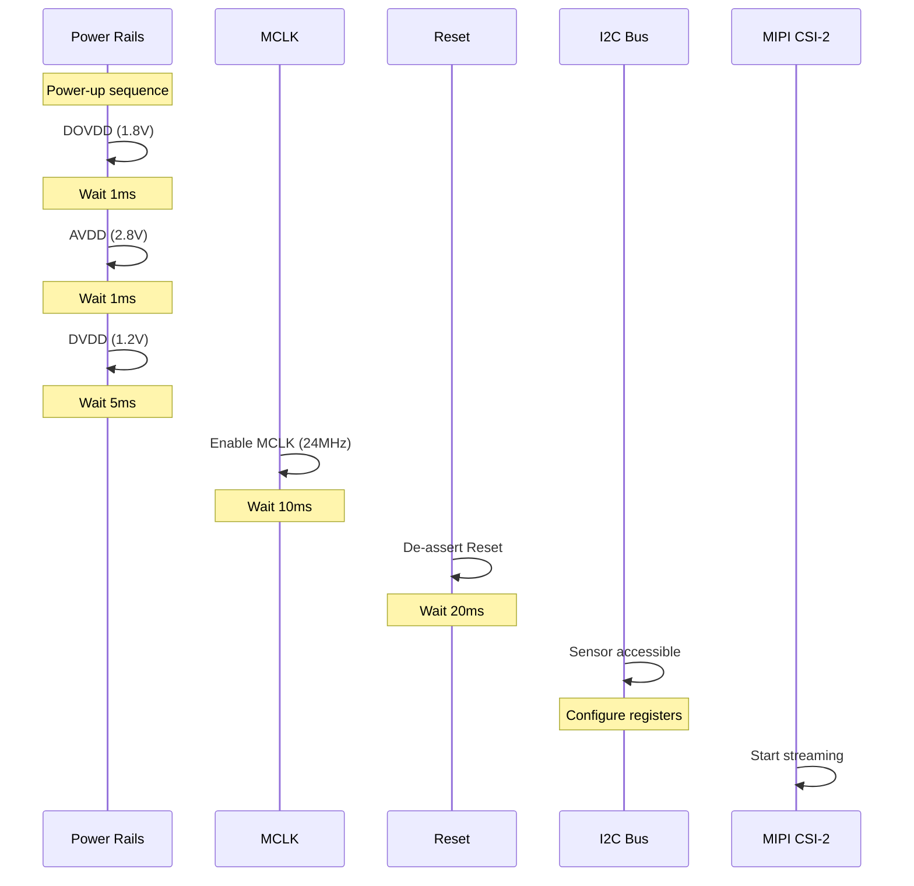

# Day 4: Camera Sensor Integration and I2C Control
## Phase 3: Camera Systems & ISP | Week 1: Camera Fundamentals

---

## 🎯 Learning Objectives
1. **Understand** camera sensor I2C/I3C control interfaces
2. **Implement** sensor driver with register configuration
3. **Configure** exposure, gain, and timing parameters
4. **Integrate** sensor with V4L2 and media controller frameworks
5. **Debug** I2C communication and sensor initialization
6. **Optimize** sensor power sequencing and performance

---

## 📚 Prerequisites & Preparation
*   **Hardware:** Camera sensor module (OV5640, IMX219, etc.), I2C bus access
*   **Software:** Linux kernel with I2C and V4L2 support, i2c-tools package
*   **Knowledge:** I2C protocol, V4L2 subdev API, device tree
*   **Datasheets:** Sensor datasheet with register map

---

## 📖 Theoretical Deep Dive

### 🔹 Part 1: Camera Sensor Control Interfaces

#### 1.1 I2C/I3C Overview

**I2C (Inter-Integrated Circuit):**
- **Speed:** Standard (100 kHz), Fast (400 kHz), Fast+ (1 MHz)
- **Addressing:** 7-bit or 10-bit slave addresses
- **Topology:** Multi-master, multi-slave bus
- **Signals:** SDA (data), SCL (clock)

**I3C (Improved Inter-Integrated Circuit):**
- **Speed:** Up to 12.5 MHz SDR, 25 MHz HDR
- **Backward compatible** with I2C
- **In-band interrupts** (no separate GPIO needed)
- **Dynamic addressing**

**Camera Sensor Usage:**
- Register read/write for configuration
- Exposure, gain, timing control
- Feature enable/disable
- Status monitoring

#### 1.2 Sensor Register Architecture

**Typical Register Map:**

```
Address Range    Purpose
0x0000-0x00FF    Chip ID, version
0x0100-0x01FF    System control (power, reset, streaming)
0x0200-0x02FF    Clock and timing
0x0300-0x03FF    Exposure control
0x0350-0x035F    Analog gain
0x0360-0x036F    Digital gain
0x0380-0x03FF    Image format and size
0x3000-0x3FFF    ISP and image processing
0x5000-0x5FFF    Advanced features (HDR, binning)
```

**Register Access Patterns:**

1. **8-bit Address, 8-bit Data:**
   ```
   Write: [ADDR] [DATA]
   Read:  [ADDR] [DATA_READ]
   ```

2. **16-bit Address, 8-bit Data (most common):**
   ```
   Write: [ADDR_H] [ADDR_L] [DATA]
   Read:  [ADDR_H] [ADDR_L] [DATA_READ]
   ```

3. **16-bit Address, 16-bit Data:**
   ```
   Write: [ADDR_H] [ADDR_L] [DATA_H] [DATA_L]
   ```

#### 1.3 Power Sequencing

**Critical Timing Requirements:**



**Power Rails:**
- **DOVDD:** Digital I/O (1.8V typical)
- **AVDD:** Analog (2.8V typical)
- **DVDD:** Digital core (1.2V typical)
- **AFVDD:** Autofocus (2.8V, if applicable)

### 🔹 Part 2: Exposure and Gain Control

#### 2.1 Exposure Time

**Exposure Formula:**

```
Exposure_Time = Exposure_Lines × Line_Time

Where:
Line_Time = (Line_Length_Pixels) / (Pixel_Clock)

Example:
Line_Length = 2200 pixels
Pixel_Clock = 84 MHz
Line_Time = 2200 / 84,000,000 = 26.19 μs

For 100 lines exposure:
Exposure_Time = 100 × 26.19 μs = 2.619 ms
```

**Register Configuration:**

```c
/* OV5640 example: 16-bit exposure value */
#define OV5640_REG_EXPOSURE_HI   0x3500
#define OV5640_REG_EXPOSURE_MID  0x3501
#define OV5640_REG_EXPOSURE_LO   0x3502

/**
 * @brief Set exposure time in lines
 */
static int ov5640_set_exposure(struct ov5640_dev *sensor, u32 lines)
{
    u8 exp_hi = (lines >> 16) & 0x0F;  /* Bits 19:16 */
    u8 exp_mid = (lines >> 8) & 0xFF;   /* Bits 15:8 */
    u8 exp_lo = lines & 0xFF;           /* Bits 7:0 */
    int ret;
    
    ret = ov5640_write_reg(sensor, OV5640_REG_EXPOSURE_HI, exp_hi);
    if (ret)
        return ret;
    
    ret = ov5640_write_reg(sensor, OV5640_REG_EXPOSURE_MID, exp_mid);
    if (ret)
        return ret;
    
    ret = ov5640_write_reg(sensor, OV5640_REG_EXPOSURE_LO, exp_lo);
    
    return ret;
}
```

#### 2.2 Gain Control

**Gain Types:**

1. **Analog Gain:**
   - Applied in sensor pixel array
   - Lower noise than digital gain
   - Limited range (typically 1x to 16x)

2. **Digital Gain:**
   - Applied after ADC
   - Amplifies noise
   - Wider range possible

**Gain Calculation:**

```c
/**
 * @brief Convert gain value to register setting
 * 
 * OV5640 gain format:
 * Gain = (1 + gain[6]/16) × (1 + gain[5]/8) × 
 *        (1 + gain[4]/4) × (1 + gain[3]/2) × (1 + gain[2:0])
 */
static u16 ov5640_gain_to_reg(u32 gain_x1000)
{
    u16 reg = 0;
    u32 gain = gain_x1000;  /* Gain in 1/1000 units */
    
    /* Coarse gain (bits 6:4) */
    if (gain >= 8000) {
        reg |= BIT(6);  /* +16/16 */
        gain = gain * 16 / 32;
    }
    if (gain >= 4000) {
        reg |= BIT(5);  /* +8/8 */
        gain = gain * 8 / 16;
    }
    if (gain >= 2000) {
        reg |= BIT(4);  /* +4/4 */
        gain = gain * 4 / 8;
    }
    
    /* Fine gain (bits 3:0) */
    reg |= ((gain - 1000) * 16 / 1000) & 0x0F;
    
    return reg;
}
```

#### 2.3 Auto Exposure (AE) Algorithm

**Basic AE Loop:**

```c
/**
 * @brief Simple auto-exposure algorithm
 */
struct ae_state {
    u32 target_brightness;  /* Target average luminance (0-255) */
    u32 current_exposure;   /* Current exposure in lines */
    u32 current_gain;       /* Current gain in 1/1000 units */
    u32 max_exposure;       /* Maximum exposure (frame_length - margin) */
    u32 max_gain;           /* Maximum gain (e.g., 16000 for 16x) */
};

static void ae_update(struct ae_state *ae, u32 measured_brightness)
{
    s32 error = ae->target_brightness - measured_brightness;
    float correction = 1.0 + (error / 128.0);  /* Simple proportional */
    
    /* Apply correction to exposure first */
    u32 new_exposure = ae->current_exposure * correction;
    
    if (new_exposure <= ae->max_exposure) {
        ae->current_exposure = new_exposure;
    } else {
        /* Exposure maxed out, increase gain */
        ae->current_exposure = ae->max_exposure;
        
        u32 remaining_correction = correction / 
            (ae->max_exposure / ae->current_exposure);
        u32 new_gain = ae->current_gain * remaining_correction;
        
        if (new_gain <= ae->max_gain) {
            ae->current_gain = new_gain;
        } else {
            ae->current_gain = ae->max_gain;
        }
    }
    
    /* Clamp to minimum values */
    if (ae->current_exposure < 1)
        ae->current_exposure = 1;
    if (ae->current_gain < 1000)
        ae->current_gain = 1000;
}
```

### 🔹 Part 3: Timing and Frame Rate Control

#### 3.1 Timing Parameters

**Key Registers:**

```c
/* Vertical timing */
#define REG_VTS_HI          0x380E  /* Vertical Total Size */
#define REG_VTS_LO          0x380F

/* Horizontal timing */
#define REG_HTS_HI          0x380C  /* Horizontal Total Size */
#define REG_HTS_LO          0x380D

/* Frame rate calculation */
Frame_Rate = Pixel_Clock / (HTS × VTS)

Example:
Pixel_Clock = 84 MHz
HTS = 2200 pixels
VTS = 1266 lines
Frame_Rate = 84,000,000 / (2200 × 1266) = 30.16 fps
```

**Setting Frame Rate:**

```c
/**
 * @brief Calculate VTS for desired frame rate
 */
static u32 calculate_vts(u32 pixel_clock, u32 hts, u32 fps)
{
    return pixel_clock / (hts * fps);
}

/**
 * @brief Set frame rate
 */
static int ov5640_set_fps(struct ov5640_dev *sensor, u32 fps)
{
    u32 vts = calculate_vts(sensor->pixel_clock, sensor->hts, fps);
    u8 vts_hi = (vts >> 8) & 0xFF;
    u8 vts_lo = vts & 0xFF;
    int ret;
    
    /* Ensure VTS is larger than frame height + blanking */
    if (vts < sensor->height + sensor->vblank_min) {
        dev_err(sensor->dev, "VTS too small for %u fps\n", fps);
        return -EINVAL;
    }
    
    ret = ov5640_write_reg(sensor, REG_VTS_HI, vts_hi);
    if (ret)
        return ret;
    
    ret = ov5640_write_reg(sensor, REG_VTS_LO, vts_lo);
    
    sensor->vts = vts;
    sensor->fps = fps;
    
    return ret;
}
```

---

## 💻 Implementation Examples

### Example 1: Complete OV5640 Sensor Driver

```c
/**
 * @file ov5640.c
 * @brief OmniVision OV5640 5MP sensor driver
 */

#include <linux/module.h>
#include <linux/i2c.h>
#include <linux/delay.h>
#include <linux/gpio/consumer.h>
#include <linux/clk.h>
#include <linux/regulator/consumer.h>
#include <media/v4l2-subdev.h>
#include <media/v4l2-ctrls.h>
#include <media/v4l2-fwnode.h>

#define OV5640_CHIP_ID          0x5640

/* System registers */
#define OV5640_REG_CHIP_ID_HI   0x300A
#define OV5640_REG_CHIP_ID_LO   0x300B
#define OV5640_REG_SC_MODE_SELECT 0x0100
#define OV5640_REG_SC_CMMN_PAD_OEN0 0x3017
#define OV5640_REG_SC_CMMN_PAD_OEN1 0x3018
#define OV5640_REG_SC_CMMN_PAD_OEN2 0x3019

/* Timing registers */
#define OV5640_REG_TIMING_HTS_HI 0x380C
#define OV5640_REG_TIMING_HTS_LO 0x380D
#define OV5640_REG_TIMING_VTS_HI 0x380E
#define OV5640_REG_TIMING_VTS_LO 0x380F

/* Exposure/Gain registers */
#define OV5640_REG_AEC_PK_EXPOSURE_HI  0x3500
#define OV5640_REG_AEC_PK_EXPOSURE_MID 0x3501
#define OV5640_REG_AEC_PK_EXPOSURE_LO  0x3502
#define OV5640_REG_AEC_PK_MANUAL       0x3503
#define OV5640_REG_AEC_PK_REAL_GAIN    0x350A
#define OV5640_REG_AEC_PK_VTS_HI       0x350C
#define OV5640_REG_AEC_PK_VTS_LO       0x350D

/* Format registers */
#define OV5640_REG_FORMAT_CTRL00 0x4300

struct ov5640_mode {
    u32 width;
    u32 height;
    u32 hts;
    u32 vts;
    u32 max_fps;
    const struct reg_value *reg_data;
    u32 reg_data_size;
};

struct reg_value {
    u16 reg;
    u8 val;
    u8 delay_ms;
};

struct ov5640_dev {
    struct i2c_client *i2c_client;
    struct v4l2_subdev sd;
    struct media_pad pad;
    struct v4l2_mbus_framefmt fmt;
    
    /* Controls */
    struct v4l2_ctrl_handler ctrl_handler;
    struct v4l2_ctrl *exposure;
    struct v4l2_ctrl *gain;
    struct v4l2_ctrl *hflip;
    struct v4l2_ctrl *vflip;
    
    /* Hardware resources */
    struct clk *xclk;
    struct gpio_desc *reset_gpio;
    struct gpio_desc *pwdn_gpio;
    struct regulator_bulk_data supplies[3];
    
    /* State */
    const struct ov5640_mode *current_mode;
    bool streaming;
    
    /* Timing */
    u32 pixel_clock;
    u32 hts;
    u32 vts;
    u32 fps;
};

/* 1920x1080 mode register configuration */
static const struct reg_value ov5640_init_1080p[] = {
    {0x3103, 0x11, 0},
    {0x3008, 0x82, 5},  /* Software reset, delay 5ms */
    {0x3008, 0x42, 0},
    {0x3103, 0x03, 0},
    {0x3017, 0x00, 0},
    {0x3018, 0x00, 0},
    {0x3034, 0x18, 0},
    {0x3035, 0x14, 0},  /* PLL */
    {0x3036, 0x38, 0},
    {0x3037, 0x13, 0},
    {0x3108, 0x01, 0},
    {0x3630, 0x36, 0},
    {0x3631, 0x0e, 0},
    {0x3632, 0xe2, 0},
    {0x3633, 0x12, 0},
    {0x3621, 0xe0, 0},
    {0x3704, 0xa0, 0},
    {0x3703, 0x5a, 0},
    {0x3715, 0x78, 0},
    {0x3717, 0x01, 0},
    {0x370b, 0x60, 0},
    {0x3705, 0x1a, 0},
    {0x3905, 0x02, 0},
    {0x3906, 0x10, 0},
    {0x3901, 0x0a, 0},
    {0x3731, 0x12, 0},
    /* ... (many more registers) ... */
    {0x3800, 0x00, 0},  /* X start */
    {0x3801, 0x00, 0},
    {0x3802, 0x00, 0},  /* Y start */
    {0x3803, 0xfa, 0},
    {0x3804, 0x0a, 0},  /* X end */
    {0x3805, 0x3f, 0},
    {0x3806, 0x06, 0},  /* Y end */
    {0x3807, 0xa9, 0},
    {0x3808, 0x07, 0},  /* X output size: 1920 */
    {0x3809, 0x80, 0},
    {0x380a, 0x04, 0},  /* Y output size: 1080 */
    {0x380b, 0x38, 0},
    {0x380c, 0x09, 0},  /* HTS: 2500 */
    {0x380d, 0xc4, 0},
    {0x380e, 0x04, 0},  /* VTS: 1120 */
    {0x380f, 0x60, 0},
    {0x3810, 0x00, 0},  /* ISP X offset */
    {0x3811, 0x10, 0},
    {0x3812, 0x00, 0},  /* ISP Y offset */
    {0x3813, 0x04, 0},
    {0x3814, 0x11, 0},  /* X increment */
    {0x3815, 0x11, 0},  /* Y increment */
    {0x3820, 0x40, 0},  /* Flip */
    {0x3821, 0x06, 0},  /* Mirror */
    {0x4514, 0x00, 0},
    {0x3a00, 0x38, 0},  /* AE control */
    {0x3a02, 0x04, 0},
    {0x3a03, 0x60, 0},
    {0x3a08, 0x01, 0},
    {0x3a09, 0x50, 0},
    {0x3a0a, 0x01, 0},
    {0x3a0b, 0x18, 0},
    {0x3a0d, 0x04, 0},
    {0x3a0e, 0x03, 0},
    {0x3a0f, 0x58, 0},
    {0x3a10, 0x50, 0},
    {0x3a11, 0x90, 0},
    {0x3a15, 0xf8, 0},
    {0x4004, 0x02, 0},  /* BLC */
    {0x4005, 0x18, 0},
    {0x4300, 0x30, 0},  /* Format: RAW */
    {0x4837, 0x16, 0},  /* MIPI pclk period */
    {0x3503, 0x00, 0},  /* AE enable */
};

static const struct ov5640_mode ov5640_modes[] = {
    {
        .width = 1920,
        .height = 1080,
        .hts = 2500,
        .vts = 1120,
        .max_fps = 30,
        .reg_data = ov5640_init_1080p,
        .reg_data_size = ARRAY_SIZE(ov5640_init_1080p),
    },
    /* Additional modes would be defined here */
};

/**
 * @brief Write single register
 */
static int ov5640_write_reg(struct ov5640_dev *sensor, u16 reg, u8 val)
{
    struct i2c_client *client = sensor->i2c_client;
    u8 buf[3] = {reg >> 8, reg & 0xFF, val};
    struct i2c_msg msg = {
        .addr = client->addr,
        .flags = 0,
        .len = 3,
        .buf = buf,
    };
    int ret;
    
    ret = i2c_transfer(client->adapter, &msg, 1);
    if (ret < 0) {
        dev_err(&client->dev, "Write reg 0x%04x failed: %d\n", reg, ret);
        return ret;
    }
    
    return 0;
}

/**
 * @brief Read single register
 */
static int ov5640_read_reg(struct ov5640_dev *sensor, u16 reg, u8 *val)
{
    struct i2c_client *client = sensor->i2c_client;
    u8 reg_buf[2] = {reg >> 8, reg & 0xFF};
    struct i2c_msg msgs[2] = {
        {
            .addr = client->addr,
            .flags = 0,
            .len = 2,
            .buf = reg_buf,
        },
        {
            .addr = client->addr,
            .flags = I2C_M_RD,
            .len = 1,
            .buf = val,
        },
    };
    int ret;
    
    ret = i2c_transfer(client->adapter, msgs, 2);
    if (ret < 0) {
        dev_err(&client->dev, "Read reg 0x%04x failed: %d\n", reg, ret);
        return ret;
    }
    
    return 0;
}

/**
 * @brief Write register array
 */
static int ov5640_write_reg_array(struct ov5640_dev *sensor,
                                  const struct reg_value *regs,
                                  unsigned int num_regs)
{
    unsigned int i;
    int ret;
    
    for (i = 0; i < num_regs; i++) {
        ret = ov5640_write_reg(sensor, regs[i].reg, regs[i].val);
        if (ret)
            return ret;
        
        if (regs[i].delay_ms)
            msleep(regs[i].delay_ms);
    }
    
    return 0;
}

/**
 * @brief Power on sequence
 */
static int ov5640_power_on(struct ov5640_dev *sensor)
{
    int ret;
    
    /* Enable regulators */
    ret = regulator_bulk_enable(ARRAY_SIZE(sensor->supplies),
                                sensor->supplies);
    if (ret) {
        dev_err(&sensor->i2c_client->dev, "Failed to enable regulators\n");
        return ret;
    }
    
    /* Wait for voltage to stabilize */
    usleep_range(5000, 10000);
    
    /* Enable clock */
    ret = clk_prepare_enable(sensor->xclk);
    if (ret) {
        dev_err(&sensor->i2c_client->dev, "Failed to enable clock\n");
        goto err_regulators;
    }
    
    /* Wait for clock to stabilize */
    usleep_range(10000, 15000);
    
    /* De-assert power-down */
    if (sensor->pwdn_gpio) {
        gpiod_set_value_cansleep(sensor->pwdn_gpio, 0);
        usleep_range(5000, 10000);
    }
    
    /* De-assert reset */
    if (sensor->reset_gpio) {
        gpiod_set_value_cansleep(sensor->reset_gpio, 0);
        msleep(20);
    }
    
    return 0;

err_regulators:
    regulator_bulk_disable(ARRAY_SIZE(sensor->supplies), sensor->supplies);
    return ret;
}

/**
 * @brief Power off sequence
 */
static void ov5640_power_off(struct ov5640_dev *sensor)
{
    if (sensor->reset_gpio)
        gpiod_set_value_cansleep(sensor->reset_gpio, 1);
    
    if (sensor->pwdn_gpio)
        gpiod_set_value_cansleep(sensor->pwdn_gpio, 1);
    
    clk_disable_unprepare(sensor->xclk);
    
    regulator_bulk_disable(ARRAY_SIZE(sensor->supplies), sensor->supplies);
}

/**
 * @brief Check chip ID
 */
static int ov5640_check_chip_id(struct ov5640_dev *sensor)
{
    u8 chip_id_hi, chip_id_lo;
    u16 chip_id;
    int ret;
    
    ret = ov5640_read_reg(sensor, OV5640_REG_CHIP_ID_HI, &chip_id_hi);
    if (ret)
        return ret;
    
    ret = ov5640_read_reg(sensor, OV5640_REG_CHIP_ID_LO, &chip_id_lo);
    if (ret)
        return ret;
    
    chip_id = (chip_id_hi << 8) | chip_id_lo;
    
    if (chip_id != OV5640_CHIP_ID) {
        dev_err(&sensor->i2c_client->dev,
                "Unexpected chip ID: 0x%04x (expected 0x%04x)\n",
                chip_id, OV5640_CHIP_ID);
        return -ENODEV;
    }
    
    dev_info(&sensor->i2c_client->dev, "OV5640 detected, chip ID: 0x%04x\n",
             chip_id);
    
    return 0;
}

/**
 * @brief Initialize sensor with mode
 */
static int ov5640_set_mode(struct ov5640_dev *sensor,
                          const struct ov5640_mode *mode)
{
    int ret;
    
    ret = ov5640_write_reg_array(sensor, mode->reg_data, mode->reg_data_size);
    if (ret) {
        dev_err(&sensor->i2c_client->dev, "Failed to set mode\n");
        return ret;
    }
    
    sensor->current_mode = mode;
    sensor->hts = mode->hts;
    sensor->vts = mode->vts;
    
    return 0;
}

/**
 * @brief V4L2 control operations
 */
static int ov5640_s_ctrl(struct v4l2_ctrl *ctrl)
{
    struct v4l2_subdev *sd = container_of(ctrl->handler,
                                          struct v4l2_subdev,
                                          ctrl_handler);
    struct ov5640_dev *sensor = container_of(sd, struct ov5640_dev, sd);
    int ret = 0;
    
    /* Only apply controls when streaming */
    if (!sensor->streaming)
        return 0;
    
    switch (ctrl->id) {
    case V4L2_CID_EXPOSURE:
        ret = ov5640_set_exposure(sensor, ctrl->val);
        break;
    
    case V4L2_CID_GAIN:
        ret = ov5640_set_gain(sensor, ctrl->val);
        break;
    
    case V4L2_CID_HFLIP:
        /* Implement horizontal flip */
        break;
    
    case V4L2_CID_VFLIP:
        /* Implement vertical flip */
        break;
    
    default:
        ret = -EINVAL;
        break;
    }
    
    return ret;
}

static const struct v4l2_ctrl_ops ov5640_ctrl_ops = {
    .s_ctrl = ov5640_s_ctrl,
};

/**
 * @brief Initialize V4L2 controls
 */
static int ov5640_init_controls(struct ov5640_dev *sensor)
{
    struct v4l2_ctrl_handler *hdl = &sensor->ctrl_handler;
    int ret;
    
    v4l2_ctrl_handler_init(hdl, 4);
    
    /* Exposure control */
    sensor->exposure = v4l2_ctrl_new_std(hdl, &ov5640_ctrl_ops,
                                         V4L2_CID_EXPOSURE,
                                         1, 65535, 1, 1000);
    
    /* Gain control */
    sensor->gain = v4l2_ctrl_new_std(hdl, &ov5640_ctrl_ops,
                                     V4L2_CID_GAIN,
                                     1000, 16000, 1, 1000);
    
    /* Flip controls */
    sensor->hflip = v4l2_ctrl_new_std(hdl, &ov5640_ctrl_ops,
                                      V4L2_CID_HFLIP,
                                      0, 1, 1, 0);
    
    sensor->vflip = v4l2_ctrl_new_std(hdl, &ov5640_ctrl_ops,
                                      V4L2_CID_VFLIP,
                                      0, 1, 1, 0);
    
    if (hdl->error) {
        ret = hdl->error;
        v4l2_ctrl_handler_free(hdl);
        return ret;
    }
    
    sensor->sd.ctrl_handler = hdl;
    
    return 0;
}

/**
 * @brief V4L2 subdev s_stream operation
 */
static int ov5640_s_stream(struct v4l2_subdev *sd, int enable)
{
    struct ov5640_dev *sensor = container_of(sd, struct ov5640_dev, sd);
    int ret;
    
    if (enable) {
        ret = ov5640_write_reg(sensor, OV5640_REG_SC_MODE_SELECT, 0x01);
        if (ret)
            return ret;
        
        sensor->streaming = true;
        dev_info(&sensor->i2c_client->dev, "Stream started\n");
    } else {
        ret = ov5640_write_reg(sensor, OV5640_REG_SC_MODE_SELECT, 0x00);
        if (ret)
            return ret;
        
        sensor->streaming = false;
        dev_info(&sensor->i2c_client->dev, "Stream stopped\n");
    }
    
    return 0;
}

static const struct v4l2_subdev_video_ops ov5640_video_ops = {
    .s_stream = ov5640_s_stream,
};

static const struct v4l2_subdev_ops ov5640_subdev_ops = {
    .video = &ov5640_video_ops,
};

/**
 * @brief I2C probe
 */
static int ov5640_probe(struct i2c_client *client)
{
    struct device *dev = &client->dev;
    struct ov5640_dev *sensor;
    int ret;
    
    sensor = devm_kzalloc(dev, sizeof(*sensor), GFP_KERNEL);
    if (!sensor)
        return -ENOMEM;
    
    sensor->i2c_client = client;
    
    /* Get clock */
    sensor->xclk = devm_clk_get(dev, "xclk");
    if (IS_ERR(sensor->xclk))
        return PTR_ERR(sensor->xclk);
    
    /* Get GPIOs */
    sensor->reset_gpio = devm_gpiod_get_optional(dev, "reset",
                                                 GPIOD_OUT_HIGH);
    if (IS_ERR(sensor->reset_gpio))
        return PTR_ERR(sensor->reset_gpio);
    
    sensor->pwdn_gpio = devm_gpiod_get_optional(dev, "powerdown",
                                                GPIOD_OUT_HIGH);
    if (IS_ERR(sensor->pwdn_gpio))
        return PTR_ERR(sensor->pwdn_gpio);
    
    /* Get regulators */
    sensor->supplies[0].supply = "dovdd";
    sensor->supplies[1].supply = "avdd";
    sensor->supplies[2].supply = "dvdd";
    
    ret = devm_regulator_bulk_get(dev, ARRAY_SIZE(sensor->supplies),
                                  sensor->supplies);
    if (ret)
        return ret;
    
    /* Power on */
    ret = ov5640_power_on(sensor);
    if (ret)
        return ret;
    
    /* Check chip ID */
    ret = ov5640_check_chip_id(sensor);
    if (ret)
        goto err_power;
    
    /* Initialize with default mode */
    ret = ov5640_set_mode(sensor, &ov5640_modes[0]);
    if (ret)
        goto err_power;
    
    /* Initialize V4L2 subdev */
    v4l2_i2c_subdev_init(&sensor->sd, client, &ov5640_subdev_ops);
    sensor->sd.flags |= V4L2_SUBDEV_FL_HAS_DEVNODE;
    
    /* Initialize controls */
    ret = ov5640_init_controls(sensor);
    if (ret)
        goto err_power;
    
    /* Initialize media entity */
    sensor->pad.flags = MEDIA_PAD_FL_SOURCE;
    sensor->sd.entity.function = MEDIA_ENT_F_CAM_SENSOR;
    ret = media_entity_pads_init(&sensor->sd.entity, 1, &sensor->pad);
    if (ret)
        goto err_ctrls;
    
    /* Register subdev */
    ret = v4l2_async_register_subdev(&sensor->sd);
    if (ret)
        goto err_entity;
    
    dev_info(dev, "OV5640 probed successfully\n");
    
    return 0;

err_entity:
    media_entity_cleanup(&sensor->sd.entity);
err_ctrls:
    v4l2_ctrl_handler_free(&sensor->ctrl_handler);
err_power:
    ov5640_power_off(sensor);
    return ret;
}

static int ov5640_remove(struct i2c_client *client)
{
    struct v4l2_subdev *sd = i2c_get_clientdata(client);
    struct ov5640_dev *sensor = container_of(sd, struct ov5640_dev, sd);
    
    v4l2_async_unregister_subdev(&sensor->sd);
    media_entity_cleanup(&sensor->sd.entity);
    v4l2_ctrl_handler_free(&sensor->ctrl_handler);
    ov5640_power_off(sensor);
    
    return 0;
}

static const struct of_device_id ov5640_of_match[] = {
    { .compatible = "ovti,ov5640" },
    { /* sentinel */ }
};
MODULE_DEVICE_TABLE(of, ov5640_of_match);

static struct i2c_driver ov5640_driver = {
    .driver = {
        .name = "ov5640",
        .of_match_table = ov5640_of_match,
    },
    .probe_new = ov5640_probe,
    .remove = ov5640_remove,
};

module_i2c_driver(ov5640_driver);

MODULE_AUTHOR("Your Name");
MODULE_DESCRIPTION("OmniVision OV5640 sensor driver");
MODULE_LICENSE("GPL v2");
```

---

## 🔬 Hands-On Lab Exercises

### Lab 1: I2C Communication Test

**Objective:** Verify I2C communication with sensor using i2c-tools.

**Commands:**

```bash
# Detect I2C devices
i2cdetect -y 1

# Expected output (OV5640 at address 0x3c):
#      0  1  2  3  4  5  6  7  8  9  a  b  c  d  e  f
# 00:          -- -- -- -- -- -- -- -- -- -- -- -- -- 
# 10: -- -- -- -- -- -- -- -- -- -- -- -- -- -- -- -- 
# 20: -- -- -- -- -- -- -- -- -- -- -- -- -- -- -- -- 
# 30: -- -- -- -- -- -- -- -- -- -- -- -- 3c -- -- -- 

# Read chip ID (registers 0x300A and 0x300B)
i2cget -y 1 0x3c 0x300A
# Expected: 0x56

i2cget -y 1 0x3c 0x300B
# Expected: 0x40

# Write to register (example: software reset)
i2cset -y 1 0x3c 0x3008 0x82

# Read back
i2cget -y 1 0x3c 0x3008
```

### Lab 2: Exposure Control Test

**Code:**

```c
/**
 * @file exposure_test.c
 * @brief Test exposure control via V4L2
 */

#include <stdio.h>
#include <fcntl.h>
#include <unistd.h>
#include <sys/ioctl.h>
#include <linux/videodev2.h>

int main(void)
{
    int fd;
    struct v4l2_control ctrl;
    struct v4l2_queryctrl qctrl;
    
    fd = open("/dev/v4l-subdev0", O_RDWR);
    if (fd < 0) {
        perror("open");
        return -1;
    }
    
    /* Query exposure control */
    memset(&qctrl, 0, sizeof(qctrl));
    qctrl.id = V4L2_CID_EXPOSURE;
    
    if (ioctl(fd, VIDIOC_QUERYCTRL, &qctrl) == 0) {
        printf("Exposure control:\n");
        printf("  Name: %s\n", qctrl.name);
        printf("  Min: %d\n", qctrl.minimum);
        printf("  Max: %d\n", qctrl.maximum);
        printf("  Step: %d\n", qctrl.step);
        printf("  Default: %d\n", qctrl.default_value);
    }
    
    /* Test different exposure values */
    int exposures[] = {100, 500, 1000, 5000, 10000};
    
    for (int i = 0; i < 5; i++) {
        ctrl.id = V4L2_CID_EXPOSURE;
        ctrl.value = exposures[i];
        
        if (ioctl(fd, VIDIOC_S_CTRL, &ctrl) < 0) {
            perror("VIDIOC_S_CTRL");
            continue;
        }
        
        printf("Set exposure to %d\n", exposures[i]);
        sleep(2);  /* Wait to see effect */
    }
    
    close(fd);
    return 0;
}
```

### Lab 3: Register Dump Utility

```bash
#!/bin/bash
# ov5640_dump_regs.sh - Dump important OV5640 registers

I2C_BUS=1
I2C_ADDR=0x3c

echo "OV5640 Register Dump"
echo "===================="

# Chip ID
echo -n "Chip ID: 0x"
i2cget -y $I2C_BUS $I2C_ADDR 0x300A
i2cget -y $I2C_BUS $I2C_ADDR 0x300B

# Streaming state
echo -n "Streaming: "
val=$(i2cget -y $I2C_BUS $I2C_ADDR 0x0100)
if [ "$val" == "0x01" ]; then
    echo "ON"
else
    echo "OFF"
fi

# Exposure
exp_hi=$(i2cget -y $I2C_BUS $I2C_ADDR 0x3500)
exp_mid=$(i2cget -y $I2C_BUS $I2C_ADDR 0x3501)
exp_lo=$(i2cget -y $I2C_BUS $I2C_ADDR 0x3502)
echo "Exposure: $exp_hi $exp_mid $exp_lo"

# Gain
gain=$(i2cget -y $I2C_BUS $I2C_ADDR 0x350A)
echo "Gain: $gain"

# Timing
hts_hi=$(i2cget -y $I2C_BUS $I2C_ADDR 0x380C)
hts_lo=$(i2cget -y $I2C_BUS $I2C_ADDR 0x380D)
vts_hi=$(i2cget -y $I2C_BUS $I2C_ADDR 0x380E)
vts_lo=$(i2cget -y $I2C_BUS $I2C_ADDR 0x380F)
echo "HTS: $hts_hi $hts_lo"
echo "VTS: $vts_hi $vts_lo"
```

---

## 🐛 Debugging Techniques

### Debug 1: I2C Communication Failures

**Symptoms:**
- Device not detected
- Read/write timeouts
- NACK errors

**Debug Steps:**

```bash
# Enable I2C debug
echo 'file i2c-core.c +p' > /sys/kernel/debug/dynamic_debug/control

# Check kernel log
dmesg | grep i2c

# Verify bus speed
cat /sys/bus/i2c/devices/i2c-1/of_node/clock-frequency
# Should be 100000 or 400000

# Test with oscilloscope/logic analyzer:
# - Verify SDA/SCL signals
# - Check pull-up resistors (typically 2.2kΩ)
# - Measure rise time (should be < 1μs for 400kHz)
```

### Debug 2: Sensor Not Initializing

**Checklist:**

```c
/**
 * @brief Comprehensive sensor initialization debug
 */
static int ov5640_debug_init(struct ov5640_dev *sensor)
{
    u8 val;
    int ret;
    
    /* 1. Check power rails */
    dev_info(sensor->dev, "Checking power rails...\n");
    /* Use multimeter to verify DOVDD, AVDD, DVDD */
    
    /* 2. Check clock */
    dev_info(sensor->dev, "Clock rate: %lu Hz\n",
             clk_get_rate(sensor->xclk));
    /* Should be 24MHz typically */
    
    /* 3. Check reset/powerdown GPIOs */
    dev_info(sensor->dev, "Reset GPIO: %d\n",
             gpiod_get_value(sensor->reset_gpio));
    dev_info(sensor->dev, "PWDN GPIO: %d\n",
             gpiod_get_value(sensor->pwdn_gpio));
    /* Reset should be 0 (de-asserted), PWDN should be 0 (active) */
    
    /* 4. Try to read chip ID */
    ret = ov5640_read_reg(sensor, OV5640_REG_CHIP_ID_HI, &val);
    if (ret) {
        dev_err(sensor->dev, "Failed to read chip ID (I2C error)\n");
        return ret;
    }
    dev_info(sensor->dev, "Chip ID HI: 0x%02x\n", val);
    
    /* 5. Check for stuck I2C bus */
    /* If SDA is stuck low, try bus recovery */
    
    return 0;
}
```

### Debug 3: Image Quality Issues

**Analysis Script:**

```python
#!/usr/bin/env python3
"""
analyze_sensor_image.py
Analyze captured image for sensor issues
"""

import cv2
import numpy as np
import sys

def analyze_image(filename):
    """Analyze image for common sensor issues"""
    img = cv2.imread(filename, cv2.IMREAD_GRAYSCALE)
    if img is None:
        print(f"Failed to load {filename}")
        return
    
    print(f"Image Analysis: {filename}")
    print(f"Size: {img.shape[1]}x{img.shape[0]}")
    
    # Check brightness
    mean_brightness = np.mean(img)
    print(f"Mean brightness: {mean_brightness:.1f}")
    
    if mean_brightness < 50:
        print("  WARNING: Image too dark (underexposed)")
    elif mean_brightness > 200:
        print("  WARNING: Image too bright (overexposed)")
    
    # Check for dead pixels
    min_val = np.min(img)
    max_val = np.max(img)
    print(f"Pixel range: {min_val} - {max_val}")
    
    # Check for horizontal/vertical lines (readout issues)
    row_variance = np.var(img, axis=1)
    col_variance = np.var(img, axis=0)
    
    if np.max(row_variance) > 10 * np.mean(row_variance):
        print("  WARNING: Horizontal line artifacts detected")
    
    if np.max(col_variance) > 10 * np.mean(col_variance):
        print("  WARNING: Vertical line artifacts detected")
    
    # Check for noise
    noise_estimate = np.std(img)
    print(f"Noise estimate (std dev): {noise_estimate:.2f}")
    
    if noise_estimate > 20:
        print("  WARNING: High noise level (check gain settings)")

if __name__ == '__main__':
    if len(sys.argv) < 2:
        print("Usage: analyze_sensor_image.py <image_file>")
        sys.exit(1)
    
    analyze_image(sys.argv[1])
```

---

## ⚡ Performance Optimization

### Optimization 1: Bulk Register Writes

```c
/**
 * @brief Optimized bulk register write using I2C block transfer
 */
static int ov5640_write_reg_bulk(struct ov5640_dev *sensor,
                                 const struct reg_value *regs,
                                 unsigned int num_regs)
{
    struct i2c_client *client = sensor->i2c_client;
    u8 *buf;
    int buf_size = 0;
    int ret;
    
    /* Calculate buffer size */
    for (unsigned int i = 0; i < num_regs; i++) {
        if (regs[i].delay_ms == 0)
            buf_size += 3;  /* addr_hi + addr_lo + data */
    }
    
    buf = kmalloc(buf_size, GFP_KERNEL);
    if (!buf)
        return -ENOMEM;
    
    /* Pack consecutive registers */
    int idx = 0;
    for (unsigned int i = 0; i < num_regs; i++) {
        if (regs[i].delay_ms > 0) {
            /* Send accumulated buffer */
            if (idx > 0) {
                ret = i2c_master_send(client, buf, idx);
                if (ret < 0)
                    goto err;
                idx = 0;
            }
            
            /* Write single register with delay */
            ret = ov5640_write_reg(sensor, regs[i].reg, regs[i].val);
            if (ret)
                goto err;
            msleep(regs[i].delay_ms);
        } else {
            /* Add to buffer */
            buf[idx++] = regs[i].reg >> 8;
            buf[idx++] = regs[i].reg & 0xFF;
            buf[idx++] = regs[i].val;
        }
    }
    
    /* Send remaining buffer */
    if (idx > 0) {
        ret = i2c_master_send(client, buf, idx);
        if (ret < 0)
            goto err;
    }
    
    kfree(buf);
    return 0;

err:
    kfree(buf);
    return ret;
}
```

### Optimization 2: Runtime PM Integration

```c
/**
 * @brief Runtime PM for sensor
 */
static int ov5640_runtime_suspend(struct device *dev)
{
    struct i2c_client *client = to_i2c_client(dev);
    struct v4l2_subdev *sd = i2c_get_clientdata(client);
    struct ov5640_dev *sensor = container_of(sd, struct ov5640_dev, sd);
    
    ov5640_power_off(sensor);
    
    return 0;
}

static int ov5640_runtime_resume(struct device *dev)
{
    struct i2c_client *client = to_i2c_client(dev);
    struct v4l2_subdev *sd = i2c_get_clientdata(client);
    struct ov5640_dev *sensor = container_of(sd, struct ov5640_dev, sd);
    
    return ov5640_power_on(sensor);
}

static const struct dev_pm_ops ov5640_pm_ops = {
    SET_RUNTIME_PM_OPS(ov5640_runtime_suspend,
                       ov5640_runtime_resume, NULL)
};
```

---

## 📝 Assessment Questions

### Conceptual Questions

1. **Explain the purpose of each power rail (DOVDD, AVDD, DVDD) in a camera sensor.**

2. **Why is power sequencing important? What can happen if the sequence is incorrect?**

3. **Calculate the frame rate for:**
   - HTS = 2200, VTS = 1266, Pixel Clock = 84 MHz

4. **What is the difference between analog and digital gain? When should each be used?**

5. **Describe how Correlated Double Sampling (CDS) reduces noise.**

### Practical Challenges

1. **Implement an auto-exposure algorithm that targets a specific histogram distribution.**

2. **Design a power sequencing circuit for a camera sensor with proper delays.**

3. **Debug a sensor that shows horizontal line artifacts in the image.**

4. **Optimize sensor initialization time from 500ms to < 100ms.**

---

## 📚 Further Reading & Resources

### Datasheets
- [OV5640 Datasheet](https://www.ovt.com/sensors/OV5640.pdf)
- [IMX219 Datasheet](https://www.sony-semicon.co.jp/products/common/pdf/IMX219PQ_Flyer.pdf)
- [I2C Specification](https://www.nxp.com/docs/en/user-guide/UM10204.pdf)

### Application Notes
- "Camera Sensor Integration Guide" - Various vendors
- "I2C Bus Design Guidelines" - NXP
- "Power Sequencing for Image Sensors" - TI

### Linux Documentation
- `Documentation/devicetree/bindings/media/i2c/`
- `Documentation/driver-api/media/v4l2-controls.rst`
- `drivers/media/i2c/ov5640.c` (reference implementation)

---

## 🎓 Summary

Today we covered:
- ✅ Camera sensor I2C/I3C control interfaces
- ✅ Complete OV5640 sensor driver implementation
- ✅ Power sequencing and initialization
- ✅ Exposure, gain, and timing control
- ✅ V4L2 subdev and control integration
- ✅ Debugging I2C communication and sensor issues

**Key Takeaways:**
1. Proper power sequencing is critical for sensor reliability
2. I2C register configuration controls all sensor parameters
3. Exposure and gain must be balanced for optimal image quality
4. V4L2 provides standardized control interface

**Next:** Day 5 - Advanced ISP Pipeline and Image Processing

---

**Day 4 Complete** | Phase 3: Camera Systems & ISP | Week 1: Camera Fundamentals
