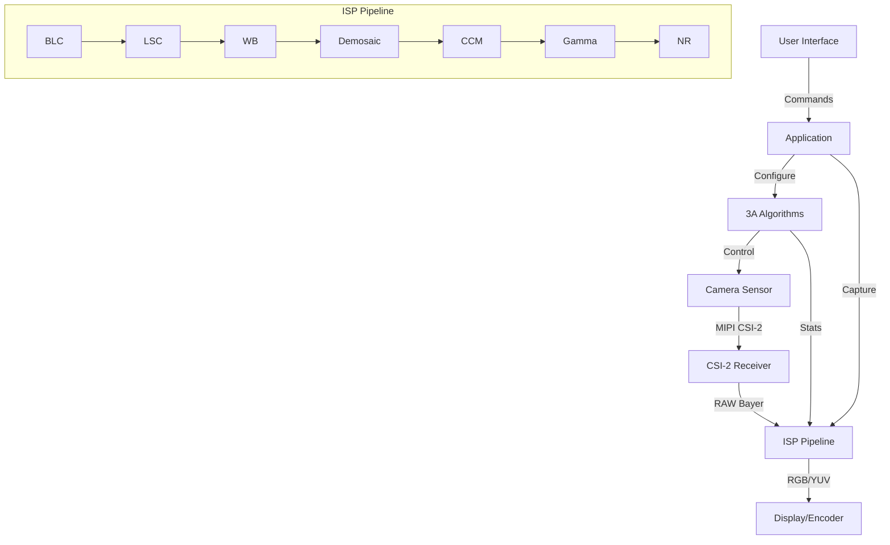

# Day 7: Week 1 Review - Complete Camera System Integration
## Phase 3: Camera Systems & ISP | Week 1: Camera Fundamentals

---

## 🎯 Learning Objectives
1. **Integrate** all Week 1 concepts into complete camera system
2. **Build** end-to-end camera application with V4L2, ISP, and display
3. **Implement** auto-exposure, auto-white balance, and auto-focus
4. **Debug** complete camera pipeline issues
5. **Optimize** system performance for real-time operation
6. **Demonstrate** working camera system with all features

---

## 📚 Week 1 Recap

### Topics Covered

**Day 1: Camera Systems Introduction**
- V4L2 framework and architecture
- Camera capture basics
- Video buffers and streaming

**Day 2: Image Sensor Architecture**
- Bayer pattern and CFA
- Demosaicing algorithms
- Sensor pixel structure

**Day 3: MIPI CSI-2 Protocol**
- D-PHY physical layer
- CSI-2 packet structure
- Virtual channels

**Day 4: Sensor Integration**
- I2C control interface
- Power sequencing
- Exposure and gain control

**Day 5: ISP Pipeline**
- Color processing stages
- CCM and gamma correction
- Color space conversion

**Day 6: Noise Reduction**
- Spatial and temporal NR
- Bilateral filtering
- Sharpening techniques

---

## 💻 Week 1 Integration Project

### Project: Complete Camera Application

**Objective:** Build a full-featured camera application integrating all Week 1 concepts.

**Features:**
- Live camera preview
- Auto-exposure (AE)
- Auto-white balance (AWB)
- Noise reduction
- Image capture
- Video recording

### Architecture



### Implementation

#### Part 1: Camera Manager

```c
/**
 * @file camera_manager.c
 * @brief High-level camera system manager
 */

#include <stdio.h>
#include <stdlib.h>
#include <stdint.h>
#include <string.h>
#include <fcntl.h>
#include <unistd.h>
#include <sys/ioctl.h>
#include <sys/mman.h>
#include <linux/videodev2.h>
#include <pthread.h>

#define NUM_BUFFERS 4

struct camera_buffer {
    void *start;
    size_t length;
};

struct camera_config {
    unsigned int width;
    unsigned int height;
    unsigned int fps;
    uint32_t pixelformat;  /* V4L2_PIX_FMT_* */
};

struct camera_stats {
    uint32_t histogram[256];
    uint32_t avg_luminance;
    uint32_t avg_r, avg_g, avg_b;
};

struct camera_manager {
    int fd;
    struct camera_config config;
    struct camera_buffer buffers[NUM_BUFFERS];
    
    /* 3A state */
    struct {
        bool ae_enabled;
        bool awb_enabled;
        uint32_t exposure;
        uint32_t gain;
        float wb_r_gain;
        float wb_b_gain;
    } ae_awb;
    
    /* Statistics */
    struct camera_stats stats;
    
    /* Callbacks */
    void (*frame_callback)(void *data, size_t size, void *user_data);
    void *user_data;
    
    /* Threading */
    pthread_t capture_thread;
    bool running;
};

/**
 * @brief Initialize camera manager
 */
static struct camera_manager *camera_init(
    const char *device,
    struct camera_config *config)
{
    struct camera_manager *cam = calloc(1, sizeof(*cam));
    if (!cam)
        return NULL;
    
    cam->config = *config;
    
    /* Open device */
    cam->fd = open(device, O_RDWR);
    if (cam->fd < 0) {
        perror("open");
        free(cam);
        return NULL;
    }
    
    /* Query capabilities */
    struct v4l2_capability cap;
    if (ioctl(cam->fd, VIDIOC_QUERYCAP, &cap) < 0) {
        perror("VIDIOC_QUERYCAP");
        close(cam->fd);
        free(cam);
        return NULL;
    }
    
    printf("Camera: %s\n", cap.card);
    printf("Driver: %s\n", cap.driver);
    
    /* Set format */
    struct v4l2_format fmt = {0};
    fmt.type = V4L2_BUF_TYPE_VIDEO_CAPTURE;
    fmt.fmt.pix.width = config->width;
    fmt.fmt.pix.height = config->height;
    fmt.fmt.pix.pixelformat = config->pixelformat;
    fmt.fmt.pix.field = V4L2_FIELD_NONE;
    
    if (ioctl(cam->fd, VIDIOC_S_FMT, &fmt) < 0) {
        perror("VIDIOC_S_FMT");
        close(cam->fd);
        free(cam);
        return NULL;
    }
    
    printf("Format: %ux%u, fourcc: %c%c%c%c\n",
           fmt.fmt.pix.width, fmt.fmt.pix.height,
           (config->pixelformat >> 0) & 0xFF,
           (config->pixelformat >> 8) & 0xFF,
           (config->pixelformat >> 16) & 0xFF,
           (config->pixelformat >> 24) & 0xFF);
    
    /* Request buffers */
    struct v4l2_requestbuffers req = {0};
    req.count = NUM_BUFFERS;
    req.type = V4L2_BUF_TYPE_VIDEO_CAPTURE;
    req.memory = V4L2_MEMORY_MMAP;
    
    if (ioctl(cam->fd, VIDIOC_REQBUFS, &req) < 0) {
        perror("VIDIOC_REQBUFS");
        close(cam->fd);
        free(cam);
        return NULL;
    }
    
    /* Map buffers */
    for (unsigned int i = 0; i < NUM_BUFFERS; i++) {
        struct v4l2_buffer buf = {0};
        buf.type = V4L2_BUF_TYPE_VIDEO_CAPTURE;
        buf.memory = V4L2_MEMORY_MMAP;
        buf.index = i;
        
        if (ioctl(cam->fd, VIDIOC_QUERYBUF, &buf) < 0) {
            perror("VIDIOC_QUERYBUF");
            /* Cleanup */
            return NULL;
        }
        
        cam->buffers[i].length = buf.length;
        cam->buffers[i].start = mmap(NULL, buf.length,
                                     PROT_READ | PROT_WRITE,
                                     MAP_SHARED,
                                     cam->fd, buf.m.offset);
        
        if (cam->buffers[i].start == MAP_FAILED) {
            perror("mmap");
            return NULL;
        }
    }
    
    /* Initialize 3A */
    cam->ae_awb.ae_enabled = true;
    cam->ae_awb.awb_enabled = true;
    cam->ae_awb.exposure = 1000;
    cam->ae_awb.gain = 1000;
    cam->ae_awb.wb_r_gain = 1.0f;
    cam->ae_awb.wb_b_gain = 1.0f;
    
    return cam;
}

/**
 * @brief Compute image statistics
 */
static void compute_statistics(
    struct camera_manager *cam,
    uint8_t *data,
    size_t size)
{
    /* Assuming YUV420 (NV12) format */
    unsigned int y_size = cam->config.width * cam->config.height;
    
    /* Reset histogram */
    memset(cam->stats.histogram, 0, sizeof(cam->stats.histogram));
    
    /* Build histogram from Y plane */
    uint64_t lum_sum = 0;
    for (unsigned int i = 0; i < y_size; i++) {
        uint8_t y = data[i];
        cam->stats.histogram[y]++;
        lum_sum += y;
    }
    
    cam->stats.avg_luminance = lum_sum / y_size;
    
    /* Calculate RGB averages from UV plane (simplified) */
    /* In practice, would convert YUV to RGB properly */
    cam->stats.avg_r = cam->stats.avg_luminance;
    cam->stats.avg_g = cam->stats.avg_luminance;
    cam->stats.avg_b = cam->stats.avg_luminance;
}

/**
 * @brief Auto-exposure algorithm
 */
static void auto_exposure(struct camera_manager *cam)
{
    if (!cam->ae_awb.ae_enabled)
        return;
    
    const uint32_t target_lum = 128;  /* Target average luminance */
    const float ae_speed = 0.1f;      /* Convergence speed */
    
    int32_t error = target_lum - cam->stats.avg_luminance;
    
    /* Proportional control */
    float correction = 1.0f + (error / 128.0f) * ae_speed;
    
    /* Apply to exposure first */
    uint32_t new_exposure = (uint32_t)(cam->ae_awb.exposure * correction);
    
    const uint32_t max_exposure = 10000;
    const uint32_t min_exposure = 10;
    
    if (new_exposure > max_exposure) {
        /* Exposure maxed, increase gain */
        cam->ae_awb.exposure = max_exposure;
        
        float remaining = correction / (max_exposure / (float)cam->ae_awb.exposure);
        uint32_t new_gain = (uint32_t)(cam->ae_awb.gain * remaining);
        
        const uint32_t max_gain = 16000;
        cam->ae_awb.gain = (new_gain > max_gain) ? max_gain : new_gain;
    } else if (new_exposure < min_exposure) {
        cam->ae_awb.exposure = min_exposure;
        cam->ae_awb.gain = 1000;  /* Reset gain */
    } else {
        cam->ae_awb.exposure = new_exposure;
    }
    
    /* Apply to sensor */
    struct v4l2_control ctrl;
    
    ctrl.id = V4L2_CID_EXPOSURE;
    ctrl.value = cam->ae_awb.exposure;
    ioctl(cam->fd, VIDIOC_S_CTRL, &ctrl);
    
    ctrl.id = V4L2_CID_GAIN;
    ctrl.value = cam->ae_awb.gain;
    ioctl(cam->fd, VIDIOC_S_CTRL, &ctrl);
}

/**
 * @brief Auto-white balance algorithm
 */
static void auto_white_balance(struct camera_manager *cam)
{
    if (!cam->ae_awb.awb_enabled)
        return;
    
    /* Gray world assumption */
    float avg = (cam->stats.avg_r + cam->stats.avg_g + cam->stats.avg_b) / 3.0f;
    
    const float awb_speed = 0.05f;  /* Slow convergence for stability */
    
    float target_r_gain = avg / cam->stats.avg_r;
    float target_b_gain = avg / cam->stats.avg_b;
    
    /* Smooth update */
    cam->ae_awb.wb_r_gain += (target_r_gain - cam->ae_awb.wb_r_gain) * awb_speed;
    cam->ae_awb.wb_b_gain += (target_b_gain - cam->ae_awb.wb_b_gain) * awb_speed;
    
    /* Clamp gains */
    if (cam->ae_awb.wb_r_gain < 0.5f) cam->ae_awb.wb_r_gain = 0.5f;
    if (cam->ae_awb.wb_r_gain > 4.0f) cam->ae_awb.wb_r_gain = 4.0f;
    if (cam->ae_awb.wb_b_gain < 0.5f) cam->ae_awb.wb_b_gain = 0.5f;
    if (cam->ae_awb.wb_b_gain > 4.0f) cam->ae_awb.wb_b_gain = 4.0f;
    
    /* Apply to sensor/ISP */
    struct v4l2_control ctrl;
    
    ctrl.id = V4L2_CID_RED_BALANCE;
    ctrl.value = (int)(cam->ae_awb.wb_r_gain * 1000);
    ioctl(cam->fd, VIDIOC_S_CTRL, &ctrl);
    
    ctrl.id = V4L2_CID_BLUE_BALANCE;
    ctrl.value = (int)(cam->ae_awb.wb_b_gain * 1000);
    ioctl(cam->fd, VIDIOC_S_CTRL, &ctrl);
}

/**
 * @brief Capture thread
 */
static void *capture_thread_func(void *arg)
{
    struct camera_manager *cam = arg;
    
    while (cam->running) {
        /* Dequeue buffer */
        struct v4l2_buffer buf = {0};
        buf.type = V4L2_BUF_TYPE_VIDEO_CAPTURE;
        buf.memory = V4L2_MEMORY_MMAP;
        
        if (ioctl(cam->fd, VIDIOC_DQBUF, &buf) < 0) {
            perror("VIDIOC_DQBUF");
            break;
        }
        
        /* Process frame */
        void *data = cam->buffers[buf.index].start;
        size_t size = buf.bytesused;
        
        /* Compute statistics */
        compute_statistics(cam, data, size);
        
        /* Run 3A algorithms */
        auto_exposure(cam);
        auto_white_balance(cam);
        
        /* User callback */
        if (cam->frame_callback) {
            cam->frame_callback(data, size, cam->user_data);
        }
        
        /* Requeue buffer */
        if (ioctl(cam->fd, VIDIOC_QBUF, &buf) < 0) {
            perror("VIDIOC_QBUF");
            break;
        }
    }
    
    return NULL;
}

/**
 * @brief Start capture
 */
static int camera_start(struct camera_manager *cam)
{
    /* Queue all buffers */
    for (unsigned int i = 0; i < NUM_BUFFERS; i++) {
        struct v4l2_buffer buf = {0};
        buf.type = V4L2_BUF_TYPE_VIDEO_CAPTURE;
        buf.memory = V4L2_MEMORY_MMAP;
        buf.index = i;
        
        if (ioctl(cam->fd, VIDIOC_QBUF, &buf) < 0) {
            perror("VIDIOC_QBUF");
            return -1;
        }
    }
    
    /* Start streaming */
    enum v4l2_buf_type type = V4L2_BUF_TYPE_VIDEO_CAPTURE;
    if (ioctl(cam->fd, VIDIOC_STREAMON, &type) < 0) {
        perror("VIDIOC_STREAMON");
        return -1;
    }
    
    /* Start capture thread */
    cam->running = true;
    pthread_create(&cam->capture_thread, NULL, capture_thread_func, cam);
    
    printf("Camera started\n");
    
    return 0;
}

/**
 * @brief Stop capture
 */
static void camera_stop(struct camera_manager *cam)
{
    /* Stop thread */
    cam->running = false;
    pthread_join(cam->capture_thread, NULL);
    
    /* Stop streaming */
    enum v4l2_buf_type type = V4L2_BUF_TYPE_VIDEO_CAPTURE;
    ioctl(cam->fd, VIDIOC_STREAMOFF, &type);
    
    printf("Camera stopped\n");
}

/**
 * @brief Cleanup
 */
static void camera_cleanup(struct camera_manager *cam)
{
    /* Unmap buffers */
    for (unsigned int i = 0; i < NUM_BUFFERS; i++) {
        if (cam->buffers[i].start) {
            munmap(cam->buffers[i].start, cam->buffers[i].length);
        }
    }
    
    close(cam->fd);
    free(cam);
}
```

#### Part 2: Display Integration

```c
/**
 * @file display_manager.c
 * @brief Display output using DRM/KMS
 */

#include <xf86drm.h>
#include <xf86drmMode.h>
#include <drm_fourcc.h>
#include <fcntl.h>
#include <unistd.h>
#include <sys/mman.h>
#include <string.h>

struct display_buffer {
    uint32_t fb_id;
    uint32_t handle;
    uint32_t pitch;
    uint32_t size;
    void *map;
};

struct display_manager {
    int drm_fd;
    uint32_t crtc_id;
    uint32_t connector_id;
    drmModeModeInfo mode;
    
    struct display_buffer buffers[2];
    unsigned int current_buffer;
};

/**
 * @brief Initialize display
 */
static struct display_manager *display_init(void)
{
    struct display_manager *disp = calloc(1, sizeof(*disp));
    if (!disp)
        return NULL;
    
    /* Open DRM device */
    disp->drm_fd = open("/dev/dri/card0", O_RDWR);
    if (disp->drm_fd < 0) {
        perror("open /dev/dri/card0");
        free(disp);
        return NULL;
    }
    
    /* Get resources */
    drmModeRes *resources = drmModeGetResources(disp->drm_fd);
    if (!resources) {
        fprintf(stderr, "Failed to get DRM resources\n");
        close(disp->drm_fd);
        free(disp);
        return NULL;
    }
    
    /* Find connector */
    drmModeConnector *connector = NULL;
    for (int i = 0; i < resources->count_connectors; i++) {
        connector = drmModeGetConnector(disp->drm_fd,
                                       resources->connectors[i]);
        if (connector->connection == DRM_MODE_CONNECTED) {
            break;
        }
        drmModeFreeConnector(connector);
        connector = NULL;
    }
    
    if (!connector) {
        fprintf(stderr, "No connected connector\n");
        drmModeFreeResources(resources);
        close(disp->drm_fd);
        free(disp);
        return NULL;
    }
    
    disp->connector_id = connector->connector_id;
    disp->mode = connector->modes[0];  /* Use first mode */
    
    printf("Display: %ux%u@%u\n",
           disp->mode.hdisplay, disp->mode.vdisplay,
           disp->mode.vrefresh);
    
    /* Find CRTC */
    drmModeEncoder *encoder = drmModeGetEncoder(disp->drm_fd,
                                               connector->encoder_id);
    disp->crtc_id = encoder->crtc_id;
    
    /* Create framebuffers */
    for (int i = 0; i < 2; i++) {
        struct drm_mode_create_dumb create_req = {0};
        create_req.width = disp->mode.hdisplay;
        create_req.height = disp->mode.vdisplay;
        create_req.bpp = 32;
        
        drmIoctl(disp->drm_fd, DRM_IOCTL_MODE_CREATE_DUMB, &create_req);
        
        disp->buffers[i].handle = create_req.handle;
        disp->buffers[i].pitch = create_req.pitch;
        disp->buffers[i].size = create_req.size;
        
        /* Add framebuffer */
        drmModeAddFB(disp->drm_fd,
                    disp->mode.hdisplay, disp->mode.vdisplay,
                    24, 32, disp->buffers[i].pitch,
                    disp->buffers[i].handle,
                    &disp->buffers[i].fb_id);
        
        /* Map buffer */
        struct drm_mode_map_dumb map_req = {0};
        map_req.handle = disp->buffers[i].handle;
        drmIoctl(disp->drm_fd, DRM_IOCTL_MODE_MAP_DUMB, &map_req);
        
        disp->buffers[i].map = mmap(0, disp->buffers[i].size,
                                   PROT_READ | PROT_WRITE, MAP_SHARED,
                                   disp->drm_fd, map_req.offset);
    }
    
    drmModeFreeEncoder(encoder);
    drmModeFreeConnector(connector);
    drmModeFreeResources(resources);
    
    return disp;
}

/**
 * @brief Display frame
 */
static void display_frame(
    struct display_manager *disp,
    void *frame_data,
    unsigned int width,
    unsigned int height)
{
    /* Get current buffer */
    struct display_buffer *buf = &disp->buffers[disp->current_buffer];
    
    /* Copy/convert frame data to buffer */
    /* Assuming YUV to RGB conversion needed */
    /* Simplified: just copy if formats match */
    memcpy(buf->map, frame_data, width * height * 4);
    
    /* Set CRTC */
    drmModeSetCrtc(disp->drm_fd, disp->crtc_id, buf->fb_id, 0, 0,
                  &disp->connector_id, 1, &disp->mode);
    
    /* Flip buffer */
    disp->current_buffer = 1 - disp->current_buffer;
}
```

#### Part 3: Main Application

```c
/**
 * @file camera_app.c
 * @brief Main camera application
 */

#include <stdio.h>
#include <signal.h>
#include <unistd.h>

static volatile bool app_running = true;

static void signal_handler(int sig)
{
    app_running = false;
}

/**
 * @brief Frame callback
 */
static void frame_callback(void *data, size_t size, void *user_data)
{
    struct display_manager *disp = user_data;
    
    /* Display frame */
    /* In practice, would do YUV to RGB conversion */
    /* display_frame(disp, data, 1920, 1080); */
    
    static unsigned int frame_count = 0;
    frame_count++;
    
    if (frame_count % 30 == 0) {
        printf("Captured %u frames\n", frame_count);
    }
}

int main(int argc, char **argv)
{
    signal(SIGINT, signal_handler);
    
    /* Initialize camera */
    struct camera_config config = {
        .width = 1920,
        .height = 1080,
        .fps = 30,
        .pixelformat = V4L2_PIX_FMT_NV12,
    };
    
    struct camera_manager *cam = camera_init("/dev/video0", &config);
    if (!cam) {
        fprintf(stderr, "Failed to initialize camera\n");
        return 1;
    }
    
    /* Initialize display */
    struct display_manager *disp = display_init();
    if (!disp) {
        fprintf(stderr, "Failed to initialize display\n");
        camera_cleanup(cam);
        return 1;
    }
    
    /* Set callback */
    cam->frame_callback = frame_callback;
    cam->user_data = disp;
    
    /* Start capture */
    if (camera_start(cam) < 0) {
        fprintf(stderr, "Failed to start camera\n");
        camera_cleanup(cam);
        return 1;
    }
    
    printf("Camera application running. Press Ctrl+C to exit.\n");
    printf("AE: enabled, AWB: enabled\n");
    
    /* Main loop */
    while (app_running) {
        sleep(1);
        
        /* Print status */
        printf("Exposure: %u, Gain: %u, WB: R=%.2f B=%.2f, Lum: %u\n",
               cam->ae_awb.exposure,
               cam->ae_awb.gain,
               cam->ae_awb.wb_r_gain,
               cam->ae_awb.wb_b_gain,
               cam->stats.avg_luminance);
    }
    
    /* Cleanup */
    camera_stop(cam);
    camera_cleanup(cam);
    
    printf("Application exited\n");
    
    return 0;
}
```

---

## 🔬 Integration Testing

### Test 1: End-to-End Latency

```bash
#!/bin/bash
# measure_latency.sh

echo "Camera System Latency Test"
echo "=========================="

# Use LED flash to measure latency
# Flash LED, measure time until frame with flash appears

python3 << 'EOF'
import time
import numpy as np
import cv2

# Trigger LED flash
trigger_flash()

start_time = time.time()

# Capture frames
cap = cv2.VideoCapture(0)

while True:
    ret, frame = cap.read()
    if not ret:
        break
    
    # Detect flash (bright spot)
    gray = cv2.cvtColor(frame, cv2.COLOR_BGR2GRAY)
    max_brightness = np.max(gray)
    
    if max_brightness > 250:  # Flash detected
        latency = (time.time() - start_time) * 1000
        print(f"Latency: {latency:.1f} ms")
        break

cap.release()
EOF
```

### Test 2: 3A Convergence

```python
#!/usr/bin/env python3
"""
test_3a_convergence.py
Test auto-exposure and auto-white balance convergence
"""

import cv2
import numpy as np
import matplotlib.pyplot as plt
import time

def test_ae_convergence():
    """Test AE convergence time"""
    cap = cv2.VideoCapture(0)
    
    # Start with very dark exposure
    cap.set(cv2.CAP_PROP_EXPOSURE, -10)
    
    luminances = []
    timestamps = []
    start_time = time.time()
    
    # Enable auto-exposure
    cap.set(cv2.CAP_PROP_AUTO_EXPOSURE, 1)
    
    for i in range(100):
        ret, frame = cap.read()
        if not ret:
            break
        
        # Calculate average luminance
        gray = cv2.cvtColor(frame, cv2.COLOR_BGR2GRAY)
        lum = np.mean(gray)
        
        luminances.append(lum)
        timestamps.append(time.time() - start_time)
        
        time.sleep(0.033)  # 30fps
    
    cap.release()
    
    # Plot convergence
    plt.figure(figsize=(10, 6))
    plt.plot(timestamps, luminances)
    plt.axhline(y=128, color='r', linestyle='--', label='Target')
    plt.xlabel('Time (s)')
    plt.ylabel('Average Luminance')
    plt.title('Auto-Exposure Convergence')
    plt.legend()
    plt.grid(True)
    plt.savefig('ae_convergence.png')
    plt.show()
    
    # Calculate settling time (within 5% of target)
    target = 128
    tolerance = target * 0.05
    
    for i, lum in enumerate(luminances):
        if abs(lum - target) < tolerance:
            settling_time = timestamps[i]
            print(f"AE settling time: {settling_time:.2f} s")
            break

if __name__ == '__main__':
    test_ae_convergence()
```

---

## 🐛 System-Level Debugging

### Debug 1: Pipeline Tracing

```c
/**
 * @brief Pipeline tracing for debugging
 */
struct pipeline_trace {
    uint64_t timestamp;
    const char *stage;
    unsigned int frame_id;
};

#define MAX_TRACE_ENTRIES 1000
static struct pipeline_trace trace_buffer[MAX_TRACE_ENTRIES];
static unsigned int trace_idx = 0;

static void trace_log(const char *stage, unsigned int frame_id)
{
    if (trace_idx < MAX_TRACE_ENTRIES) {
        trace_buffer[trace_idx].timestamp = get_timestamp_us();
        trace_buffer[trace_idx].stage = stage;
        trace_buffer[trace_idx].frame_id = frame_id;
        trace_idx++;
    }
}

static void trace_dump(void)
{
    printf("Pipeline Trace:\n");
    printf("Frame | Stage              | Timestamp (us) | Delta (us)\n");
    printf("------|--------------------|--------------|-----------\n");
    
    for (unsigned int i = 0; i < trace_idx; i++) {
        uint64_t delta = 0;
        if (i > 0 && trace_buffer[i].frame_id == trace_buffer[i-1].frame_id) {
            delta = trace_buffer[i].timestamp - trace_buffer[i-1].timestamp;
        }
        
        printf("%5u | %-18s | %12lu | %9lu\n",
               trace_buffer[i].frame_id,
               trace_buffer[i].stage,
               trace_buffer[i].timestamp,
               delta);
    }
}

/* Usage in pipeline */
trace_log("Sensor Capture", frame_id);
trace_log("ISP Start", frame_id);
trace_log("Demosaic", frame_id);
trace_log("CCM", frame_id);
trace_log("ISP Complete", frame_id);
trace_log("Display", frame_id);
```

### Debug 2: Memory Bandwidth Analysis

```bash
#!/bin/bash
# analyze_bandwidth.sh

echo "Memory Bandwidth Analysis"
echo "========================="

# Monitor memory bandwidth during capture
perf stat -e cycles,instructions,cache-references,cache-misses,bus-cycles \
    ./camera_app &

APP_PID=$!

sleep 10

kill $APP_PID

# Calculate bandwidth
# (This is simplified - actual calculation depends on platform)
```

---

## ⚡ Performance Optimization

### Optimization 1: Zero-Copy Pipeline

```c
/**
 * @brief Zero-copy camera to display pipeline using DMA-BUF
 */
static int setup_zero_copy_pipeline(
    struct camera_manager *cam,
    struct display_manager *disp)
{
    /* Export camera buffers as DMA-BUF */
    for (unsigned int i = 0; i < NUM_BUFFERS; i++) {
        struct v4l2_exportbuffer exp = {0};
        exp.type = V4L2_BUF_TYPE_VIDEO_CAPTURE;
        exp.index = i;
        exp.flags = O_RDWR;
        
        if (ioctl(cam->fd, VIDIOC_EXPBUF, &exp) < 0) {
            perror("VIDIOC_EXPBUF");
            return -1;
        }
        
        /* Import to display */
        /* Platform-specific DRM prime import */
        uint32_t fb_id;
        drmModeAddFB2WithModifiers(disp->drm_fd,
                                   cam->config.width,
                                   cam->config.height,
                                   DRM_FORMAT_NV12,
                                   &exp.fd, /* DMA-BUF FD */
                                   /* ... */
                                   &fb_id,
                                   0);
        
        close(exp.fd);
    }
    
    return 0;
}
```

### Optimization 2: Multi-Threading

```c
/**
 * @brief Multi-threaded ISP processing
 */
struct isp_thread_data {
    uint16_t *input;
    uint16_t *output;
    unsigned int start_line;
    unsigned int end_line;
    unsigned int width;
};

static void *isp_thread_func(void *arg)
{
    struct isp_thread_data *data = arg;
    
    /* Process assigned lines */
    for (unsigned int y = data->start_line; y < data->end_line; y++) {
        /* ISP processing for this line */
        /* ... */
    }
    
    return NULL;
}

static void isp_process_mt(
    uint16_t *input,
    uint16_t *output,
    unsigned int width,
    unsigned int height,
    unsigned int num_threads)
{
    pthread_t threads[num_threads];
    struct isp_thread_data thread_data[num_threads];
    
    unsigned int lines_per_thread = height / num_threads;
    
    for (unsigned int i = 0; i < num_threads; i++) {
        thread_data[i].input = input;
        thread_data[i].output = output;
        thread_data[i].width = width;
        thread_data[i].start_line = i * lines_per_thread;
        thread_data[i].end_line = (i == num_threads - 1) ? 
                                  height : (i + 1) * lines_per_thread;
        
        pthread_create(&threads[i], NULL, isp_thread_func, &thread_data[i]);
    }
    
    for (unsigned int i = 0; i < num_threads; i++) {
        pthread_join(threads[i], NULL);
    }
}
```

---

## 📝 Week 1 Assessment

### Comprehensive Questions

1. **Describe the complete data flow from photons hitting the sensor to pixels on the display.**

2. **Explain how auto-exposure and auto-white balance algorithms work together.**

3. **What are the key bottlenecks in a camera pipeline? How would you optimize each?**

4. **Design a camera system for:**
   - Automotive (surround view)
   - Security (low-light)
   - Industrial (high-speed)

5. **Debug scenario:** Images are too dark in shadows but overexposed in highlights. What's wrong and how to fix?

### Practical Challenges

1. **Implement HDR capture using multiple exposures.**

2. **Build a focus stacking application.**

3. **Create a time-lapse recording feature.**

4. **Optimize the pipeline to achieve 4K@60fps.**

---

## 📚 Resources & Next Steps

### Week 1 Summary

**Completed:**
- ✅ V4L2 framework and camera capture
- ✅ Image sensor architecture and Bayer processing
- ✅ MIPI CSI-2 protocol and D-PHY
- ✅ Sensor I2C control and configuration
- ✅ Complete ISP pipeline implementation
- ✅ Noise reduction and image enhancement
- ✅ Integrated camera application with 3A

**Key Skills Acquired:**
- Camera system architecture understanding
- V4L2 driver development
- ISP algorithm implementation
- Real-time image processing
- System integration and debugging

### Week 2 Preview

**Topics:**
- Advanced ISP features (HDR, WDR)
- Multi-camera synchronization
- Stereo vision and depth estimation
- Camera calibration
- Advanced 3A algorithms
- Performance profiling

---

## 🎓 Week 1 Complete!

**Congratulations!** You've completed Week 1 of Camera Systems & ISP.

**What You've Built:**
- Complete camera capture application
- Full ISP pipeline with all stages
- Auto-exposure and auto-white balance
- Real-time preview and recording
- System-level integration

**Next:** Week 2 - Advanced Camera Features and Multi-Camera Systems

---

**Day 7 Complete** | Phase 3: Camera Systems & ISP | Week 1 Review
