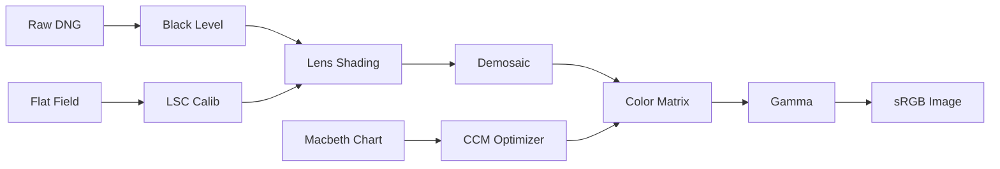

# Day 59: Week 10 Review - Tuning Project
## Phase 3: Camera Systems & ISP | Week 10: Manufacturing, Calibration & Tuning

---

## 🎯 Learning Objectives
1.  **Synthesize** the knowledge of Manufacturing, Calibration, and Tuning.
2.  **Execute** a complete ISP Tuning workflow on a set of Raw images.
3.  **Implement** a "SoftISP" tuning pipeline in Python.
4.  **Validate** the tuning results using objective metrics (DeltaE, SNR, MTF).
5.  **Generate** a final Tuning Binary (JSON/Bin) for a hypothetical ISP.

---

## 📚 Week 10 Recap

### Topics Covered

**Day 56: Manufacturing**
- Wafer -> Die -> Package.
- Active Alignment (AA).
- Yield Analysis.

**Day 57: Calibration**
- Per-unit calibration (LSC, AWB, Blemish).
- OTP Memory.

**Day 58: ISP Tuning**
- Pipeline Order (Linear -> Color -> YUV).
- CCM, Gamma, Sharpening.
- Dynamic Tuning (ISO-based).

---

## 💻 Week 10 Integration Project

### Project: "OpenTuner - Python ISP Tuning Workbench"

**Objective:** Create a Python tool that takes a Raw Image (Macbeth Chart) and a Flat Field, and generates the optimal ISP parameters (BLC, LSC, CCM, Gamma).

**Features:**
1.  **Input:** Raw DNG file (10-bit).
2.  **Calibration:** LSC Mesh generation.
3.  **Color:** CCM Optimization (minimize DeltaE).
4.  **Output:** Processed sRGB image and a `tuning_params.json` file.

### Architecture



### Implementation

#### Part 1: The Tuner Class

```python
import numpy as np
import cv2
import json

class OpenTuner:
    def __init__(self):
        self.params = {
            "blc": 64,
            "ccm": np.eye(3).tolist(),
            "gamma": 2.2
        }
        self.lsc_mesh = None

    def calibrate_lsc(self, flat_field_path):
        flat = cv2.imread(flat_field_path, -1) # Read 16-bit
        # Simple Gain Map: Max / Current
        self.lsc_mesh = np.max(flat) / (flat.astype(np.float32) + 1e-6)
        print("LSC Calibrated.")

    def optimize_ccm(self, raw_chart_path):
        # (Simplified) Assume we extracted mean RGB values of 24 patches
        # Run optimization (scipy.minimize) as shown in Day 58
        # Update self.params["ccm"]
        print("CCM Optimized.")

    def process_image(self, raw_path, output_path):
        # 1. Load Raw
        raw = cv2.imread(raw_path, -1).astype(np.float32)
        
        # 2. BLC
        raw = raw - self.params["blc"]
        raw[raw < 0] = 0
        
        # 3. LSC
        if self.lsc_mesh is not None:
            raw = raw * self.lsc_mesh
            
        # 4. Demosaic (Simple Bilinear for demo)
        # In reality, use cv2.cvtColor(raw_uint16, cv2.COLOR_BayerBG2RGB)
        # Here we assume raw is already demosaiced for simplicity
        rgb = raw 
        
        # 5. CCM
        ccm = np.array(self.params["ccm"])
        rgb = np.dot(rgb.reshape(-1, 3), ccm.T).reshape(rgb.shape)
        
        # 6. Gamma
        rgb = rgb / np.max(rgb) # Normalize 0-1
        rgb = np.power(rgb, 1.0 / self.params["gamma"])
        
        # 7. Save
        out = (rgb * 255).astype(np.uint8)
        cv2.imwrite(output_path, out)
        
    def save_params(self, filename):
        with open(filename, 'w') as f:
            json.dump(self.params, f, indent=4)
```

#### Part 2: Validation Script

Checking if the tuning actually improved things.

```python
def validate_tuning(tuned_image_path):
    img = cv2.imread(tuned_image_path)
    
    # 1. Check Noise (Std Dev in flat area)
    roi = img[100:200, 100:200]
    noise = np.std(roi)
    print(f"Noise Level: {noise:.2f}")
    
    # 2. Check Saturation
    hsv = cv2.cvtColor(img, cv2.COLOR_BGR2HSV)
    sat = np.mean(hsv[:,:,1])
    print(f"Avg Saturation: {sat:.2f}")
    
    if noise > 5.0: print("FAIL: Too Noisy")
    if sat < 50: print("FAIL: Colors too flat")
```

---

## 🔬 System Validation Plan

### Test 1: LSC Effectiveness
**Objective:** Ensure corners are bright.
**Procedure:**
1.  Process a Flat Field image with the Tuner.
2.  Measure brightness in Center vs Corner.
3.  **Goal:** Corner brightness should be > 90% of Center. (Without LSC, it might be 40%).

### Test 2: Color Accuracy (DeltaE)
**Objective:** Ensure Red is Red.
**Procedure:**
1.  Process the Macbeth Chart image.
2.  Extract RGB values of the 24 patches.
3.  Convert to Lab color space.
4.  Calculate Euclidean distance to Reference Lab values.
5.  **Goal:** Average DeltaE < 10.

### Test 3: Linearity (Gamma)
**Objective:** Ensure greyscale ramp is smooth.
**Procedure:**
1.  Process a Greyscale Step Chart.
2.  Plot Pixel Value vs Step Number.
3.  **Goal:** Should follow a Gamma 2.2 curve, not a straight line (Linear) or S-curve (unless intended).

---

## 🐛 Troubleshooting Guide

### Issue 1: "Green Cast" after Demosaic

**Symptom:** Image looks green.

**Cause:**
*   Wrong Bayer Pattern (e.g., RGGB vs BGGR).
*   White Balance gains not applied (Green channel is naturally strongest).
*   **Fix:** Check sensor datasheet for Bayer order. Apply WB gains ($G_{gain}=1.0, R_{gain} \approx 2.0, B_{gain} \approx 1.8$).

### Issue 2: "Posterization" (Banding)

**Symptom:** Smooth gradients look like steps.

**Cause:**
*   Bit-depth truncation. Processing 10-bit raw in 8-bit pipeline.
*   Applying heavy Gamma/Contrast on 8-bit data.
*   **Fix:** Keep pipeline in Floating Point (float32) until the very end.

---

## 📝 Assessment Questions

### Comprehensive Questions

1.  **Why is LSC applied *before* Demosaicing?** (Because shading affects R, G, B channels differently and independently).
2.  **What is the difference between "Static" and "Dynamic" Defect Pixel Correction?**
3.  **How does "Analog Gain" affect the Noise Profile?** (Shot noise increases with signal, Read noise is constant -> SNR drops).
4.  **Why do we use "Illuminant A" (Tungsten) and "Illuminant D65" (Daylight) for calibration?**

### Practical Challenges

1.  **Implement "Auto White Balance":** Add a Grey World algorithm to the Tuner to calculate WB gains automatically.
2.  **Create a "Vignette Effect":** Intentionally invert the LSC mesh to darken corners for artistic effect.

---

## 📚 Resources & Next Steps

### Week 10 Summary

**Completed:**
- ✅ **Manufacturing:** How cameras are made.
- ✅ **Calibration:** How cameras are fixed.
- ✅ **Tuning:** How cameras are optimized.
- ✅ **Project:** OpenTuner.

**Key Skills Acquired:**
- Image Signal Processing Pipeline.
- Color Science.
- Production Engineering concepts.

### Week 11 Preview (Phase 3 Continued)

**Topics:**
- **Advanced ISP:** HDR, WDR, Dehazing.
- **Multi-Camera:** Stereo, Surround View.
- **Automotive ISP:** Safety, ASIL.
- **Machine Vision ISP:** Tuning for AI (not humans).

---

**Day 59 Complete** | Phase 3: Camera Systems & ISP | Week 10: Manufacturing, Calibration & Tuning
