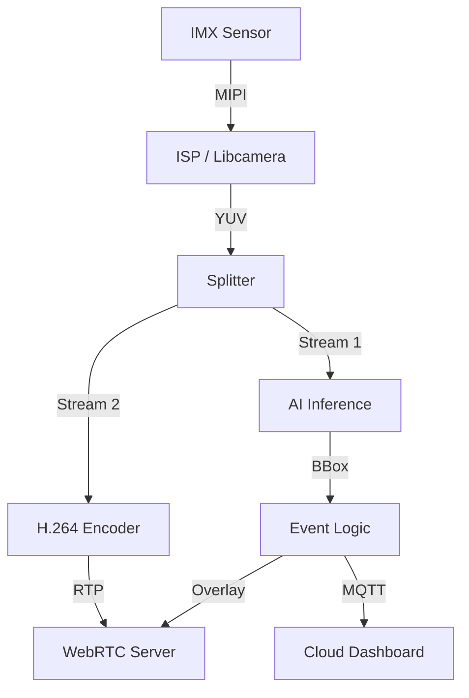

# Day 60: Phase 3 Exam & Capstone Project Kickoff
## Phase 3: Camera Systems & ISP | Week 10: Manufacturing, Calibration & Tuning

---

## 🎯 Learning Objectives
1.  **Review** the entire Phase 3 curriculum (Sensors, Interfaces, ISP, Vision, Manufacturing).
2.  **Assess** knowledge through a comprehensive Final Exam.
3.  **Launch** the Phase 3 Capstone Project: "The Autonomous Camera System".
4.  **Define** the project requirements, architecture, and deliverables.
5.  **Plan** the execution strategy for the Capstone.

---

## 📚 Phase 3 Review: The Journey So Far

### Week 1-2: Fundamentals & Sensors
*   **Light:** Photons, Quantum Efficiency, SNR.
*   **Sensors:** CCD vs CMOS, Rolling vs Global Shutter.
*   **Optics:** Focal Length, Aperture, MTF.

### Week 3-4: Interfaces & ISP Pipeline
*   **Interfaces:** MIPI CSI-2, D-PHY, SerDes (GMSL/FPD-Link).
*   **ISP:** Demosaicing, AWB, CCM, Gamma, Sharpening, NR.

### Week 5-6: 3A Algorithms & Drivers
*   **3A:** Auto-Exposure, Auto-White Balance, Auto-Focus.
*   **Drivers:** V4L2 Subdev, Media Controller, Android HAL3.

### Week 7-8: Machine Vision & 3D
*   **CV:** OpenCV, Features (ORB), Optical Flow.
*   **AI:** CNNs, YOLO, TensorRT.
*   **3D:** Stereo Vision, SLAM, SfM.

### Week 9-10: Streaming & Manufacturing
*   **Streaming:** H.264, RTSP, WebRTC.
*   **Manufacturing:** Active Alignment, Calibration (LSC/OTP).

---

## 📝 Phase 3 Final Exam

**Instructions:** Answer the following questions. (Self-Assessment)

### Part 1: Theory (50 Points)
1.  **SNR:** If a pixel collects 10,000 electrons and read noise is 10e-, what is the SNR in dB? ($20 \log_{10}(10000 / \sqrt{10000 + 10^2})$).
2.  **MIPI:** Calculate the bandwidth of a 4-lane MIPI D-PHY link running at 1.5 Gbps/lane. Can it carry 4K @ 60fps (10-bit)?
3.  **ISP:** Why must Black Level Correction be applied *before* Lens Shading Correction?
4.  **3A:** Explain the "Gray World" assumption for AWB. When does it fail?
5.  **Stereo:** If the baseline is doubled, what happens to the depth resolution at long range?

### Part 2: Architecture (30 Points)
6.  **Design:** Draw the block diagram of a "Smart Doorbell" system, including Sensor, ISP, Encoder, and Network blocks. Label the data formats (Raw, YUV, H.264) at each stage.
7.  **Latency:** Identify 3 sources of latency in a video streaming pipeline and propose a fix for each.

### Part 3: Coding (20 Points)
8.  **V4L2:** Write a snippet to set the Exposure Time control using `v4l2-ctl` or C API.
9.  **OpenCV:** Write a snippet to convert a BGR image to HSV and threshold the Red color.

---

## 🚀 Phase 3 Capstone Project: "The Autonomous Camera System"

**Objective:** Build a complete, end-to-end camera system that acts as a "Smart Observer".

### 📋 Requirements

#### 1. The "Eye" (Driver & ISP)
*   **Hardware:** Use a Raw Sensor (IMX219/IMX477) on Linux (Pi/Jetson).
*   **Driver:** Must use V4L2 / Libcamera.
*   **Tuning:** Must implement a custom tuning profile (Day 59) for accurate color and sharpness.

#### 2. The "Brain" (Vision & AI)
*   **Detection:** Run YOLO (TensorRT/TFLite) to detect "Person", "Car", "Dog".
*   **Tracking:** Assign IDs to objects and track them over time (DeepSORT or Optical Flow).
*   **Logic:** Trigger an "Event" when an object enters a specific ROI.

#### 3. The "Voice" (Streaming)
*   **Live View:** Stream low-latency video (< 200ms) via WebRTC to a Browser.
*   **Notification:** When an Event triggers, send a snapshot via HTTP/MQTT.

### 🏗️ Architecture

### 📅 Execution Plan

*   **Week 11:** Driver & ISP Setup. Get a clean image.
*   **Week 12:** AI Integration. Optimize for FPS.
*   **Week 13:** Streaming & Web Interface.
*   **Week 14:** Integration & Final Polish.

---

## 🎓 Conclusion

Congratulations on completing Phase 3! You have journeyed from the physics of a photon to the architecture of a smart camera. You are now equipped to build the eyes of the future—whether for autonomous cars, robots, or IoT devices.

**Next Phase:** Phase 4 - Embedded Linux & Kernel Development (Deep Dive).

---

**Day 60 Complete** | Phase 3: Camera Systems & ISP | Week 10: Manufacturing, Calibration & Tuning
