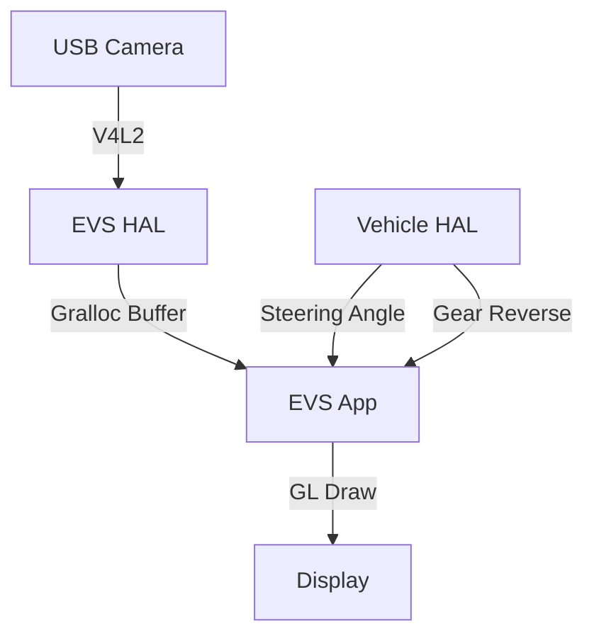

# Day 67: Week 11 Review - EVS Project
## Phase 3: Camera Systems & ISP | Week 11: Android Automotive & EVS

---

## 🎯 Learning Objectives
1.  **Integrate** the EVS HAL, Manager, and App into a working system.
2.  **Build** a "Smart Rear View Camera" project.
3.  **Implement** a custom EVS HAL that wraps a USB webcam.
4.  **Develop** an EVS App with dynamic guidelines and distance warning.
5.  **Validate** the 2-second boot requirement.

---

## 📚 Week 11 Recap

### Topics Covered

**Day 61: AAOS Overview**
- Car Service, VHAL, Architecture.

**Day 62: EVS Architecture**
- Kernel -> HAL -> App flow.
- Zero-copy requirement.

**Day 63: EVS HAL Implementation**
- `IEvsCamera`, Gralloc, V4L2 wrapper.

**Day 64: Camera Integration**
- Metadata, Parameters, VHAL triggers.

**Day 65: Rendering**
- OpenGL ES, OES Textures, Overlays.

**Day 66: Surround View**
- Multi-camera stitching, Bowl view.

---

## 💻 Week 11 Integration Project

### Project: "SmartRVC - Intelligent Rear View Camera"

**Objective:** Create a complete EVS stack for a Rear View Camera that overlays dynamic parking lines and detects obstacles (simulated).

**Features:**
1.  **Driver:** Custom EVS HAL for `/dev/video0`.
2.  **App:** Native C++ EVS App.
3.  **Input:** Steering Angle (from VHAL).
4.  **Output:** Video + Curved Lines + "STOP" warning if close.

### Architecture



### Implementation

#### Part 1: The HAL (Simplified)

```cpp
// EvsCamera.cpp
Return<EvsResult> EvsCamera::startVideoStream(const sp<IEvsCameraStream>& receiver) {
    // Open /dev/video0
    // Start Thread
    std::thread([this, receiver](){
        while(running) {
            // 1. Capture Frame
            // 2. Wrap in BufferDesc
            // 3. Send
            receiver->deliverFrame(buf);
        }
    }).detach();
    return EvsResult::OK;
}
```

#### Part 2: The App (Main Loop)

```cpp
// EvsApp.cpp
int main() {
    // 1. Connect to VHAL
    auto vhal = IVehicle::getService();
    vhal->subscribe(GEAR_SELECTION, onGearChange);
    vhal->subscribe(STEERING_ANGLE, onSteerChange);
    
    // 2. Wait for Reverse
    while(true) {
        if (current_gear == REVERSE) {
            if (!camera_open) {
                pCamera = pEnum->openCamera("rear");
                pCamera->startVideoStream(new StreamHandler());
                camera_open = true;
            }
        } else {
            if (camera_open) {
                pCamera->stopVideoStream();
                pCamera = nullptr;
                camera_open = false;
            }
        }
        usleep(100000);
    }
}
```

#### Part 3: The Renderer (Guidelines)

```cpp
// Renderer.cpp
void render(float steering_angle) {
    // 1. Draw Video Quad
    draw_video_texture();
    
    // 2. Calculate Curve
    // Radius = Wheelbase / tan(steering_angle)
    std::vector<float> line_points = calculate_ackermann(steering_angle);
    
    // 3. Draw Lines
    draw_lines(line_points, COLOR_YELLOW);
}
```

---

## 🔬 System Validation Plan

### Test 1: Boot Time Analysis
**Objective:** Verify < 2s.
**Procedure:**
1.  Connect UART console.
2.  Reboot board.
3.  Measure time from `U-Boot` end to `EVS App` first frame (log message).
4.  **Target:** 1.5 - 1.8 seconds.

### Test 2: Latency Test
**Objective:** Verify < 50ms (Glass-to-Glass).
**Procedure:**
1.  Film a stopwatch with the RVC.
2.  Film the RVC screen with a high-speed camera (iPhone Slo-Mo).
3.  Calculate difference.
4.  **Target:** < 100ms is acceptable for RVC.

### Test 3: VHAL Integration
**Objective:** Verify Steering response.
**Procedure:**
1.  Inject Steering Angle events via `adb`.
2.  **Goal:** Guidelines should move smoothly and instantly.

---

## 🐛 Troubleshooting Guide

### Issue 1: "Tearing" in Video

**Symptom:** Horizontal split.

**Cause:**
*   EVS App is not syncing with VSYNC.
*   **Fix:** Use `eglSwapInterval(display, 1)`.

### Issue 2: "Frozen" Video

**Symptom:** Image is static.

**Cause:**
*   HAL stopped sending frames (V4L2 timeout).
*   App stopped releasing frames (`doneWithFrame` not called).
*   **Fix:** Check logs for "Buffer Starvation".

---

## 📝 Assessment Questions

### Comprehensive Questions

1.  **Why is the EVS App written in C++ and not Java?** (Performance, Predictability, No Garbage Collection pauses, Early boot).
2.  **How does the EVS HAL share memory with the App?** (Gralloc / DMA-BUF / File Descriptors).
3.  **What is the "Ackermann Steering Geometry"?** (Math used to calculate wheel paths).
4.  **Why do we need a separate "EVS Manager"?** (To allow multiple apps to share the camera safely).

### Practical Challenges

1.  **Add "Ultrasonic Overlay":** Draw colored arcs behind the car representing distance sensors (Green/Yellow/Red).
2.  **Implement "Fisheye Dewarping":** Add a shader pass to straighten the image.

---

## 📚 Resources & Next Steps

### Week 11 Summary

**Completed:**
- ✅ **AAOS:** The platform.
- ✅ **EVS:** The safety system.
- ✅ **HAL:** The driver.
- ✅ **Rendering:** The UI.
- ✅ **Project:** SmartRVC.

**Key Skills Acquired:**
- Android System Programming (Native).
- HAL Development.
- OpenGL ES.

### Week 12 Preview (Phase 3 Continued)

**Topics:**
- **Functional Safety:** ISO 26262, ASIL.
- **Security:** Secure Boot, TrustZone.
- **Power:** Suspend/Resume.
- **Optimization:** Fast Boot techniques.

---

**Day 67 Complete** | Phase 3: Camera Systems & ISP | Week 11: Android Automotive & EVS
