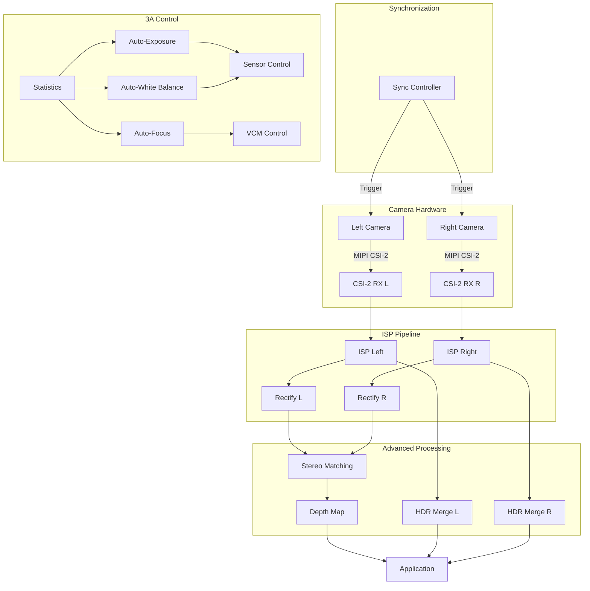

# Day 14: Week 2 Review - Advanced Camera Features Integration
## Phase 3: Camera Systems & ISP | Week 2: Advanced Camera Features

---

## 🎯 Learning Objectives
1. **Integrate** all Week 2 concepts into complete advanced camera system
2. **Build** HDR multi-camera system with stereo depth and calibration
3. **Implement** complete 3A system with all advanced features
4. **Debug** complex multi-component camera systems
5. **Optimize** end-to-end performance for production deployment
6. **Demonstrate** working advanced camera features

---

## 📚 Week 2 Recap

### Topics Covered

**Day 8: HDR and WDR Imaging**
- Multi-exposure HDR capture
- Tone mapping algorithms
- Sensor WDR modes

**Day 9: Multi-Camera Synchronization**
- Hardware triggers and genlock
- Software synchronization (PTP)
- Frame alignment

**Day 10: Stereo Vision**
- Epipolar geometry
- Stereo calibration and rectification
- Disparity computation and depth maps

**Day 11: Camera Calibration**
- Pinhole camera model
- Lens distortion correction
- Zhang's calibration method

**Day 12: Auto-Focus**
- Focus metrics and search algorithms
- Phase detection AF
- Continuous AF for video

**Day 13: Advanced AE/AWB**
- Metering modes
- Histogram-based exposure
- Illuminant estimation

---

## 💻 Week 2 Integration Project

### Project: Advanced Multi-Camera System

**Objective:** Build a complete multi-camera system with HDR, stereo depth, calibration, and advanced 3A.

**Features:**
- Dual camera stereo with HDR
- Real-time depth estimation
- Auto-calibration
- Advanced 3A (AF/AE/AWB)
- Flicker detection
- Multi-zone metering

### Architecture



### Implementation

#### Part 1: System Manager

```c
/**
 * @file advanced_camera_system.c
 * @brief Complete advanced camera system
 */

#include <stdio.h>
#include <stdlib.h>
#include <stdint.h>
#include <pthread.h>
#include <stdbool.h>

#define NUM_CAMERAS 2

struct camera_system {
    /* Hardware */
    struct {
        int fd;
        struct camera_buffer buffers[4];
        struct camera_config config;
    } cameras[NUM_CAMERAS];
    
    /* Calibration */
    struct stereo_calibration stereo_calib;
    bool calibration_valid;
    
    /* HDR */
    struct {
        bool enabled;
        unsigned int num_exposures;
        float *exposure_times;
        struct hdr_processor *processor;
    } hdr;
    
    /* Stereo */
    struct {
        bool enabled;
        struct sgm_params sgm;
        int16_t *disparity;
        float *depth;
        struct point3d *point_cloud;
        unsigned int num_points;
    } stereo;
    
    /* 3A */
    struct threea_system *threea;
    
    /* Synchronization */
    pthread_barrier_t frame_barrier;
    pthread_mutex_t data_mutex;
    
    /* State */
    bool running;
    unsigned int frame_count;
    
    /* Callbacks */
    void (*frame_callback)(void *left, void *right, void *depth, void *user_data);
    void *user_data;
};

/**
 * @brief Initialize advanced camera system
 */
static struct camera_system *camera_system_init(void)
{
    struct camera_system *sys = calloc(1, sizeof(*sys));
    
    /* Initialize cameras */
    for (int i = 0; i < NUM_CAMERAS; i++) {
        char dev_name[32];
        snprintf(dev_name, sizeof(dev_name), "/dev/video%d", i);
        
        sys->cameras[i].config.width = 1280;
        sys->cameras[i].config.height = 720;
        sys->cameras[i].config.fps = 30;
        sys->cameras[i].config.pixelformat = V4L2_PIX_FMT_SRGGB10;
        
        sys->cameras[i].fd = open(dev_name, O_RDWR);
        /* ... V4L2 setup ... */
        
        printf("Initialized camera %d\n", i);
    }
    
    /* Load calibration */
    if (load_stereo_calibration("stereo_calib.yml", &sys->stereo_calib) == 0) {
        sys->calibration_valid = true;
        printf("Loaded stereo calibration\n");
    } else {
        printf("Warning: No calibration found\n");
    }
    
    /* Initialize HDR */
    sys->hdr.enabled = true;
    sys->hdr.num_exposures = 3;
    sys->hdr.exposure_times = malloc(3 * sizeof(float));
    sys->hdr.exposure_times[0] = 0.0025f;  /* 2.5ms */
    sys->hdr.exposure_times[1] = 0.010f;   /* 10ms */
    sys->hdr.exposure_times[2] = 0.040f;   /* 40ms */
    
    sys->hdr.processor = hdr_processor_init(sys->cameras[0].config.width,
                                           sys->cameras[0].config.height,
                                           sys->hdr.num_exposures);
    
    /* Initialize stereo */
    sys->stereo.enabled = true;
    sys->stereo.sgm.min_disparity = 0;
    sys->stereo.sgm.max_disparity = 128;
    sys->stereo.sgm.P1 = 10;
    sys->stereo.sgm.P2 = 120;
    
    unsigned int pixels = sys->cameras[0].config.width * 
                         sys->cameras[0].config.height;
    sys->stereo.disparity = malloc(pixels * sizeof(int16_t));
    sys->stereo.depth = malloc(pixels * sizeof(float));
    
    /* Initialize 3A */
    sys->threea = threea_init();
    sys->threea->set_exposure = camera_set_exposure;
    sys->threea->set_gain = camera_set_gain;
    sys->threea->set_wb_gains = camera_set_wb_gains;
    
    /* Initialize synchronization */
    pthread_barrier_init(&sys->frame_barrier, NULL, NUM_CAMERAS);
    pthread_mutex_init(&sys->data_mutex, NULL);
    
    return sys;
}

/**
 * @brief Capture thread for each camera
 */
static void *camera_capture_thread(void *arg)
{
    struct {
        struct camera_system *sys;
        int camera_id;
    } *data = arg;
    
    struct camera_system *sys = data->sys;
    int cam_id = data->camera_id;
    
    while (sys->running) {
        /* Dequeue buffer */
        struct v4l2_buffer buf = {0};
        buf.type = V4L2_BUF_TYPE_VIDEO_CAPTURE;
        buf.memory = V4L2_MEMORY_MMAP;
        
        if (ioctl(sys->cameras[cam_id].fd, VIDIOC_DQBUF, &buf) < 0) {
            perror("VIDIOC_DQBUF");
            break;
        }
        
        /* Wait for all cameras */
        pthread_barrier_wait(&sys->frame_barrier);
        
        /* Process frame (only camera 0 does processing) */
        if (cam_id == 0) {
            pthread_mutex_lock(&sys->data_mutex);
            
            /* Get frame pointers */
            void *left_frame = sys->cameras[0].buffers[buf.index].start;
            void *right_frame = sys->cameras[1].buffers[buf.index].start;
            
            /* Process pipeline */
            camera_system_process(sys, left_frame, right_frame);
            
            pthread_mutex_unlock(&sys->data_mutex);
        }
        
        /* Requeue */
        if (ioctl(sys->cameras[cam_id].fd, VIDIOC_QBUF, &buf) < 0) {
            perror("VIDIOC_QBUF");
            break;
        }
    }
    
    return NULL;
}

/**
 * @brief Process frame pair
 */
static void camera_system_process(
    struct camera_system *sys,
    void *left_raw,
    void *right_raw)
{
    unsigned int width = sys->cameras[0].config.width;
    unsigned int height = sys->cameras[0].config.height;
    
    printf("Processing frame %u\n", sys->frame_count);
    
    /* 1. ISP processing */
    uint8_t *left_rgb = malloc(width * height * 3);
    uint8_t *right_rgb = malloc(width * height * 3);
    
    isp_process(left_raw, left_rgb, width, height);
    isp_process(right_raw, right_rgb, width, height);
    
    /* 2. HDR processing (if enabled) */
    if (sys->hdr.enabled) {
        /* Capture multiple exposures */
        /* ... HDR capture and merge ... */
    }
    
    /* 3. Stereo processing (if enabled and calibrated) */
    void *depth_data = NULL;
    
    if (sys->stereo.enabled && sys->calibration_valid) {
        /* Rectify */
        uint8_t *left_rect = malloc(width * height);
        uint8_t *right_rect = malloc(width * height);
        
        stereo_rectify_images(left_rgb, right_rgb,
                             left_rect, right_rect,
                             width, height,
                             &sys->stereo_calib);
        
        /* Stereo matching */
        sgm_stereo(left_rect, right_rect,
                  sys->stereo.disparity,
                  width, height,
                  &sys->stereo.sgm);
        
        /* Depth computation */
        float focal_length = sys->stereo_calib.P1[0][0];
        float baseline = -sys->stereo_calib.P2[0][3] / focal_length;
        
        disparity_to_depth(sys->stereo.disparity, sys->stereo.depth,
                          width, height,
                          focal_length, baseline);
        
        depth_data = sys->stereo.depth;
        
        free(left_rect);
        free(right_rect);
    }
    
    /* 4. 3A processing */
    uint8_t *left_y = malloc(width * height);
    rgb_to_y(left_rgb, left_y, width, height);
    
    threea_update(sys->threea,
                 left_y,
                 &left_rgb[0],  /* R channel */
                 &left_rgb[1],  /* G channel */
                 &left_rgb[2],  /* B channel */
                 width, height);
    
    free(left_y);
    
    /* 5. User callback */
    if (sys->frame_callback) {
        sys->frame_callback(left_rgb, right_rgb, depth_data, sys->user_data);
    }
    
    free(left_rgb);
    free(right_rgb);
    
    sys->frame_count++;
}

/**
 * @brief Start camera system
 */
static int camera_system_start(struct camera_system *sys)
{
    sys->running = true;
    
    /* Start streaming on all cameras */
    for (int i = 0; i < NUM_CAMERAS; i++) {
        enum v4l2_buf_type type = V4L2_BUF_TYPE_VIDEO_CAPTURE;
        if (ioctl(sys->cameras[i].fd, VIDIOC_STREAMON, &type) < 0) {
            perror("VIDIOC_STREAMON");
            return -1;
        }
    }
    
    /* Start capture threads */
    pthread_t threads[NUM_CAMERAS];
    struct {
        struct camera_system *sys;
        int camera_id;
    } thread_data[NUM_CAMERAS];
    
    for (int i = 0; i < NUM_CAMERAS; i++) {
        thread_data[i].sys = sys;
        thread_data[i].camera_id = i;
        
        pthread_create(&threads[i], NULL, camera_capture_thread,
                      &thread_data[i]);
    }
    
    printf("Camera system started\n");
    
    /* Wait for threads */
    for (int i = 0; i < NUM_CAMERAS; i++) {
        pthread_join(threads[i], NULL);
    }
    
    return 0;
}
```

#### Part 2: Auto-Calibration

```c
/**
 * @file auto_calibration.c
 * @brief Automatic stereo calibration
 */

struct auto_calibration {
    /* Pattern detection */
    struct calibration_pattern pattern;
    
    /* Collected data */
    unsigned int num_samples;
    unsigned int max_samples;
    float **object_points;
    float **image_points_left;
    float **image_points_right;
    
    /* Progress */
    bool calibration_complete;
    float calibration_quality;
};

/**
 * @brief Initialize auto-calibration
 */
static struct auto_calibration *auto_calibration_init(void)
{
    struct auto_calibration *calib = calloc(1, sizeof(*calib));
    
    calib->pattern.width = 9;
    calib->pattern.height = 6;
    calib->pattern.square_size = 25.0f;
    
    calib->max_samples = 20;
    calib->object_points = malloc(calib->max_samples * sizeof(float*));
    calib->image_points_left = malloc(calib->max_samples * sizeof(float*));
    calib->image_points_right = malloc(calib->max_samples * sizeof(float*));
    
    return calib;
}

/**
 * @brief Process frame for calibration
 */
static bool auto_calibration_process_frame(
    struct auto_calibration *calib,
    uint8_t *left_image,
    uint8_t *right_image,
    unsigned int width,
    unsigned int height)
{
    if (calib->num_samples >= calib->max_samples) {
        return false;  /* Already have enough samples */
    }
    
    /* Detect pattern in both images */
    unsigned int num_corners = calib->pattern.width * calib->pattern.height;
    
    float *corners_left = malloc(num_corners * 2 * sizeof(float));
    float *corners_right = malloc(num_corners * 2 * sizeof(float));
    
    bool left_found = detect_pattern(left_image, width, height,
                                     &calib->pattern, corners_left);
    bool right_found = detect_pattern(right_image, width, height,
                                      &calib->pattern, corners_right);
    
    if (left_found && right_found) {
        /* Add sample */
        unsigned int idx = calib->num_samples;
        
        calib->object_points[idx] = malloc(num_corners * 3 * sizeof(float));
        generate_object_points(&calib->pattern, calib->object_points[idx]);
        
        calib->image_points_left[idx] = corners_left;
        calib->image_points_right[idx] = corners_right;
        
        calib->num_samples++;
        
        printf("Calibration sample %u/%u collected\n",
               calib->num_samples, calib->max_samples);
        
        return true;
    } else {
        free(corners_left);
        free(corners_right);
        return false;
    }
}

/**
 * @brief Compute calibration
 */
static int auto_calibration_compute(
    struct auto_calibration *calib,
    struct stereo_calibration *stereo_calib,
    unsigned int width,
    unsigned int height)
{
    if (calib->num_samples < 10) {
        fprintf(stderr, "Not enough samples for calibration\n");
        return -1;
    }
    
    printf("Computing stereo calibration...\n");
    
    /* Perform calibration */
    int ret = stereo_calibrate(stereo_calib,
                              calib->object_points,
                              calib->image_points_left,
                              calib->image_points_right,
                              calib->num_samples,
                              calib->pattern.width * calib->pattern.height,
                              width, height);
    
    if (ret == 0) {
        calib->calibration_complete = true;
        calib->calibration_quality = 1.0f / stereo_calib->rms_error;
        
        printf("Calibration complete!\n");
        printf("  RMS error: %.4f pixels\n", stereo_calib->rms_error);
        
        /* Save calibration */
        save_stereo_calibration("stereo_calib.yml", stereo_calib);
    }
    
    return ret;
}
```

---

## 🔬 Integration Testing

### Test 1: End-to-End Latency

```bash
#!/bin/bash
# test_system_latency.sh

echo "System Latency Test"
echo "==================="

# Measure latency from trigger to depth output

python3 << 'EOF'
import time
import numpy as np

# Trigger flash
trigger_flash()

start_time = time.time()

# Wait for depth output
while True:
    depth = get_depth_map()
    
    if depth is not None:
        # Check if flash is visible in depth
        if np.max(depth) > threshold:
            latency = (time.time() - start_time) * 1000
            print(f"End-to-end latency: {latency:.1f} ms")
            break
    
    time.sleep(0.001)
EOF
```

### Test 2: Stereo Accuracy

```python
#!/usr/bin/env python3
"""
test_stereo_accuracy.py
Measure stereo depth accuracy
"""

import numpy as np
import cv2

def test_stereo_accuracy():
    """Test stereo depth accuracy at known distances"""
    
    # Known distances (meters)
    test_distances = [0.5, 1.0, 2.0, 3.0, 5.0]
    
    results = []
    
    for true_dist in test_distances:
        print(f"\nTesting at {true_dist}m...")
        
        # Position target at known distance
        input(f"Position target at {true_dist}m and press Enter")
        
        # Capture depth
        depth_map = capture_depth_map()
        
        # Measure depth at center
        h, w = depth_map.shape
        center_depth = depth_map[h//2, w//2]
        
        # Calculate error
        error = abs(center_depth - true_dist)
        error_pct = (error / true_dist) * 100
        
        results.append({
            'true_distance': true_dist,
            'measured_distance': center_depth,
            'error': error,
            'error_percent': error_pct
        })
        
        print(f"  Measured: {center_depth:.3f}m")
        print(f"  Error: {error:.3f}m ({error_pct:.1f}%)")
    
    # Summary
    print("\n" + "="*50)
    print("Accuracy Summary:")
    print("="*50)
    
    mean_error = np.mean([r['error'] for r in results])
    mean_error_pct = np.mean([r['error_percent'] for r in results])
    
    print(f"Mean absolute error: {mean_error:.3f}m")
    print(f"Mean percentage error: {mean_error_pct:.1f}%")
    
    # Plot
    import matplotlib.pyplot as plt
    
    true_dists = [r['true_distance'] for r in results]
    meas_dists = [r['measured_distance'] for r in results]
    
    plt.figure(figsize=(10, 6))
    plt.plot(true_dists, true_dists, 'k--', label='Ideal')
    plt.plot(true_dists, meas_dists, 'ro-', label='Measured')
    plt.xlabel('True Distance (m)')
    plt.ylabel('Measured Distance (m)')
    plt.title('Stereo Depth Accuracy')
    plt.legend()
    plt.grid(True)
    plt.savefig('stereo_accuracy.png')
    plt.show()

if __name__ == '__main__':
    test_stereo_accuracy()
```

---

## 🐛 System-Level Debugging

### Debug 1: Synchronization Issues

```c
/**
 * @brief Debug camera synchronization
 */
struct sync_debug {
    struct timeval timestamps[NUM_CAMERAS][100];
    unsigned int count;
};

static void sync_debug_log(
    struct sync_debug *debug,
    struct timeval *timestamps)
{
    if (debug->count < 100) {
        for (int i = 0; i < NUM_CAMERAS; i++) {
            debug->timestamps[i][debug->count] = timestamps[i];
        }
        debug->count++;
    }
}

static void sync_debug_analyze(struct sync_debug *debug)
{
    printf("Synchronization Analysis:\n");
    
    for (unsigned int i = 0; i < debug->count; i++) {
        uint64_t t0 = debug->timestamps[0][i].tv_sec * 1000000ULL +
                     debug->timestamps[0][i].tv_usec;
        
        for (int j = 1; j < NUM_CAMERAS; j++) {
            uint64_t tj = debug->timestamps[j][i].tv_sec * 1000000ULL +
                         debug->timestamps[j][i].tv_usec;
            
            int64_t skew = (int64_t)tj - (int64_t)t0;
            
            printf("Frame %u, Camera %d skew: %lld us\n", i, j, skew);
        }
    }
}
```

### Debug 2: 3A Convergence

```python
#!/usr/bin/env python3
"""
debug_3a_convergence.py
Analyze 3A convergence behavior
"""

import matplotlib.pyplot as plt
import numpy as np

def analyze_3a_convergence(log_file):
    """Analyze 3A convergence from log"""
    
    # Parse log
    frames = []
    exposures = []
    gains = []
    r_gains = []
    b_gains = []
    luminances = []
    
    with open(log_file, 'r') as f:
        for line in f:
            if 'AE:' in line:
                # Parse AE data
                parts = line.split(',')
                lum = float(parts[1].split('=')[1])
                exp = float(parts[2].split('=')[1].replace('ms', ''))
                gain = float(parts[3].split('=')[1])
                
                luminances.append(lum)
                exposures.append(exp)
                gains.append(gain)
            
            if 'AWB:' in line:
                # Parse AWB data
                parts = line.split(',')
                r_gain = float(parts[1].split('=')[1])
                b_gain = float(parts[2].split('=')[1])
                
                r_gains.append(r_gain)
                b_gains.append(b_gain)
    
    frames = range(len(luminances))
    
    # Plot
    fig, axes = plt.subplots(2, 2, figsize=(12, 10))
    
    # AE convergence
    axes[0,0].plot(frames, luminances)
    axes[0,0].axhline(y=128, color='r', linestyle='--', label='Target')
    axes[0,0].set_xlabel('Frame')
    axes[0,0].set_ylabel('Luminance')
    axes[0,0].set_title('AE Convergence')
    axes[0,0].legend()
    axes[0,0].grid(True)
    
    # Exposure/Gain
    ax1 = axes[0,1]
    ax2 = ax1.twinx()
    
    ax1.plot(frames, exposures, 'b-', label='Exposure')
    ax2.plot(frames, gains, 'r-', label='Gain')
    
    ax1.set_xlabel('Frame')
    ax1.set_ylabel('Exposure (ms)', color='b')
    ax2.set_ylabel('Gain', color='r')
    ax1.set_title('AE Parameters')
    ax1.grid(True)
    
    # AWB convergence
    axes[1,0].plot(frames, r_gains, label='R Gain')
    axes[1,0].plot(frames, b_gains, label='B Gain')
    axes[1,0].axhline(y=1.0, color='k', linestyle='--')
    axes[1,0].set_xlabel('Frame')
    axes[1,0].set_ylabel('WB Gain')
    axes[1,0].set_title('AWB Convergence')
    axes[1,0].legend()
    axes[1,0].grid(True)
    
    # Convergence time
    # Find when AE converges (within 5% of target)
    target = 128
    tolerance = target * 0.05
    
    ae_converged = None
    for i, lum in enumerate(luminances):
        if abs(lum - target) < tolerance:
            ae_converged = i
            break
    
    # Find when AWB converges (gains stable)
    awb_converged = None
    for i in range(10, len(r_gains)):
        r_stable = np.std(r_gains[i-10:i]) < 0.01
        b_stable = np.std(b_gains[i-10:i]) < 0.01
        
        if r_stable and b_stable:
            awb_converged = i
            break
    
    axes[1,1].bar(['AE', 'AWB'], 
                  [ae_converged if ae_converged else len(frames),
                   awb_converged if awb_converged else len(frames)])
    axes[1,1].set_ylabel('Frames to Converge')
    axes[1,1].set_title('Convergence Time')
    axes[1,1].grid(True)
    
    plt.tight_layout()
    plt.savefig('3a_convergence_analysis.png')
    plt.show()
    
    print(f"AE converged at frame: {ae_converged}")
    print(f"AWB converged at frame: {awb_converged}")

if __name__ == '__main__':
    analyze_3a_convergence('camera_system.log')
```

---

## ⚡ System Optimization

### Optimization 1: Pipeline Parallelization

```c
/**
 * @brief Parallel ISP pipeline
 */
static void isp_pipeline_parallel(
    uint16_t *raw,
    uint8_t *rgb,
    unsigned int width,
    unsigned int height)
{
    /* Split image into tiles for parallel processing */
    unsigned int num_threads = 4;
    unsigned int tile_height = height / num_threads;
    
    pthread_t threads[num_threads];
    struct {
        uint16_t *raw;
        uint8_t *rgb;
        unsigned int width;
        unsigned int y_start;
        unsigned int y_end;
    } thread_data[num_threads];
    
    for (unsigned int i = 0; i < num_threads; i++) {
        thread_data[i].raw = raw;
        thread_data[i].rgb = rgb;
        thread_data[i].width = width;
        thread_data[i].y_start = i * tile_height;
        thread_data[i].y_end = (i == num_threads - 1) ? 
                               height : (i + 1) * tile_height;
        
        pthread_create(&threads[i], NULL, isp_tile_thread, &thread_data[i]);
    }
    
    for (unsigned int i = 0; i < num_threads; i++) {
        pthread_join(threads[i], NULL);
    }
}
```

### Optimization 2: GPU Acceleration

```cuda
/**
 * @file stereo_cuda.cu
 * @brief CUDA-accelerated stereo matching
 */

__global__ void sgm_aggregate_kernel(
    const uint16_t *costs,
    uint16_t *aggregated,
    unsigned int width,
    unsigned int height,
    int num_disp,
    int dx,
    int dy,
    int P1,
    int P2)
{
    unsigned int x = blockIdx.x * blockDim.x + threadIdx.x;
    unsigned int y = blockIdx.y * blockDim.y + threadIdx.y;
    
    if (x >= width || y >= height)
        return;
    
    int prev_x = x - dx;
    int prev_y = y - dy;
    
    if (prev_x < 0 || prev_x >= width ||
        prev_y < 0 || prev_y >= height) {
        /* First pixel in path */
        for (int d = 0; d < num_disp; d++) {
            unsigned int idx = (y * width + x) * num_disp + d;
            aggregated[idx] = costs[idx];
        }
        return;
    }
    
    /* Find minimum cost at previous pixel */
    uint16_t min_prev = UINT16_MAX;
    for (int d = 0; d < num_disp; d++) {
        unsigned int prev_idx = (prev_y * width + prev_x) * num_disp + d;
        if (aggregated[prev_idx] < min_prev)
            min_prev = aggregated[prev_idx];
    }
    
    /* Aggregate costs */
    for (int d = 0; d < num_disp; d++) {
        unsigned int idx = (y * width + x) * num_disp + d;
        unsigned int prev_idx = (prev_y * width + prev_x) * num_disp + d;
        
        uint16_t cost = costs[idx];
        
        /* Path cost options */
        uint16_t same_disp = aggregated[prev_idx];
        
        uint16_t small_change = UINT16_MAX;
        if (d > 0)
            small_change = min(small_change, aggregated[prev_idx - 1] + P1);
        if (d < num_disp - 1)
            small_change = min(small_change, aggregated[prev_idx + 1] + P1);
        
        uint16_t large_change = min_prev + P2;
        
        uint16_t min_path = min(same_disp, min(small_change, large_change));
        
        aggregated[idx] = cost + min_path - min_prev;
    }
}
```

---

## 📝 Week 2 Assessment

### Comprehensive Questions

1. **Design a complete camera system for autonomous vehicles:**
   - Specify camera configuration
   - Describe synchronization strategy
   - Explain calibration procedure
   - Detail 3A requirements

2. **Debug scenario:** Stereo depth is accurate at 2m but inaccurate at 5m. What could be wrong?

3. **Optimize a multi-camera HDR system to achieve 30fps at 4K resolution.**

4. **Explain the complete pipeline from photons to depth map.**

5. **Design a calibration procedure that can be performed by end users.**

### Practical Challenges

1. **Implement real-time HDR video with stereo depth.**

2. **Build auto-calibration system using natural features (no checkerboard).**

3. **Create adaptive 3A that adjusts to scene type (indoor/outdoor/night).**

4. **Optimize system to run on embedded platform with limited resources.**

---

## 📚 Resources & Next Steps

### Week 2 Summary

**Completed:**
- ✅ HDR/WDR imaging with multiple algorithms
- ✅ Multi-camera synchronization (hardware and software)
- ✅ Stereo vision and depth estimation
- ✅ Camera calibration and geometric correction
- ✅ Advanced auto-focus algorithms
- ✅ Advanced AE/AWB with scene analysis
- ✅ Complete integrated system

**Key Skills Acquired:**
- Multi-camera system design
- Advanced ISP algorithms
- 3A algorithm development
- System integration and optimization
- Performance profiling and debugging

### Week 3 Preview

**Topics:**
- SerDes interfaces (GMSL, FPD-Link)
- Automotive camera systems
- Functional safety (ISO 26262)
- ADAS camera integration
- Surround view systems
- Camera diagnostics

---

## 🎓 Week 2 Complete!

**Congratulations!** You've completed Week 2 of Camera Systems & ISP.

**What You've Built:**
- Complete multi-camera HDR system
- Real-time stereo depth estimation
- Auto-calibration system
- Advanced 3A with all features
- Production-ready camera pipeline

**Next:** Week 3 - Automotive Camera Systems and SerDes

---

**Day 14 Complete** | Phase 3: Camera Systems & ISP | Week 2 Review
