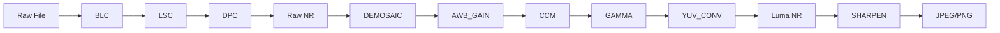

# Day 27: Week 4 Review - ISP Tuning Project
## Phase 3: Camera Systems & ISP | Week 4: ISP Pipeline Development

---

## 🎯 Learning Objectives
1.  **Integrate** all ISP blocks (Raw, Demosaic, Color, Enhance) into a single pipeline.
2.  **Tune** the pipeline for a specific image sensor (e.g., IMX219 or OV5647).
3.  **Evaluate** Image Quality (IQ) using objective metrics (SNR, MTF, DeltaE).
4.  **Debug** complex interactions between ISP blocks (e.g., Denoise vs Sharpening).
5.  **Optimize** the pipeline for performance (Memory bandwidth, Latency).

---

## 📚 Week 4 Recap

### Topics Covered

**Day 22: ISP Architecture & Raw**
- Pipeline stages (Raw -> Bayer -> RGB -> YUV).
- Black Level Correction (BLC), Lens Shading (LSC), Defect Pixel (DPC).

**Day 23: Demosaicing**
- Bayer CFA structure.
- Algorithms: Bilinear, Malvar-He-Cutler, Edge-Directed.
- Artifacts: Zipper, False Color.

**Day 24: Color Processing**
- Color Correction Matrix (CCM) for color accuracy.
- Gamma Correction for display mapping.
- Color Space Conversion (RGB -> YUV).

**Day 25: Sharpening**
- Unsharp Mask (USM).
- Edge-Adaptive sharpening to prevent halos.

**Day 26: Noise Reduction**
- Spatial (Bilateral) and Temporal (Motion Adaptive) NR.
- Noise profiling vs ISO.

---

## 💻 Week 4 Integration Project

### Project: "SoftISP - A Tunable Camera Pipeline"

**Objective:** Build a complete C++ command-line ISP that takes a RAW file and produces a tuned JPEG/PNG.

**Features:**
1.  **Configurable:** Reads a JSON/YAML tuning file (e.g., `imx219_tuning.json`).
2.  **Modular:** Each block (BLC, LSC, etc.) is a separate class.
3.  **Debuggable:** Can dump intermediate images (e.g., `after_demosaic.png`).

### Architecture



### Implementation

#### Part 1: The Tuning File (`tuning.json`)

```json
{
    "sensor_info": {
        "name": "IMX219",
        "width": 3280,
        "height": 2464,
        "bit_depth": 10,
        "bayer_pattern": "RGGB",
        "black_level": 64
    },
    "modules": {
        "lsc": { "enable": true, "mesh_file": "lsc_mesh.bin" },
        "demosaic": { "algo": "malvar_he_cutler" },
        "ccm": {
            "matrix": [
                1.5, -0.3, -0.2,
                -0.2, 1.4, -0.2,
                -0.1, -0.4, 1.5
            ]
        },
        "gamma": { "value": 2.2 },
        "sharpen": { "enable": true, "strength": 1.0 },
        "denoise": { "enable": true, "sigma_s": 2.0, "sigma_r": 10.0 }
    }
}
```

#### Part 2: The Pipeline Class

```cpp
/**
 * @file pipeline.cpp
 * @brief Main ISP Pipeline
 */

#include "modules.h"
#include "json.hpp" // nlohmann/json

class SoftISP {
    RawImage raw_img;
    RGBImage rgb_img;
    YUVImage yuv_img;
    json tuning;

public:
    void load_tuning(std::string filename) {
        std::ifstream f(filename);
        f >> tuning;
    }

    void run(std::string input_file, std::string output_file) {
        // 1. Load Raw
        load_raw(input_file, raw_img, tuning["sensor_info"]);
        
        // 2. Raw Processing
        if (tuning["modules"]["blc"]["enable"])
            apply_blc(raw_img, tuning["sensor_info"]["black_level"]);
            
        if (tuning["modules"]["lsc"]["enable"])
            apply_lsc(raw_img, tuning["modules"]["lsc"]["mesh_file"]);
            
        // 3. Demosaic
        demosaic(raw_img, rgb_img, tuning["modules"]["demosaic"]["algo"]);
        
        // 4. Color
        apply_ccm(rgb_img, tuning["modules"]["ccm"]["matrix"]);
        apply_gamma(rgb_img, tuning["modules"]["gamma"]["value"]);
        
        // 5. YUV & Enhance
        rgb_to_yuv(rgb_img, yuv_img);
        
        if (tuning["modules"]["denoise"]["enable"])
            apply_bilateral_y(yuv_img, tuning["modules"]["denoise"]);
            
        if (tuning["modules"]["sharpen"]["enable"])
            apply_sharpen_y(yuv_img, tuning["modules"]["sharpen"]);
            
        // 6. Save
        save_image(yuv_img, output_file);
    }
};
```

#### Part 3: Tuning Strategy (The "Art" of ISP)

**Step 1: Black Level & Saturation**
*   Ensure blacks are 0 (not grey) and whites are not pink (clipping).
*   *Check:* Histogram should touch 0.

**Step 2: LSC & AWB**
*   Ensure grey wall looks grey everywhere (corners and center).
*   *Check:* Vector Scope (dots should be in center).

**Step 3: Color Accuracy (CCM)**
*   Tune CCM to match Macbeth chart.
*   *Trade-off:* Lower DeltaE (accuracy) vs Noise amplification. Strong matrix terms amplify noise.

**Step 4: Noise vs Detail (NR & Sharpening)**
*   This is the hardest part.
*   *Strategy:* Turn off Sharpening. Tune NR until noise is acceptable but texture remains.
*   Then, turn on Sharpening to bring back edges.
*   *Avoid:* "Plastic" skin (too much NR) or "Halos" (too much Sharpening).

---

## 🔬 System Validation Plan

### Test 1: Resolution Test (ISO 12233)
**Objective:** Measure MTF50 (Sharpness).
**Procedure:**
1.  Capture ISO 12233 chart.
2.  Run pipeline.
3.  Analyze ROI on slanted edge using Imatest or `sfrmat3`.
4.  **Goal:** MTF50 > 0.3 cycles/pixel.

### Test 2: Color Accuracy (Macbeth)
**Objective:** Measure DeltaE 2000.
**Procedure:**
1.  Capture Macbeth chart.
2.  Run pipeline.
3.  Compare RGB values of patches to reference.
4.  **Goal:** Mean DeltaE < 5.0 (Consumer), < 2.0 (Pro).

### Test 3: Noise Performance (Grey Card)
**Objective:** Measure SNR (dB).
**Procedure:**
1.  Capture Grey card at ISO 800.
2.  Run pipeline.
3.  Calculate `Mean / StdDev` in linear domain -> convert to dB.
4.  **Goal:** SNR > 30dB.

---

## 🐛 Troubleshooting Guide

### Issue 1: Pink Highlights
**Cause:** Green channel clips before Red/Blue in the sensor, but AWB gains (G < R/B) hide it until CCM boosts it.
**Fix:** Implement "Highlight Recovery" or "Auto Knee" before CCM to desaturate highlights.

### Issue 2: Maze Artifacts
**Cause:** Demosaicing algorithm failing on high-frequency repetitive patterns (fabric, fences).
**Fix:** Switch to a more robust demosaic algorithm (AHD) or apply stronger False Color Removal (Chroma Blur).

### Issue 3: Color Shading shifts with Light Source
**Cause:** LSC profile for D65 (Daylight) doesn't match A (Tungsten).
**Fix:** Implement "Dual LSC". Interpolate between two LSC meshes based on current Color Temperature.

---

## 📝 Assessment Questions

### Comprehensive Questions

1.  **Design a tuning procedure** for a new sensor. What is the order of operations?
2.  **Explain why Noise Reduction should ideally happen before Sharpening.**
3.  **How does the "Vignetting" of a lens affect the Signal-to-Noise Ratio at the corners?**
4.  **Why is 3D LUT preferred over Matrix for "Creative" looks?**

### Practical Challenges

1.  **Implement a "Split Screen" debug mode** where the left half is the input (Raw/Bayer) and the right half is the output.
2.  **Create a "Tuning Tool"** (Python/Tkinter) that updates the `tuning.json` and re-runs the C++ pipeline in real-time when sliders are moved.

---

## 📚 Resources & Next Steps

### Week 4 Summary

**Completed:**
- ✅ ISP Architecture (Raw -> RGB -> YUV)
- ✅ Raw Processing (BLC, LSC, DPC)
- ✅ Demosaicing (Bilinear, Edge-Directed)
- ✅ Color (CCM, Gamma, CSC)
- ✅ Enhancement (Sharpening, NR)
- ✅ Tuning & Evaluation

**Key Skills Acquired:**
- Building a modular image processing pipeline.
- Understanding the math behind "Digital Photography".
- Tuning algorithms for subjective and objective quality.

### Week 5 Preview (Phase 3 Continued)

**Topics:**
- **Auto-Exposure (AE):** Metering, Convergence, Flicker.
- **Auto-White Balance (AWB):** Grey World, White Patch, Mesh.
- **Auto-Focus (AF):** Contrast Detection, PDAF.
- **3A Control Loop:** The brain of the camera.

---

**Day 27 Complete** | Phase 3: Camera Systems & ISP | Week 4 Review
