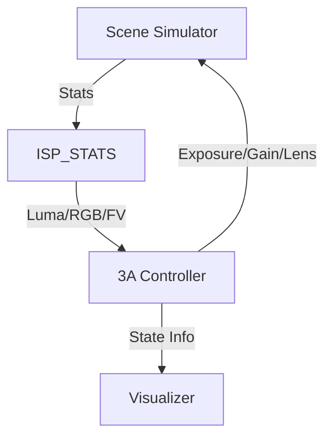

# Day 34: Week 5 Review - 3A Tuning Project
## Phase 3: Camera Systems & ISP | Week 5: 3A Algorithms & Control

---

## 🎯 Learning Objectives
1.  **Integrate** AE, AWB, and AF into a cohesive control system.
2.  **Tune** the PID parameters for Auto-Exposure to achieve fast, stable convergence.
3.  **Calibrate** the AWB algorithm for a specific sensor and lens combination.
4.  **Implement** a robust State Machine handling all corner cases (Low Light, Flash, Scene Change).
5.  **Validate** the 3A performance using industry-standard metrics (Convergence Time, Stability, Accuracy).

---

## 📚 Week 5 Recap

### Topics Covered

**Day 28: Auto-Exposure (AE)**
- Feedback Loop (Set Point, Error, Output).
- Exposure Decomposition (Gain vs Time).
- Flicker Avoidance and Hysteresis.

**Day 29: Auto-White Balance (AWB)**
- Gray World, White Patch, Mesh Algorithms.
- Illuminant Estimation and Color Temperature.
- Mixed Lighting handling.

**Day 30: Auto-Focus (AF)**
- Contrast Detection (FV) vs Phase Detection (PDAF).
- Search Strategies (Hill Climbing).
- VCM Control and Hysteresis.

**Day 31: 3A State Machine**
- Coordination Supervisor.
- Pipeline Latency management.
- Pre-Flash sequences.

**Day 32: HDR Control**
- Multi-Exposure Bracketing.
- DOL-HDR Timing.
- Tone Mapping.

**Day 33: Flash Control**
- Xenon vs LED.
- Pre-Flash Metering (TTL).
- Red-Eye Reduction.

---

## 💻 Week 5 Integration Project

### Project: "Open3A - A Modular Control Loop"

**Objective:** Build a C++ simulation of a 3A Control Loop that can run on a PC using synthetic images or a connected camera stream.

**Features:**
1.  **Simulator:** Generates synthetic stats (Luma, RGB averages) based on "Scene" parameters.
2.  **Controller:** Runs AE, AWB, AF algorithms.
3.  **Visualizer:** Plots Luma, Gains, and Focus Value over time.

### Architecture



### Implementation

#### Part 1: The Scene Simulator

Simulates how a camera responds to exposure changes.

```cpp
class SceneSimulator {
    float scene_lux = 500.0f; // Ambient Light
    float scene_cct = 5500.0f; // Daylight
    float lens_pos_target = 500; // Object distance
    
public:
    Stats capture(float gain, float time_s, int lens_pos) {
        Stats s;
        
        // AE: Luma = Lux * Gain * Time * Constant
        s.luma = scene_lux * gain * time_s * 100.0f;
        s.luma = std::clamp(s.luma, 0.0f, 255.0f);
        
        // AWB: R/B ratios depend on CCT
        // Simplified model
        s.r_avg = s.luma * (scene_cct < 4000 ? 1.2f : 0.8f);
        s.b_avg = s.luma * (scene_cct > 5000 ? 1.2f : 0.8f);
        s.g_avg = s.luma;
        
        // AF: FV peaks when lens_pos == lens_pos_target
        float dist = abs(lens_pos - lens_pos_target);
        s.focus_val = 1000.0f / (1.0f + dist); // Peak at 1000
        
        return s;
    }
    
    void change_scene() {
        scene_lux = (rand() % 1000) + 100;
        scene_cct = (rand() % 4000) + 2500;
    }
};
```

#### Part 2: The 3A Controller (Integration)

```cpp
class ThreeAController {
    AeState ae_state;
    AwbState awb_state;
    AfState af_state;
    
    float current_gain = 1.0f;
    float current_time = 0.01f; // 10ms
    int current_lens = 0;
    
public:
    void process_frame(const Stats& stats) {
        // 1. AE Loop
        float target_luma = 128.0f;
        float error = target_luma / stats.luma;
        
        if (fabs(error - 1.0f) > 0.05f) {
            // Simple P-Controller
            float exposure = current_gain * current_time;
            exposure *= (1.0f + 0.2f * (error - 1.0f));
            
            // Decompose (Priority: Time)
            current_time = exposure; 
            if (current_time > 0.033f) {
                current_time = 0.033f;
                current_gain = exposure / 0.033f;
            } else {
                current_gain = 1.0f;
            }
            ae_state = AeState::SEARCHING;
        } else {
            ae_state = AeState::CONVERGED;
        }
        
        // 2. AWB Loop
        // Gray World
        float r_gain = stats.g_avg / stats.r_avg;
        float b_gain = stats.g_avg / stats.b_avg;
        // (Store gains for next frame application)
        
        // 3. AF Loop
        // Trigger only if AE converged
        if (ae_state == AeState::CONVERGED && af_state == AfState::INACTIVE) {
            af_state = AfState::ACTIVE_SCAN;
            // Start Hill Climbing...
        }
    }
};
```

---

## 🔬 System Validation Plan

### Test 1: Convergence Speed
**Objective:** Measure time to settle after a 10x light jump.
**Procedure:**
1.  Start at 100 Lux. Settle.
2.  Jump to 1000 Lux.
3.  Count frames until `Luma` is within +/- 5% of target.
4.  **Goal:** < 10 frames (300ms at 30fps).

### Test 2: Stability (Hunting)
**Objective:** Ensure no oscillation in static scene.
**Procedure:**
1.  Point at static scene.
2.  Record Gain/Time for 100 frames.
3.  **Goal:** Standard Deviation should be near zero. No periodic toggling.

### Test 3: AWB Accuracy
**Objective:** Verify color correctness.
**Procedure:**
1.  Place Macbeth chart in Light Booth (D65).
2.  Run AWB.
3.  Measure RGB of grey patches.
4.  **Goal:** R=G=B within 5%.

---

## 🐛 Troubleshooting Guide

### Issue 1: AE Overshoot

**Symptom:** Image goes Dark -> Bright -> Target.

**Cause:**
*   Gain applied too aggressively.
*   Latency not accounted for (Controller thinks change happened, but stats are old).
*   **Fix:** Reduce P-gain (Speed). Add a "Latency Buffer" to ignore stats for N frames after a change.

### Issue 2: AF Focuses on Background

**Symptom:** Subject is blurry, background sharp.

**Cause:**
*   ROI is too large or centered on background.
*   **Fix:** Use Face Detection or Touch AF to set a smaller, specific ROI.

### Issue 3: Color Shift during AE

**Symptom:** Colors change hue while brightness changes.

**Cause:**
*   Sensor linearity issues (Black Level not subtracted correctly).
*   AWB reacting to saturation changes.
*   **Fix:** Ensure BLC is perfect. Lock AWB during AE search.

---

## 📝 Assessment Questions

### Comprehensive Questions

1.  **Explain the "Exposure Triangle" in the context of a smartphone camera (Fixed Aperture).**
2.  **Why is "Middle Grey" (18% Reflectance) the target for AE?**
3.  **How does "Flicker Detection" work in software?**
4.  **Describe the sequence of events for a "Flash Snapshot".**

### Practical Challenges

1.  **Implement a "Scene Detection" module:**
    *   If Gain is High and CCT is Low -> "Candlelight Mode".
    *   If Gain is Low and CCT is High -> "Beach/Snow Mode".
2.  **Create a "Hysteresis" class** that wraps float values and prevents jitter.

---

## 📚 Resources & Next Steps

### Week 5 Summary

**Completed:**
- ✅ **AE:** Controlling brightness.
- ✅ **AWB:** Controlling color.
- ✅ **AF:** Controlling sharpness.
- ✅ **State Machine:** The brain.
- ✅ **Advanced:** HDR and Flash.

**Key Skills Acquired:**
- Feedback Control Systems.
- State Machine Design.
- Tuning for Real-World Conditions.

### Week 6 Preview (Phase 3 Continued)

**Topics:**
- **Image Quality (IQ) Tuning:** The "Golden Eye".
- **Objective Metrics:** SNR, MTF, Color Accuracy.
- **Subjective Tuning:** Skin tones, Sky, Grass.
- **ISP Tuning Tools:** Using vendor tools (IQStudio, etc.).

---

**Day 34 Complete** | Phase 3: Camera Systems & ISP | Week 5 Review
