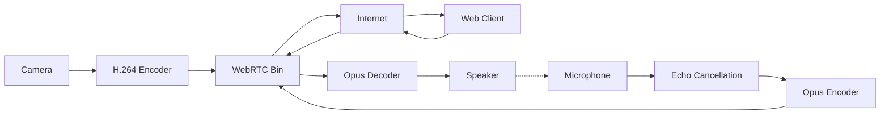

# Day 55: Week 9 Review - Streaming Project
## Phase 3: Camera Systems & ISP | Week 9: Video Encoding & Streaming

---

## 🎯 Learning Objectives
1.  **Integrate** GStreamer, WebRTC, and Hardware Encoding into a unified application.
2.  **Build** a "Video Intercom" system with bi-directional Audio/Video.
3.  **Optimize** for sub-200ms glass-to-glass latency.
4.  **Implement** Acoustic Echo Cancellation (AEC) using GStreamer.
5.  **Validate** performance over WiFi and 4G networks.

---

## 📚 Week 9 Recap

### Topics Covered

**Day 51: Video Encoding**
- H.264/HEVC, GOP, Bitrate Control (CBR/VBR).

**Day 52: Streaming Protocols**
- RTSP (Standard), WebRTC (Low Latency), HLS (Scale).

**Day 53: GStreamer Deep Dive**
- Pipelines, Elements, Pads, Debugging.

**Day 54: WebRTC Deep Dive**
- Signaling, ICE, STUN/TURN, Data Channels.

---

## 💻 Week 9 Integration Project

### Project: "DoorBell - Low Latency Video Intercom"

**Objective:** Build a Linux-based embedded doorbell (Raspberry Pi/Jetson) that streams video to a Web Browser and allows 2-way audio communication.

**Features:**
1.  **Video:** 720p30 H.264 (Hardware Encoded).
2.  **Audio:** Opus Codec (Bi-directional).
3.  **Transport:** WebRTC (via Janus Gateway or GStreamer `webrtcbin`).
4.  **Processing:** Echo Cancellation (AEC) to prevent feedback loops.

### Architecture



### Implementation (GStreamer `webrtcbin`)

This example demonstrates the C++ code to set up the WebRTC pipeline.

```cpp
/**
 * @brief WebRTC Intercom using GStreamer
 */
#include <gst/gst.h>
#include <gst/webrtc/webrtc.h>

// Global pipeline
GstElement *pipeline, *webrtc;

// 1. Create Pipeline
void create_pipeline() {
    pipeline = gst_parse_launch(
        "webrtcbin name=sendrecv bundle-policy=max-bundle "
        "v4l2src ! video/x-raw,width=1280,height=720 ! videoconvert ! queue ! "
        "x264enc tune=zerolatency bitrate=2000 ! rtph264pay ! "
        "application/x-rtp,media=video,encoding-name=H264,payload=96 ! sendrecv. "
        "alsasrc ! audioconvert ! audioresample ! queue ! "
        "opusenc ! rtpopuspay ! "
        "application/x-rtp,media=audio,encoding-name=OPUS,payload=97 ! sendrecv. ",
        NULL);
        
    webrtc = gst_bin_get_by_name(GST_BIN(pipeline), "sendrecv");
    
    // Connect signals for negotiation
    g_signal_connect(webrtc, "on-negotiation-needed", G_CALLBACK(on_negotiation_needed), NULL);
    g_signal_connect(webrtc, "on-ice-candidate", G_CALLBACK(on_ice_candidate), NULL);
}

// 2. Handle Negotiation (Simplified)
void on_negotiation_needed(GstElement *element, gpointer data) {
    GstPromise *promise = gst_promise_new_with_change_func(on_offer_created, NULL, NULL);
    g_signal_emit_by_name(webrtc, "create-offer", NULL, promise);
}

// 3. Signaling (WebSocket)
// You need to implement a WebSocket client here to exchange SDP/ICE with the browser.
// When browser sends Answer:
// g_signal_emit_by_name(webrtc, "set-remote-description", answer_sdp, promise);
```

#### Acoustic Echo Cancellation (AEC)

If the speaker volume is loud, the microphone will pick it up, creating a feedback loop. We use `webrtcsp` (WebRTC Audio Processing) element.

```bash
# GStreamer pipeline with AEC
gst-launch-1.0 \
    webrtcdsp name=dsp \
    alsasrc ! dsp.sink_probe \
    dsp.src_probe ! opusenc ! ... \
    ... ! opusdec ! dsp.sink_render \
    dsp.src_render ! alsasink
```

*   **sink_probe:** Microphone Input (Raw + Echo).
*   **sink_render:** Speaker Output (Reference signal).
*   **src_probe:** Cleaned Microphone Input (Echo removed).

---

## 🔬 System Validation Plan

### Test 1: Latency Measurement
**Objective:** Verify < 200ms.
**Procedure:**
1.  Point camera at screen showing a millisecond counter.
2.  Take a photo.
3.  Calculate difference.
4.  **Target:** 150ms (50ms Encode + 50ms Network + 50ms Decode/Render).

### Test 2: Audio Quality (Double Talk)
**Objective:** Verify AEC.
**Procedure:**
1.  Person A talks at the Doorbell.
2.  Person B talks at the Browser.
3.  **Goal:** Both can hear each other simultaneously without echo or ducking (volume drop).

### Test 3: Network Resilience
**Objective:** Simulate 4G.
**Procedure:**
1.  Limit bandwidth to 500kbps.
2.  **Observation:** Video quality should drop (blocky), but Audio should remain clear and synchronized.

---

## 🐛 Troubleshooting Guide

### Issue 1: "No Audio"

**Symptom:** Video works, Audio silent.

**Cause:**
*   ALSA device busy (blocked by PulseAudio).
*   Browser requires User Interaction (Click) before playing audio (Autoplay Policy).
*   **Fix:** Use `pulsedevice` instead of `alsasrc`. Ensure user clicks "Answer" button in UI.

### Issue 2: "Glitchy Video"

**Symptom:** Green artifacts, smearing.

**Cause:**
*   Keyframe interval too long. If a packet is lost, the decoder waits for next I-frame.
*   **Fix:** Set encoder `key-int-max=30` (1 I-frame per second).

---

## 📝 Assessment Questions

### Comprehensive Questions

1.  **Why is "Echo Cancellation" difficult?** (Non-linearities in speaker/mic, changing room acoustics).
2.  **How does `webrtcbin` handle packet loss?** (NACK - Negative Ack, PLI - Picture Loss Indication).
3.  **What is the role of the "Jitter Buffer"?**
4.  **Why do we prefer Opus over AAC for VoIP?** (Lower latency, better packet loss concealment).

### Practical Challenges

1.  **Add "Push-to-Talk":** Modify the pipeline to mute the microphone stream when the button is released.
2.  **Implement "Motion Alert":** Use `motioncells` element in GStreamer to detect movement and send a WebSocket event.

---

## 📚 Resources & Next Steps

### Week 9 Summary

**Completed:**
- ✅ **Encoding:** Compressing bits.
- ✅ **Streaming:** Moving bits.
- ✅ **GStreamer:** Processing bits.
- ✅ **WebRTC:** Interactive bits.
- ✅ **Project:** Video Intercom.

**Key Skills Acquired:**
- Real-time Media Pipelines.
- Network Programming.
- Audio Processing (AEC).

### Week 10 Preview (Phase 3 Continued)

**Topics:**
- **Camera Manufacturing:** Sensor assembly, Active Alignment.
- **Production Testing:** Chart testing, MTF, Shading.
- **ISP Tuning:** The full workflow (Black Level -> CCM -> Sharpening).
- **Final Phase 3 Exam.**

---

**Day 55 Complete** | Phase 3: Camera Systems & ISP | Week 9: Video Encoding & Streaming
