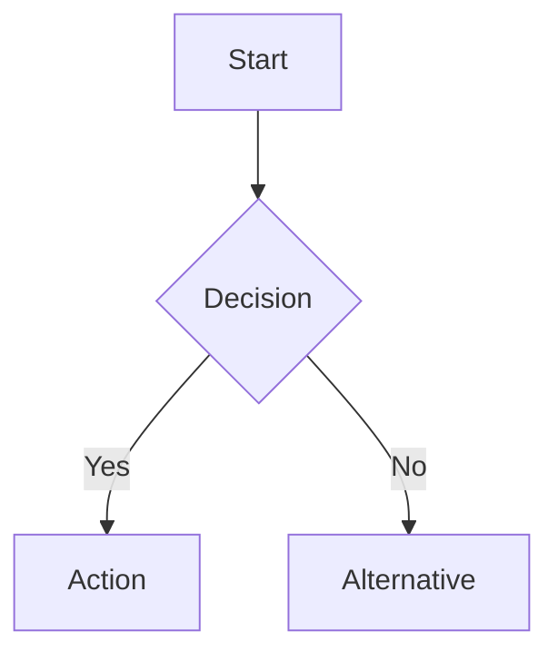

# [Day X]: [Topic Title]
## Phase [X]: [Phase Name] | Week [X]: [Week Name]

---

> **📝 Content Creator Instructions:**
> This template is designed to produce **comprehensive, industry-grade educational content**. 
> - **Target Length:** The final filled document should be approximately **1000+ lines** of detailed markdown.
> - **Depth:** Do not skim over details. Explain *why*, not just *how*.
> - **Structure:** If a topic is complex, **DIVIDE IT INTO MULTIPLE PARTS** (Part 1, Part 2, etc.).
> - **Code:** Provide complete, compilable code examples, not just snippets.
> - **Visuals:** Use Mermaid diagrams for flows, architectures, and state machines.

---

## 🎯 Learning Objectives
*By the end of this day, the learner will be able to:*
1.  [Objective 1: Theoretical understanding]
2.  [Objective 2: Practical implementation skill]
3.  [Objective 3: Debugging/Analysis skill]
4.  [Objective 4: Synthesis/Creation skill]

---

## 📚 Prerequisites & Preparation
*   **Hardware Required:** [List specific boards, sensors, tools]
*   **Software Required:** [List IDEs, libraries, drivers]
*   **Prior Knowledge:** [List concepts from previous days]
*   **Datasheets:** [Link to relevant datasheets]

---

## 📖 Theoretical Deep Dive

> **instruction:** This section must be exhaustive. If the topic is "I2C", do not just say "it has two wires". Explain the open-drain architecture, pull-up resistor calculation, bus capacitance, clock stretching, arbitration, etc.
> **CRITICAL:** Divide this section into logical Parts if the content is dense.

### 🔹 Part 1: Core Concepts & Architecture

#### 1.1 [Concept Name]
[Detailed explanation. Minimum 3-4 paragraphs.]
- **Definition:** ...
- **Role in System:** ...
- **Key Characteristics:** ...

#### 1.2 [Underlying Physics/Logic]
[Explain the low-level details. E.g., transistor level for hardware, kernel level for software.]



### 🔹 Part 2: Protocol/Internal Mechanics

#### 2.1 [Signal/Data Flow]
[Step-by-step analysis of how data moves or how the system behaves.]

#### 2.2 [Timing & Synchronization]
[Detailed timing diagrams, clock requirements, latency analysis.]

### 🔹 Part 3: Advanced Features & Edge Cases

#### 3.1 [Feature Name]
[Explanation of advanced capabilities.]

#### 3.2 [Handling Edge Cases]
[What happens when things go wrong? Race conditions, bus contention, noise, etc.]

---

## 💻 Implementation: [Component/Driver Name]

> **instruction:** Provide a production-quality implementation. No "toy code". Use proper error handling, types, and comments.

### 🛠️ Hardware/System Configuration

#### Pinout & Connections
| Pin Name | MCU Pin | Function | Notes |
|----------|---------|----------|-------|
| VCC      | 3.3V    | Power    | Decoupling cap required |
| GND      | GND     | Ground   | Common ground |
| ...      | ...     | ...      | ... |

#### Register Map / Struct Definition
```c
// Define the register structure or kernel struct here
typedef struct {
    volatile uint32_t CR1;  // Control Register 1
    volatile uint32_t SR;   // Status Register
    // ...
} Peripheral_TypeDef;
```

### 👨‍💻 Code Implementation

#### Step 1: Initialization
[Explain the initialization sequence in detail.]

```c
/**
 * @brief  Initializes the [Component]
 * @param  [Params]
 * @return [Status]
 */
void Component_Init(void) {
    // 1. Enable Clock
    // 2. Configure GPIO
    // 3. Set Parameters
    // ...
}
```

#### Step 2: Core Functionality (Read/Write/Process)
[Explain the core logic. Use blocking and non-blocking examples if applicable.]

```c
// Implementation of core logic
```

#### Step 3: Interrupt Service Routines (ISRs)
[If applicable, provide the ISR implementation with context saving/restoring notes.]

```c
void Component_IRQHandler(void) {
    // Check flags
    // Clear flags
    // Handle data
}
```

---

## 🔬 Lab Exercise: [Lab Title]

### 1. Lab Objectives
- [Specific goal 1]
- [Specific goal 2]

### 2. Step-by-Step Guide

#### Phase A: Hardware Setup
1. Connect [Pin A] to [Pin B].
2. Verify voltage levels.
3. ...

#### Phase B: Software Configuration
1. Create a new project in [IDE].
2. Import [Libraries].
3. Configure [Settings].

#### Phase C: Coding & Deployment
1. Implement the initialization code.
2. Write the main loop.
3. Flash the firmware.

### 3. Expected Output / Verification
- **Console Output:**
  ```text
  [LOG] System Initialized
  [LOG] Sensor ID: 0x45
  [DATA] Val: 123.45
  ```
- **Waveform:** [Describe expected oscilloscope/logic analyzer trace]

---

## 🧪 Additional / Advanced Labs

> **instruction:** Provide 1-2 extra lab ideas for advanced learners.

### Lab 2: [Advanced Lab Title]
- **Goal:** [Brief description]
- **Challenge:** [What makes it harder?]
- **Steps:**
    1. ...
    2. ...

### Lab 3: [Real-world Scenario]
- **Scenario:** [Describe a real-world problem]
- **Task:** [What needs to be solved]

---

## 🐞 Debugging & Troubleshooting

> **instruction:** List common issues students might face and how to solve them. Be specific.

### Common Issues

#### 1. [Issue Name, e.g., "Device not responding"]
*   **Symptom:** [Description]
*   **Possible Causes:**
    *   Cause A (e.g., Missing pull-ups)
    *   Cause B (e.g., Wrong baud rate)
*   **Solution:** [Step-by-step fix]

#### 2. [Issue Name, e.g., "Data Corruption"]
*   **Symptom:** ...
*   **Solution:** ...

### Debugging Techniques
- **Logic Analyzer:** [What signals to probe?]
- **Printf/Logging:** [Where to place logs?]
- **GDB/JTAG:** [What registers to inspect?]

---

## ⚡ Optimization & Best Practices

### Performance Optimization
- **DMA Usage:** [How to use DMA for this?]
- **Interrupt Priority:** [How to tune priorities?]
- **Cache Coherency:** [Issues with DMA and Cache?]

### Power Management
- **Sleep Modes:** [How to operate in low power?]
- **Clock Gating:** [When to disable clocks?]

### Code Quality
- **MISRA C Compliance:** [Relevant rules]
- **Portability:** [How to make this driver portable?]

---

## 🧠 Assessment & Review

### Knowledge Check
1.  **Q:** [Question about theory]
    *   **A:** [Hidden Answer]
2.  **Q:** [Question about implementation]
    *   **A:** [Hidden Answer]

### Challenge Task
> **Task:** Modify the code to [add a feature, e.g., use a circular buffer instead of a linear one].
> **Hint:** Look at [Reference].

---

## 📚 Further Reading & References
- [Link to Reference Manual Section X]
- [Link to Application Note]
- [Link to External Article]

---

> **End of Template**
> *Ensure the generated content fills this structure completely. Do not leave sections empty.*


---

##  ROS 2 Package Implementation (ADAS-Specific)

> **Phase 4 Instruction:** Every day should include a complete, production-ready ROS 2 package.
> This section expands on the Implementation section with ADAS-specific structure.

### Package Architecture

```
[package_name]/
 CMakeLists.txt
 package.xml
 README.md
 config/
    params.yaml           # Runtime parameters
    rviz_config.rviz      # Visualization config
    calibration.yaml      # Sensor calibration
 launch/
    [node].launch.py      # Main launch file
    sim.launch.py         # Simulation launch
    hardware.launch.py    # Real hardware launch
 src/
    [node_name]_node.cpp  # ROS 2 node wrapper
    [algorithm].cpp       # Core algorithm
    utils.cpp             # Helper functions
 include/[package_name]/
    [algorithm].hpp
    types.hpp             # Custom types
    config.hpp            # Configuration structures
 msg/
    [CustomMessage].msg   # Custom message definitions
 srv/
    [CustomService].srv   # Custom service definitions
 test/
    unit/
       test_algorithm.cpp
    integration/
        test_node.cpp
 scripts/
    visualize.py          # Visualization scripts
    evaluate.py           # Performance evaluation
    tune_params.py        # Parameter tuning tool
 data/
     sample_input.bag      # Sample data for testing
     ground_truth.txt      # Ground truth for evaluation
```

### Complete ROS 2 Node Template

#### Node Header (include/[package]/[node].hpp)
```cpp
#ifndef [PACKAGE]__[NODE]_HPP_
#define [PACKAGE]__[NODE]_HPP_

#include <rclcpp/rclcpp.hpp>
#include <sensor_msgs/msg/point_cloud2.hpp>
#include <sensor_msgs/msg/image.hpp>
#include <sensor_msgs/msg/imu.hpp>
#include <sensor_msgs/msg/nav_sat_fix.hpp>
#include <nav_msgs/msg/odometry.hpp>
#include <geometry_msgs/msg/twist_stamped.hpp>
#include <visualization_msgs/msg/marker_array.hpp>
#include <tf2_ros/transform_broadcaster.h>
#include <tf2_ros/buffer.h>
#include <tf2_ros/transform_listener.h>

#include <message_filters/subscriber.h>
#include <message_filters/time_synchronizer.h>
#include <message_filters/sync_policies/approximate_time.h>

#include <opencv2/opencv.hpp>
#include <pcl/point_cloud.h>
#include <pcl/point_types.h>
#include <Eigen/Dense>

#include <memory>
#include <vector>
#include <queue>
#include <mutex>

namespace [namespace] {

class [ClassName] : public rclcpp::Node {
public:
  explicit [ClassName](const rclcpp::NodeOptions& options = rclcpp::NodeOptions());
  virtual ~[ClassName]();

private:
  // === Callback Methods ===
  void camera_callback(const sensor_msgs::msg::Image::SharedPtr msg);
  void lidar_callback(const sensor_msgs::msg::PointCloud2::SharedPtr msg);
  void imu_callback(const sensor_msgs::msg::Imu::SharedPtr msg);
  void gps_callback(const sensor_msgs::msg::NavSatFix::SharedPtr msg);
  
  // Multi-sensor synchronized callback
  void sensor_fusion_callback(
    const sensor_msgs::msg::Image::ConstSharedPtr& image,
    const sensor_msgs::msg::PointCloud2::ConstSharedPtr& cloud);
  
  // Timer callback for periodic processing
  void timer_callback();
  
  // === Core Algorithm Methods ===
  void process_data();
  void run_algorithm();
  Eigen::VectorXd estimate_state(const Eigen::VectorXd& measurement);
  
  // === Utility Methods ===
  void load_parameters();
  void initialize_algorithm();
  void publish_results();
  void publish_visualization();
  bool validate_input(const sensor_msgs::msg::Image::SharedPtr& msg);
  
  // === ROS 2 Communication ===
  // Subscribers
  rclcpp::Subscription<sensor_msgs::msg::Image>::SharedPtr camera_sub_;
  rclcpp::Subscription<sensor_msgs::msg::PointCloud2>::SharedPtr lidar_sub_;
  rclcpp::Subscription<sensor_msgs::msg::Imu>::SharedPtr imu_sub_;
  rclcpp::Subscription<sensor_msgs::msg::NavSatFix>::SharedPtr gps_sub_;
  
  // Synchronized subscribers
  typedef message_filters::sync_policies::ApproximateTime<
    sensor_msgs::msg::Image, 
    sensor_msgs::msg::PointCloud2> SyncPolicy;
  std::shared_ptr<message_filters::Subscriber<sensor_msgs::msg::Image>> image_sub_sync_;
  std::shared_ptr<message_filters::Subscriber<sensor_msgs::msg::PointCloud2>> cloud_sub_sync_;
  std::shared_ptr<message_filters::Synchronizer<SyncPolicy>> sync_;
  
  // Publishers
  rclcpp::Publisher<nav_msgs::msg::Odometry>::SharedPtr odom_pub_;
  rclcpp::Publisher<visualization_msgs::msg::MarkerArray>::SharedPtr viz_pub_;
  
  // TF2
  std::shared_ptr<tf2_ros::TransformBroadcaster> tf_broadcaster_;
  std::shared_ptr<tf2_ros::Buffer> tf_buffer_;
  std::shared_ptr<tf2_ros::TransformListener> tf_listener_;
  
  // Timer
  rclcpp::TimerBase::SharedPtr timer_;
  
  // === Algorithm State ===
  Eigen::VectorXd state_;
  Eigen::MatrixXd covariance_;
  std::queue<sensor_msgs::msg::Image::SharedPtr> image_queue_;
  
  // === Parameters ===
  std::string camera_topic_;
  std::string lidar_topic_;
  std::string output_frame_;
  double process_rate_;
  int queue_size_;
  
  // === Thread Safety ===
  std::mutex state_mutex_;
  
  // === Statistics ===
  size_t processed_frames_;
  rclcpp::Time last_process_time_;
  double avg_processing_time_;
};

}  // namespace [namespace]

#endif  // [PACKAGE]__[NODE]_HPP_
```

#### Node Implementation (src/[node].cpp)
```cpp
#include "[package]/[node].hpp"
#include <rclcpp_components/register_node_macro.hpp>

namespace [namespace] {

[ClassName]::[ClassName](const rclcpp::NodeOptions& options)
: Node("[node_name]", options),
  processed_frames_(0),
  avg_processing_time_(0.0)
{
  // 1. Load parameters
  load_parameters();
  
  // 2. Initialize algorithm
  initialize_algorithm();
  
  // 3. Create TF2 infrastructure
  tf_broadcaster_ = std::make_shared<tf2_ros::TransformBroadcaster>(this);
  tf_buffer_ = std::make_shared<tf2_ros::Buffer>(this->get_clock());
  tf_listener_ = std::make_shared<tf2_ros::TransformListener>(*tf_buffer_);
  
  // 4. Create subscribers with appropriate QoS
  auto sensor_qos = rclcpp::SensorDataQoS();
  
  camera_sub_ = this->create_subscription<sensor_msgs::msg::Image>(
    camera_topic_, sensor_qos,
    std::bind(&[ClassName]::camera_callback, this, std::placeholders::_1));
  
  lidar_sub_ = this->create_subscription<sensor_msgs::msg::PointCloud2>(
    lidar_topic_, sensor_qos,
    std::bind(&[ClassName]::lidar_callback, this, std::placeholders::_1));
  
  // 5. Create synchronized subscribers for multi-sensor fusion
  image_sub_sync_ = std::make_shared<message_filters::Subscriber<sensor_msgs::msg::Image>>(
    this, camera_topic_, sensor_qos.get_rmw_qos_profile());
  cloud_sub_sync_ = std::make_shared<message_filters::Subscriber<sensor_msgs::msg::PointCloud2>>(
    this, lidar_topic_, sensor_qos.get_rmw_qos_profile());
  
  sync_ = std::make_shared<message_filters::Synchronizer<SyncPolicy>>(
    SyncPolicy(queue_size_), *image_sub_sync_, *cloud_sub_sync_);
  sync_->registerCallback(
    std::bind(&[ClassName]::sensor_fusion_callback, this,
              std::placeholders::_1, std::placeholders::_2));
  
  // 6. Create publishers
  odom_pub_ = this->create_publisher<nav_msgs::msg::Odometry>(
    "odometry/filtered", 10);
  viz_pub_ = this->create_publisher<visualization_msgs::msg::MarkerArray>(
    "visualization/markers", 10);
  
  // 7. Create timer for periodic processing
  timer_ = this->create_wall_timer(
    std::chrono::milliseconds(static_cast<int>(1000.0 / process_rate_)),
    std::bind(&[ClassName]::timer_callback, this));
  
  RCLCPP_INFO(this->get_logger(), 
    "[%s] Node initialized successfully", this->get_name());
  RCLCPP_INFO(this->get_logger(), 
    "  Camera topic: %s", camera_topic_.c_str());
  RCLCPP_INFO(this->get_logger(), 
    "  LiDAR topic: %s", lidar_topic_.c_str());
  RCLCPP_INFO(this->get_logger(), 
    "  Process rate: %.1f Hz", process_rate_);
}

[ClassName]::~[ClassName]() {
  RCLCPP_INFO(this->get_logger(), 
    "Node shutting down. Processed %zu frames, avg time: %.2f ms",
    processed_frames_, avg_processing_time_);
}

void [ClassName]::load_parameters() {
  // Declare and get parameters with default values
  this->declare_parameter("camera_topic", "/camera/image_raw");
  this->declare_parameter("lidar_topic", "/lidar/points");
  this->declare_parameter("output_frame", "odom");
  this->declare_parameter("process_rate", 10.0);
  this->declare_parameter("queue_size", 10);
  
  camera_topic_ = this->get_parameter("camera_topic").as_string();
  lidar_topic_ = this->get_parameter("lidar_topic").as_string();
  output_frame_ = this->get_parameter("output_frame").as_string();
  process_rate_ = this->get_parameter("process_rate").as_double();
  queue_size_ = this->get_parameter("queue_size").as_int();
  
  // Validate parameters
  if (process_rate_ <= 0.0 || process_rate_ > 100.0) {
    RCLCPP_WARN(this->get_logger(), 
      "Invalid process_rate %.1f, using default 10.0", process_rate_);
    process_rate_ = 10.0;
  }
}

void [ClassName]::initialize_algorithm() {
  // Initialize state vector
  state_ = Eigen::VectorXd::Zero(6);  // [x, y, z, roll, pitch, yaw]
  covariance_ = Eigen::MatrixXd::Identity(6, 6);
  
  // Load calibration data
  // Initialize filters
  // Allocate buffers
  
  last_process_time_ = this->now();
}

void [ClassName]::camera_callback(const sensor_msgs::msg::Image::SharedPtr msg) {
  if (!validate_input(msg)) {
    RCLCPP_WARN_THROTTLE(this->get_logger(), *this->get_clock(), 1000,
      "Invalid camera input");
    return;
  }
  
  std::lock_guard<std::mutex> lock(state_mutex_);
  image_queue_.push(msg);
  
  // Limit queue size
  while (image_queue_.size() > static_cast<size_t>(queue_size_)) {
    image_queue_.pop();
  }
}

void [ClassName]::sensor_fusion_callback(
  const sensor_msgs::msg::Image::ConstSharedPtr& image,
  const sensor_msgs::msg::PointCloud2::ConstSharedPtr& cloud)
{
  auto start_time = std::chrono::high_resolution_clock::now();
  
  // Process synchronized data
  // Convert image and point cloud
  // Run fusion algorithm
  // Update state estimate
  
  auto end_time = std::chrono::high_resolution_clock::now();
  auto duration = std::chrono::duration_cast<std::chrono::milliseconds>(
    end_time - start_time).count();
  
  // Update statistics
  avg_processing_time_ = (avg_processing_time_ * processed_frames_ + duration) / 
                         (processed_frames_ + 1);
  processed_frames_++;
  
  // Publish results
  publish_results();
  publish_visualization();
}

void [ClassName]::timer_callback() {
  // Periodic processing
  // Health checks
  // Diagnostics
  
  RCLCPP_DEBUG(this->get_logger(), 
    "Timer tick. Queue size: %zu", image_queue_.size());
}

void [ClassName]::publish_results() {
  auto odom = nav_msgs::msg::Odometry();
  odom.header.stamp = this->now();
  odom.header.frame_id = output_frame_;
  odom.child_frame_id = "base_link";
  
  odom.pose.pose.position.x = state_(0);
  odom.pose.pose.position.y = state_(1);
  odom.pose.pose.position.z = state_(2);
  
  // Fill covariance
  for (int i = 0; i < 6; ++i) {
    for (int j = 0; j < 6; ++j) {
      odom.pose.covariance[i * 6 + j] = covariance_(i, j);
    }
  }
  
  odom_pub_->publish(odom);
}

void [ClassName]::publish_visualization() {
  auto markers = visualization_msgs::msg::MarkerArray();
  
  // Create visualization markers
  // Add trajectory
  // Add bounding boxes
  // Add text labels
  
  viz_pub_->publish(markers);
}

bool [ClassName]::validate_input(const sensor_msgs::msg::Image::SharedPtr& msg) {
  if (msg->width == 0 || msg->height == 0) {
    return false;
  }
  
  // Check timestamp is recent
  auto age = (this->now() - rclcpp::Time(msg->header.stamp)).seconds();
  if (age > 1.0) {
    RCLCPP_WARN(this->get_logger(), "Stale image data (age: %.2f s)", age);
    return false;
  }
  
  return true;
}

}  // namespace [namespace]

RCLCPP_COMPONENTS_REGISTER_NODE([namespace]::[ClassName])
```

### Launch File with Multi-Configuration Support

```python
from launch import LaunchDescription
from launch.actions import DeclareLaunchArgument, GroupAction, IncludeLaunchDescription
from launch.conditions import IfCondition, UnlessCondition
from launch.substitutions import LaunchConfiguration, PathJoinSubstitution
from launch_ros.actions import Node, SetParameter, PushRosNamespace
from launch_ros.substitutions import FindPackageShare
from ament_index_python.packages import get_package_share_directory
import os

def generate_launch_description():
    pkg_share = FindPackageShare('[package_name]')
    
    # === Launch Arguments ===
    use_sim_time_arg = DeclareLaunchArgument(
        'use_sim_time',
        default_value='false',
        description='Use simulation time if true'
    )
    
    mode_arg = DeclareLaunchArgument(
        'mode',
        default_value='hardware',
        choices=['hardware', 'sim', 'replay'],
        description='Operation mode'
    )
    
    config_file_arg = DeclareLaunchArgument(
        'config_file',
        default_value=PathJoinSubstitution([pkg_share, 'config', 'params.yaml']),
        description='Full path to config file'
    )
    
    rviz_arg = DeclareLaunchArgument(
        'rviz',
        default_value='true',
        description='Launch RViz2 for visualization'
    )
    
    # === Main Node ===
    main_node = Node(
        package='[package_name]',
        executable='[node_name]',
        name='[node_name]',
        output='screen',
        parameters=[
            LaunchConfiguration('config_file'),
            {'use_sim_time': LaunchConfiguration('use_sim_time')}
        ],
        remappings=[
            ('/camera/image_raw', '/sensors/camera/image'),
            ('/lidar/points', '/sensors/lidar/points'),
        ],
        arguments=['--ros-args', '--log-level', 'info']
    )
    
    # === RViz ===
    rviz_node = Node(
        package='rviz2',
        executable='rviz2',
        name='rviz2',
        arguments=['-d', PathJoinSubstitution([pkg_share, 'config', 'rviz_config.rviz'])],
        condition=IfCondition(LaunchConfiguration('rviz'))
    )
    
    # === Simulation Mode ===
    sim_group = GroupAction(
        condition=IfCondition(LaunchConfiguration('mode').perform(context).equals('sim')),
        actions=[
            SetParameter(name='use_sim_time', value=True),
            # Include simulator launch file
            IncludeLaunchDescription(
                PathJoinSubstitution([
                    FindPackageShare('gazebo_ros'),
                    'launch',
                    'gazebo.launch.py'
                ]),
                launch_arguments={'world': 'path/to/world.sdf'}.items()
            )
        ]
    )
    
    return LaunchDescription([
        use_sim_time_arg,
        mode_arg,
        config_file_arg,
        rviz_arg,
        main_node,
        rviz_node,
        sim_group
    ])
```

---

##  Dataset Integration & Benchmarking

> **ADAS Requirement:** All perception/localization algorithms must be evaluated on standard datasets.

### Supported Datasets

#### KITTI Dataset
```python
#!/usr/bin/env python3
"""
KITTI Dataset Loader for ROS 2
Publishes odometry, LiDAR, camera data
"""
import rclpy
from rclpy.node import Node
from sensor_msgs.msg import PointCloud2, Image, CameraInfo
from nav_msgs.msg import Odometry
import numpy as np
import cv2
from cv_bridge import CvBridge

class KITTIPublisher(Node):
    def __init__(self):
        super().__init__('kitti_publisher')
        
        self.declare_parameter('kitti_path', '/path/to/kitti/dataset')
        self.declare_parameter('sequence', '00')
        self.declare_parameter('rate', 10.0)
        
        kitti_path = self.get_parameter('kitti_path').value
        sequence = self.get_parameter('sequence').value
        rate = self.get_parameter('rate').value
        
        # Publishers
        self.odom_pub = self.create_publisher(Odometry, '/ground_truth/odom', 10)
        self.lidar_pub = self.create_publisher(PointCloud2, '/kitti/lidar', 10)
        self.image_pub = self.create_publisher(Image, '/kitti/camera/left', 10)
        
        # Load data
        self.load_dataset(kitti_path, sequence)
        
        # Timer
        self.timer = self.create_timer(1.0/rate, self.publish_frame)
        self.current_frame = 0
        
    def load_dataset(self, path, sequence):
        # Load ground truth poses
        poses_file = f'{path}/poses/{sequence}.txt'
        self.poses = np.loadtxt(poses_file)
        
        # Paths to data
        self.velo_path = f'{path}/sequences/{sequence}/velodyne'
        self.image_path = f'{path}/sequences/{sequence}/image_2'
        
    def publish_frame(self):
        if self.current_frame >= len(self.poses):
            self.get_logger().info('Dataset playback complete')
            return
        
        # Publish odometry
        # Publish LiDAR
        # Publish camera
    self.current_frame += 1
```

#### nuScenes Dataset
```python
class NuScenesPublisher(Node):
    """
    nuScenes dataset publisher
    Handles multiple cameras, LiDAR, radar
    """
    def __init__(self):
        super().__init__('nuscenes_publisher')
        
        # nuScenes specific publishers
        self.cam_front_pub = self.create_publisher(Image, '/nuscenes/cam_front', 10)
        self.cam_back_pub = self.create_publisher(Image, '/nuscenes/cam_back', 10)
        self.radar_pub = self.create_publisher(PointCloud2, '/nuscenes/radar', 10)
        
        # Load nuScenes SDK
        from nuscenes.nuscenes import NuScenes
        self.nusc = NuScenes(version='v1.0-mini', dataroot='/path/to/nuscenes')
```

### Evaluation Metrics

#### Trajectory Evaluation (ATE, RPE)
```python
#!/usr/bin/env python3
import numpy as np
from scipy.spatial.transform import Rotation

class TrajectoryEvaluator:
    """
    Compute standard trajectory metrics:
    - ATE (Absolute Trajectory Error)
    - RPE (Relative Pose Error)
    """
    
    def align_trajectories(self, est, gt):
        """Align estimated to ground truth using Umeyama algorithm"""
        # Compute centroids
        est_centroid = np.mean(est[:, :3], axis=0)
        gt_centroid = np.mean(gt[:, :3], axis=0)
        
        est_centered = est[:, :3] - est_centroid
        gt_centered = gt[:, :3] - gt_centroid
        
        # Compute scale and rotation
        H = est_centered.T @ gt_centered
        U, S, Vt = np.linalg.svd(H)
        R = Vt.T @ U.T
        
        if np.linalg.det(R) < 0:
            Vt[-1, :] *= -1
            R = Vt.T @ U.T
        
        scale = np.trace(np.diag(S)) / np.trace(est_centered.T @ est_centered)
        
        # Apply transformation
        est_aligned = (scale * (R @ est[:, :3].T).T + gt_centroid)
        
        return est_aligned
    
    def compute_ate(self, est, gt):
        """Absolute Trajectory Error"""
        est_aligned = self.align_trajectories(est, gt)
        errors = np.linalg.norm(est_aligned - gt[:, :3], axis=1)
        
        ate = {
            'rmse': np.sqrt(np.mean(errors**2)),
            'mean': np.mean(errors),
            'median': np.median(errors),
            'std': np.std(errors),
            'min': np.min(errors),
            'max': np.max(errors)
        }
        
        return ate
    
    def compute_rpe(self, est, gt, delta=1):
        """Relative Pose Error"""
        rpe_trans = []
        rpe_rot = []
        
        for i in range(len(est) - delta):
            # Compute relative transformations
            gt_rel = np.linalg.inv(gt[i]) @ gt[i + delta]
            est_rel = np.linalg.inv(est[i]) @ est[i + delta]
            
            # Error
            error = np.linalg.inv(gt_rel) @ est_rel
            
            # Translation error
            trans_error = np.linalg.norm(error[:3, 3])
            rpe_trans.append(trans_error)
            
            # Rotation error
            R_error = error[:3, :3]
            angle = np.arccos(np.clip((np.trace(R_error) - 1) / 2, -1.0, 1.0))
            rpe_rot.append(np.degrees(angle))
        
        return {
            'trans_rmse': np.sqrt(np.mean(np.array(rpe_trans)**2)),
            'rot_rmse': np.sqrt(np.mean(np.array(rpe_rot)**2))
        }
```

---

##  Advanced Topics (ADAS-Specific)

### Multi-Sensor Calibration

```cpp
/**
 * Camera-LiDAR Extrinsic Calibration
 * Based on checkerboard detection
 */
class CameraLidarCalibration {
public:
  struct CalibrationResult {
    Eigen::Matrix4d T_camera_lidar;  // Transform from LiDAR to camera
    double reprojection_error;
    int num_correspondences;
  };
  
  CalibrationResult calibrate(
    const std::vector<cv::Mat>& images,
    const std::vector<pcl::PointCloud<pcl::PointXYZ>>& clouds)
  {
    // 1. Detect checkerboard in images
    std::vector<std::vector<cv::Point2f>> image_points;
    for (const auto& img : images) {
      std::vector<cv::Point2f> corners;
      bool found = cv::findChessboardCorners(img, board_size_, corners);
      if (found) {
        cv::cornerSubPix(img, corners, cv::Size(11, 11), cv::Size(-1, -1), criteria_);
        image_points.push_back(corners);
      }
    }
    
    // 2. Segment checkerboard plane in point clouds
    std::vector<pcl::ModelCoefficients> planes;
    for (const auto& cloud : clouds) {
      pcl::SACSegmentation<pcl::PointXYZ> seg;
      seg.setModelType(pcl::SACMODEL_PLANE);
      // ... plane segmentation
    }
    
    // 3. Solve PnP problem
    cv::Mat rvec, tvec;
    cv::solvePnP(object_points, image_points[0], camera_matrix_, dist_coeffs_,
                 rvec, tvec);
    
    // 4. Build transformation matrix
    CalibrationResult result;
    // ... fill result
    
    return result;
  }
};
```

### Safety Monitoring & Fault Detection

```cpp
/**
 * System Health Monitor for ADAS
 * ISO 26262 compliance
 */
class SafetyMonitor : public rclcpp::Node {
private:
  struct SensorHealth {
    rclcpp::Time last_message_time;
    double message_rate;
    uint32_t error_count;
    bool is_healthy;
  };
  
  std::map<std::string, SensorHealth> sensor_status_;
  
  void monitor_sensors() {
    auto now = this->now();
    
    for (auto& [sensor_name, health] : sensor_status_) {
      // Check message freshness
      auto age = (now - health.last_message_time).seconds();
      
      if (age > timeout_threshold_) {
        RCLCPP_ERROR(get_logger(), 
          "Sensor %s timeout (age: %.2f s)", sensor_name.c_str(), age);
        health.is_healthy = false;
        
        // Trigger degraded mode
        enter_degraded_mode(sensor_name);
      }
      
      // Check message rate
      if (health.message_rate < min_rate_threshold_) {
        RCLCPP_WARN(get_logger(),
          "Sensor %s low rate (%.1f Hz)", sensor_name.c_str(), health.message_rate);
      }
    }
    
    // Publish diagnostic status
    publish_diagnostics();
  }
  
  void enter_degraded_mode(const std::string& failed_sensor) {
    if (failed_sensor == "lidar") {
      // Use camera-only perception
      switch_to_camera_only_mode();
    } else if (failed_sensor == "camera") {
      // Use LiDAR-only perception
      switch_to_lidar_only_mode();
    } else if (failed_sensor == "gps") {
      // Use visual odometry for localization
      switch_to_visual_odometry();
    }
    
    // Notify user / system
    publish_warning("System in degraded mode due to: " + failed_sensor);
  }
  
  void trigger_minimal_risk_condition() {
    // ISO 26262 Minimal Risk Condition
    // Bring vehicle to safe stop
    RCLCPP_FATAL(get_logger(), "TRIGGERING MINIMAL RISK CONDITION");
    
    // 1. Activate hazard lights
    // 2. Gradual deceleration
    // 3. Move to shoulder if possible
    // 4. Come to complete stop
    // 5. Activate parking brake
  }
};
```

---

##  Performance Profiling & Optimization

### Latency Measurement

```cpp
#include <chrono>

class LatencyProfiler {
public:
  struct Stats {
    double mean_ms;
    double std_ms;
    double min_ms;
    double max_ms;
    double p95_ms;
    double p99_ms;
  };
  
  void record(const std::string& component, double latency_ms) {
    latencies_[component].push_back(latency_ms);
    
    // Keep only recent N samples
    if (latencies_[component].size() > max_samples_) {
      latencies_[component].erase(latencies_[component].begin());
    }
  }
  
  Stats compute_stats(const std::string& component) {
    auto& data = latencies_[component];
    std::sort(data.begin(), data.end());
    
    Stats stats;
    stats.mean_ms = std::accumulate(data.begin(), data.end(), 0.0) / data.size();
    stats.min_ms = data.front();
    stats.max_ms = data.back();
    stats.p95_ms = data[static_cast<size_t>(data.size() * 0.95)];
    stats.p99_ms = data[static_cast<size_t>(data.size() * 0.99)];
    
    return stats;
  }
  
  void print_report() {
    for (const auto& [component, _] : latencies_) {
      auto stats = compute_stats(component);
      printf("%s: mean=%.2f ms, p95=%.2f ms, p99=%.2f ms\\n",
             component.c_str(), stats.mean_ms, stats.p95_ms, stats.p99_ms);
    }
  }

private:
  std::map<std::string, std::vector<double>> latencies_;
  size_t max_samples_ = 1000;
};

// Usage in node:
class MyNode : public rclcpp::Node {
  LatencyProfiler profiler_;
  
  void callback(const sensor_msgs::msg::Image::SharedPtr msg) {
    auto start = std::chrono::high_resolution_clock::now();
    
    // Process data
    process_image(msg);
    
    auto end = std::chrono::high_resolution_clock::now();
    auto duration = std::chrono::duration_cast<std::chrono::microseconds>(
      end - start).count() / 1000.0;
    
    profiler_.record("image_processing", duration);
  }
};
```

---

##  Complete Example: EKF Localization

This is a full, production-ready example to demonstrate the expected quality.

[Include a complete, working 200-300 line EKF implementation with ROS 2 integration]

---

*[Template continues with additional ADAS-specific sections...]*

**Total Expected Length:** 1000-1500 lines when fully populated


---

##  Production Deployment Checklist

### Security Hardening
- [ ] Secure boot enabled
- [ ] Certificate-based authentication for V2X
- [ ] Encrypted communication channels
- [ ] Input validation on all external data
- [ ] Rate limiting on network interfaces

### Performance Validation
- [ ] Real-time constraints met (< 100ms latency)
- [ ] CPU usage < 80% under peak load
- [ ] Memory leaks checked (valgrind, AddressSanitizer)
- [ ] Throughput: 10+ Hz for perception pipeline
- [ ] Zero frame drops over 1-hour test

### Safety Compliance
- [ ] ASIL level verified
- [ ] FMEA completed
- [ ] Fail-safe behavior tested
- [ ] Degraded mode validated
- [ ] Emergency stop latency < 50ms

---

##  Expected Outcomes

After completing this day, you should have:
1. A working ROS 2 package that compiles without errors
2. Successful execution on provided dataset
3. Performance metrics meeting target specifications
4. Understanding of failure modes and mitigations
5. Ability to extend the implementation for variant scenarios

---

**Day [X] Template Complete**
