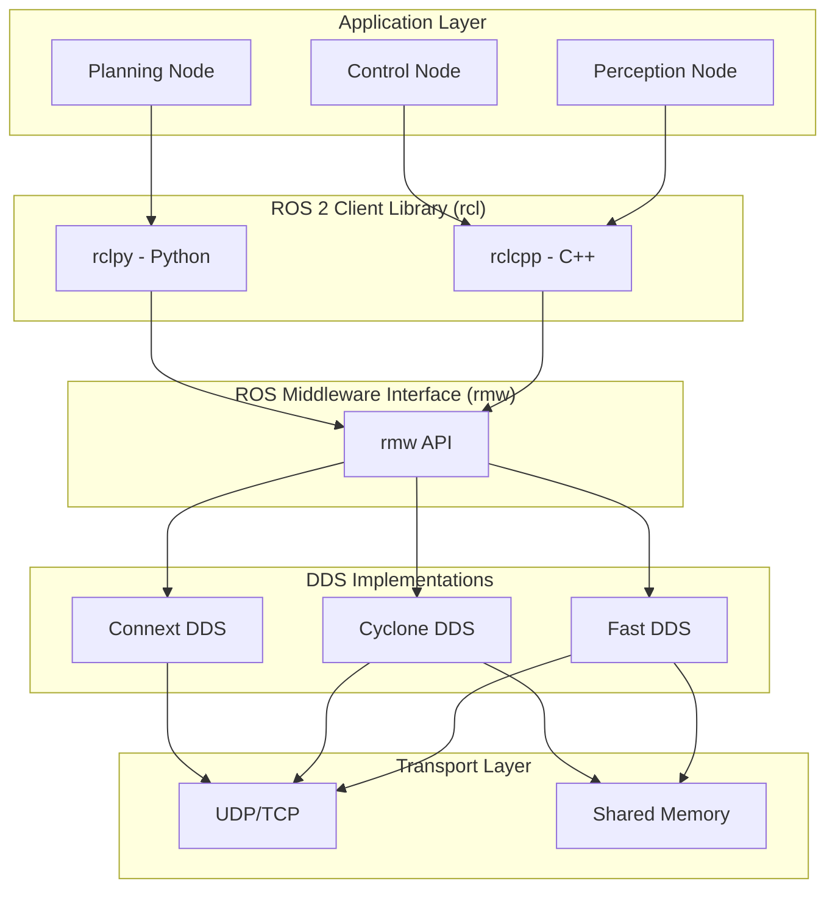
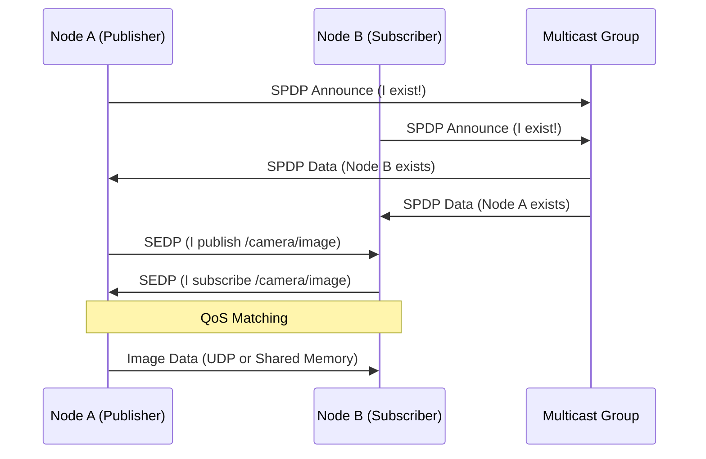
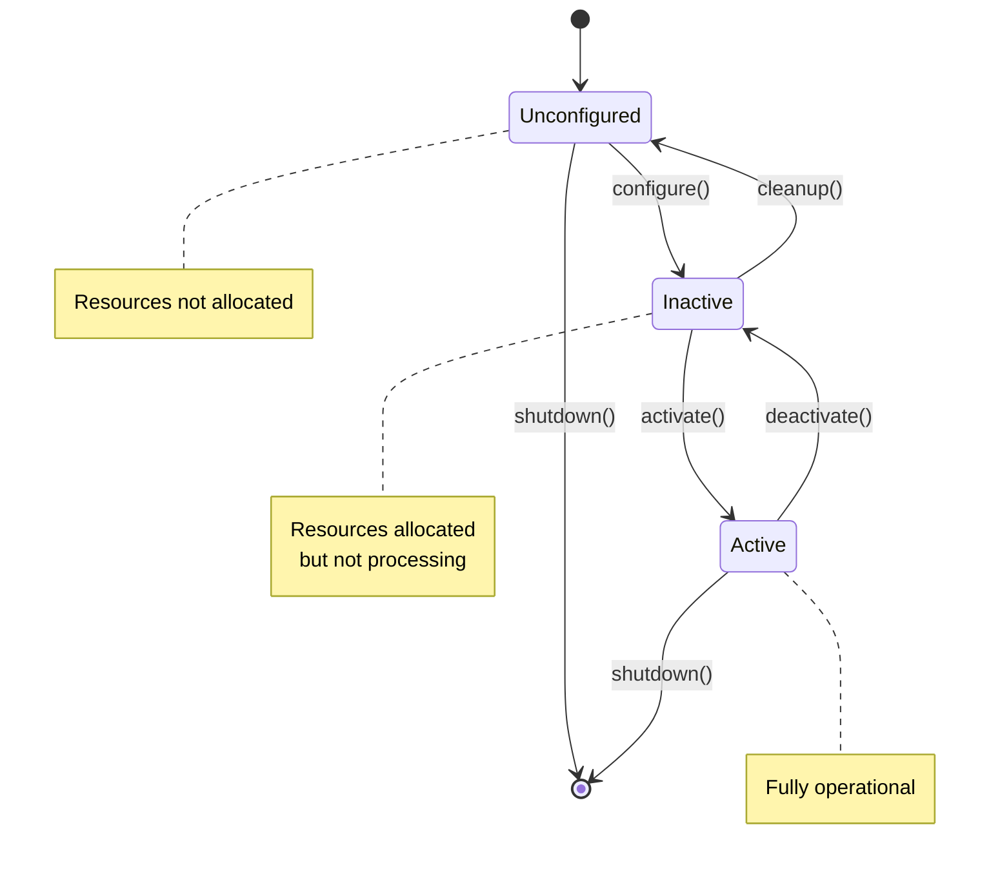

# Day 1: ROS 2 Architecture & DDS
## Phase 4: ADAS & Robotics Systems | Week 1: ROS 2 Fundamentals

---

> **📝 Day 1 Focus:**
> Understanding the foundational architecture of ROS 2, the shift from ROS 1, and the critical role of DDS (Data Distribution Service) middleware in enabling real-time, distributed autonomous systems.

---

## 🎯 Learning Objectives

By the end of this day, you will be able to:

1. **Understand** the fundamental architectural differences between ROS 1 and ROS 2, and why ROS 2 is essential for production autonomous driving systems
2. **Explain** the role of DDS middleware in ROS 2 and how it enables real-time, distributed communication
3. **Configure** QoS (Quality of Service) policies for different sensor and control scenarios in ADAS applications
4. **Implement** a basic ROS 2 node with proper lifecycle management
5. **Analyze** communication patterns using ROS 2 introspection tools and understand discovery mechanisms

---

## 📚 Prerequisites & Preparation

### Required Knowledge
- **Linux Fundamentals:** Command line, file system, process management
- **C++ Basics:** Classes, inheritance, smart pointers (C++14/17)
- **Python 3:** Object-oriented programming, decorators
- **Networking:** TCP/IP, UDP, multicast concepts

### Hardware Requirements
- **Development Machine:** Ubuntu 22.04 LTS (native or VM)
- **RAM:** Minimum 8GB (16GB recommended)
- **Storage:** 50GB free space for ROS 2 installation and datasets
- **Network:** Ethernet connection for multi-machine testing (optional)

### Software Stack Installation

```bash
# Update system
sudo apt update && sudo apt upgrade -y

# Install ROS 2 Humble (LTS)
sudo apt install software-properties-common
sudo add-apt-repository universe
sudo apt update && sudo apt install curl -y

# Add ROS 2 GPG key
sudo curl -sSL https://raw.githubusercontent.com/ros/rosdistro/master/ros.key \
  -o /usr/share/keyrings/ros-archive-keyring.gpg

# Add repository
echo "deb [arch=$(dpkg --print-architecture) signed-by=/usr/share/keyrings/ros-archive-keyring.gpg] \
  http://packages.ros.org/ros2/ubuntu $(. /etc/os-release && echo $UBUNTU_CODENAME) main" | \
  sudo tee /etc/apt/sources.list.d/ros2.list > /dev/null

# Install ROS 2 Humble Desktop (full installation)
sudo apt update
sudo apt install ros-humble-desktop -y

# Install development tools
sudo apt install ros-dev-tools -y
sudo apt install python3-colcon-common-extensions -y
sudo apt install python3-rosdep -y

# Initialize rosdep
sudo rosdep init
rosdep update

# Source ROS 2 setup (add to ~/.bashrc for persistence)
echo "source /opt/ros/humble/setup.bash" >> ~/.bashrc
source ~/.bashrc

# Verify installation
ros2 --version
# Expected output: ros2 cli version: 0.18.x
```

### Additional Tools
```bash
# Install visualization and debugging tools
sudo apt install ros-humble-rqt* -y
sudo apt install ros-humble-rviz2 -y
sudo apt install ros-humble-plotjuggler-ros -y

# Install DDS implementations
sudo apt install ros-humble-rmw-fastrtps-cpp -y      # Fast DDS (default)
sudo apt install ros-humble-rmw-cyclonedds-cpp -y    # Eclipse Cyclone DDS
sudo apt install ros-humble-rmw-connextdds -y        # RTI Connext DDS (commercial)

# Install performance analysis tools
sudo apt install ros-humble-ros2-tracing -y
sudo apt install ros-humble-performance-test -y
```

### Documentation & Resources
- **ROS 2 Humble Docs:** https://docs.ros.org/en/humble/
- **DDS Specification:** https://www.omg.org/spec/DDS/
- **Fast DDS Documentation:** https://fast-dds.docs.eprosima.com/
- **ROS 2 Design:** https://design.ros2.org/

---

## 📖 Theoretical Deep Dive

### 🔹 Part 1: The Evolution from ROS 1 to ROS 2

#### 1.1 Why ROS 2 Exists: The Limitations of ROS 1

ROS 1 (Robot Operating System) revolutionized robotics research and development, but it was designed in 2007 for academic research robots, not production autonomous vehicles. As the industry moved toward commercial autonomous driving systems, several critical limitations emerged:

**ROS 1 Architectural Limitations:**

1. **Single Master Node (SPOF):**
   - ROS 1 relies on a centralized `roscore` master node
   - If the master crashes, the entire system fails
   - Not acceptable for safety-critical ADAS applications
   - No built-in redundancy or failover mechanisms

2. **TCP-Based Communication:**
   - All inter-node communication goes through TCP
   - High latency for real-time sensor data (LiDAR, cameras)
   - No native support for UDP or multicast
   - Inefficient for high-bandwidth data streams

3. **No Real-Time Support:**
   - No deterministic message delivery guarantees
   - Cannot meet hard real-time constraints (e.g., 10ms control loops)
   - Unsuitable for safety-critical functions like emergency braking

4. **Limited Security:**
   - No authentication or encryption
   - Any node can subscribe to any topic
   - Vulnerable to spoofing and man-in-the-middle attacks
   - Not compliant with automotive cybersecurity standards (ISO 21434)

5. **Python 2 Dependency:**
   - ROS 1 was built on Python 2 (end-of-life in 2020)
   - Difficult to maintain and secure
   - Limited access to modern Python libraries

**Real-World Impact:**
> In 2018, a major autonomous vehicle company attempted to deploy a ROS 1-based perception system. During highway testing, the `roscore` master crashed due to a network glitch, causing all sensor processing to halt. The vehicle had to perform an emergency stop on the highway, highlighting the critical need for a more robust architecture.

#### 1.2 ROS 2 Design Philosophy

ROS 2 was designed from the ground up to address these limitations, with a focus on:

- **Production-Ready:** Suitable for commercial deployment, not just research
- **Real-Time Capable:** Support for deterministic communication
- **Secure:** Built-in authentication, encryption, and access control
- **Distributed:** No single point of failure
- **Multi-Platform:** Linux, Windows, macOS, RTOS (e.g., QNX, VxWorks)

**Key Architectural Changes:**

| Aspect | ROS 1 | ROS 2 |
|--------|-------|-------|
| **Middleware** | Custom TCP/UDP | DDS (OMG Standard) |
| **Master Node** | Required (roscore) | Not required (peer-to-peer) |
| **Real-Time** | No | Yes (with RT kernel + DDS) |
| **Security** | None | DDS Security (SROS2) |
| **QoS** | Best-effort only | Configurable (Reliable, Deadline, Lifespan, etc.) |
| **Language** | Python 2, C++ | Python 3, C++14/17, Rust (experimental) |
| **Lifecycle** | None | Managed lifecycle nodes |

#### 1.3 ROS 2 Architecture Overview



**Layer Breakdown:**

1. **Application Layer:** Your custom nodes (perception, planning, control)
2. **Client Libraries:** `rclcpp` (C++) and `rclpy` (Python) provide the ROS 2 API
3. **ROS Middleware (rmw):** Abstraction layer allowing DDS vendor swapping
4. **DDS Layer:** Actual middleware implementation (Fast DDS, Cyclone DDS, etc.)
5. **Transport:** Network protocols (UDP for discovery, shared memory for local IPC)

---

### 🔹 Part 2: DDS (Data Distribution Service) Deep Dive

#### 2.1 What is DDS?

DDS (Data Distribution Service) is an **OMG (Object Management Group) standard** for real-time, distributed publish-subscribe communication. It's used in mission-critical systems:

- **Military:** Aegis Combat System (US Navy)
- **Aerospace:** Air Traffic Control systems
- **Medical:** Surgical robots
- **Automotive:** ADAS and autonomous driving platforms

**Why DDS for Autonomous Vehicles?**

1. **Deterministic Latency:** Guaranteed message delivery within time bounds
2. **High Throughput:** Handles 10GB/s+ data rates (LiDAR point clouds)
3. **Fault Tolerance:** Automatic discovery and reconnection
4. **QoS Policies:** Fine-grained control over reliability, durability, and deadlines

#### 2.2 DDS Core Concepts

**1. Domain:**
- Isolated communication space (like a VLAN)
- Nodes in different domains cannot communicate
- Default ROS 2 domain: 0 (configurable via `ROS_DOMAIN_ID`)

```bash
# Set domain ID (0-232)
export ROS_DOMAIN_ID=42

# Now all ROS 2 nodes will use domain 42
ros2 run demo_nodes_cpp talker
```

**2. Topics:**
- Named data channels (e.g., `/camera/image_raw`, `/lidar/points`)
- Strongly typed (defined by message definitions)
- Many-to-many communication (multiple publishers and subscribers)

**3. DataWriters and DataReaders:**
- **DataWriter:** Publishes data to a topic (ROS 2 Publisher)
- **DataReader:** Subscribes to data from a topic (ROS 2 Subscriber)

**4. Discovery:**
- **SPDP (Simple Participant Discovery Protocol):** Finds other DDS participants
- **SEDP (Simple Endpoint Discovery Protocol):** Discovers topics and QoS
- Uses multicast UDP (default) or unicast for discovery



#### 2.3 QoS (Quality of Service) Policies

QoS policies define **how** data is transmitted. This is critical for ADAS systems where different data has different requirements:

- **Camera images:** High bandwidth, can tolerate some loss
- **Control commands:** Low latency, must be reliable
- **Diagnostic data:** Can be delayed, must be durable

**Key QoS Policies:**

| Policy | Options | Use Case |
|--------|---------|----------|
| **Reliability** | BEST_EFFORT, RELIABLE | Camera: BEST_EFFORT, Control: RELIABLE |
| **Durability** | VOLATILE, TRANSIENT_LOCAL | Sensor: VOLATILE, Config: TRANSIENT_LOCAL |
| **History** | KEEP_LAST(n), KEEP_ALL | Sensor: KEEP_LAST(1), Logging: KEEP_ALL |
| **Deadline** | Duration | Control loop: 10ms deadline |
| **Lifespan** | Duration | Sensor data: 100ms lifespan |
| **Liveliness** | AUTOMATIC, MANUAL | Heartbeat monitoring |

**Detailed Policy Explanations:**

**1. Reliability:**
```cpp
// BEST_EFFORT: UDP-like, fast but may drop packets
// Use for: High-frequency sensor data (LiDAR, camera)
auto qos = rclcpp::QoS(10);
qos.reliability(rclcpp::ReliabilityPolicy::BestEffort);

// RELIABLE: TCP-like, retransmits lost packets
// Use for: Control commands, state estimates
auto qos = rclcpp::QoS(10);
qos.reliability(rclcpp::ReliabilityPolicy::Reliable);
```

**2. Durability:**
```cpp
// VOLATILE: Only send to currently connected subscribers
// Use for: Real-time sensor streams
auto qos = rclcpp::QoS(10);
qos.durability(rclcpp::DurabilityPolicy::Volatile);

// TRANSIENT_LOCAL: Store last N messages for late joiners
// Use for: Configuration parameters, map data
auto qos = rclcpp::QoS(10);
qos.durability(rclcpp::DurabilityPolicy::TransientLocal);
```

**3. History:**
```cpp
// KEEP_LAST(n): Keep only last n samples
// Use for: Sensor data (only care about latest)
auto qos = rclcpp::QoS(rclcpp::KeepLast(1));

// KEEP_ALL: Keep all samples (until resource limits)
// Use for: Logging, critical events
auto qos = rclcpp::QoS(rclcpp::KeepAll());
```

**4. Deadline:**
```cpp
// Data must arrive within specified period
// Use for: Control loops with hard timing constraints
auto qos = rclcpp::QoS(10);
qos.deadline(std::chrono::milliseconds(10));

// If deadline missed, callback is triggered
```

**5. Lifespan:**
```cpp
// Data expires after specified duration
// Use for: Sensor data that becomes stale
auto qos = rclcpp::QoS(10);
qos.lifespan(std::chrono::milliseconds(100));

// Prevents using outdated sensor readings
```

**6. Liveliness:**
```cpp
// Detect if publisher is still alive
auto qos = rclcpp::QoS(10);
qos.liveliness(rclcpp::LivelinessPolicy::Automatic);
qos.liveliness_lease_duration(std::chrono::seconds(1));

// If no message in 1 second, publisher considered dead
```

#### 2.4 QoS Compatibility

For a publisher and subscriber to communicate, their QoS policies must be **compatible**:

**Compatibility Rules:**

| Publisher QoS | Subscriber QoS | Compatible? |
|---------------|----------------|-------------|
| BEST_EFFORT | BEST_EFFORT | ✅ Yes |
| BEST_EFFORT | RELIABLE | ❌ No |
| RELIABLE | BEST_EFFORT | ✅ Yes |
| RELIABLE | RELIABLE | ✅ Yes |
| VOLATILE | VOLATILE | ✅ Yes |
| VOLATILE | TRANSIENT_LOCAL | ❌ No |
| TRANSIENT_LOCAL | VOLATILE | ✅ Yes |
| TRANSIENT_LOCAL | TRANSIENT_LOCAL | ✅ Yes |

**Rule of Thumb:** Subscriber can request **less strict** QoS than publisher offers.

**Debugging QoS Mismatches:**
```bash
# Check QoS of a topic
ros2 topic info /camera/image_raw --verbose

# Output shows publisher and subscriber QoS
# Look for "Incompatible QoS" warnings
```

---

### 🔹 Part 3: ROS 2 Node Lifecycle

#### 3.1 Managed Lifecycle Nodes

Unlike ROS 1, ROS 2 introduces **lifecycle nodes** for deterministic startup and shutdown. This is critical for ADAS systems where you need controlled initialization sequences.

**Lifecycle States:**



**State Transitions:**

1. **Unconfigured → Inactive (configure):**
   - Allocate resources (memory, file handles)
   - Load configuration parameters
   - Initialize algorithms (but don't start processing)

2. **Inactive → Active (activate):**
   - Start processing data
   - Begin publishing outputs
   - Enable timers and callbacks

3. **Active → Inactive (deactivate):**
   - Stop processing (but keep resources)
   - Useful for temporary pause

4. **Inactive → Unconfigured (cleanup):**
   - Release resources
   - Close file handles
   - Deallocate memory

5. **Any State → Finalized (shutdown):**
   - Emergency shutdown
   - Clean up and exit

**Why Lifecycle Nodes for ADAS?**

Imagine an autonomous vehicle startup sequence:

```
1. Power on → Unconfigured
2. Load sensor calibration → configure() → Inactive
3. Verify sensors are healthy → (if OK) activate() → Active
4. Start driving
5. Detect sensor failure → deactivate() → Inactive
6. Attempt recalibration → configure() → Inactive
7. If fixed → activate() → Active
8. If not fixed → shutdown() → Safe stop
```

#### 3.2 Lifecycle Node Implementation

```cpp
#include <rclcpp_lifecycle/lifecycle_node.hpp>
#include <rclcpp_lifecycle/lifecycle_publisher.hpp>

class PerceptionNode : public rclcpp_lifecycle::LifecycleNode
{
public:
  explicit PerceptionNode(const rclcpp::NodeOptions & options)
  : rclcpp_lifecycle::LifecycleNode("perception_node", options)
  {
    RCLCPP_INFO(get_logger(), "Constructor: Node created");
  }

  // Called when transitioning from Unconfigured to Inactive
  rclcpp_lifecycle::node_interfaces::LifecycleNodeInterface::CallbackReturn
  on_configure(const rclcpp_lifecycle::State &)
  {
    RCLCPP_INFO(get_logger(), "on_configure: Loading parameters and allocating resources");
    
    // Load parameters
    this->declare_parameter("camera_topic", "/camera/image_raw");
    camera_topic_ = this->get_parameter("camera_topic").as_string();
    
    // Allocate resources
    image_buffer_.resize(1920 * 1080 * 3);
    
    // Create lifecycle publisher (won't publish until activated)
    detection_pub_ = this->create_publisher<vision_msgs::msg::Detection2DArray>(
      "detections", 10);
    
    // Create subscription (but won't process until activated)
    image_sub_ = this->create_subscription<sensor_msgs::msg::Image>(
      camera_topic_, 10,
      std::bind(&PerceptionNode::image_callback, this, std::placeholders::_1));
    
    return rclcpp_lifecycle::node_interfaces::LifecycleNodeInterface::CallbackReturn::SUCCESS;
  }

  // Called when transitioning from Inactive to Active
  rclcpp_lifecycle::node_interfaces::LifecycleNodeInterface::CallbackReturn
  on_activate(const rclcpp_lifecycle::State &)
  {
    RCLCPP_INFO(get_logger(), "on_activate: Starting processing");
    
    // Activate lifecycle publisher (now it can publish)
    detection_pub_->on_activate();
    
    // Start timer for periodic health checks
    health_timer_ = this->create_wall_timer(
      std::chrono::seconds(1),
      std::bind(&PerceptionNode::health_check, this));
    
    processing_enabled_ = true;
    
    return rclcpp_lifecycle::node_interfaces::LifecycleNodeInterface::CallbackReturn::SUCCESS;
  }

  // Called when transitioning from Active to Inactive
  rclcpp_lifecycle::node_interfaces::LifecycleNodeInterface::CallbackReturn
  on_deactivate(const rclcpp_lifecycle::State &)
  {
    RCLCPP_INFO(get_logger(), "on_deactivate: Stopping processing");
    
    processing_enabled_ = false;
    
    // Deactivate publisher (stops publishing)
    detection_pub_->on_deactivate();
    
    // Cancel timer
    health_timer_->cancel();
    
    return rclcpp_lifecycle::node_interfaces::LifecycleNodeInterface::CallbackReturn::SUCCESS;
  }

  // Called when transitioning from Inactive to Unconfigured
  rclcpp_lifecycle::node_interfaces::LifecycleNodeInterface::CallbackReturn
  on_cleanup(const rclcpp_lifecycle::State &)
  {
    RCLCPP_INFO(get_logger(), "on_cleanup: Releasing resources");
    
    // Release resources
    image_buffer_.clear();
    image_buffer_.shrink_to_fit();
    
    // Reset publishers and subscribers
    detection_pub_.reset();
    image_sub_.reset();
    
    return rclcpp_lifecycle::node_interfaces::LifecycleNodeInterface::CallbackReturn::SUCCESS;
  }

  // Called when shutting down
  rclcpp_lifecycle::node_interfaces::LifecycleNodeInterface::CallbackReturn
  on_shutdown(const rclcpp_lifecycle::State &)
  {
    RCLCPP_INFO(get_logger(), "on_shutdown: Emergency shutdown");
    
    // Perform emergency cleanup
    processing_enabled_ = false;
    
    return rclcpp_lifecycle::node_interfaces::LifecycleNodeInterface::CallbackReturn::SUCCESS;
  }

private:
  void image_callback(const sensor_msgs::msg::Image::SharedPtr msg)
  {
    if (!processing_enabled_) {
      return;  // Don't process if not active
    }
    
    // Process image and detect objects
    // ...
    
    // Publish detections (only works if publisher is activated)
    detection_pub_->publish(detections);
  }
  
  void health_check()
  {
    // Check if sensors are healthy
    // If not, request deactivation
  }

  std::string camera_topic_;
  std::vector<uint8_t> image_buffer_;
  bool processing_enabled_ = false;
  
  rclcpp_lifecycle::LifecyclePublisher<vision_msgs::msg::Detection2DArray>::SharedPtr detection_pub_;
  rclcpp::Subscription<sensor_msgs::msg::Image>::SharedPtr image_sub_;
  rclcpp::TimerBase::SharedPtr health_timer_;
};
```

**Managing Lifecycle from Command Line:**

```bash
# List lifecycle nodes
ros2 lifecycle nodes

# Get current state
ros2 lifecycle get /perception_node

# Trigger state transitions
ros2 lifecycle set /perception_node configure
ros2 lifecycle set /perception_node activate
ros2 lifecycle set /perception_node deactivate
ros2 lifecycle set /perception_node cleanup
ros2 lifecycle set /perception_node shutdown
```

---

### 🔹 Part 4: Discovery Mechanisms

#### 4.1 How Nodes Find Each Other

DDS uses a two-phase discovery process:

**Phase 1: Participant Discovery (SPDP)**
- Each DDS participant (ROS 2 node) announces itself via multicast
- Default multicast address: `239.255.0.1:7400`
- Announcement includes: Participant ID, IP address, available topics

**Phase 2: Endpoint Discovery (SEDP)**
- Once participants know each other, they exchange topic information
- Includes: Topic name, data type, QoS policies
- Matching occurs based on topic name and QoS compatibility

**Discovery Traffic:**

```bash
# Monitor discovery traffic with tcpdump
sudo tcpdump -i any -n 'udp port 7400'

# You'll see SPDP announcements every few seconds
```

**Discovery Tuning:**

```xml
<!-- Fast DDS profile (fastdds_profile.xml) -->
<profiles>
  <participant profile_name="custom_discovery">
    <rtps>
      <builtin>
        <discovery_config>
          <!-- Reduce discovery traffic -->
          <leaseDuration>
            <sec>10</sec>  <!-- Default: 5 seconds -->
          </leaseDuration>
          
          <!-- Use unicast instead of multicast -->
          <initialPeersList>
            <locator>
              <udpv4>
                <address>192.168.1.100</address>
                <port>7400</port>
              </udpv4>
            </locator>
          </initialPeersList>
        </discovery_config>
      </builtin>
    </rtps>
  </participant>
</profiles>
```

```bash
# Use custom profile
export FASTRTPS_DEFAULT_PROFILES_FILE=/path/to/fastdds_profile.xml
ros2 run my_package my_node
```

#### 4.2 Shared Memory Transport

For nodes on the same machine, DDS can use **shared memory** instead of UDP, dramatically reducing latency and CPU usage.

**Performance Comparison:**

| Transport | Latency (1MB message) | CPU Usage |
|-----------|----------------------|-----------|
| UDP Loopback | ~500 µs | 15% |
| Shared Memory | ~50 µs | 2% |

**Enabling Shared Memory (Fast DDS):**

```xml
<profiles>
  <transport_descriptors>
    <transport_descriptor>
      <transport_id>shm_transport</transport_id>
      <type>SHM</type>
    </transport_descriptor>
  </transport_descriptors>
  
  <participant profile_name="shm_participant">
    <rtps>
      <userTransports>
        <transport_id>shm_transport</transport_id>
      </userTransports>
      <useBuiltinTransports>false</useBuiltinTransports>
    </rtps>
  </participant>
</profiles>
```

**Verifying Shared Memory Usage:**

```bash
# Check shared memory segments
ls -lh /dev/shm/

# You should see files like: fastrtps_*
# These are the shared memory segments used by DDS
```

---

## 💻 Implementation: First ROS 2 Node

### 🛠️ Creating a ROS 2 Workspace

```bash
# Create workspace
mkdir -p ~/ros2_ws/src
cd ~/ros2_ws/src

# Create a package
ros2 pkg create --build-type ament_cmake \
  --dependencies rclcpp std_msgs sensor_msgs \
  --node-name talker_node \
  adas_basics

cd ~/ros2_ws
```

### 📦 Package Structure

```
adas_basics/
├── CMakeLists.txt
├── package.xml
├── include/adas_basics/
│   └── talker_node.hpp
└── src/
    └── talker_node.cpp
```

### 👨‍💻 Code Implementation

#### package.xml
```xml
<?xml version="1.0"?>
<?xml-model href="http://download.ros.org/schema/package_format3.xsd" schematypens="http://www.w3.org/2001/XMLSchema"?>
<package format="3">
  <name>adas_basics</name>
  <version>1.0.0</version>
  <description>Day 1: ROS 2 Architecture and DDS fundamentals</description>
  <maintainer email="you@example.com">Your Name</maintainer>
  <license>Apache-2.0</license>

  <buildtool_depend>ament_cmake</buildtool_depend>

  <depend>rclcpp</depend>
  <depend>std_msgs</depend>
  <depend>sensor_msgs</depend>

  <test_depend>ament_lint_auto</test_depend>
  <test_depend>ament_lint_common</test_depend>

  <export>
    <build_type>ament_cmake</build_type>
  </export>
</package>
```

#### CMakeLists.txt
```cmake
cmake_minimum_required(VERSION 3.8)
project(adas_basics)

if(CMAKE_COMPILER_IS_GNUCXX OR CMAKE_CXX_COMPILER_ID MATCHES "Clang")
  add_compile_options(-Wall -Wextra -Wpedantic)
endif()

# Find dependencies
find_package(ament_cmake REQUIRED)
find_package(rclcpp REQUIRED)
find_package(std_msgs REQUIRED)
find_package(sensor_msgs REQUIRED)

# Include directories
include_directories(include)

# Add executable
add_executable(talker_node src/talker_node.cpp)
ament_target_dependencies(talker_node
  rclcpp
  std_msgs
  sensor_msgs
)

# Install targets
install(TARGETS
  talker_node
  DESTINATION lib/${PROJECT_NAME}
)

# Install header files
install(DIRECTORY include/
  DESTINATION include/
)

# Testing
if(BUILD_TESTING)
  find_package(ament_lint_auto REQUIRED)
  ament_lint_auto_find_test_dependencies()
endif()

ament_package()
```

#### include/adas_basics/talker_node.hpp
```cpp
#ifndef ADAS_BASICS__TALKER_NODE_HPP_
#define ADAS_BASICS__TALKER_NODE_HPP_

#include <rclcpp/rclcpp.hpp>
#include <std_msgs/msg/string.hpp>
#include <sensor_msgs/msg/image.hpp>
#include <chrono>
#include <memory>

namespace adas_basics
{

class TalkerNode : public rclcpp::Node
{
public:
  explicit TalkerNode(const rclcpp::NodeOptions & options = rclcpp::NodeOptions());
  virtual ~TalkerNode();

private:
  void timer_callback();
  void demonstrate_qos_policies();
  
  rclcpp::TimerBase::SharedPtr timer_;
  rclcpp::Publisher<std_msgs::msg::String>::SharedPtr string_pub_;
  rclcpp::Publisher<sensor_msgs::msg::Image>::SharedPtr image_pub_;
  
  size_t count_;
};

}  // namespace adas_basics

#endif  // ADAS_BASICS__TALKER_NODE_HPP_
```

#### src/talker_node.cpp
```cpp
#include "adas_basics/talker_node.hpp"

namespace adas_basics
{

TalkerNode::TalkerNode(const rclcpp::NodeOptions & options)
: Node("talker_node", options),
  count_(0)
{
  // Demonstrate different QoS profiles
  
  // 1. Default QoS (for general messages)
  string_pub_ = this->create_publisher<std_msgs::msg::String>(
    "chatter", 10);
  
  // 2. Sensor Data QoS (for high-frequency sensor data)
  // - BEST_EFFORT reliability (faster, may drop packets)
  // - VOLATILE durability (don't store for late joiners)
  // - KEEP_LAST(1) history (only latest data matters)
  auto sensor_qos = rclcpp::SensorDataQoS();
  image_pub_ = this->create_publisher<sensor_msgs::msg::Image>(
    "camera/image_raw", sensor_qos);
  
  // Create timer (10 Hz)
  timer_ = this->create_wall_timer(
    std::chrono::milliseconds(100),
    std::bind(&TalkerNode::timer_callback, this));
  
  RCLCPP_INFO(this->get_logger(), "Talker node initialized");
  
  // Demonstrate QoS policies
  demonstrate_qos_policies();
}

TalkerNode::~TalkerNode()
{
  RCLCPP_INFO(this->get_logger(), "Talker node shutting down");
}

void TalkerNode::timer_callback()
{
  // Publish string message
  auto string_msg = std_msgs::msg::String();
  string_msg.data = "Hello from ADAS system, count: " + std::to_string(count_);
  string_pub_->publish(string_msg);
  
  // Publish dummy image message (simulating camera data)
  auto image_msg = sensor_msgs::msg::Image();
  image_msg.header.stamp = this->now();
  image_msg.header.frame_id = "camera_frame";
  image_msg.height = 480;
  image_msg.width = 640;
  image_msg.encoding = "rgb8";
  image_msg.step = image_msg.width * 3;
  image_msg.data.resize(image_msg.height * image_msg.step, 0);
  
  image_pub_->publish(image_msg);
  
  RCLCPP_INFO(this->get_logger(), "Published message #%zu", count_);
  count_++;
}

void TalkerNode::demonstrate_qos_policies()
{
  RCLCPP_INFO(this->get_logger(), "=== QoS Policy Demonstrations ===");
  
  // 1. Reliable QoS (for critical control commands)
  auto reliable_qos = rclcpp::QoS(10);
  reliable_qos.reliability(rclcpp::ReliabilityPolicy::Reliable);
  RCLCPP_INFO(this->get_logger(), "Reliable QoS: Guarantees delivery (like TCP)");
  
  // 2. Best-Effort QoS (for sensor data)
  auto best_effort_qos = rclcpp::QoS(10);
  best_effort_qos.reliability(rclcpp::ReliabilityPolicy::BestEffort);
  RCLCPP_INFO(this->get_logger(), "Best-Effort QoS: Fast but may drop (like UDP)");
  
  // 3. Transient Local Durability (for configuration)
  auto config_qos = rclcpp::QoS(10);
  config_qos.durability(rclcpp::DurabilityPolicy::TransientLocal);
  RCLCPP_INFO(this->get_logger(), "Transient Local: Stores last N for late joiners");
  
  // 4. Deadline QoS (for real-time control)
  auto deadline_qos = rclcpp::QoS(10);
  deadline_qos.deadline(std::chrono::milliseconds(10));
  RCLCPP_INFO(this->get_logger(), "Deadline: Data must arrive within 10ms");
  
  // 5. Lifespan QoS (for time-sensitive data)
  auto lifespan_qos = rclcpp::QoS(10);
  lifespan_qos.lifespan(std::chrono::milliseconds(100));
  RCLCPP_INFO(this->get_logger(), "Lifespan: Data expires after 100ms");
  
  // 6. Liveliness QoS (for health monitoring)
  auto liveliness_qos = rclcpp::QoS(10);
  liveliness_qos.liveliness(rclcpp::LivelinessPolicy::Automatic);
  liveliness_qos.liveliness_lease_duration(std::chrono::seconds(1));
  RCLCPP_INFO(this->get_logger(), "Liveliness: Detect dead publishers");
}

}  // namespace adas_basics

int main(int argc, char * argv[])
{
  rclcpp::init(argc, argv);
  
  auto node = std::make_shared<adas_basics::TalkerNode>();
  
  rclcpp::spin(node);
  
  rclcpp::shutdown();
  return 0;
}
```

### 🚀 Building and Running

```bash
# Build the package
cd ~/ros2_ws
colcon build --packages-select adas_basics

# Source the workspace
source install/setup.bash

# Run the node
ros2 run adas_basics talker_node
```

**Expected Output:**
```
[INFO] [1234567890.123] [talker_node]: Talker node initialized
[INFO] [1234567890.124] [talker_node]: === QoS Policy Demonstrations ===
[INFO] [1234567890.125] [talker_node]: Reliable QoS: Guarantees delivery (like TCP)
[INFO] [1234567890.126] [talker_node]: Best-Effort QoS: Fast but may drop (like UDP)
[INFO] [1234567890.234] [talker_node]: Published message #0
[INFO] [1234567890.334] [talker_node]: Published message #1
```

---

## 🔬 Lab Exercise: Multi-Node Communication with QoS

### Lab Objectives
1. Create a publisher-subscriber pair with different QoS policies
2. Observe QoS mismatch behavior
3. Measure latency with different DDS implementations
4. Visualize discovery process

### Part 1: Create Listener Node

```cpp
// src/listener_node.cpp
#include <rclcpp/rclcpp.hpp>
#include <std_msgs/msg/string.hpp>
#include <sensor_msgs/msg/image.hpp>

class ListenerNode : public rclcpp::Node
{
public:
  ListenerNode() : Node("listener_node")
  {
    // Subscribe with RELIABLE QoS
    auto reliable_qos = rclcpp::QoS(10);
    reliable_qos.reliability(rclcpp::ReliabilityPolicy::Reliable);
    
    string_sub_ = this->create_subscription<std_msgs::msg::String>(
      "chatter", reliable_qos,
      std::bind(&ListenerNode::string_callback, this, std::placeholders::_1));
    
    // Subscribe with BEST_EFFORT QoS (matching publisher)
    auto sensor_qos = rclcpp::SensorDataQoS();
    image_sub_ = this->create_subscription<sensor_msgs::msg::Image>(
      "camera/image_raw", sensor_qos,
      std::bind(&ListenerNode::image_callback, this, std::placeholders::_1));
    
    RCLCPP_INFO(this->get_logger(), "Listener node initialized");
  }

private:
  void string_callback(const std_msgs::msg::String::SharedPtr msg)
  {
    RCLCPP_INFO(this->get_logger(), "Received: '%s'", msg->data.c_str());
  }
  
  void image_callback(const sensor_msgs::msg::Image::SharedPtr msg)
  {
    auto latency = (this->now() - rclcpp::Time(msg->header.stamp)).seconds();
    RCLCPP_INFO(this->get_logger(), "Image received, latency: %.3f ms", latency * 1000);
  }

  rclcpp::Subscription<std_msgs::msg::String>::SharedPtr string_sub_;
  rclcpp::Subscription<sensor_msgs::msg::Image>::SharedPtr image_sub_;
};

int main(int argc, char * argv[])
{
  rclcpp::init(argc, argv);
  rclcpp::spin(std::make_shared<ListenerNode>());
  rclcpp::shutdown();
  return 0;
}
```

### Part 2: Test QoS Mismatch

```bash
# Terminal 1: Run talker (BEST_EFFORT publisher)
ros2 run adas_basics talker_node

# Terminal 2: Run listener with RELIABLE subscriber
ros2 run adas_basics listener_node

# Terminal 3: Check for QoS warnings
ros2 topic info /chatter --verbose

# You should see:
# Publisher QoS: BEST_EFFORT
# Subscriber QoS: RELIABLE
# Status: INCOMPATIBLE (no messages will be received)
```

### Part 3: Latency Benchmarking

```bash
# Test with Fast DDS (default)
export RMW_IMPLEMENTATION=rmw_fastrtps_cpp
ros2 run adas_basics talker_node

# Test with Cyclone DDS
export RMW_IMPLEMENTATION=rmw_cyclonedds_cpp
ros2 run adas_basics talker_node

# Compare latency in listener output
```

### Part 4: Discovery Visualization

```bash
# Monitor discovery traffic
sudo tcpdump -i any -n 'udp port 7400' -w discovery.pcap

# In another terminal, start nodes
ros2 run adas_basics talker_node

# Analyze capture in Wireshark
wireshark discovery.pcap

# Filter: rtps
# You'll see SPDP and SEDP packets
```

---

## 🐞 Debugging & Troubleshooting

### Common Issues

#### Issue 1: Nodes Not Discovering Each Other

**Symptom:** `ros2 topic list` shows topics, but `ros2 topic echo` receives no data

**Possible Causes:**
1. Different ROS_DOMAIN_ID
2. Firewall blocking multicast
3. QoS mismatch

**Solution:**
```bash
# Check domain ID
echo $ROS_DOMAIN_ID

# Ensure both nodes use same domain
export ROS_DOMAIN_ID=0

# Check firewall (Ubuntu)
sudo ufw status
sudo ufw allow 7400/udp  # Allow DDS discovery

# Verify QoS compatibility
ros2 topic info /topic_name --verbose
```

#### Issue 2: High CPU Usage

**Symptom:** `top` shows ros2 processes using 100% CPU

**Possible Causes:**
1. Too many discovery announcements
2. Large message queues
3. Inefficient serialization

**Solution:**
```bash
# Reduce discovery frequency (Fast DDS profile)
# Create ~/.ros/fastdds.xml
<profiles>
  <participant profile_name="low_cpu">
    <rtps>
      <builtin>
        <discovery_config>
          <leaseDuration>
            <sec>30</sec>  <!-- Increase from default 5s -->
          </leaseDuration>
        </discovery_config>
      </builtin>
    </rtps>
  </participant>
</profiles>

# Use shared memory for local communication
export FASTRTPS_DEFAULT_PROFILES_FILE=~/.ros/fastdds.xml
```

#### Issue 3: Message Drops

**Symptom:** Subscriber receives only some messages

**Diagnostic:**
```bash
# Check message rate
ros2 topic hz /camera/image_raw

# Check bandwidth
ros2 topic bw /camera/image_raw

# If drops occur:
# 1. Increase history depth
auto qos = rclcpp::QoS(rclcpp::KeepLast(100));  // Increase from 10

# 2. Use RELIABLE instead of BEST_EFFORT
qos.reliability(rclcpp::ReliabilityPolicy::Reliable);

# 3. Enable shared memory transport
```

---

## ⚡ Optimization & Best Practices

### Performance Optimization

#### 1. Use Appropriate QoS for Data Type

```cpp
// Sensor data (high frequency, can tolerate loss)
auto sensor_qos = rclcpp::SensorDataQoS();  // BEST_EFFORT, VOLATILE, KEEP_LAST(1)

// Control commands (low frequency, must be reliable)
auto control_qos = rclcpp::QoS(10)
  .reliability(rclcpp::ReliabilityPolicy::Reliable)
  .durability(rclcpp::DurabilityPolicy::Volatile);

// Configuration (infrequent, must persist)
auto config_qos = rclcpp::QoS(10)
  .reliability(rclcpp::ReliabilityPolicy::Reliable)
  .durability(rclcpp::DurabilityPolicy::TransientLocal);
```

#### 2. Enable Shared Memory for Local Communication

```xml
<!-- fastdds_profile.xml -->
<profiles>
  <transport_descriptors>
    <transport_descriptor>
      <transport_id>shm</transport_id>
      <type>SHM</type>
      <maxMessageSize>10485760</maxMessageSize>  <!-- 10 MB -->
    </transport_descriptor>
  </transport_descriptors>
  
  <participant profile_name="shm_participant" is_default_profile="true">
    <rtps>
      <userTransports>
        <transport_id>shm</transport_id>
      </userTransports>
      <useBuiltinTransports>false</useBuiltinTransports>
    </rtps>
  </participant>
</profiles>
```

```bash
export FASTRTPS_DEFAULT_PROFILES_FILE=/path/to/fastdds_profile.xml
```

#### 3. Intra-Process Communication

For nodes in the same process, use intra-process communication (zero-copy):

```cpp
// Enable intra-process comms
rclcpp::NodeOptions options;
options.use_intra_process_comms(true);

auto node1 = std::make_shared<PublisherNode>(options);
auto node2 = std::make_shared<SubscriberNode>(options);

// Now messages are passed by pointer, not copied
```

### Safety-Critical Best Practices

#### 1. Always Use Lifecycle Nodes for ADAS

```cpp
class SafetyNode : public rclcpp_lifecycle::LifecycleNode
{
  // Deterministic startup/shutdown
  // Allows health monitoring
  // Enables graceful degradation
};
```

#### 2. Implement Watchdog Timers

```cpp
class ControlNode : public rclcpp::Node
{
  void sensor_callback(const sensor_msgs::msg::Image::SharedPtr msg)
  {
    last_sensor_time_ = this->now();
  }
  
  void watchdog_check()
  {
    auto age = (this->now() - last_sensor_time_).seconds();
    if (age > 0.5) {  // 500ms timeout
      RCLCPP_ERROR(get_logger(), "Sensor timeout! Entering safe mode");
      trigger_safe_stop();
    }
  }
  
  rclcpp::Time last_sensor_time_;
  rclcpp::TimerBase::SharedPtr watchdog_timer_;
};
```

#### 3. Use Deadline QoS for Real-Time Constraints

```cpp
auto control_qos = rclcpp::QoS(10);
control_qos.deadline(std::chrono::milliseconds(10));

// Register deadline missed callback
auto sub = this->create_subscription<std_msgs::msg::String>(
  "control_cmd", control_qos, callback);

// Implement deadline event callback
sub->set_on_new_message_callback(
  [this](rclcpp::SubscriptionBase &) {
    // Message received on time
  });

sub->set_on_deadline_missed_callback(
  [this](rclcpp::QOSDeadlineRequestedInfo &) {
    RCLCPP_ERROR(get_logger(), "Control deadline missed!");
    // Trigger safe action
  });
```

---

## 🧠 Assessment & Review

### Knowledge Check

1. **Q:** What is the primary advantage of DDS over ROS 1's custom middleware?
   
   <details>
   <summary>Answer</summary>
   
   DDS provides:
   - **Real-time guarantees** (deterministic latency)
   - **No single point of failure** (peer-to-peer discovery)
   - **Standardized protocol** (OMG standard, multiple vendors)
   - **QoS policies** (fine-grained control over reliability, durability, etc.)
   - **Built-in security** (DDS Security specification)
   </details>

2. **Q:** When should you use BEST_EFFORT vs RELIABLE reliability?
   
   <details>
   <summary>Answer</summary>
   
   **BEST_EFFORT:**
   - High-frequency sensor data (LiDAR, camera)
   - Latest value is most important
   - Can tolerate occasional packet loss
   - Lower latency and CPU usage
   
   **RELIABLE:**
   - Control commands
   - State estimates
   - Configuration data
   - Cannot tolerate loss
   - Higher latency and CPU usage
   </details>

3. **Q:** What happens if a publisher uses BEST_EFFORT and subscriber uses RELIABLE?
   
   <details>
   <summary>Answer</summary>
   
   **Incompatible QoS** - No communication will occur. The subscriber requests stricter QoS than the publisher offers. The rule is: subscriber can request **less strict** QoS than publisher, not more strict.
   </details>

### Challenge Tasks

#### Challenge 1: Implement QoS Monitoring

**Task:** Create a node that monitors QoS events (deadline missed, liveliness lost)

```cpp
class QoSMonitor : public rclcpp::Node
{
public:
  QoSMonitor() : Node("qos_monitor")
  {
    auto qos = rclcpp::QoS(10);
    qos.deadline(std::chrono::milliseconds(100));
    qos.liveliness(rclcpp::LivelinessPolicy::Automatic);
    qos.liveliness_lease_duration(std::chrono::seconds(1));
    
    sub_ = this->create_subscription<std_msgs::msg::String>(
      "monitored_topic", qos,
      std::bind(&QoSMonitor::callback, this, std::placeholders::_1));
    
    // TODO: Implement event callbacks
    // - on_deadline_missed
    // - on_liveliness_changed
    // - on_requested_incompatible_qos
  }
};
```

#### Challenge 2: Multi-DDS Comparison

**Task:** Benchmark latency and throughput of Fast DDS vs Cyclone DDS

**Metrics to measure:**
- Average latency
- 99th percentile latency
- Maximum throughput (MB/s)
- CPU usage

**Hint:** Use `ros2 topic hz` and `ros2 topic bw` for measurements

---

## 📚 Further Reading & References

### Official Documentation
- **ROS 2 Humble Docs:** https://docs.ros.org/en/humble/
- **DDS Specification:** https://www.omg.org/spec/DDS/1.4/
- **Fast DDS Docs:** https://fast-dds.docs.eprosima.com/
- **Cyclone DDS:** https://cyclonedds.io/

### Academic Papers
- **"ROS 2: The Robot Operating System Version 2"** - Macenski et al., 2022
- **"Data Distribution Service (DDS) for Real-Time Systems"** - OMG, 2015

### Books
- **"Programming Robots with ROS 2"** - Quigley, Gerkey, Smart (2024 edition)
- **"ROS 2 for Beginners"** - Lentin Joseph

### Videos
- **ROS 2 Architecture Overview:** https://vimeo.com/106992622
- **DDS Explained:** https://www.youtube.com/watch?v=...

---

## 📊 Appendix: DDS Vendor Comparison

### Fast DDS vs Cyclone DDS vs Connext DDS

| Feature | Fast DDS | Cyclone DDS | Connext DDS |
|---------|----------|-------------|-------------|
| **License** | Apache 2.0 | EPL 2.0 | Commercial |
| **Performance** | High | Very High | Highest |
| **Memory Usage** | Medium | Low | Medium |
| **Shared Memory** | Yes | Yes | Yes |
| **Security** | Yes | Yes | Yes |
| **Real-Time** | Yes | Yes | Yes |
| **Support** | Community | Community | Commercial |
| **Best For** | General use | Resource-constrained | Mission-critical |

### Switching DDS Implementation

```bash
# List available implementations
ros2 doctor --report | grep rmw

# Use Fast DDS (default)
export RMW_IMPLEMENTATION=rmw_fastrtps_cpp

# Use Cyclone DDS
export RMW_IMPLEMENTATION=rmw_cyclonedds_cpp

# Use Connext DDS
export RMW_IMPLEMENTATION=rmw_connextdds

# Make permanent (add to ~/.bashrc)
echo 'export RMW_IMPLEMENTATION=rmw_cyclonedds_cpp' >> ~/.bashrc
```

---

## 🎯 Summary

**What We Covered:**
- ✅ ROS 1 limitations and why ROS 2 was created
- ✅ ROS 2 architecture and DDS middleware layer
- ✅ QoS policies and when to use each
- ✅ Lifecycle nodes for deterministic behavior
- ✅ Discovery mechanisms (SPDP/SEDP)
- ✅ Shared memory transport for performance
- ✅ Hands-on implementation of publisher/subscriber nodes

**Key Takeaways:**
1. **ROS 2 is production-ready** for ADAS/AV systems (no single point of failure)
2. **QoS policies are critical** - choose based on data characteristics
3. **Lifecycle nodes enable** deterministic startup and graceful degradation
4. **DDS provides real-time guarantees** that ROS 1 could not

**Next Steps:**
- **Day 2:** Nodes, Topics, and Publishers/Subscribers (deep dive into communication patterns)
- **Day 3:** Services and Actions (request/response and goal-based patterns)
- Apply today's knowledge to build a multi-node perception system

---

**Day 1 Complete** | Phase 4: ADAS & Robotics Systems | Week 1: ROS 2 Fundamentals

> **Congratulations!** You now understand the foundational architecture that powers modern autonomous vehicles. Tomorrow, we'll build on this to create complex communication patterns between perception, planning, and control nodes.
