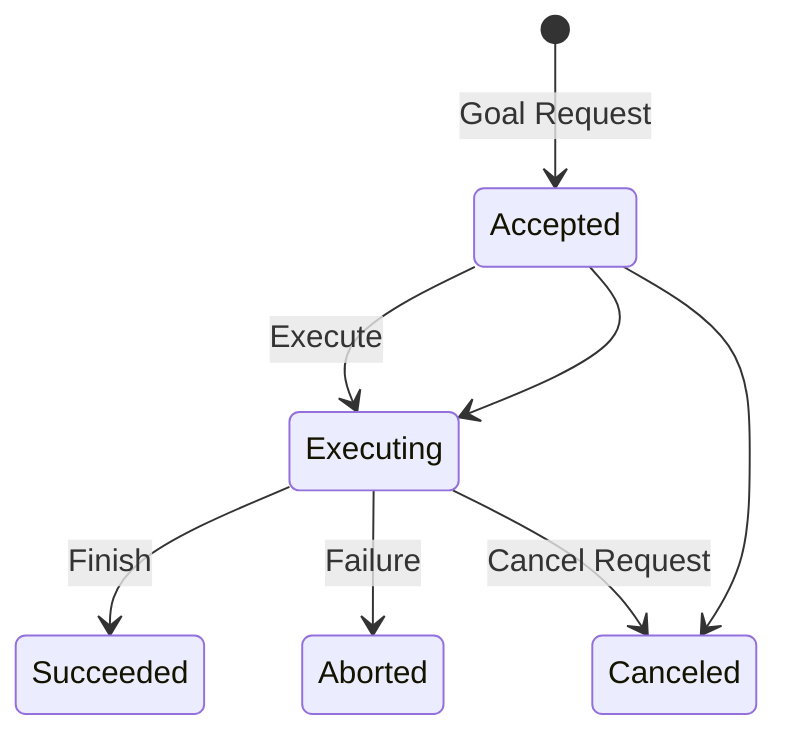

# Day 3: Services, Actions, and Custom Interfaces
## Phase 4: ADAS & Robotics Systems | Week 1: ROS 2 Fundamentals

---

> **📝 Day 3 Focus:**
> Moving beyond simple data streaming (Topics), we explore complex interaction patterns: **Services** for synchronous request/response transactions and **Actions** for long-running, preemptible tasks with feedback. These are critical for building high-level ADAS behaviors like "Park Vehicle" or "Plan Path".

---

## 🎯 Learning Objectives

By the end of this day, you will be able to:

1.  **Differentiate** between Topics, Services, and Actions based on architectural requirements (sync vs async, short vs long duration).
2.  **Implement** robust ROS 2 Services (Servers and Clients) handling concurrency and preventing deadlocks.
3.  **Construct** ROS 2 Action Servers and Clients to manage long-running tasks with feedback loops and cancellation support.
4.  **Design** custom `.srv` and `.action` interfaces for ADAS capabilities.
5.  **Debug** service and action interactions using CLI tools.

---

## 📚 Prerequisites & Preparation

### Required Knowledge
-   **ROS 2 Topics:** Understanding of Pub/Sub (Day 2).
-   **C++ Concurrency:** `std::future`, `std::promise`, asynchronous programming.
-   **State Machines:** Basic concept of states and transitions (for Actions).

### Hardware Requirements
-   **Development Machine:** Ubuntu 22.04 LTS with ROS 2 Humble.

### Software Stack
-   **ROS 2 Humble**
-   **Nav2 (Optional):** Reference for Action usage.

---

## 📖 Theoretical Deep Dive

### 🔹 Part 1: The Service Pattern (Request/Response)

#### 1.1 Architecture & Semantics

Services provide a **synchronous** (or asynchronous-await) **Remote Procedure Call (RPC)** mechanism.

-   **One-to-One (usually):** Typically one Server, multiple Clients.
-   **Transactional:** Client sends Request -> Server processes -> Server sends Response.
-   **Stateless (mostly):** The server usually computes the response based solely on the request (and current state), without maintaining a long-term session with the client.

**When to use Services in ADAS?**
-   **Querying State:** "Is the sensor ready?"
-   **Computation:** "Compute a path from A to B" (if fast).
-   **Configuration:** "Set camera exposure to 100".

**When NOT to use Services?**
-   **Long-running tasks:** "Drive to destination". (Use Actions).
-   **Continuous data:** "Lidar stream". (Use Topics).
-   **One-way commands:** "Emergency Stop". (Use Topics for speed/reliability).

#### 1.2 Synchronous vs. Asynchronous Clients

This is a common pitfall in ROS 2.

**Synchronous Calls (Blocking):**
-   Client sends request and *blocks* the thread until response arrives.
-   **DANGER:** Do **NOT** call a synchronous service from a callback inside a `SingleThreadedExecutor`.
    -   *Why?* The callback holds the thread. The Executor cannot process the response message because the thread is held. **Deadlock.**

**Asynchronous Calls (Non-Blocking):**
-   Client sends request and returns a `std::future`.
-   The node continues execution.
-   When response arrives, a callback (or future resolution) handles it.
-   *Best Practice:* Always use async calls within callbacks.

#### 1.3 Service Introspection

Services are defined in `.srv` files:
```text
# Request
int64 a
int64 b
---
# Response
int64 sum
```
Separated by `---`.

---

### 🔹 Part 2: The Action Pattern (Goal/Feedback/Result)

#### 2.1 Why Actions?

Topics are "fire and forget". Services are "request and wait".
What if you say "Park the Car"?
1.  It takes time (30 seconds).
2.  You want updates ("Moving backwards...", "Aligning...").
3.  You might want to cancel it ("Stop! Pedestrian!").

**Actions** provide this mechanism. They are built on top of Topics and Services.

**Under the Hood (The Action Protocol):**
An Action is a composite interface consisting of:
1.  **Goal Service:** Client sends Goal -> Server accepts/rejects.
2.  **Result Service:** Client asks for Result -> Server returns when done.
3.  **Cancel Service:** Client requests Cancel -> Server handles cancellation.
4.  **Feedback Topic:** Server publishes progress updates.
5.  **Status Topic:** Server publishes current state of all goals.

#### 2.2 The Action State Machine

Every Goal in an Action Server goes through a state machine:



**Key States:**
-   **ACCEPTED:** Server received goal and agreed to try.
-   **EXECUTING:** Server is working on it.
-   **SUCCEEDED:** Completed successfully.
-   **ABORTED:** Failed (e.g., path blocked).
-   **CANCELED:** User requested stop, and server cleaned up.

#### 2.3 Interface Definition (.action)

Defined in `.action` files:
```text
# Goal
float32 target_velocity
---
# Result
float32 final_velocity
bool success
---
# Feedback
float32 current_velocity
float32 distance_traveled
```
Separated by `---` (twice).

---

### 🔹 Part 3: Custom Interfaces for ADAS

Designing good interfaces is architectural work.

**Example 1: `ComputePath.srv`**
```text
# Request
geometry_msgs/PoseStamped start
geometry_msgs/PoseStamped goal
float32 tolerance
---
# Response
nav_msgs/Path path
bool valid
string error_msg
```

**Example 2: `AutoPark.action`**
```text
# Goal
string parking_spot_id
uint8 PARK_TYPE_PARALLEL=0
uint8 PARK_TYPE_PERPENDICULAR=1
uint8 park_type
---
# Result
bool success
string final_status
---
# Feedback
string current_maneuver
float32 distance_remaining
float32 estimated_time_remaining
```

---

## 💻 Implementation: ADAS Service & Action Server

We will build a package `adas_coordination` containing:
1.  **Service:** `EmergencyBrake` (Simulates a fast toggle).
2.  **Action:** `NavigateToPose` (Simulates a long driving task).

### 🛠️ Package Setup

```bash
cd ~/ros2_ws/src
ros2 pkg create --build-type ament_cmake \
  --dependencies rclcpp std_msgs action_msgs rclcpp_action \
  --node-name coordination_node \
  adas_coordination

cd adas_coordination
mkdir srv action
```

### 📦 Interface Definitions

**1. `srv/SetEmergencyBrake.srv`**
```text
bool engage
string reason
---
bool success
string message
```

**2. `action/Navigate.action`**
```text
# Goal
float32 target_x
float32 target_y
float32 target_theta
---
# Result
float32 final_x
float32 final_y
float32 total_time
---
# Feedback
float32 current_x
float32 current_y
float32 distance_remaining
```

**Update `CMakeLists.txt`:**
```cmake
find_package(rosidl_default_generators REQUIRED)

rosidl_generate_interfaces(${PROJECT_NAME}
  "srv/SetEmergencyBrake.srv"
  "action/Navigate.action"
)
```

**Update `package.xml`:**
```xml
<build_depend>rosidl_default_generators</build_depend>
<exec_depend>rosidl_default_runtime</exec_depend>
<member_of_group>rosidl_interface_packages</member_of_group>
<depend>rclcpp_action</depend>
```

### 👨‍💻 Node Implementation

#### Header: `include/adas_coordination/coordinator.hpp`

```cpp
#ifndef ADAS_COORDINATION__COORDINATOR_HPP_
#define ADAS_COORDINATION__COORDINATOR_HPP_

#include <rclcpp/rclcpp.hpp>
#include <rclcpp_action/rclcpp_action.hpp>

#include "adas_coordination/srv/set_emergency_brake.hpp"
#include "adas_coordination/action/navigate.hpp"

namespace adas_coordination
{

class CoordinatorNode : public rclcpp::Node
{
public:
  using SetEmergencyBrake = adas_coordination::srv::SetEmergencyBrake;
  using Navigate = adas_coordination::action::Navigate;
  using GoalHandleNavigate = rclcpp_action::ServerGoalHandle<Navigate>;

  explicit CoordinatorNode(const rclcpp::NodeOptions & options = rclcpp::NodeOptions());

private:
  // --- Service Server ---
  rclcpp::Service<SetEmergencyBrake>::SharedPtr brake_service_;
  void handle_brake(
    const std::shared_ptr<SetEmergencyBrake::Request> request,
    std::shared_ptr<SetEmergencyBrake::Response> response);

  // --- Action Server ---
  rclcpp_action::Server<Navigate>::SharedPtr nav_action_server_;
  
  // Action Callbacks
  rclcpp_action::GoalResponse handle_goal(
    const rclcpp_action::GoalUUID & uuid,
    std::shared_ptr<const Navigate::Goal> goal);

  rclcpp_action::CancelResponse handle_cancel(
    const std::shared_ptr<GoalHandleNavigate> goal_handle);

  void handle_accepted(
    const std::shared_ptr<GoalHandleNavigate> goal_handle);

  // Execution Thread
  void execute_navigation(const std::shared_ptr<GoalHandleNavigate> goal_handle);

  // State
  bool emergency_brake_engaged_;
};

}  // namespace adas_coordination

#endif  // ADAS_COORDINATION__COORDINATOR_HPP_
```

#### Source: `src/coordinator.cpp`

```cpp
#include "adas_coordination/coordinator.hpp"
#include <thread>

using namespace std::placeholders;

namespace adas_coordination
{

CoordinatorNode::CoordinatorNode(const rclcpp::NodeOptions & options)
: Node("coordinator_node", options),
  emergency_brake_engaged_(false)
{
  // 1. Initialize Service
  brake_service_ = this->create_service<SetEmergencyBrake>(
    "set_emergency_brake",
    std::bind(&CoordinatorNode::handle_brake, this, _1, _2));

  // 2. Initialize Action Server
  nav_action_server_ = rclcpp_action::create_server<Navigate>(
    this,
    "navigate_to_pose",
    std::bind(&CoordinatorNode::handle_goal, this, _1, _2),
    std::bind(&CoordinatorNode::handle_cancel, this, _1),
    std::bind(&CoordinatorNode::handle_accepted, this, _1));

  RCLCPP_INFO(this->get_logger(), "Coordinator Node Initialized");
}

// --- Service Implementation ---
void CoordinatorNode::handle_brake(
  const std::shared_ptr<SetEmergencyBrake::Request> request,
  std::shared_ptr<SetEmergencyBrake::Response> response)
{
  RCLCPP_WARN(this->get_logger(), "Emergency Brake Request: %s (Reason: %s)", 
    request->engage ? "ENGAGE" : "RELEASE", request->reason.c_str());

  emergency_brake_engaged_ = request->engage;
  
  response->success = true;
  response->message = request->engage ? "Brakes ENGAGED" : "Brakes RELEASED";
}

// --- Action Implementation ---

rclcpp_action::GoalResponse CoordinatorNode::handle_goal(
  const rclcpp_action::GoalUUID & uuid,
  std::shared_ptr<const Navigate::Goal> goal)
{
  RCLCPP_INFO(this->get_logger(), "Received goal request: (%.2f, %.2f)", 
    goal->target_x, goal->target_y);
  
  // Reject if emergency brake is on
  if (emergency_brake_engaged_) {
    RCLCPP_ERROR(this->get_logger(), "Goal Rejected: Emergency Brake is ON");
    return rclcpp_action::GoalResponse::REJECT;
  }

  (void)uuid;
  return rclcpp_action::GoalResponse::ACCEPT_AND_EXECUTE;
}

rclcpp_action::CancelResponse CoordinatorNode::handle_cancel(
  const std::shared_ptr<GoalHandleNavigate> goal_handle)
{
  RCLCPP_INFO(this->get_logger(), "Received request to cancel goal");
  (void)goal_handle;
  return rclcpp_action::CancelResponse::ACCEPT;
}

void CoordinatorNode::handle_accepted(
  const std::shared_ptr<GoalHandleNavigate> goal_handle)
{
  // Spin up a new thread so we don't block the executor
  std::thread{std::bind(&CoordinatorNode::execute_navigation, this, _1), goal_handle}.detach();
}

void CoordinatorNode::execute_navigation(const std::shared_ptr<GoalHandleNavigate> goal_handle)
{
  RCLCPP_INFO(this->get_logger(), "Executing navigation...");
  
  const auto goal = goal_handle->get_goal();
  auto feedback = std::make_shared<Navigate::Feedback>();
  auto result = std::make_shared<Navigate::Result>();

  float current_x = 0.0;
  float current_y = 0.0;
  float dt = 0.1; // 10Hz simulation
  
  rclcpp::Rate loop_rate(10);
  auto start_time = this->now();

  while (rclcpp::ok()) {
    // 1. Check for Cancellation
    if (goal_handle->is_canceling()) {
      result->final_x = current_x;
      result->final_y = current_y;
      result->total_time = (this->now() - start_time).seconds();
      goal_handle->canceled(result);
      RCLCPP_INFO(this->get_logger(), "Goal Canceled");
      return;
    }

    // 2. Check for Emergency Brake (Preemption)
    if (emergency_brake_engaged_) {
      result->final_x = current_x;
      result->final_y = current_y;
      result->total_time = (this->now() - start_time).seconds();
      goal_handle->abort(result);
      RCLCPP_ERROR(this->get_logger(), "Goal Aborted: Emergency Brake Triggered");
      return;
    }

    // 3. Simulate Motion (Move towards goal)
    float dx = goal->target_x - current_x;
    float dy = goal->target_y - current_y;
    float dist = std::sqrt(dx*dx + dy*dy);

    if (dist < 0.1) {
      // Reached Goal
      break;
    }

    // Simple P-controller
    float speed = 1.0; 
    current_x += (dx / dist) * speed * dt;
    current_y += (dy / dist) * speed * dt;

    // 4. Publish Feedback
    feedback->current_x = current_x;
    feedback->current_y = current_y;
    feedback->distance_remaining = dist;
    goal_handle->publish_feedback(feedback);

    loop_rate.sleep();
  }

  // 5. Success
  if (rclcpp::ok()) {
    result->final_x = current_x;
    result->final_y = current_y;
    result->total_time = (this->now() - start_time).seconds();
    goal_handle->succeed(result);
    RCLCPP_INFO(this->get_logger(), "Goal Succeeded");
  }
}

}  // namespace adas_coordination

#include "rclcpp_components/register_node_macro.hpp"
RCLCPP_COMPONENTS_REGISTER_NODE(adas_coordination::CoordinatorNode)
```

### 🚀 Testing with CLI

**1. Build & Source**
```bash
colcon build --packages-select adas_coordination
source install/setup.bash
```

**2. Run Node**
```bash
ros2 run adas_coordination coordination_node
```

**3. Test Service (CLI)**
```bash
ros2 service call /set_emergency_brake adas_coordination/srv/SetEmergencyBrake "{engage: true, reason: 'Test'}"
```

**4. Test Action (CLI)**
```bash
ros2 action send_goal /navigate_to_pose adas_coordination/action/Navigate "{target_x: 10.0, target_y: 5.0, target_theta: 0.0}" --feedback
```
*Note: If brake is engaged, action should be rejected immediately.*

---

## 🔬 Lab Exercise: Action Client Implementation

### Lab Objectives
1.  Write a C++ Action Client.
2.  Send a goal to the `CoordinatorNode`.
3.  Monitor feedback and cancel the goal if it takes too long.

### Client Implementation Snippet

```cpp
// Inside a Node class...
void send_goal() {
  using namespace std::placeholders;
  
  if (!this->client_ptr_->wait_for_action_server()) {
    RCLCPP_ERROR(this->get_logger(), "Action server not available after waiting");
    return;
  }

  auto goal_msg = Navigate::Goal();
  goal_msg.target_x = 10.0;
  goal_msg.target_y = 10.0;

  RCLCPP_INFO(this->get_logger(), "Sending goal");

  auto send_goal_options = rclcpp_action::Client<Navigate>::SendGoalOptions();
  send_goal_options.goal_response_callback =
    std::bind(&MyNode::goal_response_callback, this, _1);
  send_goal_options.feedback_callback =
    std::bind(&MyNode::feedback_callback, this, _1, _2);
  send_goal_options.result_callback =
    std::bind(&MyNode::result_callback, this, _1);
  
  this->client_ptr_->async_send_goal(goal_msg, send_goal_options);
}

void feedback_callback(
  GoalHandleNavigate::SharedPtr,
  const std::shared_ptr<const Navigate::Feedback> feedback)
{
  RCLCPP_INFO(this->get_logger(), "Remaining: %.2fm", feedback->distance_remaining);
  
  if (feedback->distance_remaining > 50.0) {
    // Cancel if too far (logic example)
    // client_ptr_->async_cancel_goal(goal_handle);
  }
}
```

---

## 🐞 Debugging & Troubleshooting

### Common Issues

#### 1. Service Deadlock
**Symptom:** Client hangs forever waiting for response.
**Cause:** Calling a service synchronously (`future.get()`) inside a callback of a `SingleThreadedExecutor`. The executor is busy running the callback, so it can't process the response.
**Solution:**
-   Use `async_send_request` with a callback.
-   Run the client in a separate thread/node.

#### 2. Action Server Not Appearing
**Symptom:** `ros2 action list` is empty.
**Cause:** Node not spinning or action server not initialized.
**Solution:** Check `create_server` call. Ensure `rclcpp::spin` is running.

#### 3. Build Failures (Interfaces)
**Symptom:** `fatal error: adas_coordination/action/navigate.hpp: No such file`.
**Cause:** `CMakeLists.txt` dependency order.
**Solution:**
```cmake
rosidl_generate_interfaces(...)
ament_export_dependencies(rosidl_default_runtime)
```
And in the node's CMake:
```cmake
rosidl_target_interfaces(coordination_node
  ${PROJECT_NAME} "rosidl_typesupport_cpp")
```

---

## ⚡ Optimization & Best Practices

### 1. Service QoS
Services use `Reliable` and `Volatile` QoS by default.
-   For high-frequency, non-critical queries, you can tune this, but it's rare.
-   **Timeout:** Always set a timeout for service clients.
    ```cpp
    client_->wait_for_service(std::chrono::seconds(1));
    ```

### 2. Action Server Threading
-   The `execute` callback in `rclcpp_action` blocks the executor if run directly.
-   **Always** spawn a new thread (or use `std::async`) for the execution logic if it takes time.
-   Ensure you join/detach the thread properly.

### 3. Interface Design
-   Keep `.srv` and `.action` files in a separate package (e.g., `adas_interfaces`) if they are shared across many nodes. This prevents circular dependencies.

---

## 🧠 Assessment & Review

### Knowledge Check

1.  **Q:** When should you use an Action instead of a Service?
    *   **A:** When the task takes significant time, requires feedback, or might need to be canceled (e.g., Navigation, Arm manipulation).

2.  **Q:** What happens if you call a service synchronously in a timer callback?
    *   **A:** Deadlock (if using SingleThreadedExecutor), because the executor cannot process the response while the timer callback is blocking it.

3.  **Q:** What are the three main components of an Action definition?
    *   **A:** Goal, Result, Feedback.

### Challenge Task
**Task:** Implement a "System Check" Service.
1.  Create `srv/SystemCheck.srv` (Request: empty, Response: `bool all_ok`, `string[] failed_components`).
2.  Server checks status of "Camera", "LiDAR", "GPS" (simulated bools).
3.  Returns failure list if any are down.

---

## 📚 Further Reading & References
-   [ROS 2 Actions Tutorial](https://docs.ros.org/en/humble/Tutorials/Intermediate/Writing-an-Action-Server-Client/Cpp.html)
-   [ROS 2 Services Tutorial](https://docs.ros.org/en/humble/Tutorials/Beginner-Client-Libraries/Writing-A-Simple-Cpp-Service-And-Client.html)
-   [Interface Design Guide](https://design.ros2.org/articles/interface_definition.html)

---

**Day 3 Complete** | Phase 4: ADAS & Robotics Systems | Week 1: ROS 2 Fundamentals
