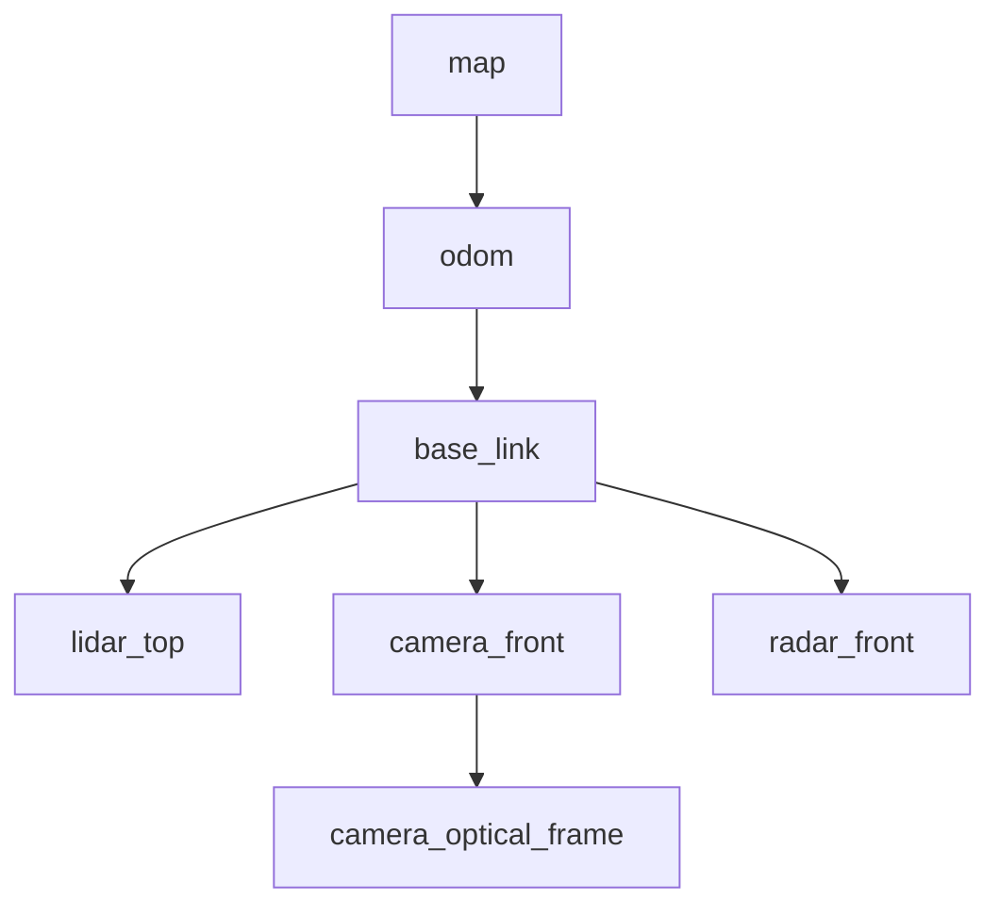

# Day 5: TF2 and Coordinate Transforms
## Phase 4: ADAS & Robotics Systems | Week 1: ROS 2 Fundamentals

---

> **📝 Day 5 Focus:**
> In ADAS, sensors (LiDAR, Camera, Radar) are mounted at different locations on the vehicle. To fuse this data, we must transform it into a common coordinate frame (e.g., `base_link` or `map`). **TF2** is the standard library in ROS 2 for managing these coordinate transforms over time.

---

## 🎯 Learning Objectives

By the end of this day, you will be able to:

1.  **Visualize** the TF2 tree structure and understand the relationship between parent and child frames.
2.  **Master** the mathematics of rigid body transformations (Translation + Rotation/Quaternion).
3.  **Implement** Static and Dynamic Transform Broadcasters in C++.
4.  **Develop** robust Transform Listeners to convert sensor data between frames, handling time delays and interpolation.
5.  **Debug** TF2 issues (disconnected trees, extrapolation errors) using `tf2_tools`.

---

## 📚 Prerequisites & Preparation

### Required Knowledge
-   **Linear Algebra:** Vectors, Matrices, Rotation Matrices.
-   **Quaternions:** Basic understanding (w, x, y, z) vs Euler Angles (Roll, Pitch, Yaw).
-   **ROS 2 Nodes:** Day 1-4 concepts.

### Hardware Requirements
-   **Development Machine:** Ubuntu 22.04 LTS with ROS 2 Humble.

### Software Stack
-   **ROS 2 Humble**
-   **TF2 Packages:** `tf2_ros`, `tf2_geometry_msgs`, `tf2_eigen`.

---

## 📖 Theoretical Deep Dive

### 🔹 Part 1: The Transform Tree (TF Tree)

#### 1.1 The Concept

A robot is a collection of rigid bodies (links) connected by joints.
-   **World Frame (`map`):** Fixed global reference.
-   **Odometry Frame (`odom`):** Local smooth reference (drifts over time).
-   **Base Frame (`base_link`):** The center of the robot/vehicle.
-   **Sensor Frames (`lidar_link`, `camera_link`):** Where sensors are mounted.

**The Rule of Trees:**
-   Every frame has exactly **one parent** (except the root).
-   A frame can have **multiple children**.
-   This forms a Directed Acyclic Graph (DAG) - specifically a Tree.

**Example ADAS Tree:**


#### 1.2 Static vs. Dynamic Transforms

1.  **Static Transforms:**
    -   Relationship does NOT change over time.
    -   Example: `base_link` -> `lidar_link` (Sensor mounting is fixed).
    -   Broadcasted once (or infrequently) on `/tf_static`.
    -   *Efficiency:* Latching topic, low bandwidth.

2.  **Dynamic Transforms:**
    -   Relationship changes over time.
    -   Example: `odom` -> `base_link` (Vehicle moving).
    -   Broadcasted frequently (e.g., 50Hz) on `/tf`.
    -   *Efficiency:* High bandwidth, requires buffering.

#### 1.3 Quaternions vs. Euler Angles

In Robotics, we avoid Euler Angles (Roll, Pitch, Yaw) for internal computation due to **Gimbal Lock**.
We use **Quaternions** ($w, x, y, z$).

-   **Pros:** No Gimbal Lock, efficient interpolation (SLERP).
-   **Cons:** Non-intuitive for humans.
-   *Workflow:* Humans think in RPY -> Convert to Quaternion -> Publish TF -> Read Quaternion -> Convert to RPY for debugging.

---

### 🔹 Part 2: TF2 Architecture

#### 2.1 The Buffer and Listener

TF2 is a distributed system.
-   **Broadcasters** send transforms to `/tf` and `/tf_static`.
-   **Listeners** subscribe to these topics and cache them in a **Buffer**.

**The Buffer:**
-   Stores a history of transforms (default 10 seconds).
-   Allows asking questions like: "Where was the `lidar_link` relative to `map` 5 seconds ago?"

#### 2.2 Time Travel (Interpolation)

This is the killer feature of TF2.
-   LiDAR scan received at $t = 10.5s$.
-   Vehicle pose known at $t = 10.4s$ and $t = 10.6s$.
-   TF2 **interpolates** the vehicle pose at exactly $t = 10.5s$ to transform the LiDAR point correctly.

#### 2.3 Exceptions

-   `LookupException`: Frame doesn't exist.
-   `ConnectivityException`: Frames exist but are not connected in the tree.
-   `ExtrapolationException`: Requesting a time that is outside the buffer (too old or in the future).

---

## 💻 Implementation: ADAS Frame Manager

We will build a package `adas_tf_manager` that:
1.  Publishes static transforms for sensors.
2.  Publishes a dynamic transform for the vehicle (simulating movement).
3.  Listens to transforms to convert a point from `lidar_link` to `map`.

### 🛠️ Package Setup

```bash
cd ~/ros2_ws/src
ros2 pkg create --build-type ament_cmake \
  --dependencies rclcpp geometry_msgs tf2_ros tf2_geometry_msgs \
  --node-name static_broadcaster \
  adas_tf_manager

cd adas_tf_manager
```

### 👨‍💻 Static Broadcaster Implementation

#### Source: `src/static_broadcaster.cpp`

```cpp
#include <memory>
#include <rclcpp/rclcpp.hpp>
#include <geometry_msgs/msg/transform_stamped.hpp>
#include <tf2_ros/static_transform_broadcaster.h>
#include <tf2/LinearMath/Quaternion.h>

class StaticFramePublisher : public rclcpp::Node
{
public:
  explicit StaticFramePublisher()
  : Node("static_tf_broadcaster")
  {
    tf_static_broadcaster_ = std::make_shared<tf2_ros::StaticTransformBroadcaster>(this);

    // Publish transforms on startup
    this->publish_transforms();
  }

private:
  void publish_transforms()
  {
    geometry_msgs::msg::TransformStamped t;

    // 1. Base -> Lidar
    t.header.stamp = this->now();
    t.header.frame_id = "base_link";
    t.child_frame_id = "lidar_link";

    // Translation (Mounted 1.5m forward, 2.0m up)
    t.transform.translation.x = 1.5;
    t.transform.translation.y = 0.0;
    t.transform.translation.z = 2.0;

    // Rotation (No rotation)
    tf2::Quaternion q;
    q.setRPY(0, 0, 0);
    t.transform.rotation.x = q.x();
    t.transform.rotation.y = q.y();
    t.transform.rotation.z = q.z();
    t.transform.rotation.w = q.w();

    tf_static_broadcaster_->sendTransform(t);
    
    RCLCPP_INFO(this->get_logger(), "Published static transform: base_link -> lidar_link");

    // 2. Base -> Camera (Mounted 1.0m forward, 1.5m up, pitched down 15 degrees)
    t.child_frame_id = "camera_link";
    t.transform.translation.x = 1.0;
    t.transform.translation.z = 1.5;
    
    // Pitch down 15 degrees (approx 0.26 rad)
    q.setRPY(0, 0.26, 0); 
    t.transform.rotation.x = q.x();
    t.transform.rotation.y = q.y();
    t.transform.rotation.z = q.z();
    t.transform.rotation.w = q.w();

    tf_static_broadcaster_->sendTransform(t);
    
    RCLCPP_INFO(this->get_logger(), "Published static transform: base_link -> camera_link");
  }

  std::shared_ptr<tf2_ros::StaticTransformBroadcaster> tf_static_broadcaster_;
};

int main(int argc, char * argv[])
{
  rclcpp::init(argc, argv);
  rclcpp::spin(std::make_shared<StaticFramePublisher>());
  rclcpp::shutdown();
  return 0;
}
```

### 👨‍💻 Dynamic Broadcaster (Simulator)

This node simulates the vehicle moving in a circle.

#### Source: `src/dynamic_broadcaster.cpp`

```cpp
#include <rclcpp/rclcpp.hpp>
#include <geometry_msgs/msg/transform_stamped.hpp>
#include <tf2_ros/transform_broadcaster.h>
#include <tf2/LinearMath/Quaternion.h>
#include <cmath>

class VehicleSimulator : public rclcpp::Node
{
public:
  VehicleSimulator()
  : Node("vehicle_simulator")
  {
    tf_broadcaster_ = std::make_unique<tf2_ros::TransformBroadcaster>(*this);

    // 50Hz update rate
    timer_ = this->create_wall_timer(
      std::chrono::milliseconds(20),
      std::bind(&VehicleSimulator::timer_callback, this));
      
    start_time_ = this->now();
  }

private:
  void timer_callback()
  {
    rclcpp::Time now = this->now();
    double elapsed = (now - start_time_).seconds();

    // Simulate circular motion
    double radius = 5.0;
    double speed = 0.5; // rad/s
    double angle = speed * elapsed;

    double x = radius * std::cos(angle);
    double y = radius * std::sin(angle);
    double yaw = angle + M_PI_2; // Tangent to circle

    geometry_msgs::msg::TransformStamped t;

    t.header.stamp = now;
    t.header.frame_id = "odom";
    t.child_frame_id = "base_link";

    t.transform.translation.x = x;
    t.transform.translation.y = y;
    t.transform.translation.z = 0.0;

    tf2::Quaternion q;
    q.setRPY(0, 0, yaw);
    t.transform.rotation.x = q.x();
    t.transform.rotation.y = q.y();
    t.transform.rotation.z = q.z();
    t.transform.rotation.w = q.w();

    tf_broadcaster_->sendTransform(t);
  }

  std::unique_ptr<tf2_ros::TransformBroadcaster> tf_broadcaster_;
  rclcpp::TimerBase::SharedPtr timer_;
  rclcpp::Time start_time_;
};

int main(int argc, char * argv[])
{
  rclcpp::init(argc, argv);
  rclcpp::spin(std::make_shared<VehicleSimulator>());
  rclcpp::shutdown();
  return 0;
}
```

### 👨‍💻 Transform Listener (The User)

This node listens to TF and transforms a point.

#### Source: `src/tf_listener.cpp`

```cpp
#include <rclcpp/rclcpp.hpp>
#include <geometry_msgs/msg/point_stamped.hpp>
#include <tf2_ros/transform_listener.h>
#include <tf2_ros/buffer.h>
#include <tf2_geometry_msgs/tf2_geometry_msgs.hpp> // For doTransform

class SensorProcessor : public rclcpp::Node
{
public:
  SensorProcessor()
  : Node("sensor_processor")
  {
    tf_buffer_ = std::make_unique<tf2_ros::Buffer>(this->get_clock());
    tf_listener_ = std::make_shared<tf2_ros::TransformListener>(*tf_buffer_);

    // Check transform every 1s
    timer_ = this->create_wall_timer(
      std::chrono::seconds(1),
      std::bind(&SensorProcessor::process_data, this));
  }

private:
  void process_data()
  {
    // Simulate a point detected by LiDAR 5 meters ahead
    geometry_msgs::msg::PointStamped lidar_point;
    lidar_point.header.frame_id = "lidar_link";
    lidar_point.header.stamp = this->now(); // "Now"
    lidar_point.point.x = 5.0;
    lidar_point.point.y = 0.0;
    lidar_point.point.z = 0.0;

    try {
      // We want to transform this point to the "map" (or odom) frame
      // Wait for transform to be available (timeout 50ms)
      // Note: We might need to wait a bit for the dynamic transform to arrive
      
      geometry_msgs::msg::PointStamped map_point;
      
      // lookupTransform(target_frame, source_frame, time)
      // But simpler: transform(input, output, target_frame)
      
      map_point = tf_buffer_->transform(lidar_point, "odom", tf2::durationFromSec(0.1));

      RCLCPP_INFO(this->get_logger(), 
        "LiDAR Point (5,0,0) -> Odom Point (%.2f, %.2f, %.2f)",
        map_point.point.x, map_point.point.y, map_point.point.z);

    } catch (tf2::TransformException & ex) {
      RCLCPP_WARN(this->get_logger(), "Could not transform: %s", ex.what());
    }
  }

  std::unique_ptr<tf2_ros::Buffer> tf_buffer_;
  std::shared_ptr<tf2_ros::TransformListener> tf_listener_;
  rclcpp::TimerBase::SharedPtr timer_;
};

int main(int argc, char * argv[])
{
  rclcpp::init(argc, argv);
  rclcpp::spin(std::make_shared<SensorProcessor>());
  rclcpp::shutdown();
  return 0;
}
```

### 🚀 Launch File

Create `launch/tf_system.launch.py`:

```python
from launch import LaunchDescription
from launch_ros.actions import Node

def generate_launch_description():
    return LaunchDescription([
        Node(
            package='adas_tf_manager',
            executable='static_broadcaster',
            name='static_broadcaster'
        ),
        Node(
            package='adas_tf_manager',
            executable='dynamic_broadcaster',
            name='vehicle_simulator'
        ),
        Node(
            package='adas_tf_manager',
            executable='tf_listener',
            name='sensor_processor'
        ),
        # RViz for visualization
        Node(
            package='rviz2',
            executable='rviz2',
            name='rviz2',
            arguments=['-d', 'src/adas_tf_manager/config/view.rviz'] 
            # (Assuming config exists, or user sets it up)
        )
    ])
```

---

## 🔬 Lab Exercise: Debugging TF

### Lab Objectives
1.  Launch the system.
2.  Use `tf2_tools` to generate a PDF of the tree.
3.  Use `tf2_echo` to check values.
4.  Visualize in RViz.

### Part 1: View Frames
```bash
# 1. Generate PDF
ros2 run tf2_tools view_frames

# 2. Open PDF
evince frames.pdf
```
*Expected:* `odom` -> `base_link` -> `lidar_link` / `camera_link`.

### Part 2: Echo Transform
```bash
ros2 run tf2_ros tf2_echo odom lidar_link
```
*Expected:* Translation should change as vehicle moves.

### Part 3: RViz Visualization
1.  Open RViz.
2.  Set Fixed Frame to `odom`.
3.  Add "TF" display.
4.  You should see the frames moving in a circle.

---

## 🐞 Debugging & Troubleshooting

### Common Issues

#### 1. "ExtrapolationException: Lookup would require extrapolation into the future"
**Cause:** You are asking for a transform at `now()` but the latest transform received is from `now() - 5ms`.
**Solution:**
-   Use `Time(0)` to get the *latest available* transform (if precise timing isn't critical).
-   Or wait for the transform using a timeout (as done in the code).

#### 2. "ExtrapolationException: Lookup would require extrapolation into the past"
**Cause:** The buffer is too short, or the system is lagging heavily.
**Solution:** Increase buffer size (default is 10s, usually enough). Check system load.

#### 3. Disconnected Tree
**Symptom:** `view_frames` shows two separate trees.
**Cause:** Missing a link (e.g., `map` -> `odom` is missing).
**Solution:** Ensure a localization node (AMCL) or a static publisher provides the missing link.

---

## ⚡ Optimization & Best Practices

### 1. Buffer Size
For most ADAS, 10s is fine. For loop closure in SLAM (hours ago), you need a separate database, not the TF buffer.

### 2. Thread Safety
`tf2_ros::Buffer` is thread-safe. You can query it from multiple callback threads.

### 3. Minimize Traffic
-   Don't publish static transforms on `/tf` (dynamic). Use `/tf_static`.
-   Don't publish at 1000Hz if 50Hz is enough.

### 4. Use `tf2_eigen`
Avoid manual conversion between `geometry_msgs` and `Eigen`.
```cpp
#include <tf2_eigen/tf2_eigen.hpp>
Eigen::Affine3d eigen_transform = tf2::transformToEigen(ros_transform);
```

---

## 🧠 Assessment & Review

### Knowledge Check

1.  **Q:** What is the difference between `/tf` and `/tf_static`?
    *   **A:** `/tf` is for changing transforms (high bandwidth). `/tf_static` is latched for fixed transforms (low bandwidth).

2.  **Q:** Why do we use Quaternions instead of Euler angles?
    *   **A:** To avoid Gimbal Lock and allow smooth interpolation (SLERP).

3.  **Q:** If `base_link` is the parent of `camera_link`, does the transform represent the camera's position in base frame, or base in camera frame?
    *   **A:** Camera's position in Base frame.

### Challenge Task
**Task:** Implement a "LookAt" Controller.
1.  Create a node that publishes a dynamic transform for a "turret".
2.  The turret should always rotate to face the `odom` origin (0,0,0) as the vehicle moves.
3.  Math hint: `atan2(y, x)`.

---

## 📚 Further Reading & References
-   [TF2 Tutorials](https://docs.ros.org/en/humble/Tutorials/Intermediate/Tf2/Tf2-Main.html)
-   [Quaternion Visualization](https://quaternions.online/)
-   [REP 103: Standard Units of Measure and Coordinate Conventions](https://www.ros.org/reps/rep-0103.html)
-   [REP 105: Coordinate Frames for Mobile Platforms](https://www.ros.org/reps/rep-0105.html)

---

**Day 5 Complete** | Phase 4: ADAS & Robotics Systems | Week 1: ROS 2 Fundamentals
