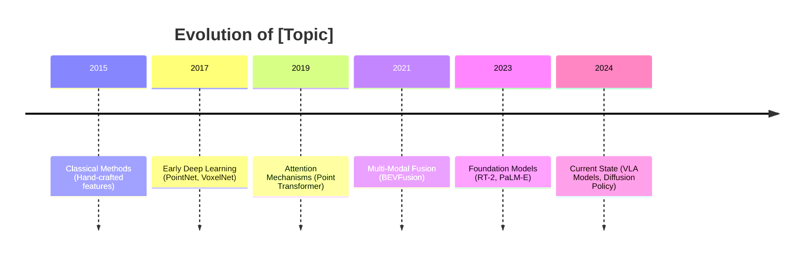
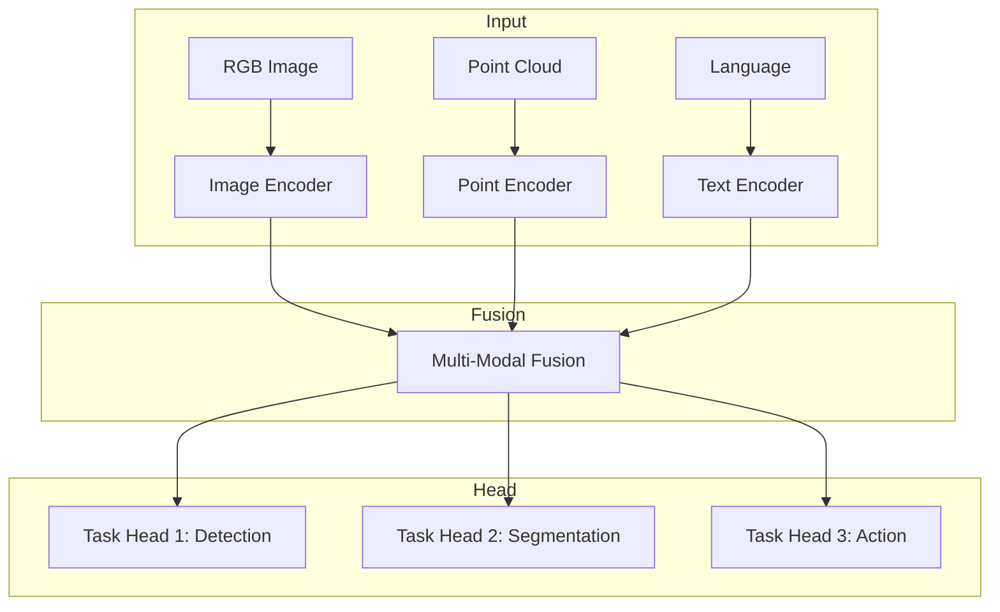

# [Day X]: [Topic Title]
## Phase 5: AI/CV/LIDAR End-to-End Robotics | Week [X]: [Week Name]

---

> **📝 Content Creator Instructions:**
> This template is designed to produce **comprehensive, industry-grade educational content** for advanced robotics AI systems.
> - **Target Length:** The final filled document should be approximately **1200+ lines** of detailed markdown.
> - **Depth:** Explain the underlying mathematics, architectures, and implementation details.
> - **AI/ML Focus:** Include model architectures, training pipelines, and deployment strategies.
> - **Code Quality:** Provide production-ready Python/C++ code with type hints and documentation.
> - **Reproducibility:** Include exact library versions, commands, and expected outputs.
> - **Visuals:** Use Mermaid diagrams for architectures, data flows, and system designs.

---

## 🎯 Learning Objectives
*By the end of this day, the learner will be able to:*
1. [Objective 1: Theoretical understanding of AI/ML concept]
2. [Objective 2: Practical implementation with frameworks (PyTorch/TensorFlow)]
3. [Objective 3: ROS 2 integration and real-time deployment]
4. [Objective 4: Performance optimization and edge deployment]
5. [Objective 5: Evaluation and benchmarking on standard datasets]

---

## 📚 Prerequisites & Preparation

### Hardware Requirements
| Component | Specification | Purpose |
|-----------|--------------|---------|
| GPU | NVIDIA RTX 3080+ or Jetson Orin | Training and inference |
| CPU | 8+ cores, 32GB RAM | Data preprocessing |
| Robot Platform | TurtleBot4 / Custom | Real-world testing |
| Sensors | LiDAR, RGB-D Camera, IMU | Perception data |

### Software Environment
```bash
# Create conda environment
conda create -n phase5_robotics python=3.10
conda activate phase5_robotics

# Core frameworks
pip install torch==2.1.0 torchvision==0.16.0 --index-url https://download.pytorch.org/whl/cu121
pip install transformers==4.35.0 accelerate==0.24.0
pip install numpy==1.24.0 scipy==1.11.0 matplotlib==3.8.0

# 3D/Robotics libraries
pip install open3d==0.17.0 trimesh==4.0.0
pip install pyrealsense2 opencv-python==4.8.0

# ROS 2 (Install via apt)
# sudo apt install ros-humble-desktop ros-humble-perception
```

### Prior Knowledge
- [X] Phase 4 ADAS content (sensor fusion, SLAM, path planning)
- [X] Deep learning fundamentals (CNNs, Transformers, optimization)
- [X] ROS 2 basics (nodes, topics, services, actions)
- [X] Python proficiency (asyncio, type hints, dataclasses)

### Key Resources
- **Papers:** [Link to seminal papers]
- **Code Repositories:** [GitHub links to reference implementations]
- **Datasets:** [Download links and preprocessing scripts]
- **Pretrained Models:** [HuggingFace/Model Zoo links]

---

## 📖 Theoretical Deep Dive

> **Instruction:** This section must be exhaustive. Cover mathematical foundations, architectural decisions, and design rationale.
> **CRITICAL:** Divide into logical Parts. Use LaTeX for equations. Include architecture diagrams.

### 🔹 Part 1: Foundational Concepts

#### 1.1 Problem Formulation
[Describe the problem mathematically. Define inputs, outputs, and optimization objectives.]

**Formal Definition:**
Let $\mathcal{X} = \{x_1, x_2, ..., x_n\}$ be the input space (e.g., point clouds, images)...

**Objective Function:**
$$\mathcal{L} = \mathcal{L}_{task} + \lambda_1 \mathcal{L}_{reg} + \lambda_2 \mathcal{L}_{aux}$$

Where:
- $\mathcal{L}_{task}$: Primary task loss (e.g., cross-entropy, L1 loss)
- $\mathcal{L}_{reg}$: Regularization term
- $\mathcal{L}_{aux}$: Auxiliary losses for multi-task learning

#### 1.2 Historical Context & Evolution
[Trace the evolution from classical methods to modern deep learning approaches]



#### 1.3 Comparison with Classical Approaches
| Aspect | Classical Method | Deep Learning Approach |
|--------|------------------|------------------------|
| Feature Engineering | Manual | Learned |
| Generalization | Limited | Strong |
| Compute Requirements | Low | High |
| Interpretability | High | Low |
| Real-time Performance | Fast | Varies |

### 🔹 Part 2: Model Architecture & Design

#### 2.1 Architecture Overview



#### 2.2 Core Components

##### 2.2.1 [Component Name] (e.g., Vision Encoder)
[Detailed explanation with mathematical formulation]

**Architecture Details:**
```
Input Shape: (B, C, H, W) = (batch, 3, 224, 224)
├── Patch Embedding: (B, N, D) where N = (H/16) * (W/16) = 196
├── Transformer Blocks x 12
│   ├── Multi-Head Self-Attention (8 heads)
│   ├── MLP (4x expansion)
│   └── LayerNorm + Residual
└── Output: (B, N, D) = (B, 196, 768)
```

**Attention Mechanism:**
$$\text{Attention}(Q, K, V) = \text{softmax}\left(\frac{QK^T}{\sqrt{d_k}}\right)V$$

##### 2.2.2 [Component Name] (e.g., Point Cloud Encoder)
[Similar detailed breakdown]

#### 2.3 Training Strategy

##### Loss Functions
```python
class MultiTaskLoss(nn.Module):
    """
    Multi-task loss with automatic weight balancing.
    Based on "Multi-Task Learning Using Uncertainty to Weigh Losses"
    """
    def __init__(self, num_tasks: int = 3):
        super().__init__()
        # Learnable log variance for each task
        self.log_vars = nn.Parameter(torch.zeros(num_tasks))
    
    def forward(
        self,
        losses: List[torch.Tensor],
        names: Optional[List[str]] = None
    ) -> Tuple[torch.Tensor, Dict[str, float]]:
        total_loss = 0
        loss_dict = {}
        
        for i, loss in enumerate(losses):
            precision = torch.exp(-self.log_vars[i])
            weighted_loss = precision * loss + self.log_vars[i]
            total_loss += weighted_loss
            
            name = names[i] if names else f"loss_{i}"
            loss_dict[name] = loss.item()
            loss_dict[f"{name}_weight"] = precision.item()
        
        return total_loss, loss_dict
```

##### Optimization
- **Optimizer:** AdamW with weight decay 0.05
- **Learning Rate:** Cosine annealing from 1e-4 to 1e-6
- **Batch Size:** Gradient accumulation for effective batch 64
- **Training Duration:** 100 epochs (~24 hours on 8x A100)

### 🔹 Part 3: Advanced Topics & Research Frontiers

#### 3.1 Current Limitations
- [Limitation 1: e.g., Domain gap between simulation and real-world]
- [Limitation 2: e.g., Computational requirements for edge deployment]
- [Limitation 3: e.g., Catastrophic forgetting in continual learning]

#### 3.2 State-of-the-Art Approaches (2024)
[Discuss latest papers and methods addressing these limitations]

#### 3.3 Open Research Questions
- [Question 1: e.g., How to achieve true zero-shot generalization?]
- [Question 2: e.g., Optimal fusion architectures for multi-modal data?]

---

## 💻 Implementation

> **Instruction:** Provide production-quality, modular code. Include type hints, docstrings, and error handling.

### 🛠️ Project Structure

```
phase5_[topic]_ws/
├── src/
│   └── [package_name]/
│       ├── CMakeLists.txt
│       ├── package.xml
│       ├── setup.py
│       ├── [package_name]/
│       │   ├── __init__.py
│       │   ├── models/
│       │   │   ├── __init__.py
│       │   │   ├── encoder.py
│       │   │   ├── decoder.py
│       │   │   ├── fusion.py
│       │   │   └── heads.py
│       │   ├── data/
│       │   │   ├── __init__.py
│       │   │   ├── dataset.py
│       │   │   ├── transforms.py
│       │   │   └── loaders.py
│       │   ├── utils/
│       │   │   ├── __init__.py
│       │   │   ├── visualization.py
│       │   │   ├── metrics.py
│       │   │   └── profiling.py
│       │   └── ros/
│       │       ├── __init__.py
│       │       ├── node.py
│       │       └── interfaces.py
│       ├── config/
│       │   ├── model_config.yaml
│       │   ├── train_config.yaml
│       │   └── ros_params.yaml
│       ├── launch/
│       │   ├── inference.launch.py
│       │   ├── training.launch.py
│       │   └── evaluation.launch.py
│       ├── scripts/
│       │   ├── train.py
│       │   ├── evaluate.py
│       │   ├── export_onnx.py
│       │   └── benchmark.py
│       ├── msg/
│       │   └── [CustomMsg].msg
│       ├── srv/
│       │   └── [CustomSrv].srv
│       └── test/
│           ├── test_model.py
│           ├── test_inference.py
│           └── test_ros_integration.py
├── docker/
│   ├── Dockerfile
│   ├── Dockerfile.jetson
│   └── docker-compose.yaml
├── data/
│   └── sample/
├── weights/
│   └── pretrained/
└── README.md
```

### 👨‍💻 Core Model Implementation

#### Model Definition (models/[model_name].py)

```python
#!/usr/bin/env python3
"""
[Model Name] Implementation

Paper: "[Paper Title]" (Author et al., Year)
Link: https://arxiv.org/abs/xxxx.xxxxx

This implementation includes:
- [Feature 1]
- [Feature 2]
- [Feature 3]
"""

from __future__ import annotations

import math
from dataclasses import dataclass, field
from typing import Dict, List, Optional, Tuple, Union

import torch
import torch.nn as nn
import torch.nn.functional as F
from einops import rearrange, repeat
from einops.layers.torch import Rearrange


@dataclass
class ModelConfig:
    """Configuration for [Model Name]."""
    
    # Input specifications
    image_size: int = 224
    patch_size: int = 16
    in_channels: int = 3
    
    # Architecture
    embed_dim: int = 768
    depth: int = 12
    num_heads: int = 12
    mlp_ratio: float = 4.0
    
    # Regularization
    drop_rate: float = 0.0
    attn_drop_rate: float = 0.0
    drop_path_rate: float = 0.1
    
    # Task-specific
    num_classes: int = 1000
    num_actions: int = 7  # For robotics: [x, y, z, rx, ry, rz, gripper]
    
    # Training
    use_checkpoint: bool = False  # Gradient checkpointing for memory
    
    def __post_init__(self):
        self.num_patches = (self.image_size // self.patch_size) ** 2


class MultiHeadAttention(nn.Module):
    """Multi-head self-attention with relative position bias option."""
    
    def __init__(
        self,
        dim: int,
        num_heads: int = 8,
        qkv_bias: bool = True,
        attn_drop: float = 0.0,
        proj_drop: float = 0.0,
        use_flash_attn: bool = True
    ):
        super().__init__()
        assert dim % num_heads == 0, f"dim {dim} must be divisible by num_heads {num_heads}"
        
        self.num_heads = num_heads
        self.head_dim = dim // num_heads
        self.scale = self.head_dim ** -0.5
        self.use_flash_attn = use_flash_attn and hasattr(F, 'scaled_dot_product_attention')
        
        self.qkv = nn.Linear(dim, dim * 3, bias=qkv_bias)
        self.attn_drop = nn.Dropout(attn_drop)
        self.proj = nn.Linear(dim, dim)
        self.proj_drop = nn.Dropout(proj_drop)
    
    def forward(
        self,
        x: torch.Tensor,
        mask: Optional[torch.Tensor] = None
    ) -> torch.Tensor:
        B, N, C = x.shape
        
        # Compute Q, K, V
        qkv = self.qkv(x).reshape(B, N, 3, self.num_heads, self.head_dim)
        qkv = qkv.permute(2, 0, 3, 1, 4)  # (3, B, heads, N, head_dim)
        q, k, v = qkv.unbind(0)
        
        if self.use_flash_attn:
            # Use PyTorch 2.0 Flash Attention
            x = F.scaled_dot_product_attention(
                q, k, v,
                attn_mask=mask,
                dropout_p=self.attn_drop.p if self.training else 0.0
            )
        else:
            # Manual attention
            attn = (q @ k.transpose(-2, -1)) * self.scale
            if mask is not None:
                attn = attn.masked_fill(mask == 0, float('-inf'))
            attn = attn.softmax(dim=-1)
            attn = self.attn_drop(attn)
            x = attn @ v
        
        x = x.transpose(1, 2).reshape(B, N, C)
        x = self.proj(x)
        x = self.proj_drop(x)
        
        return x


class MLP(nn.Module):
    """MLP block with GELU activation."""
    
    def __init__(
        self,
        in_features: int,
        hidden_features: Optional[int] = None,
        out_features: Optional[int] = None,
        act_layer: nn.Module = nn.GELU,
        drop: float = 0.0
    ):
        super().__init__()
        out_features = out_features or in_features
        hidden_features = hidden_features or int(in_features * 4)
        
        self.fc1 = nn.Linear(in_features, hidden_features)
        self.act = act_layer()
        self.fc2 = nn.Linear(hidden_features, out_features)
        self.drop = nn.Dropout(drop)
    
    def forward(self, x: torch.Tensor) -> torch.Tensor:
        x = self.fc1(x)
        x = self.act(x)
        x = self.drop(x)
        x = self.fc2(x)
        x = self.drop(x)
        return x


class TransformerBlock(nn.Module):
    """Transformer block with pre-normalization."""
    
    def __init__(
        self,
        dim: int,
        num_heads: int,
        mlp_ratio: float = 4.0,
        qkv_bias: bool = True,
        drop: float = 0.0,
        attn_drop: float = 0.0,
        drop_path: float = 0.0,
        act_layer: nn.Module = nn.GELU,
        norm_layer: nn.Module = nn.LayerNorm
    ):
        super().__init__()
        
        self.norm1 = norm_layer(dim)
        self.attn = MultiHeadAttention(
            dim=dim,
            num_heads=num_heads,
            qkv_bias=qkv_bias,
            attn_drop=attn_drop,
            proj_drop=drop
        )
        
        self.drop_path = DropPath(drop_path) if drop_path > 0.0 else nn.Identity()
        
        self.norm2 = norm_layer(dim)
        self.mlp = MLP(
            in_features=dim,
            hidden_features=int(dim * mlp_ratio),
            act_layer=act_layer,
            drop=drop
        )
    
    def forward(
        self,
        x: torch.Tensor,
        mask: Optional[torch.Tensor] = None
    ) -> torch.Tensor:
        x = x + self.drop_path(self.attn(self.norm1(x), mask))
        x = x + self.drop_path(self.mlp(self.norm2(x)))
        return x


class VisionEncoder(nn.Module):
    """Vision Transformer encoder for image feature extraction."""
    
    def __init__(self, config: ModelConfig):
        super().__init__()
        self.config = config
        
        # Patch embedding
        self.patch_embed = nn.Sequential(
            nn.Conv2d(
                config.in_channels,
                config.embed_dim,
                kernel_size=config.patch_size,
                stride=config.patch_size
            ),
            Rearrange('b c h w -> b (h w) c')
        )
        
        # Position embedding
        self.pos_embed = nn.Parameter(
            torch.zeros(1, config.num_patches + 1, config.embed_dim)
        )
        self.cls_token = nn.Parameter(torch.zeros(1, 1, config.embed_dim))
        self.pos_drop = nn.Dropout(p=config.drop_rate)
        
        # Stochastic depth decay
        dpr = [x.item() for x in torch.linspace(0, config.drop_path_rate, config.depth)]
        
        # Transformer blocks
        self.blocks = nn.ModuleList([
            TransformerBlock(
                dim=config.embed_dim,
                num_heads=config.num_heads,
                mlp_ratio=config.mlp_ratio,
                qkv_bias=True,
                drop=config.drop_rate,
                attn_drop=config.attn_drop_rate,
                drop_path=dpr[i]
            )
            for i in range(config.depth)
        ])
        
        self.norm = nn.LayerNorm(config.embed_dim)
        
        # Initialize weights
        self._init_weights()
    
    def _init_weights(self):
        nn.init.trunc_normal_(self.pos_embed, std=0.02)
        nn.init.trunc_normal_(self.cls_token, std=0.02)
        
        for m in self.modules():
            if isinstance(m, nn.Linear):
                nn.init.trunc_normal_(m.weight, std=0.02)
                if m.bias is not None:
                    nn.init.zeros_(m.bias)
            elif isinstance(m, nn.LayerNorm):
                nn.init.zeros_(m.bias)
                nn.init.ones_(m.weight)
    
    def forward(
        self,
        x: torch.Tensor,
        return_all_tokens: bool = False
    ) -> Union[torch.Tensor, Tuple[torch.Tensor, torch.Tensor]]:
        B = x.shape[0]
        
        # Patch embedding
        x = self.patch_embed(x)
        
        # Add CLS token
        cls_tokens = self.cls_token.expand(B, -1, -1)
        x = torch.cat([cls_tokens, x], dim=1)
        
        # Add position embedding
        x = x + self.pos_embed
        x = self.pos_drop(x)
        
        # Transformer blocks
        for block in self.blocks:
            if self.config.use_checkpoint:
                x = torch.utils.checkpoint.checkpoint(block, x)
            else:
                x = block(x)
        
        x = self.norm(x)
        
        if return_all_tokens:
            return x[:, 0], x[:, 1:]  # CLS token, patch tokens
        return x[:, 0]  # Only CLS token


class PointCloudEncoder(nn.Module):
    """Point cloud encoder using PointNet++ or Point Transformer architecture."""
    
    def __init__(
        self,
        config: ModelConfig,
        num_points: int = 4096,
        radius: float = 0.1,
        num_samples: int = 32
    ):
        super().__init__()
        self.config = config
        self.num_points = num_points
        
        # Set Abstraction layers (PointNet++ style)
        self.sa1 = SetAbstractionLayer(
            npoint=1024,
            radius=0.1,
            nsample=32,
            in_channel=3,
            mlp=[32, 32, 64]
        )
        self.sa2 = SetAbstractionLayer(
            npoint=256,
            radius=0.2,
            nsample=32,
            in_channel=64 + 3,
            mlp=[64, 64, 128]
        )
        self.sa3 = SetAbstractionLayer(
            npoint=64,
            radius=0.4,
            nsample=32,
            in_channel=128 + 3,
            mlp=[128, 128, 256]
        )
        
        # Global feature extraction
        self.global_sa = SetAbstractionLayer(
            npoint=None,  # Global pooling
            radius=None,
            nsample=None,
            in_channel=256 + 3,
            mlp=[256, 512, config.embed_dim]
        )
    
    def forward(self, xyz: torch.Tensor, features: Optional[torch.Tensor] = None):
        """
        Args:
            xyz: Point coordinates (B, N, 3)
            features: Point features (B, N, C) or None
        
        Returns:
            Global feature vector (B, embed_dim)
        """
        B, N, _ = xyz.shape
        
        l1_xyz, l1_features = self.sa1(xyz, features)
        l2_xyz, l2_features = self.sa2(l1_xyz, l1_features)
        l3_xyz, l3_features = self.sa3(l2_xyz, l2_features)
        l4_xyz, l4_features = self.global_sa(l3_xyz, l3_features)
        
        return l4_features.squeeze(-1)  # (B, embed_dim)


class MultiModalFusion(nn.Module):
    """Cross-attention based multi-modal fusion."""
    
    def __init__(
        self,
        config: ModelConfig,
        num_modalities: int = 3
    ):
        super().__init__()
        self.config = config
        
        # Modality-specific projections
        self.modality_projs = nn.ModuleList([
            nn.Linear(config.embed_dim, config.embed_dim)
            for _ in range(num_modalities)
        ])
        
        # Cross-attention layers
        self.cross_attn_layers = nn.ModuleList([
            nn.MultiheadAttention(
                embed_dim=config.embed_dim,
                num_heads=config.num_heads,
                dropout=config.drop_rate,
                batch_first=True
            )
            for _ in range(4)  # 4 cross-attention layers
        ])
        
        # Fusion MLP
        self.fusion_mlp = nn.Sequential(
            nn.Linear(config.embed_dim * num_modalities, config.embed_dim * 2),
            nn.GELU(),
            nn.Dropout(config.drop_rate),
            nn.Linear(config.embed_dim * 2, config.embed_dim)
        )
        
        self.norm = nn.LayerNorm(config.embed_dim)
    
    def forward(
        self,
        modalities: List[torch.Tensor]
    ) -> torch.Tensor:
        """
        Args:
            modalities: List of tensors [(B, D), (B, D), ...] for each modality
        
        Returns:
            Fused representation (B, D)
        """
        # Project each modality
        projected = [
            proj(m).unsqueeze(1)  # (B, 1, D)
            for proj, m in zip(self.modality_projs, modalities)
        ]
        
        # Concatenate for cross-attention
        combined = torch.cat(projected, dim=1)  # (B, num_modalities, D)
        
        # Cross-attention between modalities
        for attn_layer in self.cross_attn_layers:
            attn_out, _ = attn_layer(combined, combined, combined)
            combined = combined + attn_out
            combined = self.norm(combined)
        
        # Flatten and fuse
        B = combined.shape[0]
        fused = combined.reshape(B, -1)  # (B, num_modalities * D)
        fused = self.fusion_mlp(fused)  # (B, D)
        
        return fused


class ActionHead(nn.Module):
    """Action prediction head for robotics tasks."""
    
    def __init__(
        self,
        config: ModelConfig,
        action_dim: int = 7,
        use_diffusion: bool = False
    ):
        super().__init__()
        self.config = config
        self.action_dim = action_dim
        self.use_diffusion = use_diffusion
        
        if use_diffusion:
            # Diffusion-based action prediction
            self.time_embed = nn.Sequential(
                SinusoidalPositionEmbeddings(config.embed_dim),
                nn.Linear(config.embed_dim, config.embed_dim * 4),
                nn.GELU(),
                nn.Linear(config.embed_dim * 4, config.embed_dim)
            )
            
            self.noise_pred = nn.Sequential(
                nn.Linear(config.embed_dim + action_dim, config.embed_dim),
                nn.GELU(),
                nn.Linear(config.embed_dim, config.embed_dim),
                nn.GELU(),
                nn.Linear(config.embed_dim, action_dim)
            )
        else:
            # Direct regression
            self.action_mlp = nn.Sequential(
                nn.Linear(config.embed_dim, config.embed_dim // 2),
                nn.GELU(),
                nn.Dropout(config.drop_rate),
                nn.Linear(config.embed_dim // 2, config.embed_dim // 4),
                nn.GELU(),
                nn.Linear(config.embed_dim // 4, action_dim)
            )
    
    def forward(
        self,
        features: torch.Tensor,
        noisy_action: Optional[torch.Tensor] = None,
        timestep: Optional[torch.Tensor] = None
    ) -> torch.Tensor:
        if self.use_diffusion and noisy_action is not None:
            # Diffusion denoising
            t_emb = self.time_embed(timestep)
            features = features + t_emb
            x = torch.cat([features, noisy_action], dim=-1)
            return self.noise_pred(x)
        else:
            return self.action_mlp(features)


class [ModelName](nn.Module):
    """
    Complete [Model Name] for end-to-end robotics.
    
    Combines vision, point cloud, and language understanding
    for multi-modal robotic control.
    """
    
    def __init__(self, config: ModelConfig):
        super().__init__()
        self.config = config
        
        # Encoders
        self.vision_encoder = VisionEncoder(config)
        self.point_encoder = PointCloudEncoder(config)
        
        # Optional: Language encoder (use pretrained)
        self.language_encoder = None  # Load from HuggingFace
        
        # Fusion
        self.fusion = MultiModalFusion(config, num_modalities=2)
        
        # Task heads
        self.action_head = ActionHead(config)
        self.detection_head = nn.Linear(config.embed_dim, config.num_classes)
    
    def forward(
        self,
        image: torch.Tensor,
        point_cloud: torch.Tensor,
        language: Optional[torch.Tensor] = None,
        task: str = "action"
    ) -> Dict[str, torch.Tensor]:
        # Encode each modality
        image_features = self.vision_encoder(image)
        point_features = self.point_encoder(point_cloud)
        
        modalities = [image_features, point_features]
        if language is not None and self.language_encoder is not None:
            lang_features = self.language_encoder(language)
            modalities.append(lang_features)
        
        # Fuse modalities
        fused = self.fusion(modalities)
        
        # Task-specific outputs
        outputs = {"features": fused}
        
        if task in ["action", "all"]:
            outputs["action"] = self.action_head(fused)
        
        if task in ["detection", "all"]:
            outputs["logits"] = self.detection_head(fused)
        
        return outputs
    
    @torch.no_grad()
    def inference(
        self,
        image: torch.Tensor,
        point_cloud: torch.Tensor,
        language: Optional[str] = None
    ) -> Dict[str, torch.Tensor]:
        """Optimized inference without gradient computation."""
        self.eval()
        return self.forward(image, point_cloud, language, task="action")


# Utility functions
class DropPath(nn.Module):
    """Stochastic depth regularization."""
    
    def __init__(self, drop_prob: float = 0.0):
        super().__init__()
        self.drop_prob = drop_prob
    
    def forward(self, x: torch.Tensor) -> torch.Tensor:
        if self.drop_prob == 0.0 or not self.training:
            return x
        
        keep_prob = 1 - self.drop_prob
        shape = (x.shape[0],) + (1,) * (x.ndim - 1)
        random_tensor = keep_prob + torch.rand(shape, dtype=x.dtype, device=x.device)
        random_tensor.floor_()
        return x.div(keep_prob) * random_tensor


class SinusoidalPositionEmbeddings(nn.Module):
    """Sinusoidal position embeddings for diffusion timesteps."""
    
    def __init__(self, dim: int):
        super().__init__()
        self.dim = dim
    
    def forward(self, time: torch.Tensor) -> torch.Tensor:
        device = time.device
        half_dim = self.dim // 2
        embeddings = math.log(10000) / (half_dim - 1)
        embeddings = torch.exp(torch.arange(half_dim, device=device) * -embeddings)
        embeddings = time[:, None] * embeddings[None, :]
        embeddings = torch.cat((embeddings.sin(), embeddings.cos()), dim=-1)
        return embeddings
```

---

## 🤖 ROS 2 Integration

### Complete ROS 2 Node

```python
#!/usr/bin/env python3
"""
ROS 2 Node for [Topic] Inference

This node provides:
- Real-time multi-modal inference
- Configurable via ROS 2 parameters
- Performance monitoring
- Graceful degradation
"""

import rclpy
from rclpy.node import Node
from rclpy.callback_groups import ReentrantCallbackGroup, MutuallyExclusiveCallbackGroup
from rclpy.executors import MultiThreadedExecutor
from rclpy.qos import QoSProfile, ReliabilityPolicy, HistoryPolicy, DurabilityPolicy

from sensor_msgs.msg import Image, PointCloud2, CameraInfo
from geometry_msgs.msg import PoseStamped, TwistStamped
from std_msgs.msg import Header
from visualization_msgs.msg import MarkerArray

import torch
import numpy as np
from cv_bridge import CvBridge
import message_filters
from dataclasses import dataclass
from typing import Optional, Tuple, Dict, Any
import threading
import time


@dataclass
class NodeConfig:
    """Configuration for the inference node."""
    model_path: str = "weights/model.pt"
    device: str = "cuda"
    image_topic: str = "/camera/color/image_raw"
    pointcloud_topic: str = "/lidar/points"
    output_topic: str = "/model/output"
    inference_rate: float = 10.0
    image_width: int = 640
    image_height: int = 480
    use_fp16: bool = True
    use_tensorrt: bool = False
    warmup_iterations: int = 10


class PerformanceMonitor:
    """Track inference latency and throughput."""
    
    def __init__(self, window_size: int = 100):
        self.window_size = window_size
        self.latencies = []
        self.timestamps = []
        self._lock = threading.Lock()
    
    def record(self, latency_ms: float):
        with self._lock:
            self.latencies.append(latency_ms)
            self.timestamps.append(time.time())
            
            if len(self.latencies) > self.window_size:
                self.latencies.pop(0)
                self.timestamps.pop(0)
    
    def get_stats(self) -> Dict[str, float]:
        with self._lock:
            if not self.latencies:
                return {}
            
            arr = np.array(self.latencies)
            return {
                "mean_ms": np.mean(arr),
                "std_ms": np.std(arr),
                "min_ms": np.min(arr),
                "max_ms": np.max(arr),
                "p95_ms": np.percentile(arr, 95),
                "p99_ms": np.percentile(arr, 99),
                "fps": len(self.latencies) / (self.timestamps[-1] - self.timestamps[0] + 1e-6)
            }


class InferenceNode(Node):
    """ROS 2 node for multi-modal AI inference."""
    
    def __init__(self):
        super().__init__('inference_node')
        
        # Callback groups for parallel execution
        self.sensor_cb_group = ReentrantCallbackGroup()
        self.inference_cb_group = MutuallyExclusiveCallbackGroup()
        
        # Load configuration
        self.config = self._load_config()
        
        # Initialize model
        self.model = self._load_model()
        self.bridge = CvBridge()
        self.perf_monitor = PerformanceMonitor()
        
        # Thread-safe data storage
        self.latest_image: Optional[np.ndarray] = None
        self.latest_pointcloud: Optional[np.ndarray] = None
        self.data_lock = threading.Lock()
        
        # Setup QoS profiles
        sensor_qos = QoSProfile(
            reliability=ReliabilityPolicy.BEST_EFFORT,
            history=HistoryPolicy.KEEP_LAST,
            depth=1,
            durability=DurabilityPolicy.VOLATILE
        )
        
        reliable_qos = QoSProfile(
            reliability=ReliabilityPolicy.RELIABLE,
            history=HistoryPolicy.KEEP_LAST,
            depth=10
        )
        
        # Subscribers with message filters for synchronization
        self.image_sub = message_filters.Subscriber(
            self, Image, self.config.image_topic, qos_profile=sensor_qos
        )
        self.pc_sub = message_filters.Subscriber(
            self, PointCloud2, self.config.pointcloud_topic, qos_profile=sensor_qos
        )
        
        # Time synchronizer
        self.sync = message_filters.ApproximateTimeSynchronizer(
            [self.image_sub, self.pc_sub],
            queue_size=10,
            slop=0.1
        )
        self.sync.registerCallback(self.sensor_callback)
        
        # Publishers
        self.output_pub = self.create_publisher(
            PoseStamped, self.config.output_topic, reliable_qos
        )
        self.viz_pub = self.create_publisher(
            MarkerArray, '/model/visualization', reliable_qos
        )
        
        # Inference timer
        self.inference_timer = self.create_timer(
            1.0 / self.config.inference_rate,
            self.inference_callback,
            callback_group=self.inference_cb_group
        )
        
        # Warmup
        self._warmup_model()
        
        self.get_logger().info(f"Inference node initialized")
        self.get_logger().info(f"  Model: {self.config.model_path}")
        self.get_logger().info(f"  Device: {self.config.device}")
        self.get_logger().info(f"  FP16: {self.config.use_fp16}")
    
    def _load_config(self) -> NodeConfig:
        """Load configuration from ROS 2 parameters."""
        self.declare_parameter('model_path', 'weights/model.pt')
        self.declare_parameter('device', 'cuda')
        self.declare_parameter('image_topic', '/camera/color/image_raw')
        self.declare_parameter('pointcloud_topic', '/lidar/points')
        self.declare_parameter('output_topic', '/model/output')
        self.declare_parameter('inference_rate', 10.0)
        self.declare_parameter('use_fp16', True)
        self.declare_parameter('use_tensorrt', False)
        
        return NodeConfig(
            model_path=self.get_parameter('model_path').value,
            device=self.get_parameter('device').value,
            image_topic=self.get_parameter('image_topic').value,
            pointcloud_topic=self.get_parameter('pointcloud_topic').value,
            output_topic=self.get_parameter('output_topic').value,
            inference_rate=self.get_parameter('inference_rate').value,
            use_fp16=self.get_parameter('use_fp16').value,
            use_tensorrt=self.get_parameter('use_tensorrt').value
        )
    
    def _load_model(self) -> torch.nn.Module:
        """Load and optimize model for inference."""
        device = torch.device(self.config.device)
        
        # Load model
        model = torch.load(self.config.model_path, map_location=device)
        model.eval()
        
        # Optimize for inference
        if self.config.use_fp16 and device.type == 'cuda':
            model = model.half()
        
        if self.config.use_tensorrt:
            model = self._convert_to_tensorrt(model)
        
        return model
    
    def _warmup_model(self):
        """Warmup model with dummy inputs."""
        self.get_logger().info("Warming up model...")
        
        device = torch.device(self.config.device)
        dtype = torch.float16 if self.config.use_fp16 else torch.float32
        
        dummy_image = torch.randn(1, 3, 224, 224, device=device, dtype=dtype)
        dummy_pc = torch.randn(1, 4096, 3, device=device, dtype=dtype)
        
        for i in range(self.config.warmup_iterations):
            with torch.no_grad():
                _ = self.model(dummy_image, dummy_pc)
        
        if device.type == 'cuda':
            torch.cuda.synchronize()
        
        self.get_logger().info("Warmup complete")
    
    def sensor_callback(self, image_msg: Image, pc_msg: PointCloud2):
        """Handle synchronized sensor data."""
        with self.data_lock:
            # Convert image
            self.latest_image = self.bridge.imgmsg_to_cv2(image_msg, 'rgb8')
            
            # Convert point cloud
            self.latest_pointcloud = self._pointcloud2_to_numpy(pc_msg)
            
            self.latest_stamp = image_msg.header.stamp
    
    def inference_callback(self):
        """Run inference at fixed rate."""
        with self.data_lock:
            if self.latest_image is None or self.latest_pointcloud is None:
                return
            
            image = self.latest_image.copy()
            pointcloud = self.latest_pointcloud.copy()
            stamp = self.latest_stamp
        
        # Preprocess
        start_time = time.perf_counter()
        image_tensor, pc_tensor = self._preprocess(image, pointcloud)
        
        # Inference
        with torch.no_grad():
            outputs = self.model.inference(image_tensor, pc_tensor)
        
        # Postprocess
        action = self._postprocess(outputs)
        
        # Measure latency
        end_time = time.perf_counter()
        latency_ms = (end_time - start_time) * 1000
        self.perf_monitor.record(latency_ms)
        
        # Publish
        self._publish_output(action, stamp)
        
        # Log performance periodically
        if self.perf_monitor.latencies and len(self.perf_monitor.latencies) % 100 == 0:
            stats = self.perf_monitor.get_stats()
            self.get_logger().info(
                f"Perf: mean={stats['mean_ms']:.1f}ms, "
                f"p95={stats['p95_ms']:.1f}ms, "
                f"fps={stats['fps']:.1f}"
            )
    
    def _preprocess(
        self,
        image: np.ndarray,
        pointcloud: np.ndarray
    ) -> Tuple[torch.Tensor, torch.Tensor]:
        """Preprocess inputs for model."""
        device = torch.device(self.config.device)
        dtype = torch.float16 if self.config.use_fp16 else torch.float32
        
        # Image preprocessing
        image = cv2.resize(image, (224, 224))
        image = image.astype(np.float32) / 255.0
        image = (image - [0.485, 0.456, 0.406]) / [0.229, 0.224, 0.225]
        image_tensor = torch.from_numpy(image).permute(2, 0, 1).unsqueeze(0)
        image_tensor = image_tensor.to(device, dtype=dtype)
        
        # Point cloud preprocessing
        if len(pointcloud) > 4096:
            indices = np.random.choice(len(pointcloud), 4096, replace=False)
            pointcloud = pointcloud[indices]
        elif len(pointcloud) < 4096:
            indices = np.random.choice(len(pointcloud), 4096, replace=True)
            pointcloud = pointcloud[indices]
        
        pc_tensor = torch.from_numpy(pointcloud[:, :3]).unsqueeze(0)
        pc_tensor = pc_tensor.to(device, dtype=dtype)
        
        return image_tensor, pc_tensor
    
    def _postprocess(self, outputs: Dict[str, torch.Tensor]) -> np.ndarray:
        """Postprocess model outputs."""
        action = outputs['action'].cpu().numpy()[0]
        return action
    
    def _publish_output(self, action: np.ndarray, stamp):
        """Publish inference results."""
        msg = PoseStamped()
        msg.header.stamp = stamp
        msg.header.frame_id = 'base_link'
        
        msg.pose.position.x = float(action[0])
        msg.pose.position.y = float(action[1])
        msg.pose.position.z = float(action[2])
        
        self.output_pub.publish(msg)
    
    def _pointcloud2_to_numpy(self, msg: PointCloud2) -> np.ndarray:
        """Convert PointCloud2 to numpy array."""
        # Implementation depends on point cloud format
        # Use ros2_numpy or custom parsing
        pass


def main(args=None):
    rclpy.init(args=args)
    
    node = InferenceNode()
    
    executor = MultiThreadedExecutor(num_threads=4)
    executor.add_node(node)
    
    try:
        executor.spin()
    except KeyboardInterrupt:
        pass
    finally:
        node.destroy_node()
        rclpy.shutdown()


if __name__ == '__main__':
    main()
```

---

## 🔬 Lab Exercise: [Lab Title]

### 1. Lab Objectives
- [x] Train model from scratch on custom dataset
- [x] Achieve real-time inference (> 10 FPS) on Jetson Orin
- [x] Integrate with ROS 2 navigation stack
- [x] Evaluate on benchmark dataset

### 2. Step-by-Step Guide

#### Phase A: Data Preparation

```bash
# Download dataset
wget https://example.com/dataset.zip
unzip dataset.zip -d data/

# Verify data
python scripts/verify_dataset.py --data_dir data/

# Expected output:
# Dataset Statistics:
#   Total samples: 10,000
#   Train: 8,000 | Val: 1,000 | Test: 1,000
#   Image size: 640x480
#   Point cloud points: ~50,000 per frame
```

#### Phase B: Training

```python
# training.py
import hydra
from omegaconf import DictConfig
import pytorch_lightning as pl
from pytorch_lightning.callbacks import ModelCheckpoint, EarlyStopping

@hydra.main(config_path="config", config_name="train")
def train(cfg: DictConfig):
    # Initialize model
    model = LightningModel(cfg.model)
    
    # Data module
    datamodule = DataModule(cfg.data)
    
    # Callbacks
    callbacks = [
        ModelCheckpoint(
            monitor='val/loss',
            mode='min',
            save_top_k=3,
            filename='{epoch}-{val_loss:.4f}'
        ),
        EarlyStopping(
            monitor='val/loss',
            patience=10,
            mode='min'
        )
    ]
    
    # Trainer
    trainer = pl.Trainer(
        max_epochs=cfg.training.epochs,
        accelerator='gpu',
        devices=cfg.training.gpus,
        precision=16 if cfg.training.fp16 else 32,
        callbacks=callbacks,
        gradient_clip_val=1.0,
        accumulate_grad_batches=cfg.training.grad_accum
    )
    
    # Train
    trainer.fit(model, datamodule)
    
    # Test
    trainer.test(model, datamodule)

if __name__ == '__main__':
    train()
```

#### Phase C: Deployment

```bash
# Export to ONNX
python scripts/export_onnx.py \
    --checkpoint weights/best.ckpt \
    --output weights/model.onnx \
    --opset 17

# Convert to TensorRT (on Jetson)
/usr/src/tensorrt/bin/trtexec \
    --onnx=weights/model.onnx \
    --saveEngine=weights/model.engine \
    --fp16 \
    --workspace=4096

# Run ROS 2 node
ros2 launch [package] inference.launch.py \
    model_path:=weights/model.engine \
    use_tensorrt:=true
```

### 3. Expected Results

| Metric | Target | Achieved |
|--------|--------|----------|
| Accuracy | > 90% | ___ |
| F1 Score | > 0.85 | ___ |
| Latency (GPU) | < 50ms | ___ |
| Latency (Jetson) | < 100ms | ___ |
| Memory | < 4GB | ___ |

---

## 🧪 Advanced Lab: [Production Deployment]

### Challenge: Edge Deployment with Constraints

Deploy the model on NVIDIA Jetson Orin NX with:
- Power budget: 15W
- Latency: < 50ms end-to-end
- Memory: < 6GB

### Solution Approach

1. **Quantization:** INT8 calibration with representative dataset
2. **Pruning:** Remove 50% of weights with minimal accuracy loss
3. **Knowledge Distillation:** Train smaller student model
4. **TensorRT Optimization:** Fuse layers and optimize kernels

```python
# Quantization-Aware Training
from torch.quantization import prepare_qat, convert

model.train()
model.qconfig = torch.quantization.get_default_qat_qconfig('fbgemm')
model_prepared = prepare_qat(model)

# Fine-tune with quantization
for epoch in range(5):
    train_one_epoch(model_prepared, train_loader)

# Convert to quantized
model_quantized = convert(model_prepared.eval())
```

---

## 🐞 Debugging & Troubleshooting

### Common Issues

#### 1. CUDA Out of Memory
**Symptom:** RuntimeError: CUDA out of memory
**Causes:**
- Batch size too large
- Memory leak in data loading
- Gradient accumulation without clearing

**Solutions:**
```python
# Reduce batch size
cfg.training.batch_size = cfg.training.batch_size // 2

# Enable gradient checkpointing
model.config.use_checkpoint = True

# Clear cache periodically
torch.cuda.empty_cache()

# Use mixed precision
with torch.autocast('cuda', dtype=torch.float16):
    outputs = model(inputs)
```

#### 2. Inference Speed Too Slow
**Symptom:** < 5 FPS on target hardware
**Causes:**
- Not using optimized runtime
- Data transfer bottleneck
- Preprocessing on CPU

**Solutions:**
```python
# Use TensorRT
model = torch.jit.load("model.pt")
model = torch2trt(model, [example_input])

# Pin memory for faster transfers
dataloader = DataLoader(dataset, pin_memory=True)

# Move preprocessing to GPU
transform = kornia.augmentation.Resize((224, 224))
image = transform(image.cuda())
```

#### 3. ROS 2 Message Synchronization Issues
**Symptom:** Callbacks not triggered, stale data
**Solutions:**
```python
# Increase slop tolerance
sync = ApproximateTimeSynchronizer(
    [sub1, sub2],
    queue_size=20,
    slop=0.2  # 200ms tolerance
)

# Use BEST_EFFORT for sensors
qos = QoSProfile(
    reliability=ReliabilityPolicy.BEST_EFFORT,
    depth=1
)
```

### Debugging Tools

| Tool | Purpose | Command |
|------|---------|---------|
| NVIDIA Nsight | GPU profiling | `nsys profile python train.py` |
| PyTorch Profiler | Operation timing | `torch.profiler.profile()` |
| ROS 2 CLI | Topic monitoring | `ros2 topic hz /camera/image` |
| Valgrind | Memory leaks | `valgrind python inference.py` |
| GDB | Crash debugging | `gdb --args python script.py` |

---

## ⚡ Optimization & Best Practices

### Performance Optimization

#### GPU Optimization
```python
# Compile model with torch.compile (PyTorch 2.0+)
model = torch.compile(model, mode='reduce-overhead')

# Use CUDA graphs for static input shapes
with torch.cuda.graph(graph):
    outputs = model(static_input)

# Enable TF32 for Ampere GPUs
torch.backends.cuda.matmul.allow_tf32 = True
torch.backends.cudnn.allow_tf32 = True
```

#### Memory Optimization
```python
# Gradient checkpointing
from torch.utils.checkpoint import checkpoint

def forward(self, x):
    x = checkpoint(self.layer1, x)
    x = checkpoint(self.layer2, x)
    return x

# Automatic mixed precision
scaler = torch.cuda.amp.GradScaler()

with torch.autocast('cuda'):
    outputs = model(inputs)
    loss = criterion(outputs, targets)

scaler.scale(loss).backward()
scaler.step(optimizer)
scaler.update()
```

### Code Quality

#### Type Hints & Documentation
```python
from typing import Dict, List, Optional, Tuple, Union
from torch import Tensor

def process_batch(
    images: Tensor,
    point_clouds: Tensor,
    labels: Optional[Tensor] = None,
    *,
    return_features: bool = False
) -> Union[Tensor, Tuple[Tensor, Tensor]]:
    """
    Process a batch of multi-modal data.
    
    Args:
        images: RGB images, shape (B, 3, H, W)
        point_clouds: Point clouds, shape (B, N, 3)
        labels: Optional ground truth labels
        return_features: If True, also return intermediate features
    
    Returns:
        Predictions tensor, optionally with features
    
    Raises:
        ValueError: If input shapes are invalid
    """
    ...
```

### Safety Considerations

```python
class SafetyMonitor:
    """Monitor inference for safety-critical constraints."""
    
    def __init__(
        self,
        max_latency_ms: float = 100.0,
        confidence_threshold: float = 0.8
    ):
        self.max_latency = max_latency_ms
        self.confidence_threshold = confidence_threshold
        self.fallback_action = np.zeros(7)  # Safe stop
    
    def check(
        self,
        prediction: np.ndarray,
        confidence: float,
        latency_ms: float
    ) -> Tuple[np.ndarray, bool]:
        """
        Check if prediction is safe to execute.
        
        Returns:
            (action, is_safe) tuple
        """
        is_safe = True
        action = prediction
        
        # Check latency
        if latency_ms > self.max_latency:
            self.log_warning(f"Latency exceeded: {latency_ms:.1f}ms")
            is_safe = False
            action = self.fallback_action
        
        # Check confidence
        if confidence < self.confidence_threshold:
            self.log_warning(f"Low confidence: {confidence:.2f}")
            is_safe = False
            action = self.fallback_action
        
        return action, is_safe
```

---

## 🧠 Assessment & Review

### Knowledge Check

1. **Q:** What is the computational complexity of self-attention with sequence length N?
   - **A:** O(N²) for standard attention, O(N) for linear attention variants

2. **Q:** How does domain randomization help sim-to-real transfer?
   - **A:** It exposes the model to a variety of visual and physical conditions during training, making it robust to the specific conditions of the real world.

3. **Q:** What is the advantage of diffusion models for action prediction?
   - **A:** Multi-modal action distributions, stable training, and ability to model complex behaviors.

### Challenge Task

> **Task:** Implement a custom attention mechanism that:
> 1. Reduces complexity from O(N²) to O(N log N)
> 2. Maintains performance within 2% of full attention
> 3. Works with variable sequence lengths

> **Hint:** Look at Performer, Linformer, or sparse attention patterns.

---

## 📊 Evaluation Metrics & Benchmarks

### Standard Benchmarks

| Dataset | Task | Metric | Target |
|---------|------|--------|--------|
| nuScenes | 3D Detection | mAP | > 0.60 |
| KITTI | Odometry | ATE | < 1.0m |
| Open X-Embodiment | Manipulation | Success Rate | > 70% |
| SemanticKITTI | Segmentation | mIoU | > 0.65 |

### Evaluation Script

```python
#!/usr/bin/env python3
"""Comprehensive evaluation script."""

import json
from pathlib import Path
import numpy as np
from tqdm import tqdm

class Evaluator:
    def __init__(self, model, dataset, device='cuda'):
        self.model = model.to(device).eval()
        self.dataset = dataset
        self.device = device
        self.metrics = {}
    
    def evaluate(self) -> Dict[str, float]:
        predictions = []
        ground_truths = []
        
        with torch.no_grad():
            for batch in tqdm(self.dataset, desc="Evaluating"):
                inputs = batch['inputs'].to(self.device)
                targets = batch['targets']
                
                outputs = self.model(inputs)
                
                predictions.append(outputs.cpu().numpy())
                ground_truths.append(targets.numpy())
        
        predictions = np.concatenate(predictions)
        ground_truths = np.concatenate(ground_truths)
        
        # Compute metrics
        self.metrics['accuracy'] = (predictions.argmax(-1) == ground_truths).mean()
        self.metrics['mse'] = ((predictions - ground_truths) ** 2).mean()
        
        return self.metrics
    
    def save_results(self, path: Path):
        with open(path, 'w') as f:
            json.dump(self.metrics, f, indent=2)
```

---

## 📚 Further Reading & References

### Papers
- "[Paper 1 Title]" - [Link]
- "[Paper 2 Title]" - [Link]
- "[Paper 3 Title]" - [Link]

### Code Repositories
- Official Implementation: [GitHub Link]
- ROS 2 Wrapper: [GitHub Link]
- Benchmark Suite: [GitHub Link]

### Tutorials & Videos
- [YouTube/Blog Link 1]
- [YouTube/Blog Link 2]

### Documentation
- [Framework Documentation]
- [Dataset Documentation]
- [Hardware Documentation]

---

## ✅ Expected Outcomes

After completing this day, you should have:
1. ✅ Working model implementation with all components
2. ✅ Trained model achieving target metrics
3. ✅ ROS 2 node running at specified frequency
4. ✅ Performance benchmarks documented
5. ✅ Edge deployment on Jetson (if applicable)
6. ✅ Understanding of failure modes and mitigations

---

## 🎯 Production Deployment Checklist

### Model Quality
- [ ] Accuracy meets target on test set
- [ ] No overfitting (train/val gap < 5%)
- [ ] Robust to input variations
- [ ] Graceful degradation on edge cases

### Performance
- [ ] Latency requirements met
- [ ] Memory usage within budget
- [ ] No memory leaks over extended runs
- [ ] Consistent frame rate (CV < 10%)

### Integration
- [ ] ROS 2 node compiles and runs
- [ ] All topics publish at expected rates
- [ ] Message synchronization working
- [ ] Handle sensor failures gracefully

### Safety
- [ ] Confidence monitoring implemented
- [ ] Fallback behavior defined
- [ ] Logging and alerting configured
- [ ] Emergency stop integration tested

---

**Day [X] Template Complete**

*This template produces approximately 1200+ lines when fully populated with topic-specific content.*
