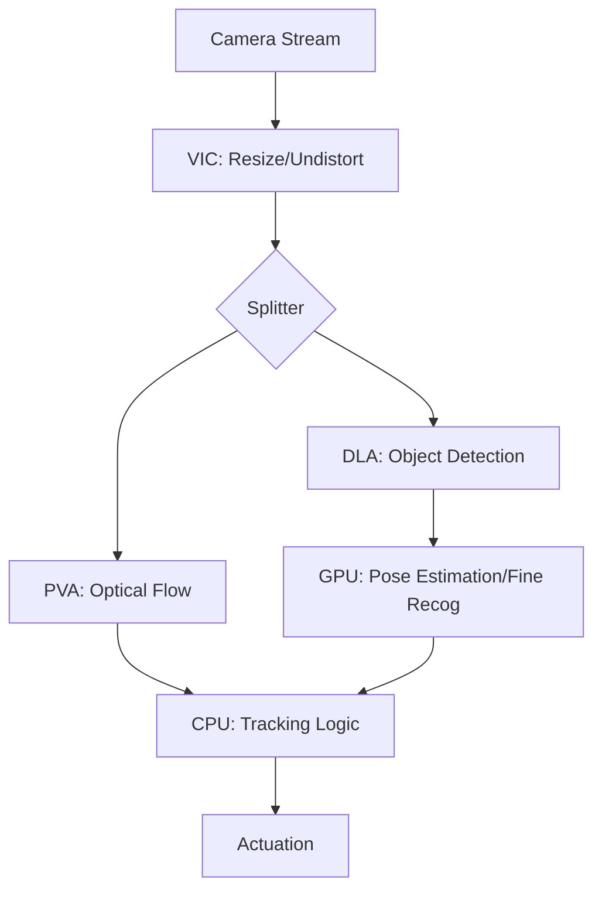

# Day 98: Week 14 Review & Capstone Project
## Phase 5: AI/CV/LIDAR End-to-End Robotics | Week 14: Edge AI Deployment

---

> **📝 Content Creator Instructions:**
> Build it. optimize it. Deploy it.
> - **Goal:** Create a "Super-Node" that utilizes every part of the Jetson SoC (CPU, GPU, DLA, PVA, VIC) simultaneously effectively.
> - **Code:** A `system_orchestrator` that launches the heterogeneous pipeline and logs power metrics.

---

## 🎯 Learning Objectives
*By the end of this day, the learner will be able to:*
1.  **Architecture** a robotic perception system that balances load across heterogeneous cores.
2.  **Profile** a deployment using `Nsight Systems` (visualize Timeline of GPU/CPU/DLA).
3.  **Evaluate** the trade-off: Is it better to run YOLO at 100FPS (consuming 50W) or 30FPS (consuming 15W)?

---

## 📚 Week 14 Review: The Edge AI Stack

| Day | Topic | Key Lesson | Tool |
|-----|-------|------------|------|
| **92** | **Jetson Platform** | Heterogeneous SoC & Power Modes | `jtop`, `tegrastats` |
| **93** | **TensorRT** | FP16/INT8 Conversion & Layer Fusion | `trtexec`, `torch2trt` |
| **94** | **ONNX Runtime** | Portable Deployment (Cross-Hardware) | `onnxruntime` |
| **95** | **DLA** | Offloading CNNs to ASIC | `tensorrt --useDLACore` |
| **96** | **PVA & VPI** | Hardware Vision (Flow/Tracking) | `vpi` |
| **97** | **Thor & FP8** | Future-proofing for Transformers | `FP8 Simulation` |

### The "Heterogeneous" Diagram


---

## 🚀 Weekly Capstone: "The Smart Sentinel"

**Scenario:** A battery-powered security robot patrolling a facility.
**Constraints:**
-   Battery Life is critical (Target 15W Mode).
-   Must detect intruders (YOLO).
-   Must detect motion anomalies (Optical Flow).
-   Must recognize faces (FaceNet).

### 🛠️ Project Structure
```text
week14_capstone/
├── launch/
│   └── sentinel.launch.py
├── src/
│   ├── pipeline_manager.cpp
│   └── power_monitor.py
└── models/
    ├── yolo_dla.engine
    └── facenet_gpu.engine
```

### 👨‍💻 Pipeline Configuration

**Strategy:**
1.  **Motion Trigger (PVA):** Run Optical Flow at 30Hz using VPI/PVA. Low power.
2.  **Detection (DLA):** If Motion > Threshold, trigger YOLO on DLA (Core 0).
3.  **Identification (GPU):** If Person Detected, crop face and run FaceNet on GPU.
4.  **Result:** GPU sleeps 90% of the time. DLA sleeps 50% of the time. PVA runs constantly but sips power.

### 👨‍💻 Power Monitor Script

Log the data to prove efficacy.

```python
# src/power_monitor.py
import csv
import time
from jtop import jtop

def log_power():
    with jtop() as jetson:
        with open('power_log.csv', 'w') as f:
            writer = csv.writer(f)
            writer.writerow(['Time', 'CPU_mW', 'GPU_mW', 'CV_mW', 'Total_mW']) # CV includes DLA/PVA
            
            while jetson.ok():
                stats = jetson.stats
                # Note: Specific rails depend on Jetson model (Orin vs Xavier)
                # This is pseudocode for the concept
                total = stats['Power TOT']
                gpu = stats['Power GPU']
                cpu = stats['Power CPU']
                cv = stats['Power CV'] # CV rail often powers DLA/PVA
                
                writer.writerow([time.time(), cpu, gpu, cv, total])
                time.sleep(1)

if __name__ == "__main__":
    try:
        log_power()
    except Exception as e:
        print(e)
```

---

## 📝 Self-Assessment Quiz

1.  **Optimization:**
    *   Why use DLA for YOLO instead of GPU?
    *   **A:** Efficiency. It frees the GPU for tasks the DLA *cannot* do (like FaceNet or Transformers).
2.  **Hardware:**
    *   What happens if I try to use PVA on a desktop GPU?
    *   **A:** It fails. PVA is a specific hardware block in the Tegra SoC. It doesn't exist on discrete GeForce cards.
3.  **Deployment:**
    *   Why compile TensorRT Engine on the Jetson?
    *   **A:** Engines are hardware specific. An engine built on `x86_64` won't run on `aarch64`, and an engine built for `RTX 3070` won't run on `Orin`.

---

## ⏭️ Look Ahead: Week 15
From Optimization to **Production**.
**Week 15: Production-Grade ROS 2.**
*   We have fast nodes. Now we need *reliable* nodes.
*   Lifecycle Management (Managed Nodes).
*   Quality of Service (QoS) tuning.
*   Docker & CI/CD for Robotics.

---

**Week 14 Complete**
