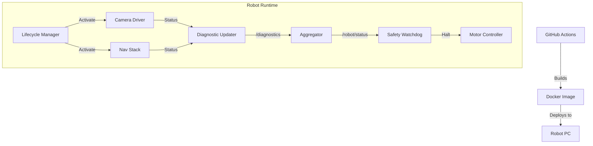

# Day 105: Week 15 Review & Capstone Project
## Phase 5: AI/CV/LIDAR End-to-End Robotics | Week 15: Production-Grade ROS 2

---

> **📝 Content Creator Instructions:**
> Stop hacking. Start engineering.
> - **Goal:** Assemble all Week 15 concepts into a "Robust Bringup" package.
> - **Code:** A repository structure that includes Docker, CI Workflows, Lifecycle Management, and Diagnostics, ready for fleet deployment.

---

## 🎯 Learning Objectives
*By the end of this day, the learner will be able to:*
1.  **Audit** a ROS 2 system for Production Readiness (Checklist methodology).
2.  **Integrate** Lifecycle Management with Diagnostics (Reporting state changes).
3.  **Contain** the entire application in a reproducible Docker image.
4.  **Deploy** with confidence using GitHub Actions CI.

---

## 📚 Week 15 Review: The Production Stack

| Day | Topic | Key Lesson | Tool |
|-----|-------|------------|------|
| **99** | **Lifecycle** | Deterministic Startup/Shutdown | `ros2 lifecycle` |
| **100** | **QoS** | Tuning DDS for WiFi/Lossy Networks | `Transient Local` |
| **101** | **Docker** | Reproducible Builds anywhere | `Dockerfile`, `rocker` |
| **102** | **CI/CD** | Automated Integration Testing | `launch_testing` |
| **103** | **Remote** | Fleet Management over WAN | `Husarnet`, `Zenoh` |
| **104** | **Diagnostics** | Health Monitoring & Aggregation | `diagnostic_updater` |

### The "Robustness" Diagram


---

## 🚀 Weekly Capstone: "The Unbreakable Robot"

**Scenario:** An Autonomous Delivery Robot operating 24/7.
**Requirements:**
1.  **Restart on Crash:** If the Lidar node dies, it must automatically respawn and re-configure.
2.  **Network Resilience:** If WiFi drops, Navigation must PAUSE (Safety), but resume when connected.
3.  **Unit Tests:** Every PR must pass `colcon test`.

### 🛠️ Project Structure
```text
week15_capstone/
├── .github/
│   └── workflows/ros2.yml
├── docker/
│   ├── Dockerfile
│   └── docker-compose.yml
├── launch/
│   └── system_bringup.launch.py
├── src/
│   └── system_manager.cpp
├── test/
│   └── test_system_stability.py
└── config/
    └── qos_overrides.yaml
```

### 👨‍💻 System Manager (The Brain)

Orchestrates the Lifecycle nodes.

```cpp
// Pseudocode for system_manager.cpp
void run() {
    // 1. Wait for nodes to be available
    wait_for_service("/lidar/get_state");
    wait_for_service("/camera/get_state");
    
    // 2. Configure
    call_service("/lidar/change_state", "configure");
    if(result == SUCCESS) 
        call_service("/lidar/change_state", "activate");
    else 
        report_error("Lidar failed init");
        
    // 3. Monitor Liveliness
    // If Lidar goes silent (detected via Diagnostics), deactivate Navigation.
}
```

### 👨‍💻 CI Workflow

```yaml
# .github/workflows/ros2.yml
name: Production Build
on: [push]
jobs:
  test:
    runs-on: ubuntu-latest
    container: osrf/ros:humble-desktop
    steps:
      - uses: actions/checkout@v2
      - name: Build
        run: colcon build --symlink-install
      - name: Test
        run: colcon test
      - name: Verify Linter
        run: ament_cpplint src/
```

### 👨‍💻 Docker Compose

```yaml
version: '3'
services:
  robot:
    build: .
    restart: always # Docker handles the respawn!
    network_mode: host
    volumes:
      - /dev:/dev
      - ./logs:/home/ros/.ros/log
```

---

## 📝 Self-Assessment Quiz

1.  **QoS:**
    *   Why must the "Map Server" uses `Transient Local` durability?
    *   **A:** Because the map is published *once* at startup. If a Navigator node starts 1 minute later (Late Joiner), `Volatile` durability means it missed the map message forever. `Transient Local` saves it for latecomers.
2.  **Docker:**
    *   What is the difference between `CMD` and `ENTRYPOINT`?
    *   **A:** `ENTRYPOINT` is the executable (e.g., the script sourcing ROS). `CMD` are the arguments passed to it (e.g., `ros2 launch ...`).
3.  **Safety:**
    *   What component should trigger the E-Stop?
    *   **A:** The Watchdog or Safety Controller, which consumes Aggregated Diagnostics. It should have highest priority.

---

## ⏭️ Look Ahead: Week 16
From Standard Sensors to **Advanced Sensing**.
**Week 16: Advanced Sensors.**
*   We mastered 2D Lidar and RGB Cameras.
*   Now: 3D Velodyne/Ouster.
*   Radar (FMCW) for velocity / fog interaction.
*   Event Cameras (Neuromorphic) for high-speed tracking.
*   Thermal Cameras (Night Vision).

---

**Week 15 Complete**
