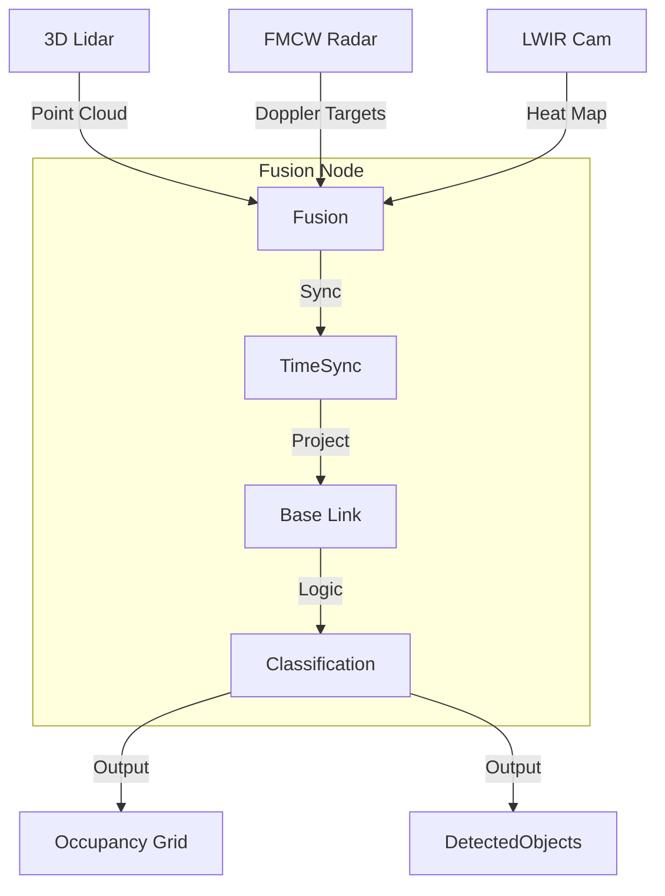

# Day 112: Week 16 Review & Capstone Project
## Phase 5: AI/CV/LIDAR End-to-End Robotics | Week 16: Advanced Sensors

---

> **📝 Content Creator Instructions:**
> The Robot sees everything.
> - **Goal:** Integrate at least 3 advanced sensors (Lidar, Radar, Thermal) into a unified perception stack.
> - **Code:** A `sensor_fusion_node` that takes `PointCloud2` (Lidar), `PointCloud2` (Radar), and `Image` (Thermal), registers them to a common frame, and outputs a `FusedPerception` message.

---

## 🎯 Learning Objectives
*By the end of this day, the learner will be able to:*
1.  **Select** the right sensor for the environment (Fog? Use Radar. Dark? Use Thermal/Lidar).
2.  **Calibrate** extrinsic transforms between heterogeneous sensors (Camera to Lidar to Radar).
3.  **Fuse** asynchronous data streams using `message_filters::TimeSynchronizer`.
4.  **Visualize** multi-modal data in Rviz.

---

## 📚 Week 16 Review: The Sensor Suite

| Day | Topic | Key Lesson | Tool |
|-----|-------|------------|------|
| **106** | **3D Lidar** | Precise Geometry, Intensity | `velodyne_driver` |
| **107** | **Radar** | Velocity, All-Weather reliability | `radar_msgs` |
| **108** | **Event Cam** | Microsecond Latency, High Dynamic Range | `dvs_msgs` |
| **109** | **Thermal** | Heat detection, Night Vision | `flir_camera_driver` |
| **110** | **Audio** | Direction of Arrival, Interaction | `audio_common` |
| **111** | **UWB** | Indoor GPS, Localization | `trilateration` |

### The "All-Seeing" Diagram


---

## 🚀 Weekly Capstone: "Search & Rescue Drone"

**Scenario:** A drone inspecting a burning building smoke-filled room.
**Challenges:**
1.  **Smoke:** Lidar returns scatter. Camera sees gray. Radar sees walls. Thermal sees fire source.
2.  **Audio:** Victims might be screaming/whistling.
3.  **Localization:** GPS denied. UWB Anchors deployed outside.

### 🛠️ Project Structure
```text
week16_capstone/
├── launch/
│   └── sensor_suite.launch.py
├── src/
│   └── multi_modal_fusion.cpp
└── rviz/
    └── all_sensors.rviz
```

### 👨‍💻 Fusion Logic (`src/multi_modal_fusion.cpp`)

We will combine Lidar Geometry with Thermal Heat.

```cpp
// Pseudocode
void callback(lidar_msg, thermal_msg, camera_info) {
    // 1. Project Lidar Points to Thermal Image Plane
    for (point : lidar_msg) {
        uv = project(point, T_lidar_thermal);
        
        // 2. Check Thermal Value at (u,v)
        temp_val = thermal_msg.at(uv);
        
        // 3. Color Lidar Point based on Temp
        if (temp_val > THRESHOLD_HOT) {
            point.r = 255; // Red
            point.g = 0;
            // High Priority Obstacle (Fire/Victim)
        } else {
            point.r = 0;
            point.g = 0;
            point.b = 255; // Blue (Wall)
        }
    }
    publish(colored_cloud);
}
```

### 👨‍💻 The Decision Matrix

| Condition | Lidar | Radar | Thermal | Action |
|-----------|-------|-------|---------|--------|
| **Clear Day** | Good | Good | Good | Fast Flight |
| **Fog/Smoke** | **Fail** | Good | **Fail** (Scatter) | Slow Flight (Radar Nav) |
| **Night** | Good | Good | **Best** | Normal Flight |
| **Mirror/Glass** | **Fail** | Good | **Fail** | Use Radar/Sono |

---

## 📝 Self-Assessment Quiz

1.  **Physics:**
    *   Which sensor works best in a blizzard?
    *   **A:** Radar. RF waves (mmWave) penetrate snow/rain significantly better than light (Lidar/Camera).
2.  **Timing:**
    *   What is the difference between `TimeSynchronizer` and `ApproximateTimeSynchronizer`?
    *   **A:** `TimeSynchronizer` requires exact matching timestamps (common in simulation). `Approximate` allows a tolerance (slop), essential for real hardware where clocks drift or trigger slightly apart.
3.  **Structure:**
    *   Why calibrate Extrinsics?
    *   **A:** If you fuse Lidar and Camera without knowing the 6-DOF transform between them, you will project the "Car" pixels onto the "Road" points.

---

## ⏭️ Look Ahead: Week 17
From Single Robot to **Multi-Robot Systems**.
**Week 17: Swarm Robotics.**
*   Communication architectures (Centralized vs Decentralized).
*   Consensus (Leader Election).
*   Formation Control.
*   Traffic Management (OpenRMF).

---

**Week 16 Complete**
