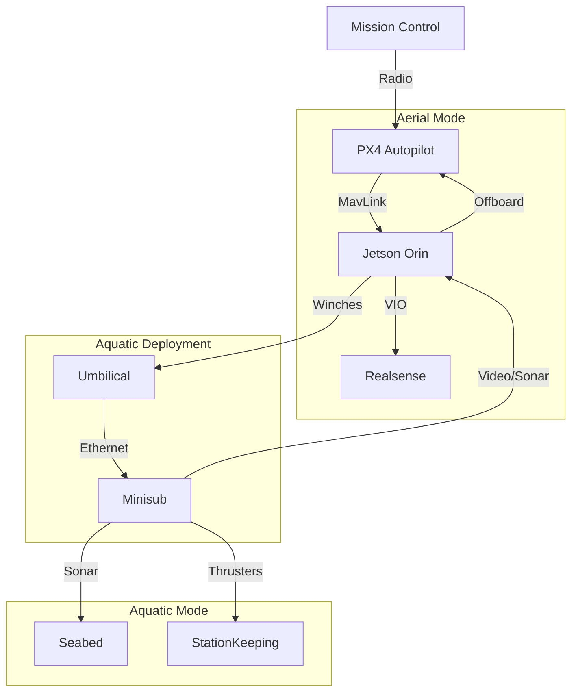

# Day 126: Week 18 Review & Capstone Project
## Phase 5: AI/CV/LIDAR End-to-End Robotics | Week 18: Aerial & Underwater Robotics

---

> **📝 Content Creator Instructions:**
> Air and Water. Two fluids, two physics models, one mission.
> - **Goal:** conceptualize a "Multi-Domain" System (Aerial-Aquatic).
> - **Code:** A Mission Manager State Machine that transitions between "Aerial Mode" (PX4 Offboard) and "Aquatic Mode" (ROV Control).

---

## 🎯 Learning Objectives
*By the end of this day, the learner will be able to:*
1.  **Synthesize** UAV control (PX4) and AUV control (Fossen) into a unified architecture.
2.  **Manage** the transition interface (Landing on water / Deploying payload).
3.  **Address** the comms blackout (Radio doesn't work underwater).
4.  **Visualize** a multi-domain mission in Rviz using different namespaces.

---

## 📚 Week 18 Review: Fluids & Six Degrees of Freedom

| Day | Topic | Key Lesson | Tool |
|-----|-------|------------|------|
| **120** | **UAV Dynamics** | Underactuated control, Cascaded PID | `QuadrotorSim` |
| **121** | **PX4/ArduPilot** | Offboard Control, MAVLink | `MicroXRCE-DDS` |
| **122** | **VIO** | Scale estimation using IMU, Loop Closure | `VINS-Fusion` |
| **123** | **AUV Dynamics** | Buoyancy, Added Mass, Quadratic Drag | `Fossen Eq` |
| **124** | **Sonar** | Acoustic Imaging, Geometric Distortion | `marine_msgs` |
| **125** | **Underwater SLAM** | DVL + LBL Sensor Fusion | `EKF` |

### The "Pelican" Diagram


---

## 🚀 Weekly Capstone: "The Pelican Drone"

**Scenario:** Inspect an offshore wind turbine foundation.
**Sequence:**
1.  **Fly:** GPS Waypoint to Turbine ($50m$ altitude).
2.  **Hover:** Maintain position.
3.  **Deploy:** Lower ROV on 20m tether into water.
4.  **Inspect:** ROV scans pillar with Sonar.
5.  **Recover:** Retract tether.
6.  **Return:** RTL.

### 🛠️ Project Structure
```text
week18_capstone/
├── src/
│   ├── mission_manager.py
│   ├── aerial_node.py
│   └── aquatic_node.py
└── launch/
    ├── multi_domain.launch.py
```

### 👨‍💻 Mission Manager (`src/mission_manager.py`)

State Machine coordinating the domain switch.

```python
import rclpy
from rclpy.node import Node
from std_msgs.msg import String, Float32

class MissionManager(Node):
    def __init__(self):
        super().__init__('mission_manager')
        
        # State
        self.state = "FLYING_TO_TARGET"
        
        # Subs/Pubs
        self.pub_drone_cmd = self.create_publisher(String, '/drone/command', 10)
        self.pub_rov_cmd = self.create_publisher(String, '/rov/command', 10)
        self.pub_winch = self.create_publisher(Float32, '/winch/length', 10)
        
        self.create_timer(1.0, self.loop)
        self.timer_state = 0

    def loop(self):
        if self.state == "FLYING_TO_TARGET":
            self.get_logger().info("Status: Flying to target...")
            self.pub_drone_cmd.publish(String(data="GOTO_GPS_WPT"))
            # Sim check arrival
            self.timer_state += 1
            if self.timer_state > 5:
                self.state = "HOVER_STABILIZE"
                self.timer_state = 0

        elif self.state == "HOVER_STABILIZE":
            self.get_logger().info("Status: Stabilizing for deployment...")
            self.pub_drone_cmd.publish(String(data="HOLD_POS"))
            self.timer_state += 1
            if self.timer_state > 3:
                self.state = "DEPLOY_ROV"
                self.timer_state = 0
                
        elif self.state == "DEPLOY_ROV":
            self.get_logger().info("Status: Lowering ROV...")
            msg = Float32()
            msg.data = 20.0 # 20 meters
            self.pub_winch.publish(msg)
            # Sim wait for winch msg
            self.timer_state += 1
            if self.timer_state > 5:
                self.state = "UNDERWATER_OPS"
                self.timer_state = 0

        elif self.state == "UNDERWATER_OPS":
            self.get_logger().info("Status: Scanning...")
            self.pub_rov_cmd.publish(String(data="SCAN_PILLAR"))
            self.timer_state += 1
            if self.timer_state > 10:
                self.state = "RECOVER_ROV"
                self.timer_state = 0
                
        elif self.state == "RECOVER_ROV":
            self.get_logger().info("Status: Hoisting...")
            msg = Float32()
            msg.data = 0.0 # Retract
            self.pub_winch.publish(msg)
            self.timer_state += 1
            if self.timer_state > 5:
                self.state = "RETURN_HOME"

        elif self.state == "RETURN_HOME":
            self.get_logger().info("Status: RTL...")
            self.pub_drone_cmd.publish(String(data="RTL"))

def main():
    rclpy.init()
    rclpy.spin(MissionManager())
```

---

## 📝 Self-Assessment Quiz

1.  **Physics:**
    *   What happens to the drone's CG when the ROV is lowered?
    *   **A:** The CG drops significantly (Pendulum effect). The PID controller must adapt to the new Swing Dynamics or instability occurs.
2.  **Comms:**
    *   Why use a tether?
    *   **A:** WiFi (2.4GHz) penetrates water only ~5cm. VLF (Very Low Freq) radio works but has near-zero bandwidth. Optical works only if clear water. Acoustic is slow. Tether provides Power + Gigabit Ethernet.
3.  **Localization:**
    *   Can the ROV use the Drone's GPS?
    *   **A:** Yes, via USBL from the Drone surface, or simply knowing the tether length + angle relative to the trusted drone position (Short baseline approximation).

---

## ⏭️ Look Ahead: Week 19
From Rigid Bodies to **Soft Bodies**.
**Week 19: Soft Robotics & Bio-Inspired Control.**
*   Robots made of Silicone/Rubber.
*   Continuum Manipulators (Elephant Trunks).
*   Learning-based control (RL) for unmodelable dynamics.
*   Genetic Algorithms for gait evolution.

---

**Week 18 Complete**
