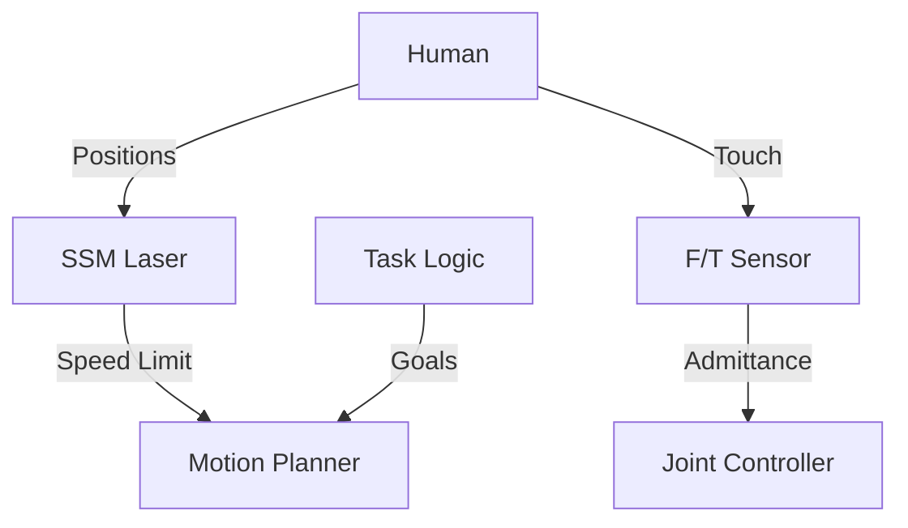

# Day 147: Week 21 Review & Capstone Project
## Phase 5: AI/CV/LIDAR End-to-End Robotics | Week 21: Collaborative Robotics (Cobots)

---

> **📝 Content Creator Instructions:**
> Robots are not tools. They are teammates.
> - **Goal:** Integrate Safety, Force Control, and Interaction into a unified Cobot Assembly application.
> - **Code:** A unified State Machine `assembly_bot.py` that alternates between Admittance Control (Insert) and SSM (Move), reacting to Simulated Human events.

---

## 🎯 Learning Objectives
*By the end of this day, the learner will be able to:*
1.  **Synthesize** the 4 Collaborative Modes into a real process flow.
2.  **Architect** a Safety-Aware State Machine.
3.  **Demonstrate** Admittance for assembly and Safety Zones for transport.

---

## 📚 Week 21 Review: The Human Factor

| Day | Topic | Key Lesson | Tool |
|-----|-------|------------|------|
| **141** | **Safety Standards** | $ISO 15066$ defines pain limits. $E < 0.5mv^2$. | `ISO Specs` |
| **142** | **Force Sensing** | Admittance: Input Force $\to$ Output Motion (Compliant). | `F/T Sensor` |
| **143** | **Handover** | Phases: Approach, Signal, Force-Trigger, Release. | `FSM` |
| **144** | **Safety Zones** | Warning (Slow) vs Stop (Halt). $S = K \times T + C$. | `Lidar Safety` |
| **145** | **LfD** | Teaching paths by moving the arm. DMP for replay. | `Kinesthetics` |
| **146** | **Ethics** | Bias in vision, Displacement of jobs, Liability. | `Auditing` |

### The Cobot Stack


---

## 🚀 Weekly Capstone: "The Co-Assembly"

**Scenario:** Building a Gearbox.
1.  **Transport:** Robot fetches Gear (High Speed). Checks Safety Zones (SSM).
2.  **Insert:** Robot places Gear on Shaft. Uses Admittance (Feel the click).
3.  **Handover:** Robot hands the assembly to Human for QA.

### 🛠️ Project Structure
```text
week21_capstone/
├── src/
│   ├── cobot_sim.py
└── output/
    ├── application_log.txt
```

### 👨‍💻 The Unified Sim (`src/cobot_sim.py`)

A pseudo-code simulation of the entire loop.

```python
import time
import numpy as np

class MockHardware:
    def __init__(self):
        self.human_dist = 5.0 # m
        self.force_z = 0.0 # N
        self.gripper = "OPEN"
        self.pos = 0.0
        self.speed_limit_ssm = 1.0 # 100%
        
    def read_lidar(self):
        # Scan zones
        if self.human_dist < 1.0: return "RED"
        if self.human_dist < 2.0: return "YELLOW"
        return "GREEN"
        
    def read_ft(self):
        return self.force_z
        
    def set_speed(self, val):
        self.speed_limit_ssm = val

class CobotApp:
    def __init__(self):
        self.hw = MockHardware()
        self.state = "FETCH"
        
    def safety_loop(self):
        # 1. SSM Safety Monitor
        zone = self.hw.read_lidar()
        if zone == "RED":
            self.hw.set_speed(0.0)
            print("SAFETY: STOP")
        elif zone == "YELLOW":
            self.hw.set_speed(0.3)
            print("SAFETY: SLOW")
        else:
            self.hw.set_speed(1.0)
            
    def run(self):
        print("Starting Co-Assembly Task...")
        
        for t in range(30):
            self.safety_loop()
            speed = self.hw.speed_limit_ssm
            
            # --- FETCH PHASE ---
            if self.state == "FETCH":
                if speed > 0:
                    self.hw.pos += 0.5 * speed
                    print(f"[{t}] Fetching... Pos={self.hw.pos:.1f}")
                    if self.hw.pos >= 5.0:
                        self.state = "INSERT"
                        print("FETCH DONE. Starting Insertion.")
                        self.hw.force_z = 0.0 # Ready for contact
                        
            # --- INSERT PHASE (Admittance) ---
            elif self.state == "INSERT":
                # Simulated Insertion: Move down until Force > 10N
                # Or wait for wiggle
                print(f"[{t}] Inserting (Admittance Mode)...")
                # Simulate contact
                if t > 12: self.hw.force_z += 2.0 # Force building up
                
                if self.hw.force_z > 10.0:
                    print("INSERT DONE (Force Limit Reached).")
                    self.state = "HANDOVER"
                    self.hw.force_z = -5.0 # Holding weight
                    
            # --- HANDOVER PHASE ---
            elif self.state == "HANDOVER":
                print(f"[{t}] Offering to Human...")
                # Simulate Human Pull at t=25
                if t == 25:
                    print("> Human pulls object.")
                    self.hw.force_z += 5.0 # Load lightens
                    
                # Logic: If Load lightens significantly (from -5 to 0)
                if self.hw.force_z > -1.0:
                    self.hw.gripper = "OPEN"
                    print("RELEASED.")
                    self.state = "DONE"
            
            elif self.state == "DONE":
                print("Task Complete.")
                break
                
            # --- SIMULATION EVENTS ---
            # Event: Human walks by at t=5 (Yellow)
            if t == 5: self.hw.human_dist = 1.5
            # Event: Human leaves at t=8
            if t == 8: self.hw.human_dist = 5.0
            
            time.sleep(0.1)

if __name__ == "__main__":
    app = CobotApp()
    app.run()
```

---

## 📝 Self-Assessment Quiz

1.  **Architecture:**
    *   Does Safety loop run inside the App loop?
    *   **A:** In Sim, yes. In Reality, Safety runs on a separate Safety PLC or checking thread with high priority.
2.  **Force:**
    *   Why Admittance for Insert?
    *   **A:** Position control would jam if the hole is misaligned. Admittance allows the peg to slide/comply with the hole walls.
3.  **Interaction:**
    *   What is "Fluency"?
    *   **A:** The lack of idle time. The robot hands over exactly when the human reaches. No stopping, no waiting.

---

## ⏭️ Look Ahead: Week 22
Cars are just big robots.
**Week 22: Autonomous Driving Stack.**
*   Lidar Detection (PointPillars).
*   Tracking (DeepSORT).
*   Prediction (Kalman).
*   Planning (Frenet).

---

**Week 21 Complete**
