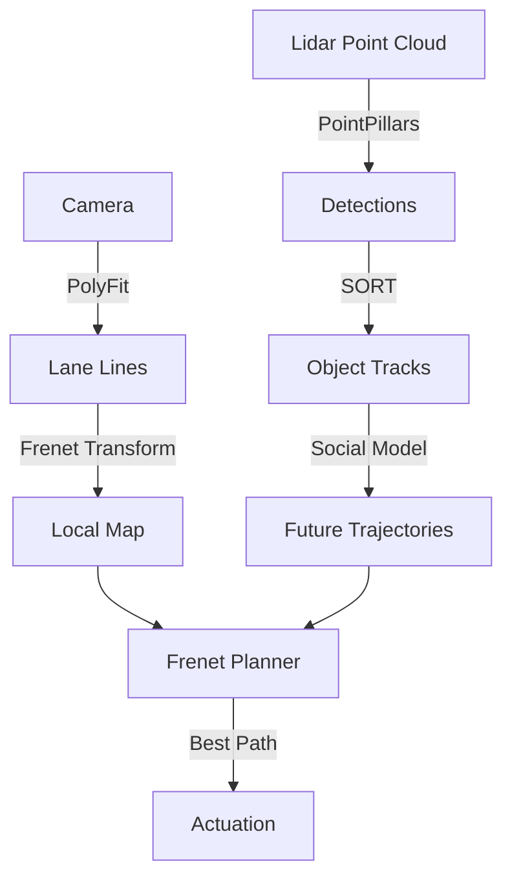

# Day 154: Week 22 Review & Capstone Project
## Phase 5: AI/CV/LIDAR End-to-End Robotics | Week 22: Autonomous Driving Stack

---

> **📝 Content Creator Instructions:**
> Build the brain of a Tesla (simplified).
> - **Goal:** Integrate Perception (Lane/Object), Tracking, Prediction, and Planning into a Micro-Autonomy Stack.
> - **Code:** A unified simulation `highway_autopilot.py` where the Ego Car percepts the environment, predicts the other car's cut-in, and plans an evasive maneuver (Slow down or Change Lane).

---

## 🎯 Learning Objectives
*By the end of this day, the learner will be able to:*
1.  **Integrate** modular AD components (Perception $\to$ Tracking $\to$ Planning).
2.  **Debug** system-level failures (Pipeline Latency, Coordinate mismatches).
3.  **Demonstrate** an autonomous overtaking maneuver.

---

## 📚 Week 22 Review: The Full Stack

| Day | Topic | Key Lesson | Tool |
|-----|-------|------------|------|
| **148** | **Sensors** | Camera for color/lanes, Lidar for depth. Calibration is key. | `TF Tree` |
| **149** | **Lidar Perception** | PointPillars converts 3D points to 2D BEV for fast detection. | `PointNet` |
| **150** | **Lanes** | Polyfit ($ax^3+...$) models road geometry. Sliding Window search. | `OpenCV` |
| **151** | **Tracking** | SORT associates detections using Kalman & Hungarian IoU. | `Kalman` |
| **152** | **Prediction** | Multimodal prediction accounts for uncertainty (Change lane vs Stay). | `Probabilistic` |
| **153** | **Planning** | Frenet Frame + Quintic Polynomials = Smooth, jerk-free paths. | `Optimization` |

### The Autonomy Pipeline


---

## 🚀 Weekly Capstone: "The Highway Autopilot"

**Scenario:** 2-Lane Highway. Ego Car in Lane 1 (Right). Slow Truck in Lane 1 ahead. Lane 2 (Left) is clear.
**Behavior:**
1.  **Sense:** Detect Truck and Lanes.
2.  **Plan:** Cost of keeping lane increases (Collision/Speed drop). Cost of Lane Change is low.
3.  **Act:** Generate Polynomial to move from $d=0$ to $d=4$.

### 🛠️ Project Structure
```text
week22_capstone/
├── src/
│   ├── highway_autopilot.py
└── output/
    ├── autopilot_log.txt
```

### 👨‍💻 Unified Simulation (`src/highway_autopilot.py`)

```python
import numpy as np
import matplotlib.pyplot as plt
import time

# --- MOCKS for Modules ---
class PerceptionModule:
    def detect_objects(self, ego_x, ego_y):
        # Simulate a Truck at X=50, Y=0 (Same lane)
        # Returns list of [x, y, vx, vy]
        return np.array([[50.0, 0.0, 15.0, 0.0]]) # Truck moving slower (15m/s)

class PredictionModule:
    def predict(self, objects, horizon=5.0):
        # Constant Velocity Prediction for Truck
        preds = []
        for obj in objects:
            # Truck stays in lane
            preds.append({'x': obj[0] + obj[2]*horizon, 'y': obj[1]})
        return preds

class PlanningModule:
    def __init__(self):
        self.state = "KEEP_LANE"
        self.target_lane = 0.0
        
    def plan(self, ego_state, predictions):
        # ego: [x, y, v]
        
        # Simple State Machine Logic instead of full Cost Function for brevity
        # 1. Check front clearance
        front_clearance = 1000.0
        for pred in predictions:
            if abs(pred['y'] - ego_state[1]) < 2.0: # Same lane
                dist = pred['x'] - ego_state[0]
                if dist > 0: front_clearance = min(front_clearance, dist)
                
        print(f"Planner: Front Clearance = {front_clearance:.1f}m")
        
        # 2. Decision
        if self.state == "KEEP_LANE":
            if front_clearance < 20.0:
                print("Planner: Obstacle ahead! Initiating Lane Change Left.")
                self.state = "LANE_CHANGE"
                self.target_lane = 4.0 # Left Lane
                
        elif self.state == "LANE_CHANGE":
            if abs(ego_state[1] - self.target_lane) < 0.2:
                print("Planner: Lane Change Complete.")
                self.state = "KEEP_LANE"
                
        return self.target_lane

class Controller:
    def update(self, current_y, target_y):
        # Simple P-Controller for Lateral
        kp = 0.5
        error = target_y - current_y
        vy_cmd = kp * error
        return vy_cmd

# --- MAIN LOOP ---
def main():
    ego_x = 0.0
    ego_y = 0.0
    ego_v = 25.0 # 25 m/s (Fast)
    
    perception = PerceptionModule()
    predictor = PredictionModule()
    planner = PlanningModule()
    control = Controller()
    
    history_x = []
    history_y = []
    
    print("Engaging Autopilot...")
    
    for t in np.arange(0, 10.0, 0.1): # 10 seconds
        ego_state = [ego_x, ego_y, ego_v]
        
        # 1. Perceive
        objects = perception.detect_objects(ego_x, ego_y)
        
        # 2. Predict (Where will truck be?)
        preds = predictor.predict(objects)
        
        # 3. Plan (Lane decision)
        target_d = planner.plan(ego_state, preds)
        
        # 4. Control (Execute)
        vy_cmd = control.update(ego_y, target_d)
        
        # 5. Physics Update
        ego_x += ego_v * 0.1
        ego_y += vy_cmd * 0.1
        
        # Update Sim World (Truck moves too)
        # (Implicit in perception mock relative to ego? No, we used absolute coords for simplicity)
        objects[0][0] += objects[0][2] * 0.1 # Truck moves
        
        history_x.append(ego_x)
        history_y.append(ego_y)
        
        # Log
        print(f"Time {t:.1f}: Pos=({ego_x:.1f}, {ego_y:.1f}) | Target D={target_d}")
        
    # Plot
    plt.figure()
    plt.plot(history_x, history_y, 'b-', label='Ego Path')
    
    # Plot Truck Path (Start 50, Speed 15)
    truck_start_x = 50
    truck_end_x = 50 + 15 * 10
    plt.plot([truck_start_x, truck_end_x], [0, 0], 'r--', label='Truck Path')
    
    plt.axhline(0, color='gray', linestyle=':', label='Lane 1')
    plt.axhline(4, color='gray', linestyle=':', label='Lane 2')
    
    plt.title("Highway Overtaking Maneuver")
    plt.xlabel("Longitudinal (m)")
    plt.ylabel("Lateral (m)")
    plt.legend()
    plt.ylim(-2, 6)
    plt.grid()
    plt.savefig("output/autopilot_trace.png")

if __name__ == "__main__":
    main()
```

---

## 📝 Self-Assessment Quiz

1.  **Architecture:**
    *   Why separate Prediction and Planning?
    *   **A:** Modularity. Prediction guesses what *others* will do. Planning decides what *you* will do.
2.  **Safety:**
    *   What if the Lane Change is blocked by a fast car in Left Lane?
    *   **A:** The Cost Function (not shown in simple code) for "Lane Change" would be infinite (Collision Risk). The planner would choose "Keep Lane" and "Target Seed = Truck Speed" (ACC).
3.  **Lidar vs Camera:**
    *   Which is better for Lane Keeping?
    *   **A:** Camera. Lidar doesn't see paint well (intensity varies). Camera sees white lines clearly.

---

## ⏭️ Look Ahead: Week 23
The Grid connects us.
**Week 23: V2X & Swarm Intelligence.**
*   Vehicle-to-Vehicle communication.
*   Cooperative Perception.
*   Platooning.

---

**Week 22 Complete**
