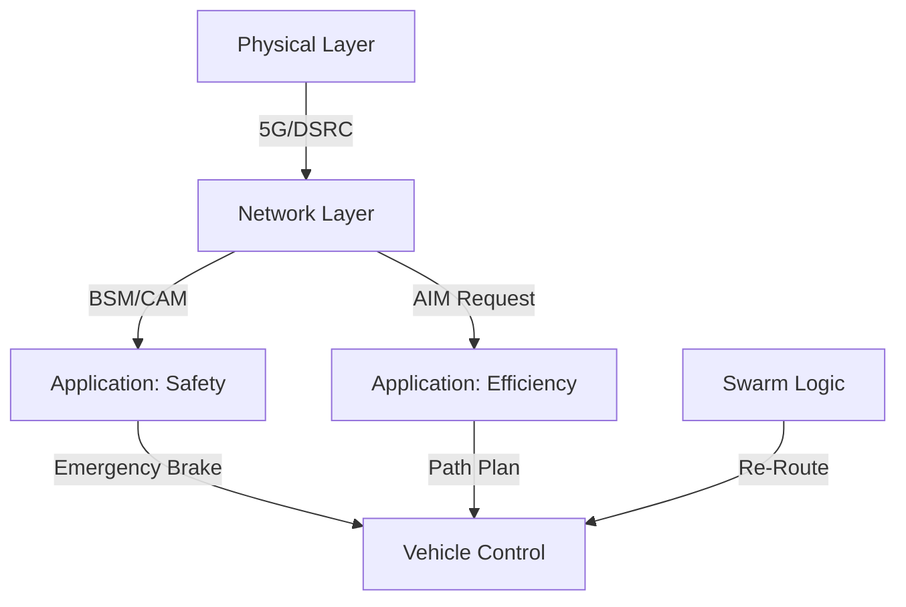

# Day 161: Week 23 Review & Capstone Project
## Phase 5: AI/CV/LIDAR End-to-End Robotics | Week 23: V2X & Swarm Intelligence

---

> **📝 Content Creator Instructions:**
> The Network is the Computer. The Swarm is the Robot.
> - **Goal:** Integrate V2V Comms, Intersection Management, and Swarm behaviors into a "Smart City" simulation.
> - **Code:** A unified script `smart_city.py` simulating 10 cars navigating a city grid. They use V2V to stop for each other, V2I to reserve intersections, and Swarm logic to re-route if a road is blocked.

---

## 🎯 Learning Objectives
*By the end of this day, the learner will be able to:*
1.  **Synthesize** DSRC messaging with Control logic.
2.  **Deploy** a decentralized traffic system (no lights).
3.  **Handle** dynamic failures (Road blocked) using Swarm Re-routing.

---

## 📚 Week 23 Review: The Connected Robot

| Day | Topic | Key Lesson | Tool |
|-----|-------|------------|------|
| **155** | **V2V Comms** | Broadcast BSMs (Pos, Vel) to prevent mishaps. | `UDP Multicast` |
| **156** | **Coop Perception** | Share Objects, not Points. See around corners. | `CPM` |
| **157** | **Platooning** | CACC uses Feedforward ($a_{lead}$) for String Stability. | `String Stability` |
| **158** | **Intersections** | AIM uses Time-Space tiles. No Red Lights needed. | `Reservation` |
| **159** | **Swarm Search** | Bug Algorithm avoids obstacles without maps. | `Bug 2` |
| **160** | **Formations** | Consensus ($\sum (x_j - x_i)$) maintains shape. | `Laplacian` |

### The Layered Architecture


---

## 🚀 Weekly Capstone: "The Smart City Simulation"

**Scenario:** $3 \times 3$ Grid City.
1.  **Agents:** 10 Communicating Cars.
2.  **Intersections:** AIM Managers.
3.  **Event:** "Road (1,1) to (1,2) Blocked".
4.  **Behavior:** Cars approaching blockage receive V2I warning, switch to Swarm Mode (Map update), and find new route.

### 🛠️ Project Structure
```text
week23_capstone/
├── src/
│   ├── smart_city.py
└── output/
    ├── city_log.txt
```

### 👨‍💻 Smart City Core (`src/smart_city.py`)

```python
import numpy as np
import time
import queue

class V2XMessage:
    def __init__(self, type, sender, payload):
        self.type = type # 'BSM', 'AIM_REQ', 'AIM_RES', 'MAP_UPDATE'
        self.sender = sender
        self.payload = payload

class IntersectionManager:
    def __init__(self, id, pos):
        self.id = id
        self.pos = pos
        self.reservations = [] # List of (car_id, t_start, t_end)
        
    def process_request(self, req):
        # FIFO Logic
        start, end = req['window']
        for r in self.reservations:
            if max(start, r[1]) < min(end, r[2]):
                return False # Conflict
        
        self.reservations.append((req['car'], start, end))
        return True

class SmartCar:
    def __init__(self, id, network):
        self.id = id
        self.network = network
        self.pos = np.random.uniform(0, 100, 2)
        self.vel = np.random.uniform(-5, 5, 2)
        self.route = ["start", "intersection_1", "end"]
        self.state = "DRIVING"
        
    def run_cycle(self, t):
        # 1. Broadcast BSM
        bsm = V2XMessage('BSM', self.id, {'pos': self.pos, 'vel': self.vel})
        self.network.broadcast(bsm)
        
        # 2. Receive Messages
        msgs = self.network.get_messages(self.id)
        for m in msgs:
            if m.type == 'BSM':
                # Collision Check
                dist = np.linalg.norm(self.pos - m.payload['pos'])
                if dist < 5.0 and self.id != m.sender:
                    print(f"[{self.id}] V2V Alert: Car {m.sender} nearby!")
            
            elif m.type == 'AIM_RES':
                if m.payload['status'] == 'APPROVED':
                    self.state = "CROSSING"
                    
            elif m.type == 'MAP_UPDATE':
                # Road blocked
                print(f"[{self.id}] RX Map Update: Blockage. Re-routing...")
                self.vel *= -1 # U-turn (Simple logic)

        # 3. Intersection Logic
        if self.state == "DRIVING":
            # If near intersection (simulated Check)
            if np.random.random() < 0.05: # Randomly approach
                req = {'car': self.id, 'window': (t+1, t+3)}
                msg = V2XMessage('AIM_REQ', self.id, req)
                # Send to Infrastructure (ID 999)
                self.network.send_unicast(msg, 999)
                self.state = "WAITING_AIM"
                print(f"[{self.id}] Requesting Intersection Access...")
                
        # 4. Physics
        if self.state != "WAITING_AIM":
            self.pos += self.vel * 0.1

class CityNetwork:
    def __init__(self):
        self.msg_queue = [] # Global Ether
        self.intersections = [IntersectionManager(999, [50, 50])]
        
    def broadcast(self, msg):
        self.msg_queue.append(msg)
        
    def send_unicast(self, msg, dest_id):
        # Mocking directing routing
        if dest_id == 999: # Infrastructure
            res = self.intersections[0].process_request(msg.payload)
            response_type = 'APPROVED' if res else 'REJECTED'
            reply = V2XMessage('AIM_RES', 999, {'status': response_type})
            self.msg_queue.append(reply) # Simplified: Broadcasts reply
            
    def get_messages(self, receiver_id):
        # In simulaton, everyone hears everything, calculate range here if needed
        msgs =  [m for m in self.msg_queue if m.sender != receiver_id]
        return msgs

    def clear(self):
        self.msg_queue = []

def main():
    net = CityNetwork()
    cars = [SmartCar(i, net) for i in range(5)]
    
    print("Starting Smart City Simulation...")
    
    for t in range(20):
        print(f"--- Time {t} ---")
        
        # Run Cars
        for c in cars:
            c.run_cycle(t)
            
        # Infrastructure Broadcast
        if t == 10:
            print(">>> INFRASTRUCTURE: ROAD COLLAPSE AT (20,20) <<<")
            warn = V2XMessage('MAP_UPDATE', 999, {'blocked_area': [20, 20]})
            net.broadcast(warn)
            
        # Clear Ether
        net.clear()
        time.sleep(0.5)

if __name__ == "__main__":
    main()
```

---

## 📝 Self-Assessment Quiz

1.  **Architecture:**
    *   Why Broadcast BSMs but Unicast AIM Requests?
    *   **A:** BSMs are for everyone (general awareness). AIM Requests are a transaction with a specific authority (the Manager).
2.  **Robustness:**
    *   What happens if the Intersection Manager crashes?
    *   **A:** Cars default to "All-Way Stop" or "Traffic Circle" behavior using V2V negotiation (high latency but safe).
3.  **Scalability:**
    *   How many cars can DSRC support?
    *   **A:** ~1000 cars/km. Beyond that, packet collisions rise. Congestion Control is mandatory.

---

## ⏭️ Look Ahead: Week 24
Security is not an add-on. It's a requirement.
**Week 24: Cybersecurity & Robustness.**
*   GPS Spoofing.
*   Adversarial Machine Learning (Stickers vs Stop Signs).
*   Fuzzing the stack.

---

**Week 23 Complete**
