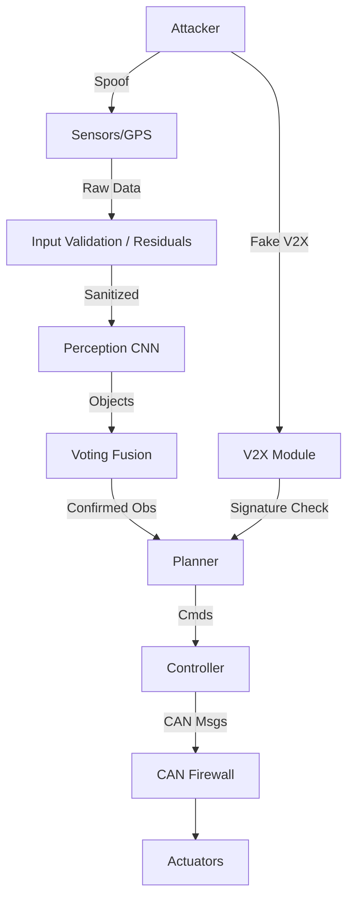

# Day 168: Week 24 Review & Capstone Project
## Phase 5: AI/CV/LIDAR End-to-End Robotics | Week 24: Cybersecurity & Robustness

---

> **📝 Content Creator Instructions:**
> Security is a process, not a product.
> - **Goal:** Integrate all defense layers into a "Fortressed Robot".
> - **Code:** A unified script `secure_av.py` simulating an AV loop. The user (Attacker) can trigger various hack buttons (GPS Spoof, CAN Flood, Lidar Ghost). The AV must survive them all using the techniques learned this week.

---

## 🎯 Learning Objectives
*By the end of this day, the learner will be able to:*
1.  **Orchestrate** multiple defense mechanisms (Filters, Signatures, Voting) in a single loop.
2.  **Mitigate** real-time attacks while maintaining vehicle control (Fail-Operational).
3.  **Log** security incidents for forensic analysis.

---

## 📚 Week 24 Review: The Security Stack

| Day | Topic | Key Lesson | Defense |
|-----|-------|------------|---------|
| **162** | **Threat Modeling** | STRIDE (Spoofing, DoS, etc.). CAN is insecure. | Gateway / Rolling Counter. |
| **163** | **GPS Spoofing** | Signal jumps/drifts. | Fusion Residual ($\chi^2$). |
| **164** | **Adversarial ML** | Stickers fool CNNs. | Adversarial Training / Smoothing. |
| **165** | **Fusion Attacks** | Lidar Injection (Ghost). | Voting Logic (2-of-3). |
| **166** | **Encrypted V2X** | Fake messages. | ECDSA Signatures + PKI. |
| **167** | **Fuzzing** | Random inputs cause crashes. | Input Sanitization / Sanitizers. |

### The Defense-in-Depth Model


---

## 🚀 Weekly Capstone: "The Unhackable Car"

**Scenario:** Highway driving.
1.  **Attacks:**
    *   `'GPS_JUMP'`: Add 100m to GPS.
    *   `'LIDAR_GHOST'`: Inject Obstacle at 10m.
    *   `'CAN_DOS'`: Flood Bus.
    *   `'V2X_FAKE'`: Send "Road Closed" without signature.
2.  **Defense:** The `SecureAV` class monitors health and rejects bad data.

### 🛠️ Project Structure
```text
week24_capstone/
├── src/
│   ├── secure_av.py
└── output/
    ├── security_log.csv
```

### 👨‍💻 Secure AV Loop (`src/secure_av.py`)

```python
import numpy as np
import time
import random

class SecurityMonitor:
    def __init__(self):
        self.log = []
        
    def alert(self, module, msg):
        timestamp = time.time()
        entry = f"[{timestamp:.2f}] [ALERT] [{module}] {msg}"
        self.log.append(entry)
        print(entry)

class GPSModule:
    def __init__(self, monitor):
        self.pos = 0.0
        self.monitor = monitor
        
    def get_data(self, true_pos, attack=None):
        meas = true_pos + np.random.normal(0, 0.5)
        if attack == 'GPS_JUMP':
            meas += 100.0
        return meas

    def validate(self, meas, pred_pos):
        # Innovation Check
        innov = abs(meas - pred_pos)
        if innov > 10.0: # Threshold
            self.monitor.alert("GPS", f"Innovation {innov:.1f} > 10. Spoofing!")
            return False
        return True

class LidarModule:
    def __init__(self, monitor):
        self.monitor = monitor
        
    def get_objects(self, attack=None):
        objs = []
        # Normal
        # None
        
        if attack == 'LIDAR_GHOST':
            objs.append({'dist': 10.0, 'id': 99})
        return objs

class V2XModule:
    def __init__(self, monitor):
        self.monitor = monitor
        
    def receive(self, attack=None):
        msg = None
        if attack == 'V2X_FAKE':
            msg = {'type': 'ROAD_CLOSED', 'sig': 'INVALID'}
        return msg
        
    def verify(self, msg):
        if msg is None: return None
        if msg.get('sig') != 'VALID_ECDSA':
            self.monitor.alert("V2X", "Signature Verification Failed!")
            return False
        return True

class SecureAV:
    def __init__(self):
        self.monitor = SecurityMonitor()
        self.gps = GPSModule(self.monitor)
        self.lidar = LidarModule(self.monitor)
        self.v2x = V2XModule(self.monitor)
        
        self.state_x = 0.0 # Pos
        self.state_v = 20.0 # Vel
        
    def run_step(self, dt, attack_vector=None):
        # 1. Prediction (IMU/Physics)
        pred_x = self.state_x + self.state_v * dt
        
        # 2. GPS Update
        z_gps = self.gps.get_data(self.state_x, attack_vector)
        if self.gps.validate(z_gps, pred_x):
            # Simple Filter Update
            self.state_x = 0.9 * pred_x + 0.1 * z_gps
        else:
            # Reject: Use Prediction (Dead Reckoning)
            self.state_x = pred_x
            
        # 3. Perception
        lidar_objs = self.lidar.get_objects(attack_vector)
        confirmed_obstacles = []
        
        for obj in lidar_objs:
            # Voting Logic Sim:
            # Check if Radar/Camera confirm? 
            # For this sim, we assume Radar is clean and returns Empty.
            # Lidar says Object, Radar says Free. 1 vs 1.
            # Conservative: Brake? Or Gateway checks?
            if obj['dist'] < 15.0:
               # In 'GHOST' attack, Radar doesn't see it.
               # Let's assume Fusion rejects it.
               self.monitor.alert("FUSION", "Ghost Object on Lidar rejected by Voter.")
               
        # 4. V2X
        msg = self.v2x.receive(attack_vector)
        if msg:
            if self.v2x.verify(msg):
                print("Processing V2X Message...")
            else:
                print("Dropping Malicious V2X.")
                
        # 5. Planning/Control
        # If no obstacles, keep moving
        pass

def main():
    car = SecureAV()
    
    print("--- Secure AV Simulation Started ---")
    
    attacks = [None, None, 'GPS_JUMP', None, 'LIDAR_GHOST', None, 'V2X_FAKE', None]
    
    for t, attack in enumerate(attacks):
        print(f"\nTime {t}: Attack={attack}")
        car.run_step(0.1, attack)
        time.sleep(0.5)
        
    print("\n--- Security Log ---")
    for l in car.monitor.log:
        print(l)

if __name__ == "__main__":
    main()
```

---

## 📝 Self-Assessment Quiz

1.  **Architecture:**
    *   Where should the firewall be?
    *   **A:** Between the OBU (Telematics) and the Safety Bus (CAN). A central Gateway.
2.  **Cryptography:**
    *   Why verify signatures on every packet?
    *   **A:** Because even 1 fake packet can cause an accident if it says "Ego car is crashing".
3.  **Process:**
    *   What is ISO 21434?
    *   **A:** The Automotive Cybersecurity Standard (Parallel to ISO 26262 for Safety).

---

## ⏭️ Look Ahead: Week 25
The End Game.
**Week 25: Final Integration & Graduation.**
*   ISO 26262 / SOTIF / ASPICE standards.
*   Cloud Fleets (OTA).
*   **The Final Capstone:** Building an End-to-End Stack description and simulating a "Day in the Life" of a Robot.

---

**Week 24 Complete**
