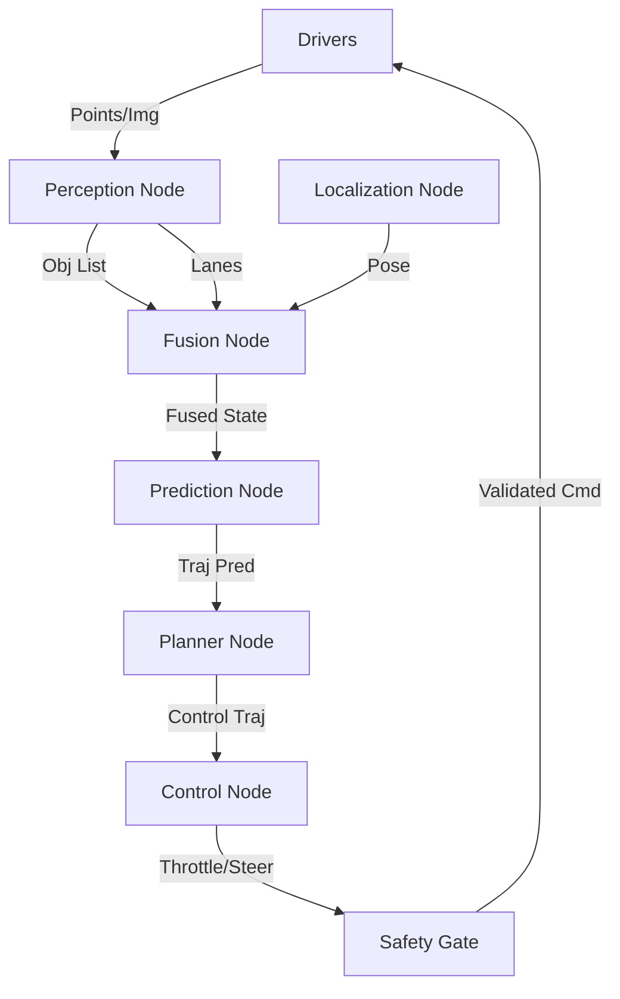

# Day 171: Final Capstone Planning (Architecture_v2)
## Phase 5: AI/CV/LIDAR End-to-End Robotics | Week 25: Final Integration & Graduation

---

> **📝 Content Creator Instructions:**
> Measure twice, cut once.
> - **Focus:** System Architecture, ODD (Operational Design Domain), Hardware Selection (Jetson vs Orin vs x86), Software Stack (ROS 2 Diagram), and Interface Definition.
> - **Code:** A `yaml` based architecture definition file `robot_arch.yaml` and a validator script `validate_arch.py` that checks for cyclic dependencies and "Illegal Bypasses" (e.g., Raw Sensors directly to Actuators).

---

## 🎯 Learning Objectives
*By the end of this day, the learner will be able to:*
1.  **Define** the ODD (Operational Design Domain) for the Capstone Robot.
2.  **Select** appropriate sensors (Lidar vs Camera vs Radar) for the ODD.
3.  **Diagram** the Software Stack using ROS 2 Nodes and Topics.
4.  **Validate** the architecture against safety rules (ISO 26262).

---

## 📚 Prerequisites & Preparation

### Hardware Requirements
- None. (Mental Simulation).

### Software Environment
```bash
pip install pyyaml graphviz
```

### Prior Knowledge
- Entire Course Content (Weeks 1-24).

---

## 📖 Theoretical Deep Dive

### 🔹 Part 1: The ODD (Operational Design Domain)

Before building, we must define **Where** it works.
*   **Capstone ODD:**
    *   **Environment:** Urban City (Simulated).
    *   **Lighting:** Day/Night (No Heavy Snow).
    *   **Speed:** Max 50 km/h.
    *   **Traffic:** Mixed (Cars, Peds).
    *   **Connectivity:** V2X enabled.

### 🔹 Part 2: The Hardware Stack

*   **Compute:** NVIDIA Orin (AI Main) + Infineon Aurix (Safety Checker).
*   **Sensors:**
    *   1x Top Lidar (360, 64-beam).
    *   4x Cameras (Front, Left, Right, Back).
    *   1x Front Radar (Long range).
    *   1x GNSS/IMU (RTK).
*   **Actuation:** Drive-by-Wire (CAN).

### 🔹 Part 3: The Software Stack (ROS 2)



---

## 💻 Implementation: Architectural Validation

We define the system in YAML and check it code.

### 🛠️ Project Structure
```text
day171_planning/
├── src/
│   ├── robot_arch.yaml
│   ├── validate_arch.py
└── output/
    ├── arch_graph.png
```

### 👨‍💻 Architecture Definition (`src/robot_arch.yaml`)

```yaml
nodes:
  - name: lidar_driver
    layer: hardware
    outputs: [/lidar/points]
    
  - name: camera_driver
    layer: hardware
    outputs: [/camera/image]
    
  - name: perception
    layer: ai
    inputs: [/lidar/points, /camera/image]
    outputs: [/perception/objects]
    
  - name: planner
    layer: planning
    inputs: [/perception/objects, /localization/pose] # Missing Localization Input defined?
    outputs: [/control/trajectory]
    
  - name: controller
    layer: control
    inputs: [/control/trajectory]
    outputs: [/can/throttle]

  - name: safety_gate
    layer: safety
    inputs: [/can/throttle]
    outputs: [/can/validated_throttle]

rules:
  - no_cycles: true
  - layer_order: [hardware, ai, planning, control, safety]
  - forbidden_connections:
      - from: hardware
        to: control
        reason: "Sensor bypasses Perception/Planning!"
```

### 👨‍💻 Architecture Validator (`src/validate_arch.py`)

```python
import yaml
import sys

def load_arch(path):
    with open(path, 'r') as f:
        return yaml.safe_load(f)

def build_graph(data):
    # Map topics to producers
    topic_producers = {}
    for node in data['nodes']:
        for out_topic in node.get('outputs', []):
            topic_producers[out_topic] = node
            
    # Build edges: Producer -> Consumer
    edges = []
    nodes_map = {n['name']: n for n in data['nodes']}
    
    for consumer in data['nodes']:
        for in_topic in consumer.get('inputs', []):
            if in_topic in topic_producers:
                producer = topic_producers[in_topic]
                edges.append((producer, consumer, in_topic))
            else:
                print(f"[WARN] Topic '{in_topic}' required by '{consumer['name']}' has NO Producer.")
                
    return edges, nodes_map

def check_layer_violations(edges, data):
    layer_order = {name: i for i, name in enumerate(data['rules'][1]['layer_order'])}
    violations = 0
    
    for prod, cons, topic in edges:
        l1 = layer_order.get(prod['layer'], -1)
        l2 = layer_order.get(cons['layer'], -1)
        
        # Check Explicit Forbidden
        for rule in data['rules'][2]['forbidden_connections']:
            if prod['layer'] == rule['from'] and cons['layer'] == rule['to']:
                print(f"[FAIL] Forbidden Connection: {prod['name']} -> {cons['name']} ({topic})")
                print(f"       Reason: {rule['reason']}")
                violations += 1
                
        # Check Layer Skipping (Optional strictness)
        if l2 > l1 + 2:
             print(f"[INFO] Large Layer Skip: {prod['name']} ({l1}) -> {cons['name']} ({l2})")
             
    return violations

def main():
    print("--- Architecture Validator ---")
    data = load_arch('src/robot_arch.yaml')
    edges, nodes = build_graph(data)
    
    print(f"Loaded {len(nodes)} nodes and {len(edges)} connections.")
    
    # 1. Dependency Check
    # (Already done in build_graph warning)
    
    # 2. Rule Check
    v = check_layer_violations(edges, data)
    
    if v == 0:
        print("\nResult: Architecture Valid ✅")
    else:
        print(f"\nResult: Found {v} Violations ❌")

if __name__ == "__main__":
    main()
```

---

## 🔬 Lab Exercise: "The Illegal Shortcut"

### 1. Lab Objectives
- **Run:** Sim.
- **Observe:** "Localization Input missing" (Because I didn't define a localization node in YAML).
- **Modify:** Add a direct connection in YAML: `lidar_driver` outputs `/can/throttle`.
- **Run:** Validator.
- **Result:** "[FAIL] Forbidden Connection: hardware -> control".
- **Lesson:** Architecture constraints prevent developers from taking dangerous shortcuts ("I'll just hook the gamepad directly to the motor for testing...").

---

## 🚀 Projects for Capstone

Select **ONE** track for the final days:

### 🅰️ The Self-Driving Car (Classic)
*   **Goal:** Navigate a simulated city loop.
*   **Tech:** Lane Keeping + Object Detection + Stop Sign logic.
*   **Bonus:** Handling Traffic Lights.

### 🅱️ The Warehouse Robot (AMR)
*   **Goal:** Pick up pallet A, deliver to Dock B.
*   **Tech:** SLAM + A* Path Finding + Dynamic Obstacle Avoidance (Forklifts).
*   **Bonus:** Multi-Robot Coordination.

### 🆎 The Delivery Drone (UAV)
*   **Goal:** Fly from roof A to roof B avoiding buildings and No-Fly Zones.
*   **Tech:** 3D Occupancy Map + Trajectory Optimization + GPS Denied landing.
*   **Bonus:** Swarm Formation.

*(We will implement Track A as the default reference implementation, but the principles apply to all).*

---

## 🐞 Debugging & Troubleshooting

### Common Issues

#### 1. "Topic Mismatch"
*   **Cause:** Perception outputs `/obj_list`, Planner expects `/objects`.
*   **Fix:** Rigid Interface Definition Language (IDL) or .msg files.

#### 2. "Cycle"
*   **Cause:** Planner needs Fusion. Fusion needs Prediction. Prediction needs Planner (for intent).
*   **Fix:** Break the cycle. Use "Previous State" for one of inputs (Time delay 1 frame).

---

## ⚡ Optimization: Zero-Copy

Passing images between nodes is slow.
*   **ROS 2:** Uses Shared Memory (Iceoryx) for intra-process comms.
*   **Arch:** Group "High Bandwidth" nodes (Camera -> Perception) into a single component container or ensure Zero-Copy is enabled in Middleware.

---

## 🧠 Assessment & Review

### Knowledge Check
1.  **Q:** What is ODD?
    *   **A:** The set of conditions (Weather, Road, Speed) under which the AV is guaranteed to function safely. Outside ODD $\to$ Handover/Stop.
2.  **Q:** Why validate architecture?
    *   **A:** To ensure safety constraints (ASIL decomposition) are respected during implementation.
3.  **Q:** What is the "Doer-Checker" pattern?
    *   **A:** Complex QM Doer performs task. Simple ASIL-D Checker verifies safety.

### Challenge Task
> **Task:** Draw the Power Architecture.
> 1. Battery $\to$ PMIC.
> 2. PMIC $\to$ Compute / Sensors / Motors.
> 3. What happens if Logic Power dies but Motor Power stays on? (Runaway).
> 4. Add "Safety Relay" controlled by Watchdog.

---

## 📚 Further Reading
- **ROS 2 Design:** Architecture docs.
- **Autoware.Universe:** Reference architecture for open source AD.

---

**Day 171 Complete**
