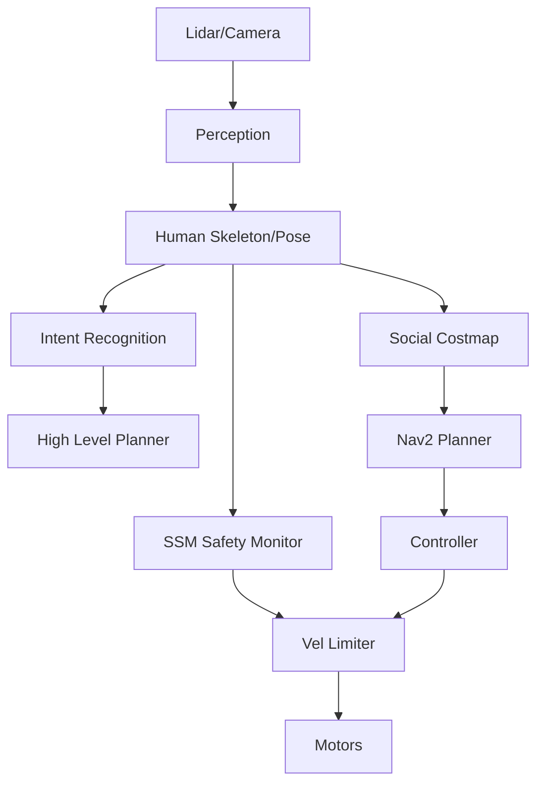

# Day 182: Week 26 Review & Project
## Phase 5: AI/CV/LIDAR End-to-End Robotics | Week 26: Human-Robot Collaboration

---

> **📝 Content Creator Instructions:**
> The "Cobot Application".
> - **Focus:** Integration of all Human-Robot Collaboration concepts (Safety, Intent, Sharing, Social).
> - **Code:** A complete `cobot_application.py`.
> - **Scenario:** A Robot Waiter.
> - **Requirements:**
>   1.  Navigate safely among customers (Social Nav).
>   2.  Slow down if someone gets too close (SSM Safety).
>   3.  Predict if a customer extends a hand (Intent).
>   4.  Stop and listen for order (NLP).

---

## 🎯 Learning Objectives
*By the end of this day, the learner will be able to:*
1.  **Synthesize** Safety, Perception, and Planning modules into a coherent HRC stack.
2.  **Architect** a Behavior Tree that switches between Social Navigation and Interactive Service.
3.  **Deploy** a "Waiter Robot" simulation requiring robust human awareness.

---

## 📚 Prerequisites & Preparation

### Hardware Requirements
- Simulated "Restaurant" World in Gazebo.
- Mobile Robot with Lidar + Camera.

### Software Environment
```bash
# ROS 2 Nav2, MoveIt, Whisper, MediaPipe
```

### Prior Knowledge
- All of Week 26.

---

## 📖 Theoretical Recap

### The HRC Pyramid

1.  **Safety (Base):** ISO 15066. SSM. Don't hurt the human.
2.  **Navigation (Middle):** Social Layers. Don't annoy the human.
3.  **Interaction (Top):** Intent & NLP. Help the human.

### Key Takeaways
*   **Day 176:** Safety is calculated, not assumed. $S_p = V \times T + \dots$.
*   **Day 177:** Explicit (Voice) vs Implicit (Motion) intent.
*   **Day 178:** Share control when ambiguity is high.
*   **Day 179:** LLMs provide the logic, Grounding provides the coords.
*   **Day 180:** Help where the burden is highest (Ergonomics).
*   **Day 181:** Respect the "Bubble".

---

## 💻 Implementation: The Robot Waiter

We create a consolidated script that manages the robot states.

### 🛠️ Project Structure
```text
day182_project/
├── src/
│   ├── waiter_main.py
│   ├── safety_monitor.py
│   └── social_nav.py
└── launch/
    └── restaurant_sim.launch.py
```

### 👨‍💻 Waiter Main Loop (`src/waiter_main.py`)

```python
import rclpy
from rclpy.node import Node
import time
import random

# Mock States
STATES = ["PATROL", "APPROACH", "SERVICE", "BLOCKED"]

class WaiterRobot(Node):
    def __init__(self):
        super().__init__('waiter_robot')
        self.state = "PATROL"
        
        # Submodules (Mocked interfaces for clarity)
        self.safety_status = "SAFE"
        self.intent_detected = False
        self.voice_command = None
        
        self.create_timer(0.1, self.behavior_loop)
        
    def check_perceptions(self):
        # 1. Check Safety (Day 176)
        # In real code: subscribe to /safety_monitor/status
        # Simulating random events:
        if random.random() < 0.05: 
            self.safety_status = "SSM_ACTIVATE"
        else:
            self.safety_status = "SAFE"
            
        # 2. Check Intent (Day 177)
        if random.random() < 0.02 and self.state == "PATROL":
            self.intent_detected = True # Customer waving
            
    def behavior_loop(self):
        self.check_perceptions()
        
        # --- STATE MACHINE ---
        
        if self.safety_status == "SSM_ACTIVATE":
            self.get_logger().warn("Safety Violation! Slowing down...")
            # Publish slow vel
            pass
            
        if self.state == "PATROL":
            # Social Navigation (Day 181)
            # Robot moves between tables
            if self.intent_detected:
                self.get_logger().info("Customer Waving! Switching to APPROACH.")
                self.state = "APPROACH"
                self.intent_detected = False
                
        elif self.state == "APPROACH":
            # Human-Aware Approach
            # Stop 1.0m away (Personal zone boundary)
            self.get_logger().info("Approaching Table...")
            time.sleep(1) # Sim travel
            self.state = "SERVICE"
            
        elif self.state == "SERVICE":
            # NLP Interface (Day 179)
            # "What can I get you?"
            print("[ROBOT]: Hello! What can I get you?")
            
            # Sim user response
            cmd = "Bring me a water." # In reality: Use Whisper
            print(f"[USER]: {cmd}")
            
            # Grounding
            if "water" in cmd:
                print("[ROBOT]: Fetching Water from Bar...")
                # Go to Bar, Pick Up, Return
                self.state = "PATROL"
            else:
                print("[ROBOT]: Pardon?")
                
        self.get_logger().info(f"Current State: {self.state}")

def main():
    rclpy.init()
    node = WaiterRobot()
    try:
        rclpy.spin(node)
    except KeyboardInterrupt:
        pass
    rclpy.shutdown()

if __name__ == "__main__":
    main()
```

---

## 🔬 Lab Exercise: "The Dynamic Hallway"

### 1. Lab Objectives
- **Setup:** A long hallway with 5 animated humans walking back and forth (Simulated actors).
- **Goal:** Robot must traverse hallway.
- **Metric:**
    1.  **Safety:** Number of collisions = 0.
    2.  **Social:** Min distance kept > 0.5m.
    3.  **Efficiency:** Time to goal.
- **Fail:** If Robot freezes (Oscillation) or hits someone.

---

## 🚀 Capstone Architecture Diagram

What we built this week:



---

## 🐞 Debugging & Troubleshooting

### Common Challenges

#### 1. "The Frozen Robot Problem"
*   **Scene:** Robot is surrounded by people. All paths are high cost.
*   **Solution:** **Recovery Behaviors.**
    1.  Ask nicely: "Excuse me, coming through."
    2.  Wait: Humans move.
    3.  Creep: Move at 0.05 m/s.

#### 2. "Voice in Noise"
*   **Scene:** Restaurant is loud. Whisper fails.
*   **Solution:** **Audio Beamforming.** Use a microphone array (ReSpeaker) to focus on the direction of the face found by the camera (Face Detection + DoA Fusion).

---

## 🧠 Assessment: HRC Specialist

1.  **Multiple Choice:** A user is walking *toward* the robot at 1.0 m/s. The robot is moving at 1.0 m/s. The reaction time is 0.2s. Stopping distance is 0.5m. What is the separation distance $S_p$?
    *   (a) 1.0m
    *   (b) ~1.7m (Correct: $S_h = 1.0 \times (0.2 + 0.5) = 0.7$. $S_r = 0.5$. $C \approx 0.2$. Total $\approx 1.4+$. Exact calc depends on braking time).
2.  **Design:** Sketch a state machine for a robot that helps a user carry a table. (States: Wait for Grip, Lift Sync, Shared Carry, Lower Sync, Release).

---

## 📚 Further Reading
- **Book:** "Human-Robot Interaction: An Introduction" (Christoph Bartneck).
- **Framework:** ROS 2 HRI (ROS4HRI).

---

**(End of Week 26. Next: Week 27 - Advanced Control & Dynamics)**
