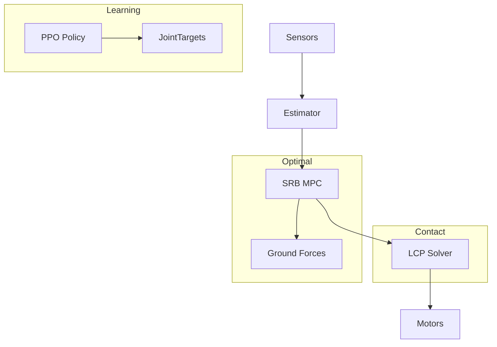

# Day 189: Week 27 Review & Project
## Phase 5: AI/CV/LIDAR End-to-End Robotics | Week 27: Advanced Control & Dynamics

---

> **📝 Content Creator Instructions:**
> Control Theory is the brain of the body.
> - **Focus:** Project: "The Raibert Hopper". Integrating Hybrid Dynamics, Impulse Control, and State Machines.
> - **Code:** `raibert_hopper.py`. A 1-Legged robot that hops, maintains height, and forward velocity.
> - **Review:** LQR, MPC, MPPI, PPO, and Hybrid Systems.

---

## 🎯 Learning Objectives
*By the end of this day, the learner will be able to:*
1.  **Decompose** a hopping gait into Flight, Compression, and Thrust phases.
2.  **Apply** the Raibert Heuristic for foot placement ($\dot{x} T_s / 2 + k \dot{x}_{err}$).
3.  **Synthesize** concepts from Week 27 (Hybrid dynamics, energy injection) into a working system.

---

## 📚 Prerequisites & Preparation

### Hardware Requirements
- Physics Sim (PyBullet/Gazebo) or Python custom sim.

### Software Environment
```bash
pip install matplotlib numpy
```

### Prior Knowledge
- Spring-Mass-Damper systems.
- State Machines.

---

## 📖 Theoretical Recap

### The Control Spectrum

1.  **Classical (PID):** $u = -Kp \cdot e$. Good for setpoints. Bad for dynamics.
2.  **Optimal (LQR/MPC):** Minimize $J$. Good for MIMO systems.
    *   **LQR:** Infinite horizon, unconstrained.
    *   **MPC:** Finite horizon, constrained ($u_{min} < u < u_{max}$). (Days 185, 188).
3.  **Sampling (MPPI):** Non-differentiable, parallel universe simulation. (Day 184).
4.  **Learning (RL):** "Try and Die". Good for unmodelable contact. (Day 186).
5.  **Hybrid (Contact):** Handling the switch between Air and Ground. (Day 183).

---

## 💻 Implementation: The Raibert Hopper

The "Hello World" of legged robotics.
3 Controllers running in parallel:
1.  **Hopping Height:** Inject energy during stance (Thrust).
2.  **Body Attitude:** P-Control on Hip Torque during stance.
3.  **Forward Speed:** Foot placement during flight.

### 🛠️ Project Structure
```text
day189_project/
├── src/
│   ├── hopper.py
│   └── main_sim.py
└── output/
    └── hop_log.csv
```

### 👨‍💻 Main Simulation (`src/main_sim.py`)

A simplified 2D physics loop (Forward Euler) with explicit Contact Event handling.

```python
import numpy as np
import matplotlib.pyplot as plt

class RaibertHopper:
    def __init__(self):
        # Params
        self.mass_body = 5.0
        self.mass_leg = 0.5
        self.spring_k = 1000.0
        self.rest_len = 0.5
        
        # State: Body(x, z, theta), Leg(Length, Angle)
        # Simplified: Body Pos(x, z), Vel(vx, vz). Foot Pos(fx, fz)
        self.pos = np.array([0.0, 1.0]) # Start high
        self.vel = np.array([1.0, 0.0]) # Forward velocity 1 m/s
        
        self.foot_pos_rel = np.array([0.0, -0.5]) # Relative to body
        self.on_ground = False
        
        # Control Targets
        self.target_h = 1.0
        self.target_vel = 1.0
        
    def get_foot_world(self):
        return self.pos + self.foot_pos_rel
        
    def step(self, dt=0.001):
        # 1. Physics
        g = np.array([0.0, -9.81])
        force = self.mass_body * g
        
        foot_world = self.get_foot_world()
        
        # Ground Check
        if foot_world[1] <= 0:
            if not self.on_ground:
                # TD Event
                self.on_ground = True
                print("Touchdown!")
            foot_world[1] = 0 # Constraint
        else:
            if self.on_ground:
                # LO Event
                self.on_ground = False
                print("Liftoff!")
                
        # Forces
        if self.on_ground:
            # Spring Force
            # Vec Body to Foot
            v_leg = foot_world - self.pos
            curr_len = np.linalg.norm(v_leg)
            direction = v_leg / curr_len
            
            compression = self.rest_len - curr_len
            f_spring = -direction * (self.spring_k * compression)
            
            # --- CONTROL 1: Altitude (Thrust) ---
            # If compressing (going down), just spring.
            # If extending (going up), Add Thrust!
            if self.vel[1] > 0:
                f_spring *= 1.2 # Thrust
                
            force += f_spring
            
            # Friction/No Slip constraint implied (simplified)
            
            # --- CONTROL 2: Attitude ---
            # (Ignored in point mass model, relevant if we had Inertia)
            
        else:
            # FLIGHT PHASE
            # --- CONTROL 3: Fwd Velocity via Foot Placement ---
            # Raibert Formula: x_foot = x_body + v * Ts/2 + k_v * (v - v_target)
            T_stance = 0.2 # Estimated Stance duration
            k_v = 0.1
            
            dx_foot = self.vel[0] * T_stance / 2.0 + k_v * (self.vel[0] - self.target_vel)
            
            # Move leg to this relative position (Servo)
            target_foot_rel = np.array([dx_foot, -self.rest_len])
            
            # Servo dynamics
            self.foot_pos_rel += (target_foot_rel - self.foot_pos_rel) * 10.0 * dt

        # Integration
        acc = force / self.mass_body
        self.vel += acc * dt
        self.pos += self.vel * dt
        
        # Foot Drag (Kinematic foot follows body in stance, moves in flight)
        if self.on_ground:
            self.foot_pos_rel = foot_world - self.pos # Update relative
        # else: foot_pos_rel updated by Control 3
        
        return self.pos, self.get_foot_world()

def main():
    sim = RaibertHopper()
    
    t_hist = []
    z_hist = []
    x_hist = []
    
    plt.ion()
    fig, ax = plt.subplots()
    
    for i in range(2000): # 2 seconds
        p, f = sim.step()
        
        if i % 20 == 0:
            t_hist.append(i*0.001)
            z_hist.append(p[1])
            x_hist.append(p[0])
            
            ax.clear()
            # Draw Ground
            ax.plot([-1, 10], [0, 0], 'k-')
            # Draw Body
            ax.plot(p[0], p[1], 'bo', markersize=10)
            # Draw Leg
            ax.plot([p[0], f[0]], [p[1], f[1]], 'k-', linewidth=2)
            
            ax.set_xlim(p[0]-1, p[0]+2)
            ax.set_ylim(-0.2, 2.0)
            ax.set_aspect('equal')
            plt.pause(0.001)
            
    plt.ioff()
    print("Done.")

if __name__ == "__main__":
    main()
```

---

## 🔬 Lab Exercise: "Parameter Sensitivity"

### 1. Lab Objectives
- **Experiment:** Change `T_stance` estimate in the foot placement controller.
- **Fail:** If `T_stance` is too small, foot lands too far back $\to$ Robot accelerates forward uncontrollably (Trip).
- **Fail:** If `T_stance` is too large, foot lands too far forward $\to$ Robot brakes and flips backward.
- **Tune:** Find the sweet spot for stable 1 m/s hopping.

---

## 🚀 Capstone Project Architecture

What we built this week:



---

## 🐞 Debugging & Troubleshooting

### Common Challenges

#### 1. "Energy Leak"
*   **Scene:** Hopper jumps higher and higher until it breaks simulation.
*   **Cause:** Thrust added every cycle, but damping is insufficient.
*   **Fix:** Thrust should inject *exactly* the energy lost to damping. $E_{total} = mgh + 0.5mv^2$. Target $E_{des}$.

---

## 🧠 Assessment: Control Architect

1.  **Selection:** You have a robot arm picking up delicate eggs. Which controller?
    *   (a) PPO
    *   (b) Impedance Control (Correct: Force/Stiffness control is best for delicate contact).
    *   (c) MPPI
2.  **Selection:** You have a drone flying through a dynamic forest (moving trees).
    *   (a) LQR
    *   (b) MPPI (Correct: Handles non-convex/dynamic obstacles well via massive sampling).

---

## 📚 Further Reading
- **Marc Raibert:** "Legged Robots That Balance" (The classic 1986 book).
- **Boston Dynamics:** Atlas papers (rare, but exist).

---

**(End of Week 27. Next: Week 28 - Future Technologies)**
