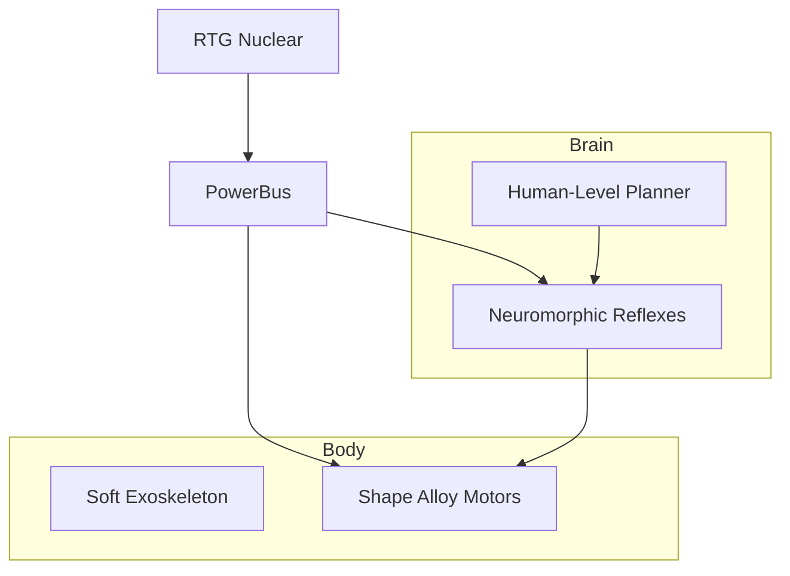

# Day 196: Week 28 Review & Project
## Phase 5: AI/CV/LIDAR End-to-End Robotics | Week 28: Future Technologies

---

> **📝 Content Creator Instructions:**
> The "X-Bot".
> - **Focus:** Project: Designing the Ultimate Future Robot. Integration of Neuromorphic Sensing, Soft Actuation, Bio-Gait, and Energy Harvesting.
> - **Code:** `future_bot_concept.py`. A simulation that tracks the "Viability" of a robot mission based on Energy, Compute, and Durability dynamics.
> - **Review:** CPG, SNN, Soft, Energy, Quantum, VLA.

---

## 🎯 Learning Objectives
*By the end of this day, the learner will be able to:*
1.  **Synthesize** heterogenous technologies into a coherent system architecture.
2.  **Evaluate** trade-offs (e.g., Soft Actuators are safe but energy inefficient).
3.  **Simulate** a long-duration mission on a moon of Saturn.

---

## 📚 Prerequisites & Preparation

### Hardware Requirements
- None.

### Software Environment
```bash
pip install matplotlib numpy
```

### Prior Knowledge
- All of Week 28.

---

## 📖 Theoretical Recap

### The Technology Stack 2030

1.  **Brain:** Human-Level VLA (Day 195) + Neuromorphic Reflexes (Day 190).
2.  **Body:** Soft/Compliant Materials (Day 193) + Tensegrity Structure (Day 192).
3.  **Energy:** Nuclear/Solar Harvesting (Day 194) + Metabolic Digestion?
4.  **Control:** Quantum Optimization (Day 191) + CPG spinal cords (Day 192).

### Key Takeaways
*   **Day 190:** Spikes save energy.
*   **Day 191:** Quantum tunnels through local minima.
*   **Day 192:** Morphology does the computation.
*   **Day 193:** Materials are actuators.
*   **Day 194:** Power is the ultimate constraint.
*   **Day 195:** Logic is solved; Physicality is the frontier.

---

## 💻 Implementation: The Titan Explorer

We simulate a mission on Titan (Saturn's Moon).
*   **Env:** Cold (-180C), Thick atmosphere, Low gravity.
*   **Robot:** Soft-body "Squid" with Radioisotope generator and SNN brain.
*   **Metric:** Science Data Collected / Kg of Launch Mass.

### 🛠️ Project Structure
```text
day196_project/
├── src/
│   ├── titan_mission.py
│   └── subsystems.py
└── output/
    └── mission_log.png
```

### 👨‍💻 Mission Simulator (`src/titan_mission.py`)

A Monte-Carlo simulation of system reliability and performance.

```python
import numpy as np
import matplotlib.pyplot as plt

class FutureBot:
    def __init__(self):
        # Stats
        self.energy_stored = 1000.0 # Wh (RTG buffer)
        self.structure_health = 100.0 # %
        self.science_data = 0.0 # MB
        
        # Subsystems
        self.actuator_type = "SMA" # Nitinol (Good for cold?) No, needs heat.
        self.brain_type = "NEUROMORPHIC" # Low power
        
        # Env
        self.temp_ambient = -180.0 # C
        
    def step(self, t):
        # 1. Energy harvesting (RTG is constant)
        p_in = 5.0 # 5 Watts continuous
        
        # 2. Consumption
        p_load = 0.0
        
        if self.brain_type == "NEUROMORPHIC":
            p_load += 0.5 # mW? No, lets say 0.5W for tough compute
        elif self.brain_type == "GPU":
            p_load += 20.0 # High power
            
        rate_of_movement = 0.0
        
        # Heating Requirement (SMA needs +50C, Ambient -180C. HUGE Delta T)
        # Power = h A dT. Very expensive on Titan.
        heating_cost = 50.0 # Watts
        
        if self.energy_stored > 50.0:
            # Active
            p_load += heating_cost
            rate_of_movement = 1.0 # m/s
            
            # Wear and Tear
            # Soft robots heal, but extreme cold makes them brittle
            if self.temp_ambient < -100:
                 self.structure_health -= 0.01
        
        # Net
        self.energy_stored += (p_in - p_load) * (1.0/60.0) # 1 min step
        
        # Clamp
        if self.energy_stored < 0: 
            self.energy_stored = 0
            rate_of_movement = 0
            
        # Science
        if rate_of_movement > 0:
            self.science_data += 0.1
            
        return self.energy_stored, self.structure_health, self.science_data

def main():
    bot = FutureBot()
    
    t_hist = []
    e_hist = []
    h_hist = []
    
    for t in range(60 * 24 * 7): # 1 Week
        e, h, s = bot.step(t)
        
        if t % 60 == 0:
            t_hist.append(t/60.0) # Hours
            e_hist.append(e)
            h_hist.append(h)
            
        if h <= 0:
            print(f"Robot Died at hour {t/60.0}")
            break
            
    print(f"Total Science: {bot.science_data:.1f} MB")
    
    plt.plot(t_hist, e_hist, label='Energy IDLE')
    plt.title("Titan Mission Analysis")
    plt.xlabel("Hours")
    plt.savefig("output/mission_log.png")

if __name__ == "__main__":
    main()
```

---

## 🔬 Lab Exercise: "Design Review"

### 1. Lab Objectives
- **Analyze:** The Titan Mission failed (Energy drained by heating SMAs).
- **Iterate:** Change `actuator_type` to `Pneumatic` (Gas powered, maybe using ambient methane?).
- **Iterate:** Change `brain_type` to `Quantum` (Cloud connected? No, latency to Earth is 80 mins. Must be local).
- **Result:** Find a configuration that survives 1 week.

---

## 🚀 Capstone Architecture Diagram

The "X-Bot":



---

## 🐞 Debugging & Troubleshooting

### Common Challenges

#### 1. "Integration Hell"
*   **Scene:** SNN outputs spikes, but SMA needs PWM.
*   **Fix:** **Transduction Layer.** Integrate spikes to capacitor voltage $\to$ PWM duty cycle.

#### 2. "Cold Welding"
*   **Scene:** Metal parts fuse in vacuum.
*   **Fix:** Use Soft materials / Polymers.

---

## 🧠 Assessment: Futurist

1.  **Multiple Choice:** Critical bottleneck for Mars Robots?
    *   (a) AI Intelligence
    *   (b) Energy/Thermal Management (Correct: Cold kills batteries. Dust covers solar).
    *   (c) Speed
2.  **Design:** Sketch a robot that eats plastic pollution to power itself. (Microbial Fuel Cell + Soft Mouth).

---

## 📚 Further Reading
- **NASA NIAC:** Innovative Advanced Concepts program (The craziest robot ideas).
- **Science Robotics:** Top journal for new mechanisms.

---

**(End of Week 28. Next: Week 29 - Capstone Project Part 1)**
