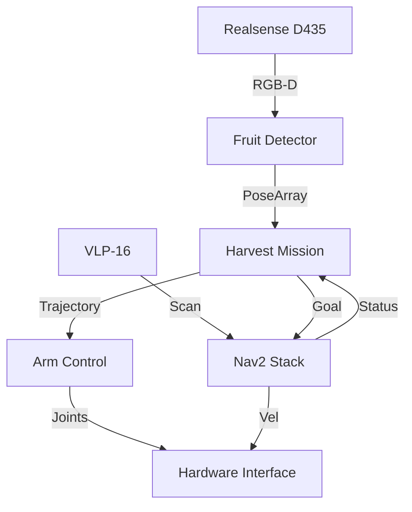

# Day 206: Documentation
## Phase 5: AI/CV/LIDAR End-to-End Robotics | Week 30: Capstone Project Part 2

---

> **📝 Content Creator Instructions:**
> If it isn't documented, it doesn't exist.
> - **Focus:** Generating professional documentation for the Agri-Bot project. READMEs, Architecture Diagrams, and API docs.
> - **Code:** Setup `Sphinx` to auto-generate Python docs.
> - **Concept:** Technical Communication.

---

## 🎯 Learning Objectives
*By the end of this day, the learner will be able to:*
1.  **Structure** a Root `README.md` that explains "How to Run".
2.  **Generate** API documentation using `sphinx` and `autodoc`.
3.  **Draw** a high-level Block Diagram using `Mermaid.js`.
4.  **License** the code properly (Apache 2.0 / MIT).

---

## 📚 Prerequisites & Preparation

### Hardware Requirements
- None.

### Software Environment
```bash
pip install sphinx sphinx_rtd_theme
```

### Prior Knowledge
- Markdown styling.
- Python Docstrings (Google Style).

---

## 📖 Theoretical Structure

### 🔹 The Anatomy of a Good Repo

1.  **Banner Image:** Cool robot screenshot.
2.  **Badges:** CI Passing, License, ROS Distro.
3.  **Installation:** "Copy paste these 3 lines".
4.  **Usage:** "Run this launch file".
5.  **Architecture:** "How it works internally".
6.  **Troubleshooting:** "If X fails, do Y".

### 🔹 Code as Documentation

*   **Docstrings:** Comments inside the code that explain inputs/outputs.
*   **Type Hints:** `msg: Image` is better than `msg`.

---

## 💻 Implementation: Sphinx Auto-Docs

We set up a documentation site that updates when we change the code.

### 🛠️ Project Structure
```text
agribot_docs/
├── docs/
│   ├── conf.py
│   ├── index.rst
│   └── modules.rst
├── src/
│   └── my_robot_code.py
└── README.md
```

### 👨‍💻 Sphinx Config (`docs/conf.py`)

Standard setup to read Python paths.

```python
import os
import sys
sys.path.insert(0, os.path.abspath('../../agribot_control/src'))

project = 'AgriBot'
copyright = '2025, OmniCorp'
author = 'Jane Doe'

extensions = [
    'sphinx.ext.autodoc',
    'sphinx.ext.viewcode',
    'sphinx.ext.napoleon' # Support Google-style docstrings
]

html_theme = 'sphinx_rtd_theme'
```

### 👨‍💻 Writing Docstrings (Example)

```python
class HarvestMission:
    """
    Orchestrates the autonomous harvesting mission.
    
    Attributes:
        status (str): Current FSM state (SEARCHING, PICKING).
        fruits_queue (list): List of detected fruit poses.
    """
    
    def add_fruit(self, pose):
        """
        Adds a timestamped fruit pose to the queue.
        
        Args:
            pose (geometry_msgs.msg.Pose): The 3D location of the fruit.
            
        Returns:
            bool: True if added, False if duplicate.
        """
        pass
```

### 👨‍💻 The Graph (`README.md`)

```markdown
# AgriBot 5000 🍓

Autonomous Strawberry Harvesting Robot using ROS 2 Humble.

## Architecture



## Quick Start

```bash
# 1. Install Dependencies
rosdep install --from-paths src -y --ignore-src

# 2. Build
colcon build --symlink-install

# 3. Harvest!
ros2 launch agribot_bringup sim_complete.launch.py
```
```

---

## 🔬 Lab Exercise: "The Stranger Test"

### 1. Lab Objectives
- **Scenario:** Give your repo link to a friend (or imagine a stranger).
- **Task:** Ask them to run the simulation *without* asking you any questions. Only using the README.
- **Fail:** They will likely get stuck on "Missing Dependency" or "Source install/setup.bash".
- **Fix:** Update the README with the missing step.

---

## 🚀 Project Steps

1.  **Wiki:** If the README gets too long (> 500 lines), move details to a Wiki or `docs/` folder.
2.  **Video:** Record a screen capture of the simulation working. Embed the GIF in the README. (People don't read text, they watch GIFs).

---

## 🐞 Debugging & Troubleshooting

### Common Issues

#### 1. "Sphinx Import Error"
*   **Cause:** Sphinx can't find your ROS modules (`rclpy`) because it's running in a pure python env.
*   **Fix:** Mock the ROS libraries in `conf.py` (`autodoc_mock_imports = ['rclpy', 'geometry_msgs']`).

#### 2. "Outdated Docs"
*   **Cause:** You changed the code but forgot to update the README.
*   **Solution:** Use Auto-Docs (Sphinx) for API reference. Keep README high-level.

---

## ⚡ Optimization: Hosting

*   **GitHub Pages:** Host the HTML generated by Sphinx for free.
*   **ReadTheDocs:** Connects to GitHub and builds docs automatically on every commit.

---

## 🧠 Assessment & Review

### Knowledge Check
1.  **Q:** What is a "Docstring"?
    *   **A:** A string literal directly after a function definition `"""Like This"""`. Python tools can read it at runtime (`help(func)`).
2.  **Q:** Why use Mermaid diagrams?
    *   **A:** They render as images on GitHub but are edited as text. Version controllable diagrams!

### Challenge Task
> **Task:** "Interactive Graph".
> 1. Use `rqt_graph` to save a live snapshot of the ROS node connections.
> 2. Include this in the documentation as "Verified Runtime Graph".

---

## 📚 Further Reading
- **Google Python Style Guide:** (Standard for Docstrings).
- **Write The Docs:** Community for tech writers.

---

**Day 206 Complete**
