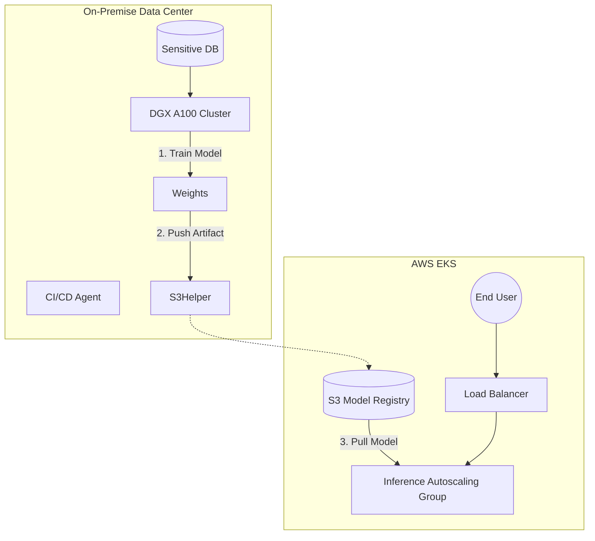

# Day 69: The Best of Both Worlds: Hybrid & Multi-Cloud
### Phase 6: AI/ML Platform Engineering with GPU Programming | Week 10: Cloud Platforms for ML

---

> **🎯 Focus Area:** Startups use Public Cloud. Enterprises use **Hybrid Cloud**. Learn how to bridge your on-premise H100 cluster with Cloud Bursting capabilities using **Anthos** or **Azure Arc**.

---

## 🎯 Learning Objectives
*By the end of this day, the learner will be able to:*
1.  **Identify** Use Cases for Hybrid (Data Sovereignty vs Cloud Bursting).
2.  **Architecture** a solution where Training happens On-Prem and Inference happens on EKS.
3.  **Explain** the role of a "Control Plane of Control Planes" (Anthos/Arc).
4.  **Discuss** Data Gravity: Why moving compute to data is easier than moving data to compute.
5.  **Evaluate** Kubernetes Federation (KubeFed) concepts.

---

## 📚 Prerequisites & Preparation

### Hardware Requirements
- None (Conceptual Design Day).

### Software Environment
- Mermaid JS (for diagrams).

---

## 📖 Theoretical Foundation

### 1. The CapEx vs OpEx Dilemma
*   **On-Prem (CapEx):** You buy an H100 DGX Station ($300k).
    *   *Pros:* 0 marginal cost per hour. Security.
    *   *Cons:* Finite capacity. Maintenance.
*   **Cloud (OpEx):** You rent p4d instances ($32/hr).
    *   *Pros:* Infinite scale. Zero maintenance.
    *   *Cons:* Extremely expensive for 24/7 utilization.

### 2. The Hybrid Pattern
**Steady State:** Run base workload on owned hardware.
**Peak State:** "Burst" excess training jobs to AWS Spot Instances.

### 3. Unified Management
If you have 10 clusters (3 OnPrem, 3 AWS, 4 Azure), managing `kubectl` contexts is a nightmare.
**Solutions:**
*   **Google Anthos / GKE Enterprise:** Install a GKE agent on your On-Prem cluster. It appears in GCP Console.
*   **Azure Arc:** Same concept, appears in Azure Portal.

---

## 💻 Implementation

### 👨‍💻 Architecture: Train-Prem, Serve-Cloud

This is a common pattern for Healthcare/Finance. Data cannot leave the building. Model weights (anonymized) can.



### 👨‍💻 Conceptual: Kubefed (Federation)

How to deploy `nginx` to 3 clusters simultaneously?

```yaml
apiVersion: types.kubefed.io/v1beta1
kind: FederatedDeployment
metadata:
  name: test-deployment
  namespace: test-namespace
spec:
  template:
    metadata:
      labels:
        app: nginx-test
    spec:
      replicas: 3
  placement:
    clusters:
    - name: cluster-us-east
    - name: cluster-eu-west
    - name: cluster-onprem
```

*Note: Federation is complex and often replaced by GitOps (ArgCD syncing to multiple clusters).*

---

## 🔬 Lab Exercise: "Latency Modeling"

### Task
Calculate Sync time.
*   **Scenario:** You train on-prem. Checkpoint size is 50GB. Connection is 1Gbps Direct Connect.
*   **Time:** 50GB * 8 = 400 Gigabits. / 1Gbps = 400 seconds (~7 mins).
*   **Impact:** If you save checkpoints every 10 mins, you spend 7 mins uploading.
*   **Solution:** Compression, Differential Checkpointing, or upgrade to 10Gbps line.

---

## 📝 Daily Summary

### Key Takeaways
1.  **Network is the Bottleneck:** Hybrid cloud fails when you try to treat On-Prem and Cloud as "LAN neighbors". They are "WAN strangers".
2.  **GitOps usage:** Use ArgoCD with multiple destinations. `Application A` targets `https://onprem-k8s`. `Application B` targets `https://aws-eks`.
3.  **Compliance:** Sometimes, Hybrid is not a choice; it's a legal requirement (GDPR, HIPAA).

### API Summary
```bash
# Azure Arc Connect
az connectedk8s connect --name my-onprem --resource-group rg
```

---

**Day 69 Complete** ✅

*Next: Day 70 - Week 10 Review & Project - Designing a Cost-Optimized, Multi-Cloud ML Platform.*
