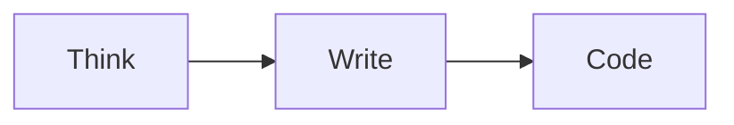

# Day 197: Designing Titan: The Global ML Platform
### Phase 6: AI/ML Platform Engineering with GPU Programming | Week 29: Capstone Project Part 1

---

> **🎯 Focus Area:** You are now the "HPrincipal ML Platform Engineer". You have been tasked to design **Titan**: A platform that serves 100M users, runs 10k training jobs/day, and spans 3 continents. This is your RFC (Request for Comments).

---

## 🎯 Learning Objectives
*By the end of this day, the learner will be able to:*
1.  **Draft** a System Design Document (RFC) for a Global ML Platform.
2.  **Architect** the Control Plane vs Data Plane separation.
3.  **Define** Non-Functional Requirements (NFRs) like Latency < 100ms (P99) and Availability 99.99%.
4.  **Select** the Technology Stack (Why Karmada? Why Ray? Why Vault?) with trade-off analysis.

---

## 📚 Prerequisites & Preparation

### Hardware Requirements
- Whiteboard / Diagramming Tool (MermaidJS).

---

## 📖 Theoretical Foundation

### 1. The Requirements
*   **Scale:** Support 100+ Data Scientists and 50+ Product Teams.
*   **Geography:** Data Residency in EU (GDPR). GPU Availability in US (Cost).
*   **Workloads:**
    *   *Type A:* Distributed Training (LLMs - 1000 GPUs).
    *   *Type B:* Real-time Inference (Low Latency).
    *   *Type C:* Batch Inference (High Throughput).

### 2. High Level Architecture
*   **The Brain (Control Plane):** Centralized Management (Virginia). Backstage, ArgoCD, Karmada Host, Thanos Global, Vault.
*   **The Muscles (Data Plane):** Execution Clusters.
    *   `us-east-1-gpu` (Training).
    *   `eu-central-1-inf` (Inference).
    *   `ap-northeast-1-inf` (Inference).

---

## 💻 Implementation

### 👨‍💻 Architecture: The RFC (Design Doc)

This is the document you present to the CTO.

#### 📁 `capstone/design/RFC-001-Titan.md`
```markdown
# RFC 001: Project Titan - Global ML Platform

## 1. Problem Statement
Current Infrastructure is fragmented.
- EU team uses manual EC2 scripts.
- US team uses unmanaged EKS.
- Cost is uncontrolled ($50k/month waste).
- Security audit failed (Secrets in Git).

## 2. Proposed Solution
Build a Unified Platform "Titan" based on Kubernetes Federation.

## 3. Architecture Diagrams

### 3.1 Global Topology
```mermaid
graph TD
    User([Data Scientist]) --> IDP[Backstage IDP]
    IDP --> Git[GitLab]
    Git --> Argo[ArgoCD]
    Argo --> Karmada[Karmada Host (US-East)]
    
    Karmada -->|Sync| US_TRAIN[US Training Cluster]
    Karmada -->|Sync| EU_INF[EU Inference Cluster]
    Karmada -->|Sync| AP_INF[AP Inference Cluster]
    
    subgraph Observability
        Thanos[Thanos Global]
        Grafana[Grafana]
    end
    
    US_TRAIN -->|Metrics| Thanos
    EU_INF -->|Metrics| Thanos
```

### 3.2 Technology Stack Selection

| Component | Choice | Rationale | Alternatives |
| :--- | :--- | :--- | :--- |
| **Orchestrator** | Kubernetes 1.28 | Industry Standard | Nomad |
| **Federation** | Karmada | Supports Pull Mode (Edge) | KubeFed |
| **Compute** | Ray | Best for Distributed Training | Spark |
| **Serving** | KServe + vLLM | Standards based + Fast | Seldon |
| **Secrets** | Vault | Dynamic Secrets | SealedSecrets |
| **Mesh** | Istio | mTLS + Locality LB | Linkerd |

## 4. Workflows

### 4.1 Deployment Workflow (GitOps)
1.  DS creates project via Backstage.
2.  Backstage creates Repo + Helm Chart.
3.  DS pushes code.
4.  CI builds Image + Pushes to Harbor.
5.  CI updates Helm values in Git.
6.  ArgoCD syncs ApplicationSet.
7.  Karmada propagates manifest to correct region.

### 4.2 Training Workflow
1.  DS submits `RayJob` YAML.
2.  Kyverno checks Priority & Quota.
3.  Karmada routes job to `us-east-1` (Cheapest GPUs).
4.  Fluid pre-fetches data from S3 to NVMe.
5.  Ray Train executes.
6.  Checkpoint saved to S3.

## 5. Risk Assessment
*   **Risk:** Karmada SPOF.
    *   *Mitigation:* High Availability Backup (Velero) + Standby Control Plane.
*   **Risk:** Cross-Region Egress Cost.
    *   *Mitigation:* Fluid Caching + "Compute where Data is" Policy.

## 6. Cost Analysis
*   **Current:** $150k/mo.
*   **Projected:** $80k/mo.
*   **Savings:** $70k/mo (via Spot Instances & Auto-Termination).
```

### 👨‍💻 Core Implementation: The Folder Structure

Organizing the Monorepo for the Capstone.

#### 📁 `setup_repo.sh`
```bash
mkdir -p titan-platform
cd titan-platform

# 1. Infrastucture as Code (Terraform)
mkdir -p iac/terraform/control-plane
mkdir -p iac/terraform/data-planes

# 2. Configuration Management (Ansible/Helm)
mkdir -p iac/kubernetes/addons # Istio, Vault, etc.
mkdir -p iac/kubernetes/apps   # The user workloads

# 3. Platform Services (The IDP)
mkdir -p platform/backstage
mkdir -p platform/cli

# 4. GitOps
mkdir -p gitops/argocd/applicationsets
```

---

## 🔬 Lab Exercise: "The Devil's Advocate"

### Task
Design Review Simulation.
1.  **Scenario:** The Security Architect asks: "How do you prevent a malicious model from scanning our internal network?"
2.  **Answer:**
    *   **NetworkPolicy:** Default Deny-All-Ingress/Egress.
    *   **Egress Gateway:** All external traffic must pass through a strict FQDN proxy.
    *   **Runtime Security:** Falco/Tetragon monitoring `connect()` syscalls.
3.  **Scenario:** The FinOps Lead asks: "Who pays for the shared Istio Control Plane?"
4.  **Answer:** Detailed Shared Cost attribution model in Kubecost (Split by Request Volume).

---

## 📖 Advanced Theory: The CAP Theorem in Operations
*   **Consistency:** Every cluster has the exact same Config.
*   **Availability:** The platform works even if GitHub is down.
*   **Partition Tolerance:** The EU cluster works even if the Trans-Atlantic cable is cut.
*   **Titan Design:** Prioritizes **Partition Tolerance** and **Availability**. If Github is down, ArgoCD cannot sync (Consistency lags), but existing Pods keep running.

---

## 📝 Daily Summary

### Key Takeaways
1.  **Start with RFCs:** Never write code before writing english. Writing the RFC reveals holes in your logic ("Wait, how does the EU cluster pull images from the US registry? Latency?").
2.  **Trade-offs:** There is no "Best" architecture. There is only the least worst one for your specific constraints.
3.  **Buy vs Build:** We are building "Glue". We are *buying* (using OSS) the components (K8s, Ray, Istio). Do not write your own Orchestrator.

### API Summary


---

**Day 197 Complete** ✅

*Next: Day 198 - Capstone Part 2 - The Data Plane Implementation.*
