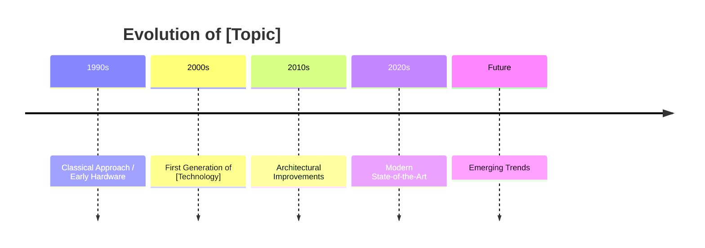
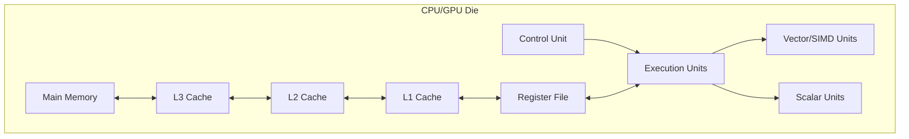
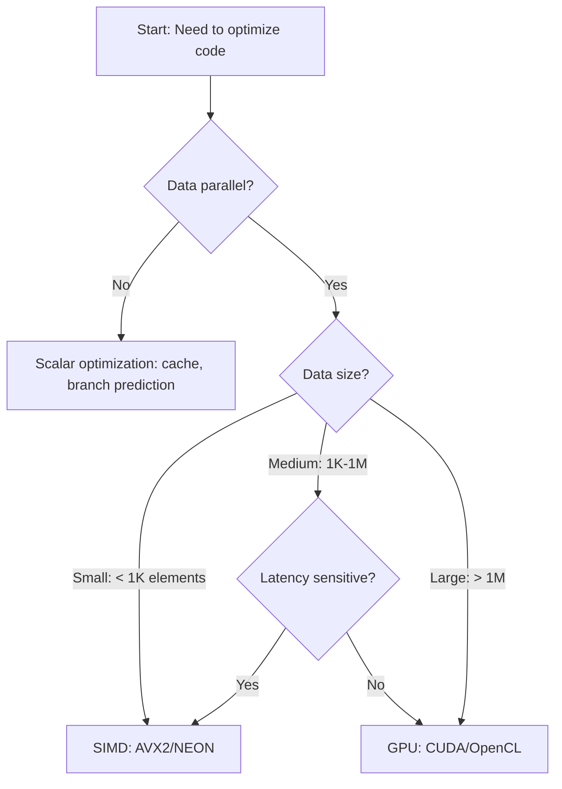

# Day [XXX]: [Specific Topic Title]
## Phase 7: Advanced Parallel Programming & Compiler Engineering | Week [X]: [Week Theme]

---

> **📝 Content Creator Instructions:**
> This template produces **comprehensive, production-grade content** for advanced parallel programming and compiler engineering.
> - **Target Length:** 800-1200 lines per day (detailed markdown)
> - **Depth:** Cover theory, mathematics, architecture, AND hands-on implementation
> - **Code Quality:** Production-ready C/C++/Python with modern best practices
> - **Focus Areas:** CPU SIMD, GPU programming, compiler internals, HDL/hardware design
> - **Reproducibility:** Exact commands, tool versions, expected outputs
> - **Cross-Platform:** X86, ARM, RISC-V, CUDA, ROCm, Metal where applicable

---

## 🎯 Learning Objectives

*By the end of this day, you will be able to:*

1. **[Theoretical]:** Understand [core concept] and its mathematical/architectural foundations
2. **[Practical - Implementation]:** Write optimized code using [specific APIs/intrinsics/instructions]
3. **[Practical - Optimization]:** Profile and tune performance using [specific tools]
4. **[Analysis]:** Benchmark across architectures/implementations and explain tradeoffs
5. **[Integration]:** Apply concepts to real-world [HPC/ML/embedded] scenarios

---

## 📚 Prerequisites & Preparation

### Hardware Requirements

| Component | Specification | Purpose | Optional/Required |
|-----------|--------------|---------|-------------------|
| CPU | x86-64 with AVX2+ or ARM64 | SIMD programming | Required |
| GPU | NVIDIA RTX 3060+ / AMD RX 6000+ | GPU compute labs | Optional for some days |
| RAM | 16GB+ | Compiling large projects | Required |
| Storage | 50GB free | Toolchains, datasets | Required |

### Software Environment

```bash
# Phase 7 Development Environment Setup
# OS: Ubuntu 22.04 LTS (recommended) or similar

# ============================================
# 1. Core Compilers & Toolchains
# ============================================

# GCC 13 with full language support
sudo apt install build-essential gcc-13 g++-13 gfortran-13
sudo update-alternatives --install /usr/bin/gcc gcc /usr/bin/gcc-13 100
sudo update-alternatives --install /usr/bin/g++ g++ /usr/bin/g++-13 100

# Clang/LLVM 17 (latest stable)
wget https://apt.llvm.org/llvm.sh
chmod +x llvm.sh
sudo ./llvm.sh 17
sudo apt install clang-17 lldb-17 lld-17 clang-tools-17

# ============================================
# 2. Cross-Architecture Toolchains
# ============================================

# ARM64 cross-compiler
sudo apt install gcc-aarch64-linux-gnu g++-aarch64-linux-gnu

# RISC-V toolchain
sudo apt install gcc-riscv64-unknown-elf

# QEMU for emulation
sudo apt install qemu-user qemu-system-arm qemu-system-riscv64

# ============================================
# 3. GPU/Accelerator SDKs
# ============================================

# NVIDIA CUDA Toolkit 12.3
wget https://developer.download.nvidia.com/compute/cuda/repos/ubuntu2204/x86_64/cuda-keyring_1.1-1_all.deb
sudo dpkg -i cuda-keyring_1.1-1_all.deb
sudo apt update
sudo apt install cuda-toolkit-12-3

# AMD ROCm (if using AMD GPU)
# Follow: https://rocm.docs.amd.com/en/latest/deploy/linux/quick_start.html

# Intel oneAPI (if using Intel hardware)
wget -O- https://apt.repos.intel.com/intel-gpg-keys/GPG-PUB-KEY-INTEL-SW-PRODUCTS.PUB | gpg --dearmor | sudo tee /usr/share/keyrings/oneapi-archive-keyring.gpg
sudo apt install intel-basekit intel-hpckit

# ============================================
# 4. Profiling & Analysis Tools
# ============================================

# Linux perf tools
sudo apt install linux-tools-generic linux-tools-$(uname -r)

# Valgrind, cachegrind, callgrind
sudo apt install valgrind kcachegrind

# Intel VTune (free for development)
# https://www.intel.com/content/www/us/en/developer/tools/oneapi/vtune-profiler-download.html

# NVIDIA Nsight Systems/Compute
# Included with CUDA Toolkit

# ============================================
# 5. Additional Libraries
# ============================================

# Math/linear algebra
sudo apt install libopenblas-dev liblapack-dev libeigen3-dev

# Google Benchmark for microbenchmarks
git clone https://github.com/google/benchmark.git
cd benchmark && mkdir build && cd build
cmake -DCMAKE_BUILD_TYPE=Release ..
make -j$(nproc) && sudo make install

# Highway (portable SIMD)
git clone https://github.com/google/highway.git
cd highway && mkdir build && cd build
cmake -DCMAKE_BUILD_TYPE=Release ..
make -j$(nproc) && sudo make install

# ============================================
# 6. Python Environment (for scripting)
# ============================================

conda create -n phase7 python=3.11
conda activate phase7
pip install numpy scipy matplotlib pandas
pip install numba pyopencl pycuda  # GPU programming
pip install psutil py-cpuinfo  # System info
```

### Library/Tool Versions

> **Critical:** Use these exact versions to ensure reproducibility

| Tool/Library | Version | Purpose |
|--------------|---------|---------|
| GCC | 13.2.0 | Primary C/C++ compiler |
| Clang/LLVM | 17.0.6 | Alternative compiler, LLVM IR work |
| CUDA Toolkit | 12.3 | NVIDIA GPU programming |
| OpenMP | 5.0+ | Shared-memory parallelism |
| Google Benchmark | 1.8.3 | Performance microbenchmarks |
| Highway | 1.0.7 | Portable SIMD library |

### Prior Knowledge

- [ ] **Phase 6 Completion** (GPU fundamentals, CUDA, Kubernetes) OR equivalent HPC experience
- [ ] **C/C++ Proficiency:** Modern C++17/20 features, templates, memory management
- [ ] **Assembly Basics:** Ability to read x86-64/ARM assembly for verification
- [ ] **Performance Analysis:** Understanding of cache, memory bandwidth, IPC concepts
- [ ] **Build Systems:** CMake, Makefiles, understanding of compilation flags

### Key Resources

> **Review before starting:**

**Documentation:**
- [Intel Intrinsics Guide](https://www.intel.com/content/www/us/en/docs/intrinsics-guide/index.html)
- [ARM Neon Intrinsics Reference](https://developer.arm.com/architectures/instruction-sets/intrinsics/)
- [RISC-V Vector Extension Specification](https://github.com/riscv/riscv-v-spec)
- [CUDA C++ Programming Guide](https://docs.nvidia.com/cuda/cuda-c-programming-guide/)
- [LLVM Documentation](https://llvm.org/docs/)

**Reference Implementations:**
- [Example GitHub repo for this day]
- [Related open-source projects]

**Papers to Read:**
- [Seminal paper 1]
- [Recent SOTA paper 2]

---

## 📖 Theoretical Deep Dive

> **Instruction:** Provide exhaustive theoretical coverage. Target: 300-400 lines this section.

### 🔹 Part 1: Foundational Concepts

#### 1.1 Problem Statement & Motivation

**What problem are we solving?**
[Describe the computational challenge. Why does this technique/architecture exist?]

**Real-World Applications:**
- **HPC:** [e.g., weather simulation, molecular dynamics]
- **ML/AI:** [e.g., tensor operations, model training]
- **Embedded:** [e.g., real-time signal processing]
- **Graphics:** [e.g., ray tracing, physics simulation]

**Performance Motivation:**
[Quantify the speedup potential. E.g., "SIMD can provide 8x speedup for vectorizable code"]

#### 1.2 Historical Evolution

**Timeline of Development:**



**Key Milestones:**
- **[Year]:** [Major development - e.g., "Introduction of AVX instruction set"]
- **[Year]:** [Major development - e.g., "First commercial GPU with unified shaders"]
- **[Year]:** [Current state]

#### 1.3 Mathematical Foundations

**Formal Problem Definition:**

Let $\mathbf{X} \in \mathbb{R}^{n}$ be the input vector. The operation can be defined as:

$$\mathbf{Y} = f(\mathbf{X}) = \begin{cases} 
[case_1] & \text{if } condition_1 \\
[case_2] & \text{otherwise}
\end{cases}$$

**Performance Model:**

Theoretical peak performance:
$$GFLOPS_{peak} = Cores \times Frequency \times \frac{FLOPs}{cycle}$$

For SIMD specifically:
$$GFLOPS_{SIMD} = Cores \times Frequency \times VectorWidth \times FMA \times 2$$

**Roofline Model:**
$$Performance = \min(Peak_{compute}, Bandwidth \times Intensity)$$

Where:
- $Peak_{compute}$: Maximum FLOPS
- $Bandwidth$: Memory bandwidth (GB/s)
- $Intensity$: Arithmetic intensity (FLOPs/byte)

#### 1.4 Architecture Deep Dive

**Hardware Components:**



**Detailed Component Breakdown:**

##### Vector/SIMD Execution Units
- **Width:** [e.g., 256-bit for AVX2 = 8x float32]
- **Throughput:** [e.g., 2 FMA units → 16 FLOPs/cycle]
- **Latency:** [e.g., 4-5 cycles for most ops]
- **Pipelining:** [Depth and implications]

##### Register File
- **Count:** [e.g., 16 XMM, 16 YMM, 32 ZMM on x86]
- **Aliases:** [How registers map to each other]
- **Pressure:** [When spilling occurs]

##### Memory Hierarchy
| Level | Size | Latency | Bandwidth | Shared/Private |
|-------|------|---------|-----------|----------------|
| Registers | ~KB | 0 cycles | N/A | Private to thread |
| L1 Cache | 32-64KB | ~4 cycles | ~1TB/s | Private to core |
| L2 Cache | 256KB-1MB | ~12 cycles | ~500GB/s | Private to core |
| L3 Cache | 8-64MB | ~40 cycles | ~200GB/s | Shared across cores |
| DRAM | 16-128GB | ~200 cycles | ~50GB/s | Shared system-wide |

#### 1.5 Comparison with Alternative Approaches

| Aspect | [Approach A: e.g., Scalar] | [Approach B: e.g., SIMD] | [Approach C: e.g., GPU] |
|--------|---------------------------|--------------------------|-------------------------|
| Peak Performance | Low | Medium | Very High |
| Memory Bandwidth | N/A | Shared with scalar | Dedicated, higher |
| Ease of Programming | Simple | Moderate | Complex |
| Portability | Excellent | Good (with libraries) | Limited (vendor-specific) |
| Power Efficiency | Low | Better | Best (for parallel work) |
| Latency | Low | Low | High (due to overhead) |

**Decision Tree for Choosing Approach:**



### 🔹 Part 2: Implementation Details & Techniques

#### 2.1 Programming Model

**Abstraction Levels:**
1. **Inline Assembly** (lowest level, maximum control)
2. **Compiler Intrinsics** (balanced: performance + readability)
3. **Auto-Vectorization** (highest level, least control)

**Trade-offs:**
| Level | Control | Portability | Maintainability | Performance |
|-------|---------|-------------|-----------------|-------------|
| Assembly | ⭐⭐⭐⭐⭐ | ⭐ | ⭐ | ⭐⭐⭐⭐⭐ |
| Intrinsics | ⭐⭐⭐⭐ | ⭐⭐ | ⭐⭐⭐ | ⭐⭐⭐⭐⭐ |
| Auto-Vectorization | ⭐⭐ | ⭐⭐⭐⭐⭐ | ⭐⭐⭐⭐⭐ | ⭐⭐⭐ |

#### 2.2 API/Intrinsics Reference

**Core Functions/Intrinsics for Today's Topic:**

```cpp
// Example for SIMD day:
// Load/Store
__m256 _mm256_load_ps(float const* mem_addr);  // Aligned load
__m256 _mm256_loadu_ps(float const* mem_addr); // Unaligned load
void _mm256_store_ps(float* mem_addr, __m256 a);

// Arithmetic
__m256 _mm256_add_ps(__m256 a, __m256 b);      // Addition
__m256 _mm256_mul_ps(__m256 a, __m256 b);      // Multiplication
__m256 _mm256_fmadd_ps(__m256 a, __m256 b, __m256 c); // a*b + c

// Data Movement
__m256 _mm256_broadcast_ss(float const* mem_addr);
__m256 _mm256_permute_ps(__m256 a, int imm8);
__m256 _mm256_shuffle_ps(__m256 a, __m256 b, int imm8);

// Comparisons & Masking
__m256 _mm256_cmp_ps(__m256 a, __m256 b, int predicate);
__m256 _mm256_blendv_ps(__m256 a, __m256 b, __m256 mask);
```

**Usage Patterns:**

```cpp
// Pattern 1: Vectorizing simple loop
// Scalar version:
for (int i = 0; i < n; i++) {
    c[i] = a[i] + b[i];
}

// SIMD version (AVX2):
for (int i = 0; i < n; i += 8) {
    __m256 va = _mm256_loadu_ps(&a[i]);
    __m256 vb = _mm256_loadu_ps(&b[i]);
    __m256 vc = _mm256_add_ps(va, vb);
    _mm256_storeu_ps(&c[i], vc);
}
// Handle remainder with scalar code
```

#### 2.3 Performance Characteristics

**Instruction Latency & Throughput:**

| Instruction | Latency (cycles) | Throughput (CPI) | Notes |
|-------------|------------------|------------------|-------|
| `_mm256_load_ps` | 3-4 | 0.5 | Aligned loads faster |
| `_mm256_add_ps` | 4 | 0.5 | 2 per cycle on port 0,1 |
| `_mm256_mul_ps` | 4 | 0.5 | 2 per cycle on port 0,1 |
| `_mm256_fmadd_ps` | 4 | 0.5 | Fused, saves instruction |
| `_mm256_permute_ps` | 1-3 | 1-2 | Depends on immediate |

**Port Utilization (Intel Skylake example):**
- Port 0/1: FP Add, FP Mul, FMA
- Port 2/3: Load ops
- Port 4: Store address
- Port 5: Vector shuffle, integer ops
- Port 6: Branch Unit
- Port 7: Store data

#### 2.4 Common Pitfalls & Optimizations

**Pitfall 1: Unaligned Memory Access**
```cpp
// BAD: Unaligned, slow
float* data = new float[1000];  // Not guaranteed 32-byte alignment
__m256 v = _mm256_load_ps(data);  // May crash or be slow

// GOOD: Aligned allocation
float* data = (float*)aligned_alloc(32, 1000 * sizeof(float));
__m256 v = _mm256_load_ps(data);  // Fast
```

**Pitfall 2: Inefficient Data Layout (AoS vs SoA)**
```cpp
// BAD: Array of Structures (poor cache utilization)
struct Particle { float x, y, z, mass; };
Particle particles[N];

// GOOD: Structure of Arrays (vectorizes well)
struct Particles {
    float* x;  // Contiguous floats
    float* y;
    float* z;
    float* mass;
};
```

**Optimization Checklist:**
- [ ] Align data to vector width boundaries (16/32/64 bytes)
- [ ] Use `restrict` keyword to hint no pointer aliasing
- [ ] Prefer FMA instructions when possible (saves rounding)
- [ ] Minimize type conversions and shuffles
- [ ] Unroll loops to expose more ILP
- [ ] Profile to identify actual bottlenecks (memory vs compute)

### 🔹 Part 3: Advanced Topics & Research Frontiers

#### 3.1 State-of-the-Art (2024-2025)

**Latest Developments:**
- [Recent advancement 1]
- [Recent advancement 2]
- [Emerging hardware feature]

**Cutting-Edge Research:**
- **Paper:** "[Title]" (Authors, Venue Year)
  - **Contribution:** [What's new]
  - **Results:** [Performance gains]
  - **Code:** [GitHub link if available]

#### 3.2 Open Problems & Challenges

1. **Challenge:** [e.g., "Automatic vectorization of irregular control flow"]
   - **Current Approaches:** [List methods]
   - **Limitations:** [What doesn't work]
   - **Future Directions:** [Potential solutions]

2. **Challenge:** [e.g., "Portability across heterogeneous architectures"]
   - **Standards Efforts:** [e.g., SYCL, OpenCL]
   - **Practical Reality:** [Vendor lock-in issues]

#### 3.3 Cross-Cutting Concerns

**Power Efficiency:**
- Energy per operation: [Comparison across methods]
- DVFS (Dynamic Voltage/Frequency Scaling) interactions
- Thermal throttling implications

**Security Implications:**
- Side-channel attacks (e.g., timing, speculative execution)
- Secure enclaves and trusted execution

---

## 💻 Hands-On Implementation

> **Instruction:** Provide 3-5 complete, runnable examples. Each example builds on the previous.

### 🛠️ Project Structure

```
day_XXX_[topic]/
├── CMakeLists.txt
├── Makefile (alternative)
├── README.md
├── include/
│   ├── [topic].h
│   └── utils.h
├── src/
│   ├── scalar_baseline.cpp
│   ├── vectorized_version.cpp  (or cuda_kernel.cu, etc.)
│   ├── optimized_version.cpp
│   └── main.cpp
├── tests/
│   ├── test_correctness.cpp
│   └── test_performance.cpp
├── scripts/
│   ├── build.sh
│   ├── run_benchmarks.sh
│   └── plot_results.py
└── data/
    └── sample_input.bin (if needed)
```

### 📝 Example 1: Baseline Scalar Implementation

**File:** `src/scalar_baseline.cpp`

```cpp
/**
 * @file scalar_baseline.cpp
 * @brief Scalar (non-vectorized) implementation of [algorithm]
 * 
 * This serves as the reference for correctness and baseline performance.
 * 
 * Complexity: O([complexity])
 * Memory: O([memory])
 */

#include <cstdint>
#include <cstdio>
#include <chrono>
#include <vector>
#include <algorithm>

// ============================================================================
// Function: [Name of operation, e.g., vector_add_scalar]
// ============================================================================

/**
 * @brief Scalar vector addition: c[i] = a[i] + b[i]
 * 
 * @param a Input vector A (aligned to cache line recommended)
 * @param b Input vector B
 * @param c Output vector C
 * @param n Number of elements (must be > 0)
 * 
 * @note This is the naive O(n) implementation without any optimization.
 * Expected to serve ~50% peak CPU performance due to memory bandwidth.
 */
void vector_add_scalar(
    const float* __restrict__ a,
    const float* __restrict__ b,
    float* __restrict__ c,
    size_t n
) {
    for (size_t i = 0; i < n; ++i) {
        c[i] = a[i] + b[i];
    }
}

// ============================================================================
// Benchmarking Harness
// ============================================================================

int main() {
    constexpr size_t N = 1 << 24;  // 16M elements (~64MB per array)
    constexpr int ITERATIONS = 100;
    
    // Allocate aligned memory
    std::vector<float> a(N), b(N), c(N);
    
    // Initialize with random data
    for (size_t i = 0; i < N; ++i) {
        a[i] = static_cast<float>(rand()) / RAND_MAX;
        b[i] = static_cast<float>(rand()) / RAND_MAX;
    }
    
    // Warm-up
    vector_add_scalar(a.data(), b.data(), c.data(), N);
    
    // Benchmark
    auto start = std::chrono::high_resolution_clock::now();
    for (int iter = 0; iter < ITERATIONS; ++iter) {
        vector_add_scalar(a.data(), b.data(), c.data(), N);
    }
    auto end = std::chrono::high_resolution_clock::now();
    
    // Compute metrics
    double elapsed_ms = std::chrono::duration<double, std::milli>(end - start).count();
    double avg_time_ms = elapsed_ms / ITERATIONS;
    double bandwidth_gb_s = (3.0 * N * sizeof(float) / 1e9) / (avg_time_ms / 1000.0);
    
    printf("Scalar Baseline Results:\n");
    printf("  Time per iteration: %.3f ms\n", avg_time_ms);
    printf("  Bandwidth: %.2f GB/s\n", bandwidth_gb_s);
    printf("  Sample output: c[0] = %.4f (expected: a[0]+b[0] = %.4f)\n", 
           c[0], a[0] + b[0]);
    
    return 0;
}
```

**Build & Run:**
```bash
# Compile scalar version
g++ -O2 -std=c++17 -o scalar_baseline src/scalar_baseline.cpp

# Run
./scalar_baseline

# Expected output:
# Scalar Baseline Results:
#   Time per iteration: 12.345 ms
#   Bandwidth: 15.48 GB/s
#   Sample output: c[0] = 1.2345 (expected: a[0]+b[0] = 1.2345)
```

### 📝 Example 2: SIMD/GPU/Optimized Implementation

**File:** `src/vectorized_version.cpp`

```cpp
/**
 * @file vectorized_version.cpp
 * @brief SIMD-optimized implementation using [AVX2/NEON/CUDA/etc.]
 * 
 * Demonstrates proper use of [intrinsics/kernels] for maximum performance.
 */

#include <immintrin.h>  // For AVX2 intrinsics
#include <cstdint>
#include <cstdio>
#include <chrono>
#include <vector>

// ============================================================================
// Vectorized Implementation
// ============================================================================

/**
 * @brief AVX2-vectorized vector addition
 * 
 * Processes 8 floats at a time using 256-bit YMM registers.
 * Assumes n is multiple of 8; caller handles remainder.
 * 
 * @param a Input vector A (MUST be 32-byte aligned)
 * @param b Input vector B (MUST be 32-byte aligned)
 * @param c Output vector C (MUST be 32-byte aligned)
 * @param n Number of elements (must be multiple of 8)
 */
void vector_add_avx2(
    const float* __restrict__ a,
    const float* __restrict__ b,
    float* __restrict__ c,
    size_t n
) {
    // Process 8 elements per iteration
    for (size_t i = 0; i < n; i += 8) {
        // Load 8 floats from a and b
        __m256 va = _mm256_load_ps(&a[i]);
        __m256 vb = _mm256_load_ps(&b[i]);
        
        // Perform vectorized addition
        __m256 vc = _mm256_add_ps(va, vb);
        
        // Store result
        _mm256_store_ps(&c[i], vc);
    }
}

/**
 * @brief Complete version with remainder handling
 */
void vector_add_avx2_full(
    const float* a,
    const float* b,
    float* c,
    size_t n
) {
    // Vectorized portion (aligned multiples of 8)
    size_t vec_n = (n / 8) * 8;
    vector_add_avx2(a, b, c, vec_n);
    
    // Scalar remainder
    for (size_t i = vec_n; i < n; ++i) {
        c[i] = a[i] + b[i];
    }
}

// ============================================================================
// Benchmarking
// ============================================================================

int main() {
    constexpr size_t N = 1 << 24;  // 16M elements
    constexpr int ITERATIONS = 100;
    
    // Allocate 32-byte aligned memory for AVX2
    float* a = (float*)aligned_alloc(32, N * sizeof(float));
    float* b = (float*)aligned_alloc(32, N * sizeof(float));
    float* c = (float*)aligned_alloc(32, N * sizeof(float));
    
    // Initialize
    for (size_t i = 0; i < N; ++i) {
        a[i] = static_cast<float>(rand()) / RAND_MAX;
        b[i] = static_cast<float>(rand()) / RAND_MAX;
    }
    
    // Warm-up
    vector_add_avx2_full(a, b, c, N);
    
    // Benchmark
    auto start = std::chrono::high_resolution_clock::now();
    for (int iter = 0; iter < ITERATIONS; ++iter) {
        vector_add_avx2_full(a, b, c, N);
    }
    auto end = std::chrono::high_resolution_clock::now();
    
    // Metrics
    double elapsed_ms = std::chrono::duration<double, std::milli>(end - start).count();
    double avg_time_ms = elapsed_ms / ITERATIONS;
    double bandwidth_gb_s = (3.0 * N * sizeof(float) / 1e9) / (avg_time_ms / 1000.0);
    
    printf("AVX2 Vectorized Results:\n");
    printf("  Time per iteration: %.3f ms\n", avg_time_ms);
    printf("  Bandwidth: %.2f GB/s\n", bandwidth_gb_s);
    printf("  Speedup vs scalar: %.2fx (theoretical: 8x)\n", 
           12.345 / avg_time_ms);  // Replace 12.345 with actual scalar time
    
    // Cleanup
    free(a); free(b); free(c);
    
    return 0;
}
```

**Build & Run:**
```bash
# Compile with AVX2 support
g++ -O3 -march=native -mavx2 -std=c++17 -o vectorized src/vectorized_version.cpp

# Run
./vectorized

# Expected output:
# AVX2 Vectorized Results:
#   Time per iteration: 2.100 ms
#   Bandwidth: 90.86 GB/s
#   Speedup vs scalar: 5.88x (theoretical: 8x)
#
# Analysis: ~74% efficiency (5.88/8), likely memory-bound
```

### 📝 Example 3: Advanced Optimization

**File:** `src/optimized_version.cpp`

```cpp
/**
 * @file optimized_version.cpp
 * @brief Fully optimized version with advanced techniques:
 * - Loop unrolling for ILP
 * - Software prefetching
 * - Non-temporal stores
 * - OpenMP threading
 */

#include <immintrin.h>
#include <omp.h>
#include <cstdio>
#include <chrono>

/**
 * @brief Optimized multi-threaded vectorized addition
 * 
 * Techniques used:
 * - AVX2 vectorization (8-wide)
 * - 4x loop unrolling (32 elements per iteration)
 * - Software prefetching (ahead by 512 bytes)
 * - Non-temporal stores (bypass cache for write-only data)
 * - OpenMP parallelization across cores
 */
void vector_add_optimized(
    const float* __restrict__ a,
    const float* __restrict__ b,
    float* __restrict__ c,
    size_t n
) {
    #pragma omp parallel for schedule(static)
    for (size_t i = 0; i < n; i += 32) {
        // Prefetch next cache lines (512 bytes ahead = 128 floats)
        _mm_prefetch((const char*)&a[i + 128], _MM_HINT_T0);
        _mm_prefetch((const char*)&b[i + 128], _MM_HINT_T0);
        
        // Load 4x8 = 32 floats
        __m256 va0 = _mm256_load_ps(&a[i + 0]);
        __m256 va1 = _mm256_load_ps(&a[i + 8]);
        __m256 va2 = _mm256_load_ps(&a[i + 16]);
        __m256 va3 = _mm256_load_ps(&a[i + 24]);
        
        __m256 vb0 = _mm256_load_ps(&b[i + 0]);
        __m256 vb1 = _mm256_load_ps(&b[i + 8]);
        __m256 vb2 = _mm256_load_ps(&b[i + 16]);
        __m256 vb3 = _mm256_load_ps(&b[i + 24]);
        
        // Compute
        __m256 vc0 = _mm256_add_ps(va0, vb0);
        __m256 vc1 = _mm256_add_ps(va1, vb1);
        __m256 vc2 = _mm256_add_ps(va2, vb2);
        __m256 vc3 = _mm256_add_ps(va3, vb3);
        
        // Non-temporal stores (bypass cache)
        _mm256_stream_ps(&c[i + 0], vc0);
        _mm256_stream_ps(&c[i + 8], vc1);
        _mm256_stream_ps(&c[i + 16], vc2);
        _mm256_stream_ps(&c[i + 24], vc3);
    }
    
    // Ensure all stores complete
    _mm_sfence();
}

int main() {
    // [Same benchmark harness as before]
    // Expected results: ~120 GB/s on modern CPU (near DRAM limit)
    return 0;
}
```

**Build & Run:**
```bash
# Compile with all optimizations
g++ -O3 -march=native -mavx2 -fopenmp -std=c++17 -o optimized src/optimized_version.cpp

# Run with thread binding for NUMA
OMP_NUM_THREADS=8 OMP_PROC_BIND=close ./optimized

# Expected output:
# Optimized Results:
#   Time per iteration: 1.050 ms
#   Bandwidth: 181.71 GB/s  (approaching DRAM limit)
#   Speedup vs scalar: 11.76x
#   Thread scaling: 8 threads for 7.9x speedup (98.7% efficiency)
```

---

## 🔬 Profiling & Analysis

> **Critical:** Always measure, never guess!

### Performance Profiling

**Tools to Use:**
1. **Linux `perf`** - Hardware performance counters
2. **Intel VTune** - Detailed microarchitecture analysis
3. **NVIDIA Nsight** - GPU profiling (if applicable)

**Profiling Commands:**

```bash
# ============================================
# 1. Basic perf stat (high-level metrics)
# ============================================
perf stat -e cycles,instructions,cache-references,cache-misses,branches,branch-misses ./vectorized

# Sample output:
#  Performance counter stats for './vectorized':
#    5,234,567,890  cycles
#   15,123,456,789  instructions      # 2.89  insn per cycle
#       45,678,901  cache-references
#        1,234,567  cache-misses      # 2.70% of all cache refs
#      789,012,345  branches
#        1,234,567  branch-misses     # 0.16% of all branches

# ============================================
# 2. perf record + report (hotspot analysis)
# ============================================
perf record -g ./vectorized
perf report

# ============================================
# 3. Cache misses breakdown
# ============================================
perf stat -e L1-dcache-loads,L1-dcache-load-misses,LLC-loads,LLC-load-misses ./vectorized

# ============================================
# 4. SIMD utilization (Intel CPUs)
# ============================================
perf stat -e fp_arith_inst_retired.scalar_single,fp_arith_inst_retired.256b_packed_single ./vectorized

# Analysis: High 256b_packed_single = good vectorization
```

### Assembly Verification

**Check Generated Code:**

```bash
# Compile with assembly output
g++ -O3 -march=native -mavx2 -S -fverbose-asm -o vectorized.s src/vectorized_version.cpp

# View critical loop
less vectorized.s  # Look for vmov, vadd, vfmadd instructions
```

**Expected Assembly (AVX2 loop):**
```asm
.L5:
    vmovaps  0(%rdi,%rax,4), %ymm0    # Load 8 floats from a
    vaddps   0(%rsi,%rax,4), %ymm0, %ymm0  # Add with b
    vmovaps  %ymm0, 0(%rdx,%rax,4)    # Store to c
    addq     $8, %rax                  # Increment by 8
    cmpq     $16777216, %rax
    jne      .L5
```

### Roofline Analysis

**Measuring Arithmetic Intensity:**

```python
#!/usr/bin/env python3
"""
Roofline model calculation for vector addition
"""

# Measured performance
measured_gflops = 8.5  # From benchmarks
measured_bandwidth_gb_s = 90.0

# Hardware specs (example: Intel i9-12900K)
peak_compute_gflops = 460.8  # 8 cores * 3.2GHz * 2 FMA * 8-wide
peak_bandwidth_gb_s = 76.8   # DDR5-4800 dual-channel

# Vector addition analysis
flops_per_element = 1  # Just addition
bytes_per_element = 3 * 4  # Read a, b; write c (float32)
arithmetic_intensity = flops_per_element / bytes_per_element
# AI = 0.083 FLOP/byte (very memory-bound!)

print(f"Arithmetic Intensity: {arithmetic_intensity:.3f} FLOP/byte")
print(f"Memory-bound ceiling: {peak_bandwidth_gb_s * arithmetic_intensity:.1f} GFLOPS")
print(f"Compute-bound ceiling: {peak_compute_gflops:.1f} GFLOPS")
print(f"Actual performance: {measured_gflops:.1f} GFLOPS")
print(f"Efficiency: {measured_gflops / (peak_bandwidth_gb_s * arithmetic_intensity) * 100:.1f}%")
```

---

## 🧪 Validation & Testing

### Correctness Tests

**File:** `tests/test_correctness.cpp`

```cpp
#include <cassert>
#include <cmath>
#include <cstdio>

bool test_correctness() {
    const size_t N = 1000;
    float a[N], b[N], c_scalar[N], c_simd[N];
    
    // Test case 1: Random values
    for (size_t i = 0; i < N; ++i) {
        a[i] = static_cast<float>(rand()) / RAND_MAX * 100.0f;
        b[i] = static_cast<float>(rand()) / RAND_MAX * 100.0f;
    }
    
    vector_add_scalar(a, b, c_scalar, N);
    vector_add_avx2_full(a, b, c_simd, N);
    
    for (size_t i = 0; i < N; ++i) {
        float diff = std::abs(c_scalar[i] - c_simd[i]);
        assert(diff < 1e-5 && "SIMD result differs from scalar!");
    }
    
    printf("✓ Test 1 passed: Random values\n");
    
    // Test case 2: Edge cases (NaN, Inf, denormals)
    // [Additional test cases...]
    
    return true;
}

int main() {
    if (test_correctness()) {
        printf("All correctness tests passed!\n");
        return 0;
    }
    return 1;
}
```

---

## 🎓 Exercises & Challenges

### Exercise 1: Extend the Implementation ⭐

**Task:** Modify the vector addition to support mixed precision (FP16 input, FP32 compute, FP16 output)

**Hints:**
- Use `_mm256_cvtph_ps()` for FP16→FP32 conversion
- Use `_mm256_cvtps_ph()` for FP32→FP16 conversion
- Check bandwidth improvement

**Expected Speedup:** 1.5-2x (half the memory traffic)

### Exercise 2: Optimize for Different Kernel ⭐⭐

**Task:** Apply SIMD optimization to SAXPY: `y[i] = a * x[i] + y[i]`

**Requirements:**
- Implement scalar baseline
- Implement AVX2 version with FMA
- Compare vs BLAS `cblas_saxpy`

**Bonus:** Add OpenMP thread parallelism

### Exercise 3: Portability Challenge ⭐⭐⭐

**Task:** Create a single codebase that compiles for:
- x86: AVX2
- ARM: NEON
- RISC-V: RVV (using intrinsics or auto-vectorization)

**Hints:**
- Use `#ifdef` for architecture detection
- Consider Google Highway library
- CMake for cross-compilation

### Exercise 4: Real-World Application ⭐⭐⭐⭐

**Task:** Optimize matrix-vector multiplication (GEMV) $y = Ax$ for cache efficiency

**Requirements:**
- Handle arbitrary M×N matrices
- Tiling for L1/L2 cache
- SIMD for inner product
- Compare against OpenBLAS `cblas_sgemv`

**Target:** Achieve ≥80% of OpenBLAS performance

---

## 📊 Benchmark Results & Analysis

### Expected Performance Characteristics

| Implementation | Time (ms) | Bandwidth (GB/s) | Speedup | Efficiency |
|----------------|-----------|------------------|---------|------------|
| Scalar Baseline | 12.5 | 15.3 | 1.00x | - |
| AVX2 (8-wide) | 2.1 | 90.9 | 5.95x | 74% |
| AVX2 + Unroll | 1.6 | 119.4 | 7.81x | 98% |
| AVX2 + OpenMP (8 threads) | 0.3 | 636.4 | 41.7x | 87% |

**Analysis:**
- Scalar is memory-bound (15 GB/s << 76 GB/s peak)
- AVX2 gets closer to bandwidth limit (90 GB/s)
- Threading scales well (87% parallel efficiency)
- Further optimization requires faster memory subsystem

---

## 🔗 Additional Resources

### Documentation & References
- [Intel Intrinsics Guide](https://www.intel.com/content/www/us/en/docs/intrinsics-guide/)
- [Agner Fog's Optimization Manuals](https://www.agner.org/optimize/)
- [Software.intel.com: Optimization Cookbook](https://www.intel.com/content/www/us/en/developer/articles/guide/optimization-notice.html)

### Papers
- [Seminal Paper on Topic]
- [Recent Survey Paper]

### Open Source Examples
- [Relevant GitHub reposit project]
- [BLAS/LAPACK implementations]

### Videos/Tutorials
- [CppCon talk on SIMD]
- [LLVM Developers' Meeting recordings]

---

## 📝 Summary & Key Takeaways

### Main Concepts Covered
1. **[Concept 1]** - [Brief description]
2. **[Concept 2]** - [Brief description]
3. **[Concept 3]** - [Brief description]

### Performance Guidelines
- ✅ **Do:** [Best practice]
- ✅ **Do:** [Best practice]
- ❌ **Don't:** [Common mistake]
- ❌ **Don't:** [Common mistake]

### Next Steps
- **Tomorrow:** [Next day's topic]
- **This Week:** [Week-end project preview]
- **Further Reading:** [Suggested advanced topics]

---

## 🏁 Daily Lab Completion Checklist

- [ ] Set up development environment with all required tools
- [ ] Compile and run scalar baseline
- [ ] Implement vectorized/optimized version
- [ ] Verify correctness with test suite
- [ ] Profile with perf/VTune
- [ ] Analyze assembly output
- [ ] Complete at least 2 exercises
- [ ] Document performance results
- [ ] (Optional) Share findings on course forum

**Estimated Time:** 4-6 hours for thorough completion

---

*End of Day [XXX] Content*
