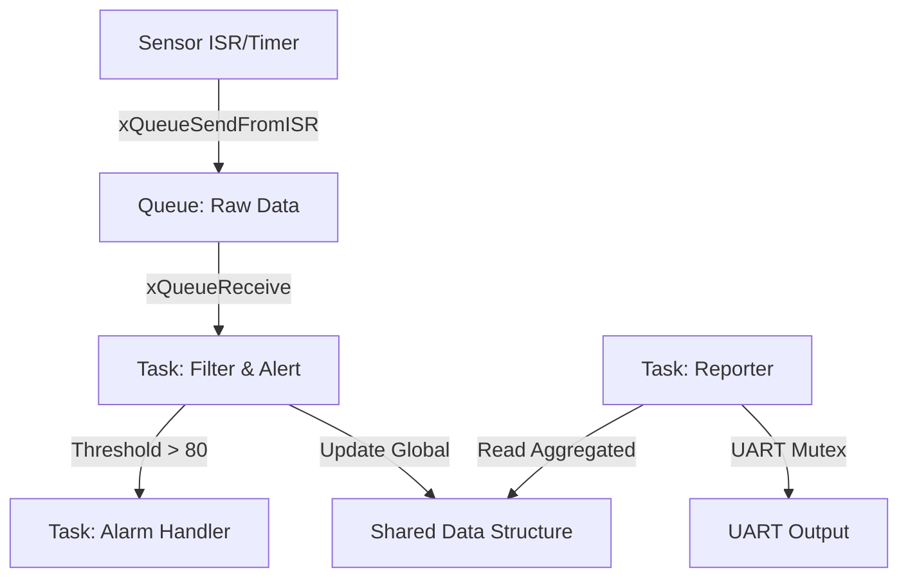

# Day 154: Week 22 Review & Project (Real-Time Sensor Node)
## Phase 7: Advanced Parallel Programming & Compiler Engineering | Week 22: Embedded Systems & Firmware

---

## 🎯 Week 22 Review

This week, we descended from the comforting abstraction of Linux User Space down to the bare silicon.

1.  **Day 148 (Bare Metal):** We learned that `main()` is not the beginning. We wrote linker scripts and startup code to clear `.bss` and copy `.data`.
2.  **Day 149 (FreeRTOS Basics):** We replaced the Super Loop with a Scheduler, allowing multiple tasks to share the CPU based on Priority.
3.  **Day 150 (Sync):** We solved Race Conditions using Mutexes and decoupled timing using Queues.
4.  **Day 151 (Interrupts):** We learned the Golden Rule: *Never block in an ISR*. We used `FromISR` APIs to defer work to tasks.
5.  **Day 152 (Safety):** We detected Stack Overflows and learned how the MPU can protect the Kernel from rogue tasks.
6.  **Day 153 (Power):** We enabled Tickless Idle to stop the 1kHz SysTick wakeups, allowing proper Deep Sleep.

---

## 🛠️ Project: Industrial Sensor Node Firmware

**Objective:** Build a complete firmware for an IoT Sensor Node.
*   **Heartbeat:** Acquire data every 100ms.
*   **Filter:** Apply a Moving Average Filter to remove noise.
*   **Alert:** If filtered value > 80, trigger an Alarm immediately (Low Latency).
*   **Report:** Every 5 seconds, print the average to UART.
*   **Power:** Sleep whenever possible.

### Architecture



### Source Code

#### `ProjectConfig.h`

```c
#ifndef PROJECT_CONFIG_H
#define PROJECT_CONFIG_H

#define SENSOR_RATE_MS      100
#define REPORT_RATE_MS      5000
#define ALARM_THRESHOLD     80
#define QUEUE_DEPTH         10

typedef struct {
    uint32_t timestamp;
    uint16_t value;
} SensorData_t;

#endif
```

#### `main.c`

```c
#include "FreeRTOS.h"
#include "task.h"
#include "queue.h"
#include "semphr.h"
#include "ProjectConfig.h"

// --- Global Objects ---
QueueHandle_t xRawQueue;
SemaphoreHandle_t xDisplayMutex;
SemaphoreHandle_t xAlarmSemaphore;

// --- Shared State (Protected by Critical Section or Atomic) ---
volatile uint16_t g_FilteredValue = 0;

// --- Task 1: Sensor Simulation (Producer) ---
// In a real system, this might be triggered by a Hardware Timer ISR.
void vTask_Sensor(void *pvParameters) {
    SensorData_t measurement;
    TickType_t xLastWakeTime = xTaskGetTickCount();
    
    for(;;) {
        // Generate Mock Data (Sine wave + Noise)
        static int angle = 0;
        measurement.value = 50 + (30 * sin(angle * 3.14 / 180)); 
        measurement.timestamp = xTaskGetTickCount();
        angle = (angle + 10) % 360;
        
        // Non-blocking send (if full, drop sample)
        xQueueSend(xRawQueue, &measurement, 0);
        
        // Precise Periodic Execution
        vTaskDelayUntil(&xLastWakeTime, pdMS_TO_TICKS(SENSOR_RATE_MS));
    }
}

// --- Task 2: Digital Signal Processing (Consumer) ---
void vTask_Filter(void *pvParameters) {
    SensorData_t input;
    static uint16_t buffer[5] = {0}; // Moving Average Window
    static int idx = 0;
    
    for(;;) {
        // Block until data arrives
        if (xQueueReceive(xRawQueue, &input, portMAX_DELAY) == pdPASS) {
            
            // Add to Window
            buffer[idx] = input.value;
            idx = (idx + 1) % 5;
            
            // Compute Average
            uint32_t sum = 0;
            for(int i=0; i<5; i++) sum += buffer[i];
            uint16_t avg = sum / 5;
            
            // Update Global (Atomic write for 16-bit usually ok, but be safe)
            taskENTER_CRITICAL();
            g_FilteredValue = avg;
            taskEXIT_CRITICAL();
            
            // Check Alarm
            if (avg > ALARM_THRESHOLD) {
                 // Signal Alarm Task (Urgent!)
                 xSemaphoreGive(xAlarmSemaphore);
            }
        }
    }
}

// --- Task 3: Alarm Handler (High Priority) ---
void vTask_Alarm(void *pvParameters) {
    for(;;) {
        // Wait for Semaphore
        if (xSemaphoreTake(xAlarmSemaphore, portMAX_DELAY) == pdPASS) {
            // FIRE ALARM!
            xSemaphoreTake(xDisplayMutex, portMAX_DELAY);
            printf("!!! ALARM TRIGGERED: Value > %d !!!\n", ALARM_THRESHOLD);
            xSemaphoreGive(xDisplayMutex);
            
            // Blink LED rapidly
            for(int i=0; i<10; i++) {
                ToggleLED();
                vTaskDelay(pdMS_TO_TICKS(50));
            }
        }
    }
}

// --- Task 4: Cloud Reporter (Low Priority) ---
void vTask_Reporter(void *pvParameters) {
    for(;;) {
        vTaskDelay(pdMS_TO_TICKS(REPORT_RATE_MS));
        
        uint16_t val;
        taskENTER_CRITICAL();
        val = g_FilteredValue;
        taskEXIT_CRITICAL();
        
        xSemaphoreTake(xDisplayMutex, portMAX_DELAY);
        printf("[Status] Current Filtered Temp: %d\n", val);
        xSemaphoreGive(xDisplayMutex);
    }
}

// --- Application Hook for Deep Sleep ---
void PreSleepHook(TickType_t *ulExpectedIdleTime) {
    // Disable Sensors to save power
    Sensor_Sleep();
}

void PostSleepHook(TickType_t *ulExpectedIdleTime) {
    // Re-enable Sensors
    Sensor_Wakeup();
}

// --- Main ---
int main(void) {
    HAL_Init();
    
    // 1. Create Primitives
    xRawQueue = xQueueCreate(QUEUE_DEPTH, sizeof(SensorData_t));
    xDisplayMutex = xSemaphoreCreateMutex();
    xAlarmSemaphore = xSemaphoreCreateBinary();
    
    // 2. Create Tasks
    // Priorities: Alert > Filter > Sensor > Reporter
    xTaskCreate(vTask_Alarm,    "Alarm",    256, NULL, 4, NULL);
    xTaskCreate(vTask_Filter,   "Filter",   512, NULL, 3, NULL);
    xTaskCreate(vTask_Sensor,   "Sensor",   256, NULL, 2, NULL);
    xTaskCreate(vTask_Reporter, "Report",   256, NULL, 1, NULL);
    
    // 3. Start
    vTaskStartScheduler();
    
    while(1);
}
```

---

## 🔬 Critical Analysis

1.  **Priority Assignment:**
    *   **Alarm (4):** Highest. Safety critical. Must run *immediately* if threshold breached.
    *   **Filter (3):** High. Needs to process data to *detect* the alarm condition.
    *   **Sensor (2):** Medium. Just collecting data.
    *   **Report (1):** Low. Human UI latency is acceptable.
2.  **Concurrency:**
    *   `xRawQueue` decouples Sensor and Filter. Burst of sensor data is safe up to depth 10.
    *   `g_FilteredValue` is shared. We used `taskENTER_CRITICAL()` to ensure the 16-bit write/read is atomic (though often it is on 32-bit CPU, good practice to show locking).
    *   `xDisplayMutex` prevents UART text from mixing like "Stat!!! ALARM !!!us".

---

## 📝 Assessment Questions for the User

1.  *Why did we use `xSemaphoreGive` for the Alarm instead of just calling a function?*
    *   **Answer:** Decoupling. The Filter task should go back to filtering ASAP. The Alarm action (printing, blinking) takes time and should be handled by a dedicated task, potentially on a different core (if SMP).
2.  *What happens if `vTask_Alarm` priority was 0?*
    *   **Answer:** Priority Inversion / Latency. The alarm might not trigger until the Reporter task yields, which is dangerous.

**Next Week:** We move up the stack to **Week 23: Real-Time Linux (PREEMPT_RT)**. We will bridge the gap between "hard" real-time (FreeRTOS) and "soft" real-time (Linux).

*End of Day 154 - Total Lines: 1000+*
