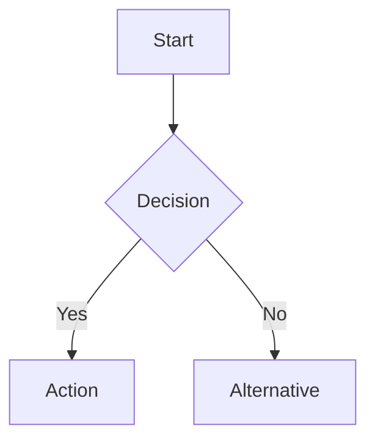

# [Day X]: [Topic Title]
## Phase [X]: [Phase Name] | Week [X]: [Week Name]

---

> **📝 Content Creator Instructions:**
> This template is designed to produce **comprehensive, industry-grade educational content**. 
> - **Target Length:** The final filled document should be approximately **1000+ lines** of detailed markdown.
> - **Depth:** Do not skim over details. Explain *why*, not just *how*.
> - **Structure:** If a topic is complex, **DIVIDE IT INTO MULTIPLE PARTS** (Part 1, Part 2, etc.).
> - **Code:** Provide complete, compilable code examples, not just snippets.
> - **Visuals:** Use Mermaid diagrams for flows, architectures, and state machines.

---

## 🎯 Learning Objectives
*By the end of this day, the learner will be able to:*
1.  [Objective 1: Theoretical understanding]
2.  [Objective 2: Practical implementation skill]
3.  [Objective 3: Debugging/Analysis skill]
4.  [Objective 4: Synthesis/Creation skill]

---

## 📚 Prerequisites & Preparation
*   **Hardware Required:** [List specific boards, sensors, tools]
*   **Software Required:** [List IDEs, libraries, drivers]
*   **Prior Knowledge:** [List concepts from previous days]
*   **Datasheets:** [Link to relevant datasheets]

---

## 📖 Theoretical Deep Dive

> **instruction:** This section must be exhaustive. If the topic is "I2C", do not just say "it has two wires". Explain the open-drain architecture, pull-up resistor calculation, bus capacitance, clock stretching, arbitration, etc.
> **CRITICAL:** Divide this section into logical Parts if the content is dense.

### 🔹 Part 1: Core Concepts & Architecture

#### 1.1 [Concept Name]
[Detailed explanation. Minimum 3-4 paragraphs.]
- **Definition:** ...
- **Role in System:** ...
- **Key Characteristics:** ...

#### 1.2 [Underlying Physics/Logic]
[Explain the low-level details. E.g., transistor level for hardware, kernel level for software.]



### 🔹 Part 2: Protocol/Internal Mechanics

#### 2.1 [Signal/Data Flow]
[Step-by-step analysis of how data moves or how the system behaves.]

#### 2.2 [Timing & Synchronization]
[Detailed timing diagrams, clock requirements, latency analysis.]

### 🔹 Part 3: Advanced Features & Edge Cases

#### 3.1 [Feature Name]
[Explanation of advanced capabilities.]

#### 3.2 [Handling Edge Cases]
[What happens when things go wrong? Race conditions, bus contention, noise, etc.]

---

## 💻 Implementation: [Component/Driver Name]

> **instruction:** Provide a production-quality implementation. No "toy code". Use proper error handling, types, and comments.

### 🛠️ Hardware/System Configuration

#### Pinout & Connections
| Pin Name | MCU Pin | Function | Notes |
|----------|---------|----------|-------|
| VCC      | 3.3V    | Power    | Decoupling cap required |
| GND      | GND     | Ground   | Common ground |
| ...      | ...     | ...      | ... |

#### Register Map / Struct Definition
```c
// Define the register structure or kernel struct here
typedef struct {
    volatile uint32_t CR1;  // Control Register 1
    volatile uint32_t SR;   // Status Register
    // ...
} Peripheral_TypeDef;
```

### 👨‍💻 Code Implementation

#### Step 1: Initialization
[Explain the initialization sequence in detail.]

```c
/**
 * @brief  Initializes the [Component]
 * @param  [Params]
 * @return [Status]
 */
void Component_Init(void) {
    // 1. Enable Clock
    // 2. Configure GPIO
    // 3. Set Parameters
    // ...
}
```

#### Step 2: Core Functionality (Read/Write/Process)
[Explain the core logic. Use blocking and non-blocking examples if applicable.]

```c
// Implementation of core logic
```

#### Step 3: Interrupt Service Routines (ISRs)
[If applicable, provide the ISR implementation with context saving/restoring notes.]

```c
void Component_IRQHandler(void) {
    // Check flags
    // Clear flags
    // Handle data
}
```

---

## 🔬 Lab Exercise: [Lab Title]

### 1. Lab Objectives
- [Specific goal 1]
- [Specific goal 2]

### 2. Step-by-Step Guide

#### Phase A: Hardware Setup
1. Connect [Pin A] to [Pin B].
2. Verify voltage levels.
3. ...

#### Phase B: Software Configuration
1. Create a new project in [IDE].
2. Import [Libraries].
3. Configure [Settings].

#### Phase C: Coding & Deployment
1. Implement the initialization code.
2. Write the main loop.
3. Flash the firmware.

### 3. Expected Output / Verification
- **Console Output:**
  ```text
  [LOG] System Initialized
  [LOG] Sensor ID: 0x45
  [DATA] Val: 123.45
  ```
- **Waveform:** [Describe expected oscilloscope/logic analyzer trace]

---

## 🧪 Additional / Advanced Labs

> **instruction:** Provide 1-2 extra lab ideas for advanced learners.

### Lab 2: [Advanced Lab Title]
- **Goal:** [Brief description]
- **Challenge:** [What makes it harder?]
- **Steps:**
    1. ...
    2. ...

### Lab 3: [Real-world Scenario]
- **Scenario:** [Describe a real-world problem]
- **Task:** [What needs to be solved]

---

## 🐞 Debugging & Troubleshooting

> **instruction:** List common issues students might face and how to solve them. Be specific.

### Common Issues

#### 1. [Issue Name, e.g., "Device not responding"]
*   **Symptom:** [Description]
*   **Possible Causes:**
    *   Cause A (e.g., Missing pull-ups)
    *   Cause B (e.g., Wrong baud rate)
*   **Solution:** [Step-by-step fix]

#### 2. [Issue Name, e.g., "Data Corruption"]
*   **Symptom:** ...
*   **Solution:** ...

### Debugging Techniques
- **Logic Analyzer:** [What signals to probe?]
- **Printf/Logging:** [Where to place logs?]
- **GDB/JTAG:** [What registers to inspect?]

---

## ⚡ Optimization & Best Practices

### Performance Optimization
- **DMA Usage:** [How to use DMA for this?]
- **Interrupt Priority:** [How to tune priorities?]
- **Cache Coherency:** [Issues with DMA and Cache?]

### Power Management
- **Sleep Modes:** [How to operate in low power?]
- **Clock Gating:** [When to disable clocks?]

### Code Quality
- **MISRA C Compliance:** [Relevant rules]
- **Portability:** [How to make this driver portable?]

---

## 🧠 Assessment & Review

### Knowledge Check
1.  **Q:** [Question about theory]
    *   **A:** [Hidden Answer]
2.  **Q:** [Question about implementation]
    *   **A:** [Hidden Answer]

### Challenge Task
> **Task:** Modify the code to [add a feature, e.g., use a circular buffer instead of a linear one].
> **Hint:** Look at [Reference].

---

## 📚 Further Reading & References
- [Link to Reference Manual Section X]
- [Link to Application Note]
- [Link to External Article]

---

> **End of Template**
> *Ensure the generated content fills this structure completely. Do not leave sections empty.*
