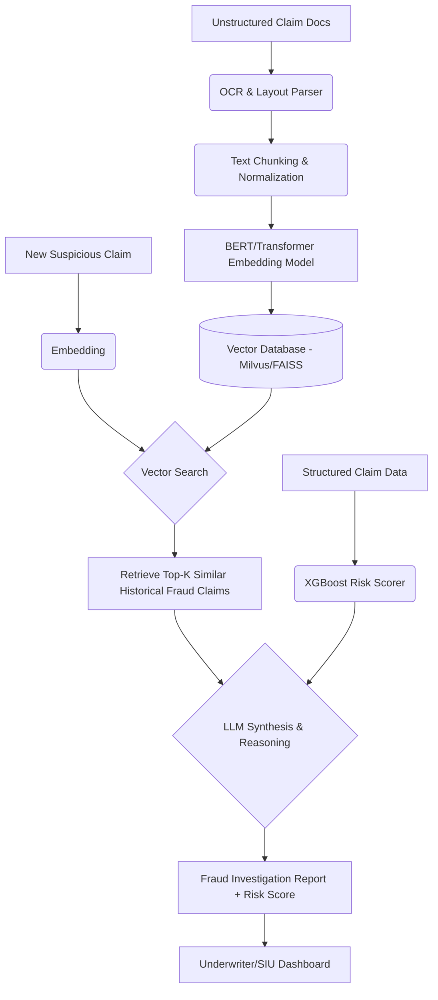

# 🔥 PROJECT GRIND: Insurance Fraud Detection & Risk Modeling (RAG + LLMs)
### Company: Chubb | Role: Senior Data Scientist II

> **Resume Bullet:** Architected and deployed scalable ML-based fraud detection system using RAG (Retrieval-Augmented Generation) and Large Language Models (LLMs) to identify potentially fraudulent insurance claims across long-tail claim lifecycles. Developed advanced Information Extraction pipelines from unstructured claims data using NLP transformers and BERT-based models.

---

## 🏗️ 1. PRODUCTION ARCHITECTURE

---

## 🛠️ 2. PHASE-BY-PHASE DEEP DIVE & UNUSUAL EDGECASES

### A. Training & Indexing Phase
*   **What you did:** Fine-tuned BERT for insurance entity extraction (NER for injury types, legal terminology). Generated embeddings for thousands of historical proven fraudulent claims.
*   **The "Unusual" Issue:** **The "Boilerplate" Domination.** Legal documents have 80% boilerplate text. Standard chunking meant embeddings retrieved claims matching "Standard Indemnity Clause" rather than the actual fraud pattern.
*   **The Fix:** Built a pre-processing pipeline to strip legal boilerplate. Used a custom chunking strategy separating the "Incident Description" from "Medical Bills." Weighted the embeddings of the incident description 3x higher during indexing.

### B. Development & Evaluation Phase
*   **What you did:** Built the RAG pipeline. LLM generates a summary of *why* the new claim looks like historical fraud.
*   **The "Unusual" Issue:** **"Synergistic Hallucination."** The LLM would see a past fraud claim where a specific doctor (Dr. Smith) was involved, and hallucinate that Dr. Smith was also involved in the *current* claim, blending the retrieved context with the query.
*   **The Fix:** Strict XML tagging in the prompt. `<current_claim>` vs `<historical_pattern>`. Added a post-extraction Natural Language Inference (NLI) step that explicitly verified if entities mentioned in the output actually existed in the `<current_claim>` tags. (Zero-shot LLM-as-judge constraint).

### C. Production & Deployment Phase
*   **What you did:** Deployed batch and real-time processing via Kubeflow/GCP.
*   **The "Unusual" Issue:** **Vector DB Drift over Long-Tail Claims.** Fraud rings adapt. A fraud pattern from 2022 might be completely obsolete. Simply doing a nearest-neighbor search kept retrieving outdated fraud schemes that SIU (Special Investigation Unit) already shut down.
*   **The Fix:** Time-decayed vector search. Modified the retrieval scoring formula: `Final_Score = Cosine_Sim * e^(-lambda * Age_of_historical_claim)`. This prioritized *recent* similar fraud patterns while still allowing highly identical old patterns to surface.

---

## ⚔️ 3. FLIPKART ROUND-SPECIFIC GRINDING QUESTIONS

### 🔴 Flipkart DDS (System Design) Questions
1.  **"How does your RAG system handle contradictory information in unstructured claims? E.g., Police report says 'rear-ended', medical report says 'fell down stairs'."**
    *   *Ans:* The chunking strategy separates provenance (source document type). The LLM prompt is instructed to explicitly cross-verify entity extraction across sources and output an `inconsistency_flag` if the incident description vectors from Doc A and Doc B have high semantic divergence.
2.  **"Flipkart has return fraud. How would you adapt this exact architecture to detect buyers claiming 'empty box' returns using unstructured customer chat logs?"**
    *   *Ans:* Keep the Vector DB. Index historical chat logs of proven empty-box fraudsters. For new chats, embed the sliding window of the conversation. The LLM generates a "Risk Narrative" summarizing behavioral similarities, passing it to the SIU.

### 🔵 Flipkart DMM (Mathematical Modeling) Questions
1.  **"You used BERT for extraction. Derive the self-attention formula and explain mathematically why it suffers quadratic complexity with document length."**
    *   *Ans:* $\text{Attention}(QK^V) = \text{softmax}(QK^T/\sqrt{d_k})V$. The matrix multiplication of $Q$ ($N \times d$) and $K^T$ ($d \times N$) results in an $N \times N$ matrix. Storing and computing this takes $O(N^2)$ memory and time.
2.  **"How did you evaluate the quality of your embeddings mathematically before putting them into the Vector DB?"**
    *   *Ans:* Recall@K and NDCG on a holdout set of known fraud clusters. Also calculated the Silhouette Score of the embeddings grouped by fraud-ring ID to ensure tight clustering.

### 🟢 Flipkart HO (Hands-On) Questions
1.  **"Write a Python script from scratch that implements the time-decayed vector search retrieval you mentioned."**
    *   *Ans:* Be ready to write a custom retrieval pipeline over FAISS indices using `numpy` arrays, demonstrating modifying the distance scores based on a time array.
2.  **"Given a raw text string of a messy claim, write the regex/NLP pipeline to extract all monetary values and dates cleanly."**

### 🟡 Flipkart HM (Hiring Manager) Questions
1.  **"You built this at Chubb. Fraud investigators are notoriously skeptical of 'AI black boxes'. How did you get the SIU team to actually trust and use your RAG summaries?"**
    *   *Ans:* *STAR Format.* Situation: SIU rejected v1 because it was a black box score. Action: Re-designed the output to be a deterministic "Evidence Trace". The system didn't just say "90% fraud", it highlighted the exact sentence in the specific document, and cited the historical claim ID it matched. Result: Adoption rate went from 15% to 85% because it empowered them rather than replacing them.
