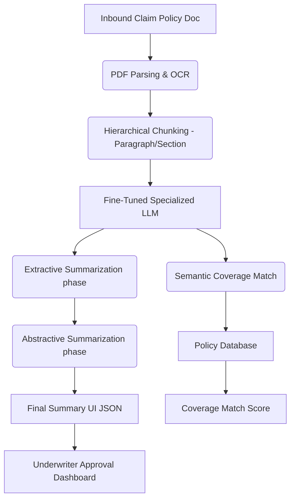

# 🔥 PROJECT GRIND: Underwriters Assistance & Claims Summarization
### Company: Chubb | Role: Senior Data Scientist II

> **Resume Bullet:** Built Coverage Match and Claims Classification systems using advanced Information Retrieval and semantic search. Developed Claims Summarization tool leveraging LLMs and extractive/abstractive summarization techniques, freeing underwriter bandwidth.

---

## 🏗️ 1. PRODUCTION ARCHITECTURE

---

## 🛠️ 2. PHASE-BY-PHASE DEEP DIVE & UNUSUAL EDGECASES

### A. Training & Prompting Phase
*   **What you did:** Implemented dual-stage summarization. First, extractive (pulling exact clauses), then abstractive (rewriting for readability).
*   **The "Unusual" Issue:** **"Omission by Summarization."** The LLM was summarizing *too* well, occasionally dropping critical edge-case clauses (e.g., "Act of God exclusion") because they were statistically rare in the training data distribution.
*   **The Fix:** Implemented a negative-constraint prompt logic AND a secondary "Extractive Checklist" model. Before outputting the final summary, the system ran a fast Regex/Embedding check against a master list of 50 critical exclusions. If the original text contained "Earthquake" but the summary didn't, the pipeline triggered an automatic rewrite with high penalty.

### B. Development & Evaluation Phase
*   **What you did:** Semantic match of claim details against policy coverage.
*   **The "Unusual" Issue:** **"Lexical vs. Semantic Collision."** "Water damage from pipe" vs "Flood damage from rain." Standard embeddings mapped them closely (both water damage), but in insurance, one is covered, one is strictly excluded.
*   **The Fix:** Contrastive fine-tuning of the embedding model using hard negatives. explicitly trained the encoder to push "pipe burst" and "flood" far apart in vector space despite sharing vocabulary ("water", "damage").

### C. Production & Deployment Phase
*   **What you did:** Served via Vertex AI / Kubernetes to the underwriting team.
*   **The "Unusual" Issue:** **"Context Window Explosion."** Some commercial policies are 300+ pages long. Feeding this into an LLM crashed the context window, and chunking broke the logical flow of nested clauses (e.g., Section 4.1.a refers to Section 2.3).
*   **The Fix:** Implemented Graph-based Retrieval (Knowledge Graphs). Mapped the document structure as a tree. When looking at Section 4.1.a, the system retrieves its parent nodes automatically to maintain context without needing to ingest the entire 300 pages.

---

## ⚔️ 3. FLIPKART ROUND-SPECIFIC GRINDING QUESTIONS

### 🔴 Flipkart DDS (System Design) Questions
1.  **"How would you design a summarization system for millions of Flipkart product reviews that groups concepts (e.g., 'Battery life is bad', 'Camera is good') automatically without hallucinating?"**
    *   *Ans:* Use an Extractive-Abstractive pipeline. 1. Cluster review embeddings using HDBSCAN. 2. Extract top TF-IDF keywords per cluster. 3. Pass the cluster medoids to an LLM to generate an abstractive summary "Pros/Cons" list.
2.  **"How do you evaluate generative summarization in production without human labels?"**
    *   *Ans:* Implement LLM-as-a-judge. Use a larger, capable model (GPT-4) to grade the summary against the source text on three axes: Faithfulness (no hallucinations), Coverage (all key points present), and Coherence.

### 🔵 Flipkart DMM (Mathematical Modeling) Questions
1.  **"You mentioned contrastive learning to separate 'flood' from 'pipe burst'. Write down the Triplet Loss objective function and explain the importance of the 'margin'."**
    *   *Ans:* $L = \max(d(a,p) - d(a,n) + \text{margin}, 0)$. The margin prevents the model from collapsing all embeddings into a trivial solution and forces it to confidently separate the negative beyond a clear threshold.
2.  **"What is the mathematical formulation of ROUGE-N, and why is it terrible for evaluating your abstractive summaries?"**
    *   *Ans:* ROUGE-N measures n-gram overlap recall between summary and reference. It's terrible for abstractive summaries because if the LLM uses a brilliant synonym that isn't in the reference text, ROUGE scores it as a 0 mathematically. 

### 🟢 Flipkart HO (Hands-On) Questions
1.  **"Given a Pandas dataframe of 10,000 text claims, write the code to compute TF-IDF and find the top 5 most similar claims to a given new claim."**
2.  **"Write a Python function to split a string into chunks of max 500 tokens, but ensuring no sentence is cut in half."**

### 🟡 Flipkart HM (Hiring Manager) Questions
1.  **"Tell me about a time your model made a significant error in production (like missing a coverage clause). How did you handle the fallout with business stakeholders?"**
    *   *Ans:* Acknowledge it happens. Explain the specific mitigation (the "Extractive Checklist" mentioned above). The key is showing extreme *Ownership* and *Bias for Action*, implementing immediate fail-safes (routing complex docs to manual review temporarily) while the model is patched.
