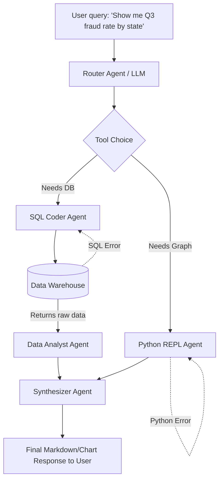

# 🔥 PROJECT GRIND: Agentic BI Tool (LangChain/LLMs)
### Company: Chubb | Role: Senior Data Scientist II

> **Resume Bullet:** Designed and built an Agentic AI-powered Business Intelligence tool using LangChain and autonomous agent workflows to enable natural-language querying for data analysts — reducing report generation time by automating complex analytical pipelines.

---

## 🏗️ 1. PRODUCTION ARCHITECTURE

---

## 🛠️ 2. PHASE-BY-PHASE DEEP DIVE & UNUSUAL EDGECASES

### A. Training & Workflow Design Phase
*   **What you did:** Built a ReAct (Reasoning and Acting) loop using Langchain allowing the LLM to write SQL, execute it, read results, write pandas code for charting, and return it.
*   **The "Unusual" Issue:** **"The Schema Hallucination Death Spiral."** The agent would hallucinate a column name (`fraud_status` instead of `is_fraud`), write bad SQL, get an error, and then *hallucinate a different bad column name* over and over until token limits were hit.
*   **The Fix:** Implemented a **Semantic Schema RAG layer**. Before writing SQL, the agent queried a vector database of the Data Dictionary. Strict prompt enforcement required the agent to `SELECT` only from columns verified by the dictionary. Injected specific error-handling prompts: "If SQL fails, retrieve schema again before retrying."

### B. Development Phase
*   **What you did:** Allowed the agent to write and execute Python code (using PythonREPL tool) for advanced BI plotting and stat testing.
*   **The "Unusual" Issue:** **Token limit crashes on large dataframes.** The SQL agent would successfully say `SELECT * FROM claims` returning 5 million rows, passing it to the context window of the next agent, instantly crashing the LLM.
*   **The Fix:** The "Head/Tail/Stats" abstraction. The execution wrapper *never* returns the raw dataframe to the LLM. It intercepts the execution and solely passes back `df.head(5)`, `len(df)`, and `df.describe()`. If the user asks for a plot, the Python agent receives the local filepath of the saved CSV to load it directly in the sandbox, rather than reading it through the context window.

### C. Production & Deployment Phase
*   **What you did:** Deployed to internal analyst teams as a conversational AI tool.
*   **The "Unusual" Issue:** **"Catastrophic Code Execution."** An analyst jokingly asked "Drop the claims table." The agent happily wrote `DROP TABLE claims;`.
*   **The Fix:** Hard sandbox security. 
    1. Read-only database credentials. 
    2. Python Sandbox restricted from using `os` or `subprocess` libraries. 
    3. An intermediate "Security Guard" LLM that evaluates the generated SQL AST (Abstract Syntax Tree) for destructive operations before the execution layer runs it.

---

## ⚔️ 3. FLIPKART ROUND-SPECIFIC GRINDING QUESTIONS

### 🔴 Flipkart DDS (System Design) Questions
1.  **"Design an Agentic system for Flipkart management that can look at real-time supply chain data, identify bottlenecks, and autonomously send re-routing instructions to warehouse managers."**
    *   *Ans:* Break it into sub-agents. 1. Monitoring Agent (watches Kafka stream for anomalies). 2. Root Cause Analysis Agent (Queries BigQuery to see if anomaly is stockout or weather). 3. Action Agent (Drafts the email/system alert). Essential design point: **Human-in-the-Loop (HITL) gate** for the action agent. AI cannot autonomously reroute trucks without human OK.
2.  **"How does your semantic tool routing work? What if the user asks something ambiguous?"**
    *   *Ans:* Use a fast, light LLM (or embeddings classifier) as the Coordinator. If confidence is <0.8 on which tool to use, explicitly trigger an "Ask_User_For_Clarification" tool.

### 🔵 Flipkart DMM (Mathematical Modeling) Questions
1.  **"Agentic workflows use beam search or similar decoding. Mathematically, why might beam search fail to generate 'creative' analytical insights compared to high-temperature sampling?"**
    *   *Ans:* Beam search maximizes the joint probability of the sequence $P(y_1...y_t | x)$. It finds the most mathematically "likely" standard sequence (boring). High temperature flattens the softmax distribution, increasing the mathematical probability of sampling lower-ranked, less common (more creative) tokens.
2.  **"If your agent executes 5 steps, each with a 90% success probability, what is the probability of the whole workflow failing? How do you optimize this?"**
    *   *Ans:* $P(\text{Success}) = 0.9^5 = 0.59$. Probability of failing = 41%. Optimize by adding self-reflection/retries (Markov Chain absorbing states).

### 🟢 Flipkart HO (Hands-On) Questions
1.  **"Write a robust Python wrapper class for executing LLM-generated SQL that safely catches exceptions, enforces a limit of 1000 rows, and prevents any DROP/DELETE/INSERT statements via Regex."**
2.  **"Parse this complex nested JSON output from a Langchain agent trace to extract the thought, action, and final output."**

### 🟡 Flipkart HM (Hiring Manager) Questions
1.  **"Business analysts are very used to Tableau/PowerBI. Why would they use a chatbot? How did you drive adoption of this tool over existing platforms?"**
    *   *Ans:* Focus on the "Time to Insight" metric. Explain that this doesn't replace dashboards, it replaces the *ad-hoc SQL requests* that take data engineering teams 3 days to fulfill. Position it as a power-tool for edge-case queries, not daily dashboard replacement.
