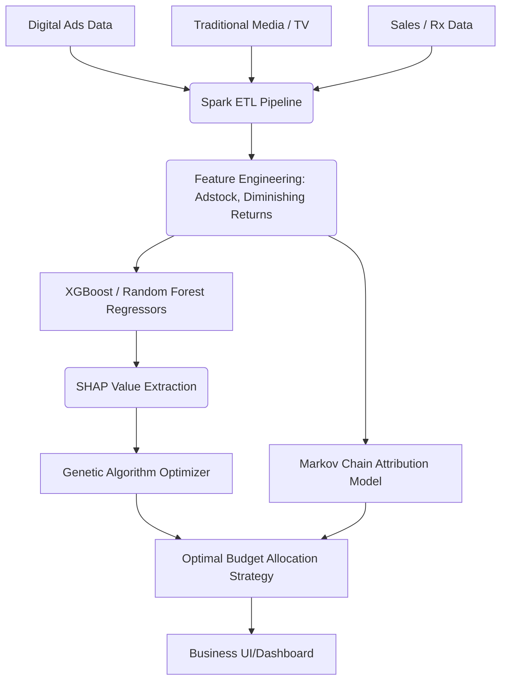

# 🔥 PROJECT GRIND: Advanced Marketing Mix Modeling (MMM) & Attribution
### Company: Axtria | Role: Decision Science & Engineering Manager

> **Resume Bullet:** Developed sophisticated Marketing Mix Models for Immunology and Neuroscience using ensemble methods and time series analysis, achieving ~10% increased revenue. Designed custom genetic algorithm for multi-objective optimization of budget allocation. Designed and deployed multi-touch attribution model using Markov Chains.

---

## 🏗️ 1. PRODUCTION ARCHITECTURE

---

## 🛠️ 2. PHASE-BY-PHASE DEEP DIVE & UNUSUAL EDGECASES

### A. Training & Feature Engineering Phase
*   **What you did:** Modeled marketing impact on sales using non-linear ensemble models, handling Adstock (carryover effect) and Diminishing Returns (saturation).
*   **The "Unusual" Issue:** **"The Collinearity Nightmare."** Pharmaceutical marketing launches campaigns simultaneously. TV, Email, and Search Ads all spike on the exact same dates. The tree models couldn't distinguish which channel actually drove the sales, leading to volatile, unstable feature importances.
*   **The Fix:** Regularized Generalized Additive Models (GAMs) combined with Ridge regression as a baseline, and enforced monotonic constraints on the XGBoost model (spending more should NEVER lead to fewer sales). Decorrelated features using PCA for independent component signals before feeding to the ensemble.

### B. Development & Optimization Phase
*   **What you did:** Built a Genetic Algorithm (GA) to optimize the $100M budget allocation across channels.
*   **The "Unusual" Issue:** **"The Corner Solution Paradox."** The optimization algorithm would greedily allocate 100% of the budget to the single channel with the highest marginal ROI, suggesting zero spend on TV/Print. This is mathematically optimal but business-irresponsible (ignores funnel dynamics).
*   **The Fix:** Multi-objective GA. Added hard penalty constraints: $Spend_{channel} \ge 0.5 \times Spend_{historical}$. Added a secondary objective function to maximize brand awareness (funnel metrics) alongside direct sales ROI, ensuring a balanced portfolio allocation.

### C. Attribution Phase
*   **What you did:** Built a Markov Chain model to track patient/doctor digital journeys.
*   **The "Unusual" Issue:** **"The Removal Effect Anomaly."** When calculating the removal effect (simulating the probability of conversion if a channel is removed), some generic touchpoints (like "Website Homepage") showed near 100% attribution because *every* user passed through it, stealing credit from the actual driving ads.
*   **The Fix:** Split the Markov chain states to differentiate between "Incidental Homepage Visits" and "Active Journey Sub-pages". Normalized the removal effects based on the channel's position in the sequence, combining it with Shapley values to enforce fairness in credit distribution.

---

## ⚔️ 3. FLIPKART ROUND-SPECIFIC GRINDING QUESTIONS

### 🔴 Flipkart DDS (System Design) Questions
1.  **"Flipkart spends billions on Big Billion Days advertising. How do you design an MMM system that accounts for the massive 'Halo Effect' where an iPhone ad causes a spike in phone case sales?"**
    *   *Ans:* The target variable cannot be isolated SKU sales. Build a hierarchical model. Top level: Total category GMV. Bottom level: SKU GMV. Introduce cross-product elasticity parameters.
2.  **"Your Markov chain attributes past events. How do you design a system that takes these attribution weights and automatically updates bidding systems in real-time?"**
    *   *Ans:* Batch calculate attribution weights nightly. Export channel-level ROAS directly to a feature store. The real-time bidding API reads these weights and adjusts the dynamic bid floor scalar up or down.

### 🔵 Flipkart DMM (Mathematical Modeling) Questions
1.  **"Write the mathematical formulation for Adstock (carry-over effect) and Diminishing Returns (saturation) used in your MMM."**
    *   *Ans:* Adstock: $A_t = S_t + \lambda A_{t-1}$ (where $\lambda$ is retention rate).
    *   Saturation (Hill function): $Y_t = \frac{A_t^\alpha}{K^\alpha + A_t^\alpha}$ (where $\alpha$ is shape, K is half-saturation point).
2.  **"In your Markov Chain attribution, derive how the 'Removal Effect' is calculated from the Transition Probability Matrix."**
    *   *Ans:* Calculate the probability of moving from Start to Conversion: $P(C)$. Then remove node $i$ by setting its transition to Conversion to 0, and reroute it to Null. Calculate new conversion probability $P(C_{-i})$. Removal Effect = $1 - \frac{P(C_{-i})}{P(C)}$.

### 🟢 Flipkart HO (Hands-On) Questions
1.  **"Given a pandas dataframe of daily sales and ad speeds, write a vectorized function to calculate the Adstock transformation for a decay rate of 0.6."**
    *   *Ans:* Uses `scipy.signal.lfilter` or a standard recursive pandas shift.
2.  **"Write a simplified version of your Genetic Algorithm crossover and mutation functions in Python for an array of 5 budget values."**

### 🟡 Flipkart HM (Hiring Manager) Questions
1.  **"MMM has been done using Linear Regression for 50 years. Why did you use XGBoost/Random Forest? How did you justify that complexity to business leaders who just want a linear coefficient?"**
    *   *Ans:* Explain that linear models fail to capture the complex saturation curves (diminishing returns) naturally. XGBoost captures non-linearities out of the box. To justify it to business, I used SHAP values to generate "Equivalent Linear Coefficients" for local interpretations.
