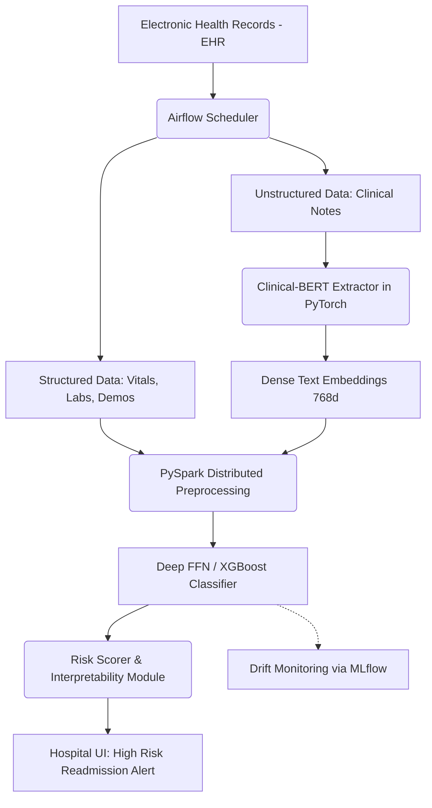

# 🔥 PROJECT GRIND: Patient Readmission Risk (Deep Learning)
### Company: EXL | Role: Manager, Data Science & ML Engineering

> **Resume Bullet:** Built production ML pipeline for readmission risk prediction incorporating clinical notes; leveraged PyTorch with BERT for rich text feature extraction from unstructured clinical data, improving model AUC from 0.82 to 0.89.

---

## 🏗️ 1. PRODUCTION ARCHITECTURE

---

## 🛠️ 2. PHASE-BY-PHASE DEEP DIVE & UNUSUAL EDGECASES

### A. Training & NLP Feature Extraction Phase
*   **What you did:** Extracted text from discharge summaries using BERT, concatenated with structured data, and predicted 30-day readmission risk.
*   **The "Unusual" Issue:** **"The Negative Transfer Problem."** Initially, using standard pre-trained BERT actually *degraded* model performance compared to a simple TF-IDF baseline. Why? Medical abbreviations ("SOB" = Shortness of Breath, "Pt" = Patient) were completely misunderstood by standard linguistic BERT.
*   **The Fix:** Swapped to `ClinicalBERT` fine-tuned on MIMIC-III data. Used a sliding window inference for long discharge summaries, pooling the `[CLS]` tokens via Mean-Pooling to generate a single fixed-length document vector.

### B. Development & Evaluation Phase
*   **What you did:** Combined tabular data and text embeddings into a unified model, boosting AUC to 0.89.
*   **The "Unusual" Issue:** **"The Class Imbalance / Threshold Trap."** Readmission events are highly imbalanced (~10-15%). While AUC was high, Precision at the default 0.5 threshold was garbage. Doctors were getting massive alert fatigue (False Positives) and ignoring the system.
*   **The Fix:** Shifted evaluation from AUC-ROC to Precision-Recall AUC (PR-AUC). Implemented threshold tuning based strictly on hospital bed capacity. If the hospital can only intervene on 20 patients a day, we set the threshold strictly at the Top-20 ranking cut-off, maximizing Precision@20 rather than overall accuracy.

### C. Production & Deployment Phase
*   **What you did:** Deployed using Airflow, PySpark, and MLflow for tracking.
*   **The "Unusual" Issue:** **"Data Drift via Protocol Change."** Six months into production, model accuracy tanked. Discovered the hospital changed their discharge note template, altering the text distribution completely. 
*   **The Fix:** Automated drift detection using Kullback-Leibler (KL) divergence on the incoming text embeddings. If the distribution drifted beyond a threshold, Airflow automatically paused the text-based model and fell back to the structured-data-only model while paging the data science team.

---

## ⚔️ 3. FLIPKART ROUND-SPECIFIC GRINDING QUESTIONS

### 🔴 Flipkart DDS (System Design) Questions
1.  **"Flipkart wants to predict which sellers will churn in the next 30 days based on structured sales data and unstructured seller support chat logs. Walk through the end-to-end design."**
    *   *Ans:* This is a direct parallel. Map EHR -> Sales Data, Clinical Notes -> Chat logs. Architecture: DistilBERT for chat log embedding -> concatenate with historical sales RFM (Recency, Frequency, Monetary) features -> LightGBM or FFN for churn prediction.
2.  **"How does your Airflow DAG handle backfilling if the data pipeline goes down for 3 days and you need to score risk historically to catch up?"**
    *   *Ans:* Design idempotent DAGs. Use execution dates (`{{ ds }}`) in SQL pulls so rerunning historical dates doesn't overlap or duplicate inserts.

### 🔵 Flipkart DMM (Mathematical Modeling) Questions
1.  **"You used KL divergence for drift detection. Write the formula and explain why it is NOT symmetric. How do you make it a true distance metric?"**
    *   *Ans:* $D_{KL}(P || Q) = \sum P(x) \log(P(x) / Q(x))$. Not symmetric because weighting is based on P. Jensen-Shannon Divergence solves this: $JSD(P||Q) = \frac{1}{2} D_{KL}(P||M) + \frac{1}{2} D_{KL}(Q||M)$ where $M = (P+Q)/2$.
2.  **"Explain mathematically the problem of optimizing for Accuracy instead of F1-Score on heavily imbalanced medical (or fraud) datsets."**

### 🟢 Flipkart HO (Hands-On) Questions
1.  **"Write a robust PyTorch `Dataset` and `DataLoader` class that handles variable-length text strings and outputs padded tensors for BERT."**
2.  **"Implement a custom PyTorch Loss function that adds a focal loss element to penalize the hard-to-predict minority class (readmissions) more heavily."**

### 🟡 Flipkart HM (Hiring Manager) Questions
1.  **"Medical data involves intense privacy (HIPAA). Suppose your model accidentally memorized patient names in the text embeddings. How do you mathematically guarantee privacy?"**
    *   *Ans:* Differential Privacy. Implement DP-SGD (Differentially Private Stochastic Gradient Descent) during BERT fine-tuning, which clips gradients and injects Gaussian noise to ensure the model cannot mathematically memorize specific training instances.
