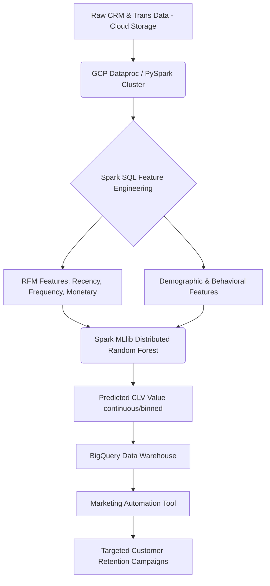

# 🔥 PROJECT GRIND: Customer Lifetime Value (CLV) at Scale
### Company: EXL | Role: Manager, Data Science & ML Engineering

> **Resume Bullet:** Developed distributed Random Forest model using PySpark to predict CLV for 2M+ prospects; implemented feature engineering pipelines using Spark SQL for efficient large-scale customer data processing. Utilized GCP Dataproc for orchestrating scalable model training and scoring, reducing processing time by 70%.

---

## 🏗️ 1. PRODUCTION ARCHITECTURE

---

## 🛠️ 2. PHASE-BY-PHASE DEEP DIVE & UNUSUAL EDGECASES

### A. Training & Feature Engineering Phase
*   **What you did:** Engineered massive RFM pipelines using PySpark DataFrame API and Spark SQL, trained distributed Random Forest on 2M+ rows.
*   **The "Unusual" Issue:** **"The Spark Data Skew OOM Crash."** Certain VIP clients or corporate accounts had millions of transactions, while normal customers had 5. During the `groupBy("customer_id")` aggregations in PySpark, this vast data skew caused specific worker nodes processing the VIP accounts to run Out Of Memory (OOM) and crash the job.
*   **The Fix:** **Salting techniques.** Appended a random integer (salt) from 1 to 10 to the `customer_id` before the `groupBy`, forcing the massive VIP data to be split across 10 reducers. After the aggregate, ran a second smaller group-by to sum up the salted results. Reduced runtime from crash loop to 45 minutes.

### B. Development & Modeling Phase
*   **What you did:** Shifted from linear regression to Distributed Random Forest to capture non-linear spending habits.
*   **The "Unusual" Issue:** **"The Infinity Problem in CLV."** Predicting absolute dollars for CLV is highly skewed (a few whales spend millions, most spend $50). MSE loss optimized entirely for the statistical whales, leaving predictions for 99% of normal customers highly inaccurate.
*   **The Fix:** Log transformation of the target variable ($\log(CLV + 1)$) prior to model training. Alternatively, predicted CLV as decile bins (Ordinal Classification) rather than absolute regression, which aligned exactly with what the marketing team needed (identifying "Top 10%" vs "Bottom 10%").

### C. Production & Deployment Phase
*   **What you did:** Orchestrated training and scoring on GCP Dataproc (managed Hadoop/Spark clusters).
*   **The "Unusual" Issue:** **"Cost Overruns on Dataproc."** The cluster was left running idly after jobs completed, burning massive cloud spend. 
*   **The Fix:** Implemented Ephemeral Clusters via Airflow. The DAG spins up the Dataproc cluster dynamically at 2 AM, executes the PySpark jobs, pushes results to BigQuery, and instantly tears down the cluster. Utilized GCP Preemptible VMs for worker nodes to cut compute costs by ~70%.

---

## ⚔️ 3. FLIPKART ROUND-SPECIFIC GRINDING QUESTIONS

### 🔴 Flipkart DDS (System Design) Questions
1.  **"Flipkart wants to predict real-time CLV updating after every single page view a user makes during a Big Billion Days sale. PySpark batch is too slow. Design this."**
    *   *Ans:* Streaming architecture. Pub/Sub (or Kafka) for page views -> Apache Flink or Spark Structured Streaming. Use a fast Key-Value store (Redis) to hold state (current session views, last 7 days features). Update a light XGBoost model or Neural Network forward pass asynchronously. 
2.  **"Why use Spark MLlib instead of just Pandas and XGBoost on a large VM?"**
    *   *Ans:* While XGBoost is memory efficient, feature engineering via Pandas is strictly bound by RAM (cannot fit 500GB CRM data). Spark handles out-of-core computation natively via RDD/Dataframe spilling to disk. 

### 🔵 Flipkart DMM (Mathematical Modeling) Questions
1.  **"In Random Forest for regression, predict the variance of a single sample's prediction using the individual trees."**
    *   *Ans:* The prediction is the mean of all tree outputs $\hat{y} = \frac{1}{B} \sum T_b(x)$. The variance of the prediction (uncertainty) can be estimated empirically as the sample variance of the $B$ tree predictions: $\frac{1}{B-1} \sum (T_b(x) - \hat{y})^2$.
2.  **"CLV inherently deals with customers 'dying' or churning without telling you. How does the Buy-Till-You-Die (BTYD) Pareto/NBD model mathematically model this differently than a Random Forest?"**
    *   *Ans:* BTYD explicitly models two unobserved processes: A Poisson process for transaction rate ($\lambda$), and an Exponential process for dropout/churn rate ($\mu$). RF just correlates static features to spending.

### 🟢 Flipkart HO (Hands-On) Questions
1.  **"Write a PySpark script using Window functions to calculate the rolling 90-day purchase frequency for each user_id without using slow UDFs."**
2.  **"Implement the PySpark salting technique in code to cleanly handle skewed groupy aggregations."**

### 🟡 Flipkart HM (Hiring Manager) Questions
1.  **"CLV models often disenfranchise lower-income customers by predicting low value, leading to them getting worse support/promotions. How do you address this ethical issue at scale?"**
    *   *Ans:* Fairness constraints. Ensure that CLV metrics are not the *sole* driver of customer support routing. Implement strategic "Exploration" budgets—treating low-CLV customers as VIPs for a randomized subset to gather counterfactual data and see if high service *creates* high CLV.
