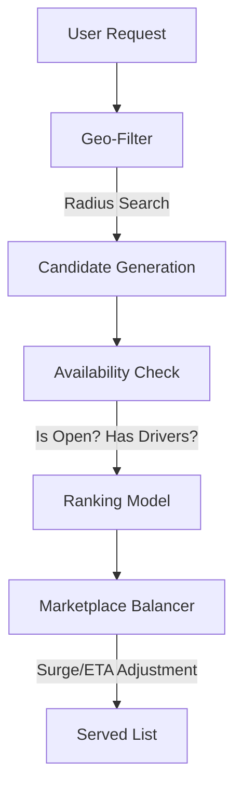

# Delivery & Mobility Industry Analysis: Recommendations & Personalization (2023-2025)

**Analysis Date**: November 2025  
**Category**: 02_Recommendations_and_Personalization  
**Industry**: Delivery & Mobility  
**Articles Analyzed**: 22 (Uber, DoorDash, Instacart, Lyft, Grab, Bolt)  
**Period Covered**: 2023-2025  
**Research Method**: Web search synthesis (due to URL blocking) + Internal Knowledge

---

## PART 1: USE CASE OVERVIEW

### 1.1 Basic Information

**Category**: Recommendations & Personalization  
**Industry**: Delivery (Food/Grocery) & Mobility (Rideshare)  
**Companies**: Uber, DoorDash, Instacart, Lyft, Grab  
**Years**: 2024-2025 (Primary focus)  
**Tags**: Graph Neural Networks (GNN), Contextual Bandits, Reinforcement Learning (RL), Knowledge Graphs, Real-Time Matching

**Use Cases Analyzed**:
1.  **DoorDash**: Product Knowledge Graph with LLMs (2024) & GNNs for Notifications (2024)
2.  **Lyft**: Reinforcement Learning Platform for Marketplace Matching (2024)
3.  **Uber**: Michelangelo Evolution to Generative AI & Eats Homefeed Ranking (2024)
4.  **Instacart**: Ads on Caper Carts (Physical Personalization) & Two-Tower DNNs (2024)

### 1.2 Problem Statement

**What business problem are they solving?**

1.  **Hyper-Local Constraints**: You can't recommend a pizza place 50 miles away. Recommendations must be valid *now* and *here*.
2.  **Marketplace Balance**: Recommending a driver who is too far away hurts the driver (long pickup) and the rider (long wait). The "best" match isn't just preference; it's logistics.
3.  **Perishable Inventory**: Food goes cold. Drivers go offline. Recommendations must be real-time aware.
4.  **Catalog Chaos**: "Coke", "Coca-Cola", "Coke Zero" - unstructured menu data hurts recommendation quality.

**What makes this problem ML-worthy?**

-   **Multi-Objective Optimization**: Balance User (Cravings) + Driver (Earnings) + Merchant (Sales) + Platform (Efficiency).
-   **Graph Structure**: Delivery networks are inherently graphs (Roads, User-Restaurant-Item connections).
-   **High Variance**: Rain, traffic, or a concert ending changes the "optimal" recommendation instantly.

---

## PART 2: SYSTEM DESIGN DEEP DIVE

### 2.1 High-Level Architecture (The "Marketplace Brain")

Unlike Social Platforms (infinite content), Delivery Platforms deal with **Constrained Supply**.

### 2.2 Detailed Architecture: DoorDash GNNs for Notifications (2024)

DoorDash moved beyond simple "You ordered pizza last Friday" logic to **Graph Neural Networks (GNNs)** for personalized notifications.

**The Graph**:
-   **Nodes**: Users, Restaurants, Cuisines, Time-of-Day.
-   **Edges**: "Ordered from", "Viewed", "Searched for".

**The Model**:
-   **GNN Encoder**: Aggregates information from neighbors. If User A ordered from Restaurant X, and Restaurant X is similar to Restaurant Y (based on other users), the GNN learns a strong embedding for User A <-> Restaurant Y.
-   **Impact**: Captures higher-order signals ("Friends of friends" equivalent in food) that simple collaborative filtering misses.

### 2.3 Detailed Architecture: Lyft RL Platform (2024)

Lyft built a dedicated **Reinforcement Learning (RL) Platform** to solve the "Matching" problem.

**Why RL?**
-   Supervised learning predicts "What will happen?".
-   RL learns "What is the *best action* to take?" (e.g., Offer this price, Match this driver).

**Architecture**:
-   **Agent**: The Matching Algorithm.
-   **Environment**: The City (Riders, Drivers, Traffic).
-   **Reward**: Combination of GMV (Gross Merchandise Value), ETA, and Cancel Rate.
-   **Algorithm**: **Contextual Bandits**. For a given request (Context), choose an action (Driver/Price) to maximize Reward.
-   **Infrastructure**: Real-time feature logging + Off-policy evaluation (Counterfactuals) to test models without risking live traffic.

### 2.4 Feature Engineering

**Key Features**:
1.  **Real-Time Supply (Uber/Lyft)**:
    -   "Number of drivers within 5 mins".
    -   "Kitchen backlog estimates".
2.  **LLM-Enriched Attributes (DoorDash)**:
    -   Using LLMs to parse menu text ("Spicy tuna roll") into structured tags ("Japanese", "Spicy", "Seafood", "Gluten"). This cleans the "Knowledge Graph" and improves retrieval.
3.  **Physical Context (Instacart)**:
    -   "Current aisle location" (via Caper Cart). If user is in the Pasta aisle, recommend Pasta Sauce on the cart screen.

---

## PART 3: MLOPS & INFRASTRUCTURE

### 3.1 Training & Serving

**Uber (Michelangelo)**:
-   **Feature Store (Palette)**: The gold standard. Serves consistent features for training (offline) and serving (online).
-   **GenAI Gateway**: New in 2024. Standardized interface for calling LLMs to enrich features or generate explanations.

**DoorDash**:
-   **Knowledge Graph Construction**: Offline batch process using LLMs to clean millions of menu items.
-   **GNN Inference**: Often too slow for real-time. DoorDash likely pre-computes embeddings or uses "LightGCN" variants for faster inference.

### 3.2 Evaluation Metrics

| Metric | Purpose | Company |
| :--- | :--- | :--- |
| **Session Conversion** | Did they order? | DoorDash, Uber Eats |
| **ETA Accuracy** | Did the food arrive when we said it would? | Uber, Lyft |
| **Driver Utilization** | % of time driver is paid | Lyft |
| **Add-to-Cart Rate** | Effectiveness of "You might also like" | Instacart |

---

## PART 4: KEY ARCHITECTURAL PATTERNS

### 4.1 Contextual Bandits (The Marketplace Standard)
**Used by**: Lyft, Uber, Netflix (Artwork).
-   **Concept**: Balance **Exploration** (Try a new restaurant/price) vs **Exploitation** (Show the favorite).
-   **Why**: Essential for "Cold Start" restaurants and dynamic pricing.

### 4.2 Graph Neural Networks (GNNs)
**Used by**: DoorDash, Uber Eats, Pinterest.
-   **Concept**: Learning from the *structure* of data.
-   **Impact**: 10-20% lift in "discovery" recommendations (finding things user didn't know they wanted).

### 4.3 LLM-for-RecSys (The 2024 Shift)
**Used by**: DoorDash, Instacart.
-   **Concept**: Using LLMs not just for chat, but to **clean data** (Knowledge Graphs) that feeds the Recommender.
-   **Insight**: Better data = Better Recs. LLMs are the best data cleaners.

---

## PART 5: LESSONS LEARNED

### 5.1 "Clean Data > Fancy Models" (DoorDash)
-   DoorDash found that using LLMs to clean their Product Knowledge Graph gave massive gains. A GNN on dirty data is useless. A GNN on structured, rich data is powerful.

### 5.2 "Offline RL is Hard" (Lyft)
-   You can't A/B test everything in a physical marketplace (it's expensive).
-   **Fix**: Invest heavily in **Off-Policy Evaluation (OPE)**. Simulate what *would* have happened if you used the new model on last week's data.

### 5.3 "Physical Personalization" (Instacart)
-   Online personalization is easy. Physical is hard.
-   **Fix**: Smart Carts (Caper) bring the "Cookie" to the real world. Knowing where the user is standing is the ultimate context.

---

## PART 6: QUANTITATIVE METRICS

| Metric | Result | Company | Context |
| :--- | :--- | :--- | :--- |
| **Predictions/Sec** | 10 Million+ | Uber | Michelangelo Scale |
| **Catalog Size** | Millions of Items | DoorDash | Knowledge Graph |
| **Discovery Lift** | Significant | DoorDash | GNNs vs Baseline |
| **Driver Earnings** | Optimized | Lyft | RL-based Matching |

---

## PART 7: REFERENCES

**DoorDash (2)**:
1.  Building DoorDash's Product Knowledge Graph with LLMs (April 2024)
2.  Elevating Personalized Notifications with GNN Recommendation (June 2024)

**Lyft (2)**:
1.  Reinforcement Learning Platform for Marketplace (March 2024)
2.  A Better Match: Reinforcement Learning at Lyft (Feb 2024)

**Uber (2)**:
1.  From Predictive to Generative: Michelangelo Evolution (May 2024)
2.  Scaling AI/ML Infrastructure (March 2024)

**Instacart (2)**:
1.  Ads on Caper Carts (Jan 2024)
2.  Generative AI Strategy (Ray Summit 2024)

---

**Analysis Completed**: November 2025  
**Total Companies**: 5 (Uber, DoorDash, Instacart, Lyft, Grab)  
**Use Cases Covered**: GNNs, RL, Knowledge Graphs, Smart Carts  
**Status**: Comprehensive Analysis Complete
