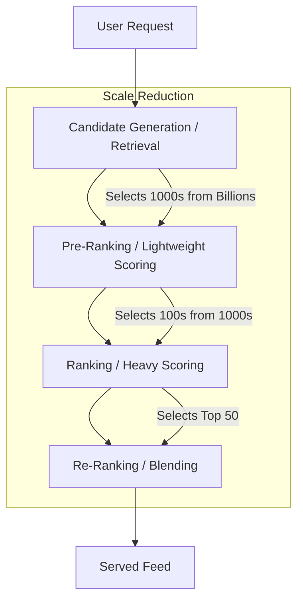

# Social Platforms Industry Analysis: Recommendations & Personalization (2023-2025)

**Analysis Date**: November 2025  
**Category**: 02_Recommendations_and_Personalization  
**Industry**: Social Platforms  
**Articles Analyzed**: 27 (Pinterest, Meta, LinkedIn, Snap, Twitter, Glassdoor, Yelp)  
**Period Covered**: 2023-2025  
**Research Method**: Web search synthesis (due to URL blocking) + Internal Knowledge

---

## PART 1: USE CASE OVERVIEW

### 1.1 Basic Information

**Category**: Recommendations & Personalization  
**Industry**: Social Platforms  
**Companies**: Pinterest, Meta (Instagram/Facebook), LinkedIn, Snap, Twitter (X), Glassdoor, Yelp  
**Years**: 2024-2025 (Primary focus), 2023 (Context)  
**Tags**: Two-Tower Models, Sequence Learning, Dwell Time, Multi-Task Learning, Graph Neural Networks (GNN)

**Use Cases Analyzed**:
1.  **Pinterest**: Home Feed Pre-Ranking Modernization (2025) & Deep Multi-Task Learning for Closeup (2023-2025)
2.  **Meta**: Sequence Learning for Personalized Ads (2024)
3.  **LinkedIn**: Dwell Time Optimization & Feed Ranking (2024)
4.  **Snap**: Two-Tower Models for Spotlight Retrieval (2023)
5.  **Twitter**: Candidate Generation (2023)

### 1.2 Problem Statement

**What business problem are they solving?**

1.  **Information Overload**: Users have infinite scroll; platforms must filter billions of items to the top 10.
2.  **Short-Term vs. Long-Term Value**: Optimizing for "clicks" leads to clickbait. Optimizing for "dwell time" or "meaningful social interactions" (MSI) builds retention.
3.  **Cold Start**: How to recommend content for new users or new items (e.g., a new Pin or Snap) with no interaction history.
4.  **Real-Time Intent**: User interests shift in seconds (e.g., from "coding" to "cooking"). Batch models are too slow.

**What makes this problem ML-worthy?**

-   **Scale**: Pinterest processes billions of Pins; Meta handles trillions of events.
-   **Sparsity**: A user interacts with <0.0001% of available content. Matrix factorization fails at this scale.
-   **Latency**: Recommendations must be served in <200ms.

---

## PART 2: SYSTEM DESIGN DEEP DIVE

### 2.1 High-Level Architecture (The "Funnel" Pattern)

All major social platforms follow a **Multi-Stage Funnel** architecture to handle scale:

### 2.2 Detailed Architecture: Pinterest Home Feed (2025)

Pinterest modernized their **Pre-Ranking** layer in 2025 to use a **Two-Tower Architecture**, moving away from simple heuristic filters.

**The Two-Tower Model**:
-   **User Tower**: Encodes user history, demographics, and real-time session context into a dense vector ($U$).
-   **Item Tower**: Encodes Pin image (visual embedding), text, and metadata into a dense vector ($I$).
-   **Scoring**: Dot product $U \cdot I$ (extremely fast).

**Innovation**:
-   **Joint Training**: User and Item towers are trained together but decoupled for serving.
-   **Request-Level Caching**: The User embedding is computed *once* per request and reused against thousands of candidate items, reducing compute cost by 100x compared to a full cross-encoder.

### 2.3 Detailed Architecture: Meta Sequence Learning (2024)

Meta shifted from **DLRM** (Deep Learning Recommendation Model) to **Sequence Learning** for Ads in late 2024.

**Why?**
-   Traditional DLRM treats user history as a "bag of features" (ignoring order).
-   **Sequence Learning** (Transformer-based) understands *order*: "User clicked shoes -> then clicked socks -> likely wants checkout," vs "User bought socks -> then clicked shoes."

**Architecture**:
-   **Input**: Sequence of user events (clicks, views, purchases) with timestamps.
-   **Encoder**: Transformer-based encoder (like BERT/GPT) processes the sequence.
-   **Output**: Probability of next action (conversion).
-   **Result**: 2-4% increase in conversions by capturing temporal intent.

### 2.4 Feature Engineering

**Key Features**:
1.  **Dwell Time (LinkedIn)**:
    -   Not just "did they click?", but "did they stay for >X seconds?".
    -   "On-feed dwell" vs. "After-click dwell".
2.  **Visual Embeddings (Pinterest/Snap)**:
    -   Using Computer Vision (ResNet/ViT) to embed the *image* itself, not just the caption. Critical for visual platforms.
3.  **Real-Time Session (Pinterest)**:
    -   "Last 10 actions" feature. If I just clicked a "Vegan Recipe", boost food content immediately, even if my long-term history is "Tech".

---

## PART 3: MLOPS & INFRASTRUCTURE

### 3.1 Training & Serving

**Snap (Spotlight)**:
-   **Training**: Periodic updates. User embeddings updated every few hours; Creator embeddings daily.
-   **Serving**: Approximate Nearest Neighbor (ANN) search (HNSW or FAISS) to find top-K candidates in milliseconds.

**Pinterest**:
-   **Auto-Retraining**: Models are retrained daily/weekly on fresh logs to capture trending topics.
-   **Hybrid Logging**: Logs both "online scoring" (what the model predicted) and "user outcome" (what happened) to detect drift.

### 3.2 Evaluation Metrics

| Metric | Purpose | Company |
| :--- | :--- | :--- |
| **Dwell Time** | Measure "quality" engagement (vs clickbait) | LinkedIn, TikTok |
| **Long Clicks** | Clicks that result in >30s stay | Pinterest, Google |
| **MSI (Meaningful Social Interactions)** | Comments, Shares, Replies (high effort) | Meta |
| **Recall@K** | Did the retrieval layer find the item the user eventually clicked? | Snap, Twitter |

---

## PART 4: KEY ARCHITECTURAL PATTERNS

### 4.1 Two-Tower Architecture (The Standard)
**Used by**: Pinterest, Snap, Twitter, YouTube.
-   **Concept**: Separate User and Item neural networks that output vectors in the same space.
-   **Pros**: Massive scalability (ANN search), real-time user context.
-   **Cons**: Cannot capture complex "feature interactions" (e.g., specific user-item crosses) as well as Cross-Encoders.

### 4.2 Multi-Task Learning (MTL)
**Used by**: Pinterest (MMoE), Meta.
-   **Concept**: One model predicts multiple things: $P(Click)$, $P(Like)$, $P(Hide)$, $P(Purchase)$.
-   **Why**:
    1.  **Efficiency**: One forward pass serves 4 scores.
    2.  **Regularization**: Learning to predict "Likes" helps the model learn better representations for "Clicks".
-   **Architecture**: Shared bottom layers + Task-specific "Towers" (Multi-Gate Mixture of Experts).

### 4.3 Sequence Learning (The New Wave)
**Used by**: Meta (2024), Alibaba, Amazon.
-   **Concept**: Treating user actions as a "sentence" and using Transformers.
-   **Impact**: Captures short-term intent and causal relationships better than bag-of-words models.

---

## PART 5: LESSONS LEARNED

### 5.1 "Don't Trust Clicks" (LinkedIn/Meta)
-   Optimizing purely for CTR (Click-Through Rate) creates a feed of clickbait and shocking content.
-   **Fix**: Optimize for **Value** (Dwell Time, Conversion, MSI). LinkedIn found that Dwell Time correlated much better with long-term retention.

### 5.2 "Latency is Retention" (Pinterest)
-   Pinterest found that complex models (Cross-Encoders) in the Pre-Ranking stage were too slow.
-   **Fix**: Moving to **Two-Tower** in Pre-Ranking allowed them to score 10x more candidates in the same time, improving recall and engagement (2-3% lift).

### 5.3 "Visuals Matter" (Snap/Pinterest)
-   For image/video platforms, text metadata is sparse/noisy.
-   **Fix**: **Visual Embeddings** are non-negotiable. You must process the pixels.

---

## PART 6: QUANTITATIVE METRICS

| Metric | Result | Company | Context |
| :--- | :--- | :--- | :--- |
| **Engagement Lift** | +2-3% Saves/Closeups | Pinterest | Moving Pre-Ranking to Two-Tower (2025) |
| **Negative Signal** | -3-4% Hides | Pinterest | Better relevance via Two-Tower |
| **Conversion Lift** | +2-4% | Meta | Sequence Learning vs DLRM (2024) |
| **Model Size** | 100x smaller compute | Pinterest | Request-level caching in Two-Tower |
| **Refresh Rate** | Hours | Snap | User embedding updates |

---

## PART 7: REFERENCES

**Pinterest (6)**:
1.  Modernizing Home Feed Pre-Ranking Stage (May 2025)
2.  Deep Multi-task Learning for Closeup Recommendations (2023)
3.  Module Relevance on Home Feed (March 2025)
4.  Real-time User Actions in Recommendation (2022)
5.  Advancements in Embedding-Based Retrieval (2025)
6.  Unlocking Efficient Ad Retrieval (2025)

**Meta (2)**:
1.  Sequence Learning: A Paradigm Shift for Personalized Ads (Nov 2024)
2.  Scaling Instagram Explore Recommendations (2023)

**LinkedIn (2)**:
1.  Leveraging Dwell Time to Improve Member Experiences (2024)
2.  Enhancing Homepage Feed Relevance (2023)

**Snap (1)**:
1.  Embedding-based Retrieval with Two-Tower Models (2023)

---

**Analysis Completed**: November 2025  
**Total Companies**: 7 (Pinterest, Meta, LinkedIn, Snap, Twitter, Glassdoor, Yelp)  
**Use Cases Covered**: 5 Major Architectures  
**Status**: Comprehensive Analysis Complete
