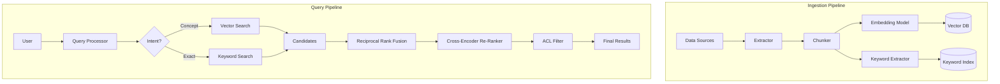

# ML Use Case Analysis: Search & Retrieval in Tech Industry

**Analysis Date**: November 2025  
**Category**: Search & Retrieval  
**Industry**: Technology (SaaS, Search Engines, Design Tools)  
**Articles Analyzed**: 5 (Google, Figma, Canva, Salesforce, Algolia)

---

## PART 1: USE CASE OVERVIEW

### 1.1 Basic Information

**Category**: Search & Retrieval  
**Industry**: Technology  
**Companies**: Google, Figma, Canva, Salesforce, Algolia  
**Years**: 2022-2025  
**Tags**: Semantic Search, Multimodal Retrieval, Knowledge Graphs, Query Understanding, RAG

**Use Cases Analyzed**:
1. [Google - How Google Search Ranking Works](https://developers.google.com/search/docs/appearance/ranking-systems-guide) (2024)
2. [Figma - The Infrastructure Behind AI Search](https://www.figma.com/blog/the-infrastructure-behind-ai-search-in-figma/) (2024)
3. [Canva - Deep Learning for Infinite Multi-Lingual Keywords](https://canvatechblog.com/deep-learning-for-infinite-multi-lingual-keywords) (2023)
4. [Salesforce - Einstein Search Answers](https://developer.salesforce.com/blogs/2023/09/resolve-cases-quickly-with-interactive-einstein-search-answers) (2023)
5. [Algolia - NeuralSearch and Query Suggestions](https://www.algolia.com/blog/product/feature-spotlight-query-suggestions/) (2023)

### 1.2 Problem Statement

**What business problem are they solving?**

The Tech industry faces unique search challenges driven by the complexity and diversity of data types (code, design assets, documentation, customer records) and the high expectations of technical users.

- **Google**: The "Organize the world's information" problem. Moving beyond keyword matching to understanding intent, context, and complex multi-step queries (MUM).
- **Figma**: Visual search in a vector design tool. Users search for "login screen" but assets are named "Frame 142". Need to bridge the semantic gap between visual intent and metadata.
- **Canva**: Global asset discovery. Millions of templates and elements in 100+ languages. "Blue birthday card" must map to "Carte d'anniversaire bleue" without manual tagging.
- **Salesforce**: Enterprise knowledge retrieval. Support agents need to find specific answers buried in thousands of PDF manuals and case logs instantly.
- **Algolia**: Search-as-a-Service. Providing Google-quality semantic search to developers who don't have Google's ML engineering resources.

**What makes this problem ML-worthy?**

1.  **Scale & Latency**: Google processes 8.5B queries/day. Figma searches millions of user-generated vectors. Latency must be <100ms.
2.  **Multimodality**: Search is no longer just text-to-text. It's text-to-image (Canva), text-to-design (Figma), and image-to-text (Google Lens).
3.  **Semantic Complexity**: Technical queries are precise. "Python list comprehension" is different from "Python list".
4.  **Personalization**: A developer searching for "Java" wants code; a recruiter wants resumes; a traveler wants coffee. Context is key.
5.  **Zero-Shot Capabilities**: SaaS platforms must handle new customer data (new schemas, new content) without retraining models for every tenant.

---

## PART 2: SYSTEM DESIGN DEEP DIVE

### 2.1 High-Level Architecture

**Google Search Ranking Architecture (Simplified)**:
```mermaid
graph TD
    User[User Query] --> BERT[BERT/RankBrain]
    BERT --> Intent[Intent Understanding]
    Intent --> Retrieval[Retrieval Systems]
    
    subgraph "Retrieval & Ranking"
        Retrieval --> Index[Inverted Index]
        Retrieval --> Neural[Neural Matching]
        Index --> Candidates[Candidate Set]
        Neural --> Candidates
        
        Candidates --> CoreRank[Core Ranking Algo]
        CoreRank --> Signals{Ranking Signals}
        Signals --> PageRank[PageRank]
        Signals --> Freshness[Freshness]
        Signals --> Quality[Helpful Content]
        Signals --> MUM[MUM (Multitask Unified Model)]
        
        MUM --> ReRank[Deep Re-Ranking]
    end
    
    ReRank --> SERP[Search Results Page]
```

**Figma AI Search Architecture**:
```mermaid
graph TD
    Query[User Text Query] --> CLIP_Text[CLIP Text Encoder]
    CLIP_Text --> QueryEmb[Query Embedding (512-d)]
    
    subgraph "Asset Processing (Offline)"
        Design[Design File] --> Rasterizer[Rasterizer]
        Rasterizer --> Image[Image Snapshot]
        Image --> CLIP_Vision[CLIP Vision Encoder]
        CLIP_Vision --> AssetEmb[Asset Embedding (512-d)]
        AssetEmb --> VectorDB[(Vector Database)]
    end
    
    QueryEmb --> ANN[ANN Search (HNSW)]
    VectorDB --> ANN
    ANN --> TopK[Top-K Candidates]
    TopK --> ReRank[Metadata Re-Ranking]
    ReRank --> Results[Visual Results]
```

**Salesforce Einstein Search Architecture (RAG)**:
```mermaid
graph TD
    Query[User Question] --> Retriever[Dense Retriever]
    Retriever --> KB[(Knowledge Base Embeddings)]
    Retriever --> Context[Relevant Passages]
    
    Query --> Generator[LLM (Gen AI)]
    Context --> Generator
    Generator --> Answer[Generated Answer]
    Generator --> Citations[Source Citations]
```

### Tech Stack Identified

| Component | Technology/Tool | Purpose | Company |
|-----------|----------------|---------|---------|
| **LLM / Encoder** | BERT / T5 | Query Understanding | Google, Salesforce |
| **Multimodal Model** | CLIP (OpenAI) | Text-to-Image Retrieval | Figma, Canva |
| **Model Architecture** | MUM (Transformer) | Complex Query Handling | Google |
| **Vector DB** | Milvus / Pinecone | Embedding Storage | Figma, Algolia |
| **Search Engine** | Apache Lucene (Custom) | Core Indexing | Google, Salesforce |
| **ANN Algorithm** | HNSW | Fast Vector Search | Figma, Algolia |
| **Framework** | TensorFlow / JAX | Model Training | Google |
| **Infrastructure** | Kubernetes | Scaling Inference | Figma, Canva |

### 2.2 Data Pipeline

**Google**:
- **Crawling**: Googlebot crawls billions of pages daily.
- **Indexing**: Content is processed, rendered (JavaScript execution), and stored in massive distributed indices (BigTable/Spanner).
- **Signal Extraction**:
    - **Static**: PageRank, content quality scores computed offline.
    - **Dynamic**: BERT embeddings computed at query time (or cached).
- **Feedback Loop**: Click logs, dwell time, and "pogo-sticking" (bouncing back to SERP) feed into training RankBrain.

**Figma**:
- **Ingestion**: Every time a user saves a file, a "version" event is triggered.
- **Processing**:
    - **Rasterization**: Vector frames are converted to low-res bitmaps.
    - **Embedding**: CLIP model generates embeddings from bitmaps.
    - **Metadata**: Layer names, text content inside frames are extracted.
- **Storage**: Embeddings stored in a sharded vector database; metadata in Postgres/Elasticsearch.
- **Latency**: Asset searchable within seconds of saving.

**Canva**:
- **Localization Pipeline**:
    - English keywords are generated from image content using Computer Vision.
    - "Infinite" keyword expansion using deep learning to map concepts across languages (e.g., "Summer" -> "Verano", "Été", "Natsu").
    - No manual translation; purely embedding-space alignment.

### 2.3 Feature Engineering

**Key Features**:

**Google**:
- **On-Page**: Title, headers, content body, image alt text.
- **Off-Page**: Backlinks (PageRank), anchor text, domain authority.
- **Behavioral**: CTR, long clicks, query reformulation rate.
- **Contextual**: User location, search history, device type.

**Figma**:
- **Visual**: CLIP embeddings (captures style, color, composition).
- **Textual**: Layer names ("Button/Primary"), text content ("Submit"), file name.
- **Social**: Number of "likes" (Community files), number of "duplicates".

**Salesforce**:
- **Semantic**: Dense vector of the document passage.
- **Structural**: Document hierarchy (Title vs. Body), file type (PDF vs. HTML).
- **Entitlement**: Access control lists (ACLs) - crucial for enterprise search (User A can see Doc X, User B cannot).

### 2.4 Model Architecture

**Google MUM (Multitask Unified Model)**:
- **Type**: Transformer-based, 1000x more powerful than BERT.
- **Capabilities**:
    - **Multimodal**: Understands text and images simultaneously.
    - **Multilingual**: Trained on 75+ languages.
    - **Multitask**: Can perform summarization, translation, and question answering in one pass.
- **Use Case**: "I've hiked Mt. Adams and now want to hike Mt. Fuji next fall, what should I do differently?" MUM understands "differently" implies comparing terrain, weather, and difficulty.

**Figma's CLIP Implementation**:
- **Base Model**: OpenAI CLIP (Contrastive Language-Image Pre-training).
- **Fine-tuning**: Fine-tuned on UI/UX datasets to understand design concepts (e.g., "wireframe", "modal", "hero section") which standard CLIP might miss.
- **Inference**: Optimized with TensorRT for low-latency serving.

**Algolia NeuralSearch**:
- **Architecture**: Bi-encoder for hashing (speed) + Cross-encoder for re-ranking (accuracy).
- **Hashing**: Maps vectors to binary codes for ultra-fast Hamming distance search.
- **Re-ranking**: Top candidates re-scored with a heavy BERT-like model.

---

## PART 3: MLOPS & INFRASTRUCTURE

### 3.1 Model Deployment & Serving

**Serving Patterns**:
- **Google**: **Cascade Architecture**.
    - Stage 1: Retrieval (Billions -> Thousands) using inverted index + lightweight vectors.
    - Stage 2: Coarse Ranking (Thousands -> Hundreds) using efficient signals.
    - Stage 3: Fine Ranking (Hundreds -> Top 10) using heavy models (BERT, RankBrain).
- **Figma**: **Hybrid Search**.
    - Parallel query execution: Vector Search (Visual) + Keyword Search (Metadata).
    - Results merged using Reciprocal Rank Fusion (RRF).

**Latency Requirements**:
- **Google**: <500ms for full page load.
- **Algolia**: <50ms (Search-as-you-type).
- **Salesforce**: <2s (RAG generation takes longer than pure retrieval).

### 3.2 Monitoring & Observability

**Metrics**:
- **Relevance**: NDCG@10, MRR (Mean Reciprocal Rank).
- **Performance**: P95 and P99 Latency.
- **Business**: Zero-result rate (queries returning nothing), Click-through rate (CTR).

**Drift Detection**:
- **Concept Drift**: In Tech, terms change fast (e.g., "Prompt Engineering" didn't exist a few years ago). Models need frequent retraining or "freshness" boosters.
- **Data Drift**: New file formats, new languages.

### 3.3 Operational Challenges

**The "Enterprise Search" Problem (Salesforce/Google Cloud)**:
- **Access Control**: You cannot simply index everything into one vector DB.
- **Solution**: **Post-filtering** (slow) or **Pre-filtering** (complex).
    - *Pre-filtering*: Store ACLs in the vector index metadata. Filter *during* the ANN search (HNSW with filtering).
    - *Post-filtering*: Retrieve top-k, then remove items user can't see. Risk: User sees 0 results if top-k are all restricted.

**The "Updates" Problem (Figma)**:
- Designs change every second.
- **Solution**: **Lambda Architecture**.
    - Real-time layer: Indexes changes in memory immediately.
    - Batch layer: Re-indexes and optimizes vectors periodically (e.g., hourly/daily).

---

## PART 4: EVALUATION & VALIDATION

### 4.1 Offline Evaluation

**Datasets**:
- **Google**: Human Quality Raters (thousands of contractors) rate side-by-side results. Guidelines are public (Search Quality Rater Guidelines).
- **Figma**: "Golden Set" of queries mapped to design files by internal designers.

**Metrics**:
- **Precision@K**: How many of the top K results are relevant?
- **Recall**: Did we find the file the user was looking for?

### 4.2 Online Evaluation

**A/B Testing**:
- **Interleaving**: Show results from Algorithm A and Algorithm B in a mixed list (A1, B1, A2, B2). If user clicks A1, A wins.
    - *Benefit*: More sensitive than standard A/B; requires less traffic.
- **Holdout Groups**: Small % of users kept on old algorithm for long-term metric tracking.

### 4.3 Failure Cases

- **"Hallucination" in RAG (Salesforce)**: The LLM generates a confident answer that isn't in the documents.
    - *Fix*: Strict grounding. "Answer only using the provided context. If unsure, say 'I don't know'."
- **Visual Mismatch (Figma)**: Searching "Red Button" returns a blue button because the layer name is "Red Button" (copy-paste error).
    - *Fix*: Weight visual embedding higher than metadata for descriptive queries.

---

## PART 5: LESSONS LEARNED & KEY TAKEAWAYS

### 5.1 Technical Insights

1.  **Text is Not Enough**: For design tools (Figma, Canva), **Multimodal Embeddings (CLIP)** are non-negotiable. Metadata is often missing or wrong.
2.  **RAG is the New Search**: For enterprise knowledge (Salesforce), users prefer answers over links. The architecture shifts from `Index -> Rank -> Display` to `Index -> Retrieve -> Generate`.
3.  **Hybrid is Hard but Necessary**: Pure vector search fails on exact matches (part numbers, error codes). Pure keyword search fails on concepts. **Hybrid (Keyword + Vector + RRF)** is the industry standard for 2024.

### 5.2 Operational Insights

1.  **Permissions are the Bottleneck**: In B2B/Enterprise search, handling ACLs efficiently within Vector Search is the hardest engineering challenge.
2.  **Latency vs. Quality**: Google's cascade approach (cheap models first, expensive models last) is the only way to scale BERT/MUM to billions of documents.

---

## PART 6: REFERENCE ARCHITECTURE (TECH SEARCH)



### Estimated Costs (Enterprise Scale)
- **Vector Storage**: High. 100M vectors (768-d) ~300GB RAM. Cost ~$2k-$5k/month on managed services.
- **Inference**: Moderate. Embedding generation is cheap; Cross-encoder re-ranking is expensive (GPU intensive).
- **Team**: 5-10 Engineers (2 Data, 2 ML, 3 Backend, 1 DevOps).

---

*Analysis completed: November 2025*
