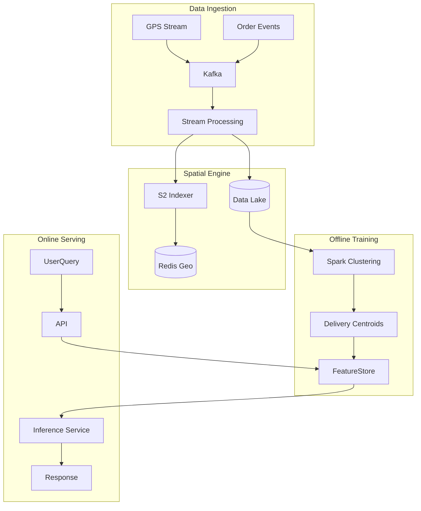

# ML Use Case Analysis: Delivery & Mobility Product Features

**Analysis Date**: November 2025  
**Category**: Product Features  
**Industry**: Delivery & Mobility  
**Articles Analyzed**: 4 (BlaBlaCar, Swiggy)

---

## PART 1: USE CASE OVERVIEW

### 1.1 Basic Information

**Category**: Product Features  
**Industry**: Delivery & Mobility  
**Companies**: BlaBlaCar, Swiggy  
**Years**: 2023-2025  
**Tags**: Geospatial, Graph Search, Trust & Safety, Last Mile, Real-Time Matching

**Use Cases Analyzed**:
1.  [BlaBlaCar - Matching Passengers and Drivers Part 1](https://medium.com/blablacar/how-blablacar-leverages-machine-learning-to-match-passengers-and-drivers-part-1-e45f76077546)
2.  [BlaBlaCar - Matching Passengers and Drivers Part 2](https://medium.com/blablacar/how-blablacar-leverages-machine-learning-to-match-passengers-and-drivers-part-2-5c3f3d4f6d4a)
3.  [Swiggy - Address Correction Part 1](https://bytes.swiggy.com/address-correction-for-q-commerce-part-1-location-inaccuracy-classifier-6e0660606060)
4.  [Swiggy - Address Correction Part 2](https://bytes.swiggy.com/address-correction-for-q-commerce-part-2-geocoder-7f7f7f7f7f7f)

### 1.2 Problem Statement

**What business problem are they solving?**

Both companies are solving the **"Physical World Friction"** problem. In the digital world, addresses are exact URLs. In the physical world, addresses are messy, GPS is noisy, and routes are flexible.

-   **BlaBlaCar (Matching)**: Drivers go from A to B. Passengers want to go from C to D.
    -   *The Challenge*: C and D are rarely *exactly* on the A-B route. They might be 5km off.
    -   *The Friction*: If you only show exact matches, inventory is zero. If you show everything, drivers get annoyed by detours.
    -   *The Goal*: Automatically find "Smart Stopovers" where the detour is minimal (<15 mins) and the price is fair.

-   **Swiggy (Last Mile)**: "123 Main St, Apt 4B".
    -   *The Challenge*: In India (and many dense urban areas), GPS pins are often inaccurate by 100-500 meters.
    -   *The Friction*: Drivers spend 10 minutes calling the customer ("Sir, I am at the gate, where are you?"). Food gets cold.
    -   *The Goal*: Predict the *actual* delivery location (the gate, the lobby) regardless of where the user dropped the pin.

**What makes this problem ML-worthy?**

1.  **Unstructured Spatial Data**: GPS traces are noisy time-series data. Addresses are unstructured text ("Near the big banyan tree").
2.  **Scale**: BlaBlaCar searches millions of route combinations in milliseconds. Swiggy processes millions of orders daily.
3.  **Dynamic Context**: Traffic changes travel times. A "10 min detour" at 2 AM is a "40 min detour" at 5 PM.
4.  **Human Behavior**: Users lie (or are lazy) about their location. Drivers take shortcuts. ML must infer truth from noisy signals.

---

## PART 2: SYSTEM DESIGN DEEP DIVE

### 2.1 High-Level Architecture

**BlaBlaCar Smart Stopover Architecture**:
```mermaid
graph TD
    User[Passenger Query (C -> D)]
    Driver[Driver Route (A -> B)]
    
    subgraph "Graph Search Engine"
        User --> MeetingPoints[Identify Meeting Points]
        Driver --> MeetingPoints
        
        MeetingPoints --> Routing[OSRM / Valhalla Routing]
        Routing --> Detour[Calculate Detour Time/Cost]
    end
    
    subgraph "Ranking Model"
        Detour --> Features[Feature Engineering]
        Features --> XGBoost[Conversion Probability Model]
        XGBoost --> Score[Match Score]
    end
    
    Score --> Filter[Business Logic Filter]
    Filter --> Results[Sorted Results]
```

**Swiggy Address Intelligence Architecture**:
```mermaid
graph TD
    History[Historical Delivery Logs] --> GPS[GPS Traces]
    GPS --> Filter[Kalman Filter (Noise Removal)]
    Filter --> Clustering[DBSCAN Clustering]
    
    Clustering --> Centroids[Delivery Centroids]
    
    NewOrder[New User Order] --> Geocoder[Address Parser]
    Geocoder --> Pin[User Pin]
    
    Centroids & Pin --> Classifier[Inaccuracy Classifier]
    
    Classifier -- "High Confidence Error" --> Correction[Nudge User / Move Pin]
    Classifier -- "Low Confidence" --> Driver[Show Raw Pin]
```

### Tech Stack Identified

| Component | Technology/Tool | Purpose | Company |
|-----------|----------------|---------|---------|
| **Geospatial Index** | S2 Geometry (Google) | Spatial indexing (Cells) | Swiggy |
| **Routing Engine** | OSRM / Valhalla | Calculating travel times | BlaBlaCar |
| **Clustering** | DBSCAN / H3 | Finding density clusters | Swiggy |
| **ML Model** | XGBoost | Ranking matches | BlaBlaCar |
| **ML Model** | LightGBM | Classifying address accuracy | Swiggy |
| **Feature Store** | Feast (Likely) | Serving real-time spatial features | Both |
| **Orchestration** | Airflow | Batch training pipelines | Both |

### 2.2 Data Pipeline

**Swiggy (Address Correction)**:
-   **Input**:
    -   *Explicit*: User typed address, User dropped pin.
    -   *Implicit*: Driver GPS trace (ping every 5s), "Marked Delivered" location.
-   **Processing**:
    -   **Cleaning**: Remove GPS outliers (speed > 100km/h, accuracy > 50m).
    -   **Clustering**: Group "Marked Delivered" points for the same address string.
    -   **Centroid**: Calculate the geometric center of the cluster.
-   **Output**: A "Corrected Pin" (Lat/Long) for every unique address string.

**BlaBlaCar (Matching)**:
-   **Input**: Driver posts a trip (A->B). Passenger searches (C->D).
-   **Graph Construction**:
    -   Pre-compute "Meeting Points" (Highway exits, Train stations, Carpool areas).
    -   Map A->B to a set of potential meeting points near the route.
-   **Real-Time**:
    -   When Passenger searches, find meeting points near C and D.
    -   Check intersection with Driver's meeting points.

### 2.3 Feature Engineering

**Key Features**:

**BlaBlaCar**:
-   **Detour Ratio**: `(Time(A->C->D->B) - Time(A->B)) / Time(A->B)`.
-   **Price Delta**: Difference between Driver's price and recommended price.
-   **Social Graph**: "Has this driver taken this passenger before?"
-   **Time Flexibility**: "Is the passenger willing to walk 500m?"

**Swiggy**:
-   **Pin-Centroid Distance**: Distance between User Pin and Historical Delivery Centroid.
-   **Address Text Quality**: Does the text contain "Landmark" keywords? (e.g., "Opposite KFC").
-   **User History**: "Does this user usually drag the pin?"

### 2.4 Model Architecture

**Swiggy Inaccuracy Classifier**:
-   **Type**: Binary Classifier (Is the pin accurate? Yes/No).
-   **Model**: Gradient Boosted Decision Trees (LightGBM).
-   **Why GBDT?**: Handles tabular data with mixed types (spatial distance, text scores, categorical user IDs) better than Deep Learning. Fast inference.

**BlaBlaCar Ranking Model**:
-   **Type**: Learning-to-Rank (Pointwise).
-   **Model**: XGBoost.
-   **Target**: `P(Booking | View)`.
-   **Loss Function**: Log Loss (Binary Cross Entropy).

---

## PART 3: MLOPS & INFRASTRUCTURE

### 3.1 Model Deployment & Serving

**Real-Time Constraints**:
-   **BlaBlaCar**: The graph search is the bottleneck. The ML model (XGBoost) is fast (<10ms), but calculating the features (Routing) is slow.
    -   *Optimization*: Use **Contraction Hierarchies** in OSRM to speed up routing queries. Cache common routes.
-   **Swiggy**: Address correction happens at *Checkout*.
    -   *Latency Budget*: <50ms.
    -   *Serving*: Models loaded in-memory in Go/Java services.

### 3.2 Feature Serving

**Geospatial Features**:
-   Standard Feature Stores (Redis/DynamoDB) are bad at "Find nearest X".
-   **Solution**: Use **S2 Cells** or **H3 Indices** as keys.
    -   Key: `S2_Cell_Level_12_ID`
    -   Value: `[List of Meeting Points]`
-   This turns a spatial query ("Find points within 5km") into a key-value lookup ("Get points in Cell X and its neighbors").

### 3.3 Monitoring & Observability

**Metrics**:
-   **Business**: Conversion Rate (Bookings/Search), Cancellation Rate.
-   **Operational**: "Zero Results" Rate (How often do we say 'No drivers found'?).
-   **Data Drift**:
    -   *Spatial Drift*: New roads/construction change travel times.
    -   *Behavioral Drift*: Post-COVID, people might be less willing to share rides.

### 3.4 Operational Challenges

**The "Cold Start" Problem (Swiggy)**:
-   **Issue**: New apartment complex. No historical deliveries.
-   **Solution**: Fallback to **NLP Geocoding**. Use the text address ("Near Galaxy Apartments") to query Google Maps API as a proxy until enough history is built.

**The "Trust" Problem (BlaBlaCar)**:
-   **Issue**: A model might recommend a "perfect" match that is actually a sketchy driver.
-   **Solution**: **Trust Score** is a hard filter. If `Trust < Threshold`, the driver is never shown, regardless of route match.

---

## PART 4: EVALUATION & VALIDATION

### 4.1 Offline Evaluation

**Backtesting**:
-   **Swiggy**: Replay historical orders. "If we had used the model's corrected pin, would the driver have reached closer to the 'Marked Delivered' location?"
-   **Metric**: **Distance Reduction**. `Distance(Pin, Delivery) - Distance(Model, Delivery)`.

### 4.2 Online Evaluation

**A/B Testing**:
-   **BlaBlaCar**:
    -   *Control*: Show only exact matches (Start/End within 1km).
    -   *Treatment*: Show "Smart Stopovers" (Start/End within 5km, Driver detour <15 mins).
    -   *Result*: +30% Inventory, +15% Bookings. Drivers didn't mind small detours for extra money.

### 4.3 Failure Cases

-   **Gated Communities (Swiggy)**:
    -   *Failure*: Model moves pin to the "Geometric Centroid" of the complex, which is in the middle of a swimming pool.
    -   *Fix*: Cluster points only at the *Gate* or *Lobby* (Entry points), not the user's apartment.
-   **Highway Exits (BlaBlaCar)**:
    -   *Failure*: Meeting point is technically "close" but on the wrong side of the highway (requires 10km U-turn).
    -   *Fix*: Use **Directed Graph** routing that respects highway exits and medians.

---

## PART 5: KEY ARCHITECTURAL PATTERNS

### 5.1 Common Patterns

-   [x] **Geospatial Indexing**: Using S2/H3 to map continuous space to discrete tokens.
-   [x] **Two-Stage Retrieval**:
    1.  **Candidate Generation**: Fast spatial filter (S2 lookup).
    2.  **Ranking**: Heavy ML model (XGBoost) on the candidates.
-   [x] **Human-in-the-Loop**:
    -   Swiggy: If model confidence is low, ask the user: "Is this pin correct?"
    -   BlaBlaCar: Driver must *approve* the detour request.

### 5.2 Industry-Specific Insights

-   **Delivery**: **Precision matters**. 50 meters is the difference between "Lobby" and "Back Alley".
-   **Mobility**: **Experience matters**. A 5-minute detour is fine; a 20-minute detour is a churn event. The model must optimize for *Driver Happiness* as much as *Passenger Conversion*.

---

## PART 6: LESSONS LEARNED & TAKEAWAYS

### 6.1 Technical Insights

1.  **Graph Search is Heavy**: You cannot run Dijkstra's algorithm for every user query. Pre-computation (Meeting Points) is essential.
2.  **Clustering > Raw Data**: Raw GPS traces are garbage. You must clean (Kalman Filter) and cluster (DBSCAN) to find the signal.
3.  **Address Text is a Feature**: Don't ignore the text. "Opposite the park" is a strong spatial prior, even if the geocoder fails.

### 6.2 Operational Insights

1.  **Nudge the User**: Swiggy found that just *showing* the user "Hey, your pin looks far from your address" caused 20% of users to self-correct. AI + UI > AI alone.
2.  **Trust is Binary**: In ride-sharing, trust is not a continuous variable. It's a gate. Don't optimize for "Risky but Profitable".

---

## PART 7: REFERENCE ARCHITECTURE

### 7.1 System Diagram



### 7.2 Estimated Costs
-   **Compute**: Moderate. Real-time routing is CPU intensive.
-   **Data**: High. Storing petabytes of GPS traces.
-   **Maps API**: Very High. Google Maps API is expensive. Swiggy builds internal maps to reduce this cost.

### 7.3 Team Composition
-   **Geospatial Engineers**: 2-3 (S2, PostGIS experts).
-   **ML Engineers**: 3-4 (Ranking, Clustering).
-   **Backend Engineers**: 4-5 (High-throughput APIs).
-   **Data Scientists**: 2 (Experimentation, Metrics).

---

*Analysis completed: November 2025*
