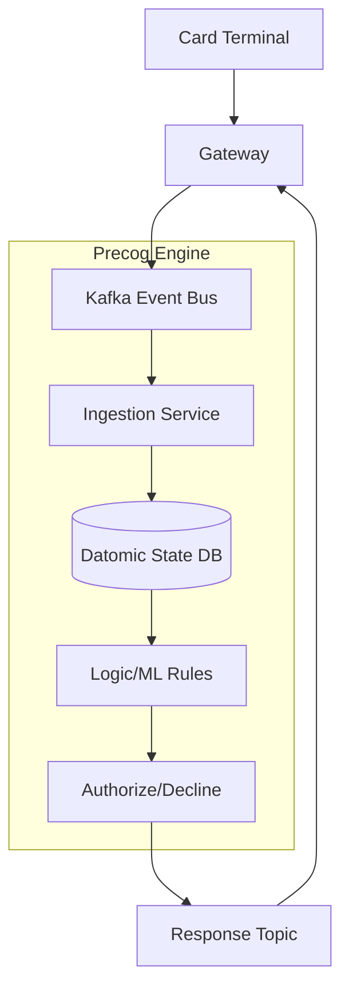

# ML Use Case Analysis: Fintech & E-commerce Product Features

**Analysis Date**: November 2025  
**Category**: Product Features  
**Industry**: Fintech & E-commerce  
**Articles Analyzed**: 3 (Nubank, Stripe, Coupang)

---

## PART 1: USE CASE OVERVIEW

### 1.1 Basic Information

**Category**: Product Features  
**Industry**: Fintech & E-commerce  
**Companies**: Nubank, Stripe, Coupang  
**Years**: 2023-2025  
**Tags**: Real-Time AI, Geospatial, Catalog Quality, Fraud Detection, Event Streaming

**Use Cases Analyzed**:
1.  [Nubank - Precog Real-Time Event AI](https://building.nubank.com.br/presenting-precog-nubanks-real-time-event-ai/)
2.  [Stripe - Jurisdiction Resolution](https://stripe.com/blog/how-we-built-it-jurisdiction-resolution-for-stripe-tax)
3.  [Coupang - Matching Duplicate Items](https://medium.com/coupang-engineering/matching-duplicate-items-to-improve-catalog-quality-ca4abc827f94)

### 1.2 Problem Statement

**What business problem are they solving?**

This category deals with **"High-Stakes Precision"**. In Fintech and E-commerce, errors cost money directly.

-   **Nubank (Complexity)**: "The State Explosion". A user swipes a card.
    -   *The Challenge*: Is the card locked? Is the limit reached? Is it fraud? Is it a subscription?
    -   *The Friction*: Checking 50 microservices adds latency. If it takes >2s, the terminal times out.
    -   *The Goal*: A centralized, real-time decision engine ("Precog") that authorizes transactions in milliseconds based on holistic user state.

-   **Stripe (Compliance)**: "The Driveway Problem".
    -   *The Challenge*: Tax rates in the US are defined by overlapping polygons (City, County, State, Special District). A house can be in a different tax zone than its neighbor.
    -   *The Friction*: Zip codes are not enough. Using Zip codes leads to under/over-taxing, which is illegal.
    -   *The Goal*: Rooftop-level precision for tax calculation in real-time during checkout.

-   **Coupang (Catalog Quality)**: "The Spam Problem".
    -   *The Challenge*: 3rd party sellers upload the same iPhone case 50 times to dominate search results.
    -   *The Friction*: Users see 10 pages of the same item. Price comparison is impossible.
    -   *The Goal*: Detect and merge duplicate items (even with slightly different titles/images) into a single "Catalog Page".

**What makes this problem ML-worthy?**

1.  **Multimodal Matching (Coupang)**: Duplicates aren't exact copies. They have different angles (Vision) and different adjectives (NLP). You need to embed both.
2.  **Geospatial Complexity (Stripe)**: Point-in-Polygon is a geometric problem, but handling "fuzzy" addresses and edge cases requires probabilistic matching.
3.  **Temporal State (Nubank)**: Fraud isn't a static feature. It's a sequence. "Small purchase, then big purchase, then password change". ML must model the *sequence*.

---

## PART 2: SYSTEM DESIGN DEEP DIVE

### 2.1 High-Level Architecture

**Nubank Precog (Event-Driven AI)**:


**Coupang Duplicate Detection**:
```mermaid
graph TD
    ItemA[Item A] & ItemB[Item B] --> FeatureEng
    
    subgraph "Encoders"
        FeatureEng --> TextEnc[BERT (Title)]
        FeatureEng --> ImageEnc[CNN (Image)]
        FeatureEng --> Price[Price/Brand Features]
    end
    
    TextEnc & ImageEnc --> Fusion[Concat Vectors]
    Fusion --> Similarity[Cosine Similarity]
    
    Similarity & Price --> Classifier[XGBoost Classifier]
    Classifier --> Verdict{Is Duplicate?}
    
    Verdict -- Yes --> Merge[Merge Request]
    Verdict -- No --> Index[Index Separately]
```

### Tech Stack Identified

| Component | Technology/Tool | Purpose | Company |
|-----------|----------------|---------|---------|
| **Event Bus** | Kafka | High-throughput messaging | Nubank |
| **Database** | Datomic | Immutable, time-travel DB | Nubank |
| **Language** | Clojure | Functional programming for correctness | Nubank |
| **Geospatial** | S2 Geometry | Spatial Indexing | Stripe |
| **NLP** | BERT / RoBERTa | Text Embeddings | Coupang |
| **Vision** | ResNet / EfficientNet | Image Embeddings | Coupang |
| **Orchestrator** | Airflow | Batch pipelines | Coupang |

### 2.2 Data Pipeline

**Stripe (Tax Resolution)**:
-   **Ingest**: Raw address string.
-   **Normalization**: "123 Main Street" -> "123 Main St".
-   **Geocoding**: Convert to Lat/Long (High Precision).
-   **Spatial Join**: Check inclusion in thousands of Tax Polygons (Shapefiles).
-   **Heuristics**: If point is on a boundary, check "Nearest Neighbor" parcels.

**Nubank (Precog)**:
-   **Pattern**: **Event Sourcing**.
-   **State**: The database doesn't just store "Balance = $50". It stores "Transaction -$10 at 10:00", "Deposit +$60 at 11:00".
-   **Inference**: The model replays the relevant history to build the *current* context for the decision.

### 2.3 Feature Engineering

**Key Features**:

**Coupang**:
-   **Jaccard Similarity**: Overlap of tokens in the title.
-   **Visual Hash**: Perceptual hash (pHash) to catch exact image duplicates (even if resized).
-   **Attribute Match**: Do they both have "Color: Red" and "Size: M"?

**Nubank**:
-   **Velocity**: "Number of transactions in last 5 minutes".
-   **Geo-Velocity**: "Distance between last transaction and current transaction / Time elapsed". (Impossible speed = Fraud).

### 2.4 Model Architecture

**Coupang Hybrid Model**:
-   **Stage 1: Blocking**: Use fast heuristics (Title overlap) to find *candidate* duplicates. (Reduce N^2 to linear).
-   **Stage 2: Classification**: Run heavy BERT+CNN model on candidates.
-   **Stage 3: Clustering**: Connected Components on the graph of matches to form "Item Groups".

---

## PART 3: MLOPS & INFRASTRUCTURE

### 3.1 Model Deployment & Serving

**Latency vs Consistency**:
-   **Nubank**: Uses **Clojure** because it's immutable by default. This prevents "Race Conditions" where two threads update the balance simultaneously.
-   **Stripe**: Pre-computes the "Tax Zone" for every valid address in the US (Offline) and serves it via a fast Key-Value store (Online).

### 3.2 Monitoring & Observability

**Metrics**:
-   **Fintech**: **False Positive Rate (FPR)**. Blocking a legit user is a "Insult". It causes churn.
-   **E-commerce**: **Cluster Purity**. Do all items in this group actually belong together?

**Shadow Mode**:
-   Nubank runs new fraud rules in "Shadow Mode" (logging only) for weeks. They compare the Shadow decision to the Live decision.
-   *Alert*: If Shadow Model blocks >10% more users than Live Model, trigger an alert.

### 3.3 Operational Challenges

**The "Long Tail" (Coupang)**:
-   **Issue**: iPhones are easy. "Handmade Ceramic Mugs" are hard. Descriptions are vague.
-   **Solution**: **Active Learning**. Send low-confidence pairs to human labelers. Retrain.

**Data Residency (Stripe)**:
-   **Issue**: Tax laws require data to stay in certain jurisdictions (GDPR, etc.).
-   **Solution**: Sharded architecture where EU data stays in EU data centers.

---

## PART 4: EVALUATION & VALIDATION

### 4.1 Offline Evaluation

**Golden Sets**:
-   **Coupang**: Curated list of 10,000 known duplicate pairs and 10,000 non-duplicates.
-   **Metric**: F1-Score. (Harmonic mean of Precision and Recall).

**Backtesting (Nubank)**:
-   Replay last month's transaction stream through the new model.
-   "Would we have caught the fraud attack on Nov 12th?"

### 4.2 Online Evaluation

**Interleaving (Coupang)**:
-   Show search results from Algorithm A and Algorithm B interleaved.
-   See which one users click. (If they click the merged item, good. If they click the unmerged duplicate, bad).

### 4.3 Failure Cases

-   **The "Bundle" Problem (Coupang)**:
    -   *Failure*: Model merges "iPhone" and "iPhone + Case Bundle". They look similar, titles are similar.
    -   *Fix*: Explicit "Quantity" and "Bundle" extraction from text.
-   **The "New Construction" Problem (Stripe)**:
    -   *Failure*: New subdivision built. Address exists, but not in shapefiles yet.
    -   *Fix*: Fallback to "Nearest Neighbor" logic with a confidence flag.

---

## PART 5: KEY ARCHITECTURAL PATTERNS

### 5.1 Common Patterns

-   [x] **Event Sourcing**: Reconstructing state from logs (Nubank).
-   [x] **Blocking/Candidate Generation**: Two-stage retrieval for N^2 problems (Coupang).
-   [x] **Geospatial Pre-computation**: Solving complex geometry offline for fast online lookup (Stripe).
-   [x] **Functional Pipelines**: Using immutable data structures for financial correctness (Nubank).

### 5.2 Industry-Specific Insights

-   **Fintech**: **Correctness > Accuracy**. It's better to be slow and right than fast and wrong. (Though Nubank manages to be fast and right via Datomic).
-   **E-commerce**: **Catalog is the Foundation**. Search, Recs, and Ads all fail if the catalog is messy. Deduplication is the highest ROI project.

---

## PART 6: LESSONS LEARNED & TAKEAWAYS

### 6.1 Technical Insights

1.  **Immutability is a Superpower**: Nubank's use of Datomic allows them to debug *any* past state. "Why was this blocked?" -> "Let's rewind the DB to 10:00:01 AM".
2.  **Multimodal is Necessary**: You can't deduplicate products with text alone. Images contain the truth.
3.  **Address Normalization is Hard**: "Apt 4" vs "#4" vs "Unit 4". You need a specialized NLP model just for addresses (Stripe).

### 6.2 Operational Insights

1.  **Shadow Mode is Mandatory**: Never deploy a financial model directly to production.
2.  **Human Review**: For catalog merging, if the model is 90% sure, don't merge. Send to human. A bad merge (iPhone = Samsung) destroys trust.

---

## PART 7: REFERENCE ARCHITECTURE

### 7.1 System Diagram (Event-Driven Decisioning)

```mermaid
graph TD
    subgraph "Event Bus"
        Kafka[Kafka Cluster]
    end

    subgraph "State Management"
        Ingest[Ingest Consumer] --> DB[(Immutable Ledger)]
        DB --> Cache[State Cache (Redis)]
    end

    subgraph "Decision Engine"
        Trigger[Event Trigger] --> Fetch[Fetch State]
        Fetch --> Cache
        Fetch --> Model[Inference Service]
        Model --> Result[Decision]
        Result --> Kafka
    end

    subgraph "Monitoring"
        Kafka --> Shadow[Shadow Consumer]
        Shadow --> Eval[Evaluation DB]
    end
```

### 7.2 Estimated Costs
-   **Compute**: Moderate.
-   **Data**: High. Storing full event history (Nubank) or high-res maps (Stripe).
-   **Team**: Senior Backend Engineers + ML Engineers.

### 7.3 Team Composition
-   **Distributed Systems Engineers**: 4-5 (Kafka, Datomic).
-   **ML Engineers**: 3-4 (Fraud models).
-   **Domain Experts**: 2 (Tax accountants, Fraud analysts).

---

*Analysis completed: November 2025*
