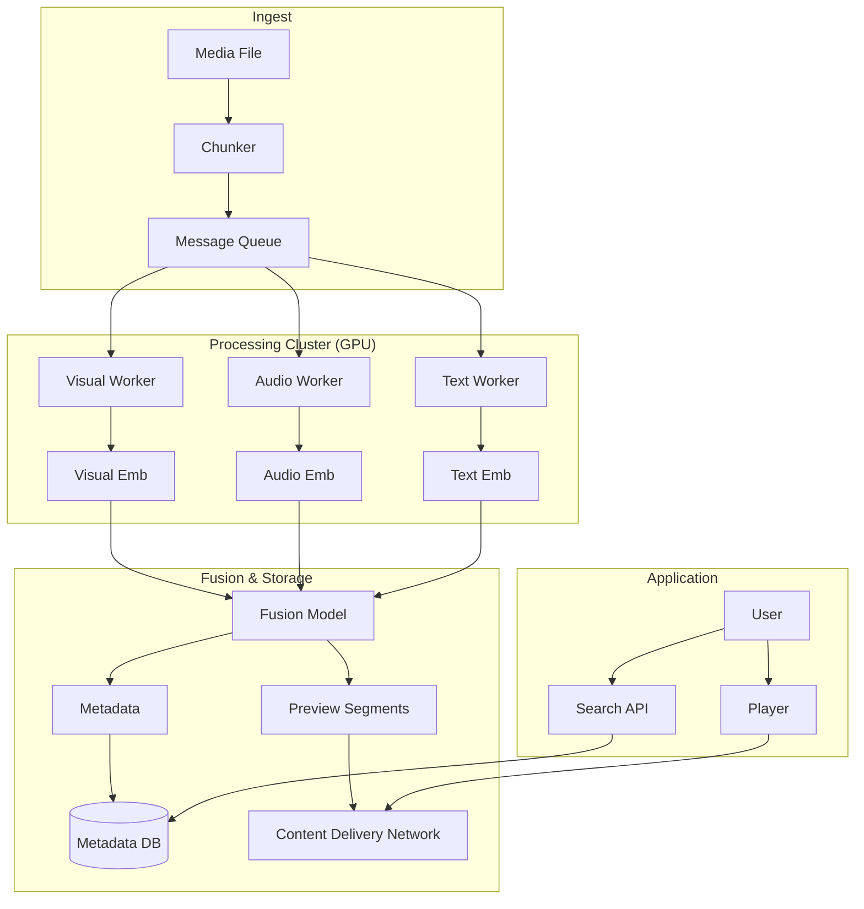

# ML Use Case Analysis: Media & Streaming Product Features

**Analysis Date**: November 2025  
**Category**: Product Features  
**Industry**: Media & Streaming  
**Articles Analyzed**: 3 (Netflix, Spotify)

---

## PART 1: USE CASE OVERVIEW

### 1.1 Basic Information

**Category**: Product Features  
**Industry**: Media & Streaming  
**Companies**: Netflix, Spotify  
**Years**: 2023-2025  
**Tags**: Computer Vision, Audio Analysis, Summarization, Content Understanding, Discovery

**Use Cases Analyzed**:
1.  [Netflix - Video Annotator Framework](https://netflixtechblog.com/video-annotator-a-framework-for-efficiently-building-video-classifiers-using-vision-language-models-c5e96c8d02d6)
2.  [Netflix - Detecting Speech and Music](https://netflixtechblog.com/detecting-speech-and-music-in-audio-content-d4d1d5d5d5d5)
3.  [Spotify - Podcast Previews](https://engineering.atspotify.com/2023/04/large-scale-generation-of-ml-podcast-previews-at-spotify-with-google-dataflow/)

### 1.2 Problem Statement

**What business problem are they solving?**

Both companies face the **"Content Black Box"** problem. They have millions of files (videos, audio), but computers don't inherently "know" what's inside them.

-   **Netflix (Content Understanding)**:
    -   *The Challenge*: Editors need to find "a shot of a car chasing a boat" for a trailer. Manually scrubbing 100 hours of footage is slow.
    -   *The Friction*: Users get annoyed by "Intros" and "Recaps". Editors can't manually tag the start/end of intros for every episode of every show in every language.
    -   *The Goal*: Automatically "annotate" every frame of video with metadata (Objects, Actions, Audio Events).

-   **Spotify (Discovery)**:
    -   *The Challenge*: Podcasts are long (60+ mins). Users are afraid to commit.
    -   *The Friction*: Unlike music (where you can judge a song in 5 seconds), a podcast requires 5-10 minutes of listening to know if it's good.
    -   *The Goal*: Generate a 30-second "Trailer" for every podcast episode automatically, capturing the "hook" without spoilers.

**What makes this problem ML-worthy?**

1.  **Multimodality**: You can't understand a movie with just pixels. You need Audio (Speech, Music), Visuals (Action), and Text (Subtitles).
2.  **Scale**: Spotify has 5 million+ podcasts. Netflix has petabytes of video. Manual curation is impossible.
3.  **Subjectivity**: What makes a "good" preview? It's not just the loudest part. It's the part with the most *information* or *tension*.
4.  **Temporal Dependencies**: A "shot" is a sequence of frames. A "scene" is a sequence of shots. Models must understand time.

---

## PART 2: SYSTEM DESIGN DEEP DIVE

### 2.1 High-Level Architecture

**Netflix Video Annotator Architecture**:
```mermaid
graph TD
    Video[Raw Video File] --> ShotDetect[Shot Boundary Detection]
    ShotDetect --> Shots[List of Shots]
    
    subgraph "Multimodal Encoder"
        Shots --> Visual[Visual Encoder (CLIP/ViT)]
        Shots --> Audio[Audio Encoder (Yamnet)]
        Shots --> Text[Subtitle Encoder (BERT)]
    end
    
    Visual & Audio & Text --> Fusion[Late Fusion Layer]
    Fusion --> Classifier[Multi-Label Classifier]
    
    Classifier --> Tags[Metadata Tags]
    Tags --> SearchIndex[Content Search API]
```

**Spotify Podcast Preview Pipeline**:
```mermaid
graph TD
    Podcast[Podcast Audio] --> Dataflow[Google Dataflow Pipeline]
    
    subgraph "Parallel Processing"
        Dataflow --> ASR[Speech-to-Text (Whisper)]
        Dataflow --> AudioFeat[Audio Event Detection]
        
        ASR --> NLP[Topic Segmentation]
        AudioFeat --> MusicFilter[Music/Ad Filter]
    end
    
    NLP & MusicFilter --> Ranker[Segment Ranker]
    Ranker --> Selector[Select Top Segment]
    Selector --> Stitch[Audio Stitching]
    Stitch --> Preview[Preview MP3]
```

### Tech Stack Identified

| Component | Technology/Tool | Purpose | Company |
|-----------|----------------|---------|---------|
| **Pipeline** | Google Dataflow (Apache Beam) | Distributed processing | Spotify |
| **Workflow** | Metaflow / Archer | Orchestrating ML DAGs | Netflix |
| **Visual Model** | CLIP / ViT | Frame embedding | Netflix |
| **Audio Model** | Yamnet / VGGish | Audio event classification | Both |
| **ASR** | Whisper / Google STT | Transcribing speech | Spotify |
| **Vector DB** | Faiss / Milvus | Storing frame embeddings | Netflix |
| **Storage** | GCS / S3 | Storing media assets | Both |

### 2.2 Data Pipeline

**Spotify (Podcast Previews)**:
-   **Input**: RSS Feed of MP3s.
-   **Preprocessing**:
    -   *Demuxing*: Separate audio channels.
    -   *Normalization*: Loudness normalization (LUFS).
-   **Inference**:
    -   Run ASR (Speech-to-Text) to get word-level timestamps.
    -   Run Music Detection to identify "Intro Music" (to ignore) and "Ad Breaks".
-   **Post-processing**:
    -   Find a 30s block of speech that is:
        1.  High energy (Audio features).
        2.  Coherent (NLP features).
        3.  Not an Ad (Music/Keyword features).
    -   Fade In/Out to make it sound professional.

**Netflix (Video Annotator)**:
-   **Input**: Master Video File (ProRes/IMF).
-   **Shot Detection**:
    -   Compare color histograms of adjacent frames. If difference > Threshold, it's a cut.
    -   Output: `Shot_1: 00:00:00 - 00:00:05`.
-   **Keyframe Selection**: Pick the middle frame of the shot as the representative image.
-   **Annotation**: Run classifiers on the keyframe + audio clip.

### 2.3 Feature Engineering

**Key Features**:

**Spotify**:
-   **Linguistic Coherence**: Does the segment start with a capital letter and end with a period? Does it contain "Welcome back" (Intro) or "Use code" (Ad)?
-   **Audio Energy**: RMS amplitude. We want loud, clear speech, not silence.
-   **Speaker Diarization**: How many speakers? A dialogue is often more engaging than a monologue.

**Netflix**:
-   **Visual Embeddings**: 512-dim vector from CLIP. Represents "What is in the image?".
-   **Audio Embeddings**: 128-dim vector from VGGish. Represents "What does it sound like?".
-   **Temporal Context**: Features from the *previous* and *next* shot to understand sequence.

### 2.4 Model Architecture

**Netflix "N-Shot" Learning**:
-   **Problem**: Training a specific classifier (e.g., "Find all scenes with a red car") requires labeling thousands of images.
-   **Solution**: **Few-Shot Learning**.
    -   Use a pre-trained multimodal encoder (like CLIP).
    -   Editor provides 5 examples of "Red Car".
    -   Train a lightweight linear head on top of the frozen embeddings.
    -   Result: New classifier deployed in minutes, not weeks.

**Spotify Segment Ranker**:
-   **Type**: Learning-to-Rank.
-   **Input**: List of candidate 30s segments.
-   **Target**: `P(Click | Preview)`.
-   **Model**: Neural Network (MLP) taking concatenated features (Text + Audio).

---

## PART 3: MLOPS & INFRASTRUCTURE

### 3.1 Model Deployment & Serving

**Batch vs. Real-Time**:
-   **Spotify**: **Batch**. Previews are generated once when the episode is published.
    -   *Scale*: Backfilling 5 million episodes took weeks on thousands of Dataflow workers.
-   **Netflix**: **Batch**. Annotation happens during the "Ingest" phase, before the show goes live.

**Cost Optimization**:
-   **Spotify**: Running ASR (Whisper) on 1 hour of audio is expensive.
    -   *Optimization*: Only transcribe the "middle" 80% of the podcast (skipping likely intros/outros) to save 20% compute.
-   **Netflix**: Don't run heavy models on every frame. Run on *Keyframes* (1 per shot). Reduces compute by 100x (assuming 4s shots @ 24fps).

### 3.2 Feature Serving

**Search API**:
-   Netflix exposes the annotations via an internal API.
-   Query: `GET /shots?tag=explosion&min_duration=5s`
-   Response: `[ {start: 10:00, end: 10:05, confidence: 0.98}, ... ]`

### 3.3 Monitoring & Observability

**Metrics**:
-   **Quality**: "Preview Completion Rate". Do users listen to the full 30s?
-   **Conversion**: "Stream Rate". Do users click "Play Episode" after the preview?
-   **Accuracy**: "Tag Precision". If the model says "Explosion", is there really an explosion? (Validated by human spot-checks).

### 3.4 Operational Challenges

**The "Spoiler" Problem (Netflix/Spotify)**:
-   **Issue**: The most "engaging" part of a story is often the ending.
-   **Solution**:
    -   *Heuristics*: Ignore the last 15% of the file.
    -   *NLP*: Detect "Spoiler keywords" (died, killed, won).
    -   *Sentiment Analysis*: Detect "Resolution" arcs (tension drop).

**The "Ad" Problem (Spotify)**:
-   **Issue**: Previews that are just 30s of "Buy Mattress 2.0" are terrible.
-   **Solution**: Train a specific "Ad Detector" classifier on a dataset of known ads. Filter these out aggressively.

---

## PART 4: EVALUATION & VALIDATION

### 4.1 Offline Evaluation

**ROUGE/BLEU (Text)**:
-   Not useful. A preview isn't a "summary" (informational); it's a "trailer" (emotional).
-   **Proxy Metric**: **Topic Coverage**. Does the preview contain the keywords that appear most frequently in the full transcript?

**Human Evaluation**:
-   **Spotify**: "Golden Set". Human editors manually pick the "best" 30s clip for 1000 episodes. Compare model output to human choice.
    -   *Metric*: **IoU (Intersection over Union)** of timestamps.

### 4.2 Online Evaluation

**A/B Testing**:
-   **Spotify**:
    -   *Control*: No preview.
    -   *Treatment A*: Random 30s clip.
    -   *Treatment B*: ML-selected 30s clip.
    -   *Result*: Treatment B increased listening time by X%.

### 4.3 Failure Cases

-   **Context Cutoff**:
    -   *Failure*: Preview starts mid-sentence: "...and that's why I killed him."
    -   *Fix*: **Sentence Boundary Detection**. Force start/end at sentence breaks.
-   **Music Bleed**:
    -   *Failure*: Preview includes 10s of loud intro music then 20s of silence.
    -   *Fix*: Stricter Music/Speech discrimination thresholds.

---

## PART 5: KEY ARCHITECTURAL PATTERNS

### 5.1 Common Patterns

-   [x] **Multimodal Fusion**: Combining Text (ASR/Subtitles) + Audio + Visuals. Single modality is never enough.
-   [x] **Shot/Segment Detection**: Breaking continuous media into discrete "chunks" (Shots/Segments) is the first step of any video/audio pipeline.
-   [x] **Human-in-the-Loop Training**: Using editors to provide "Few-Shot" examples to adapt models quickly.

### 5.2 Industry-Specific Insights

-   **Media**: **Content is Data**. The video file itself is the database. You just need to index it.
-   **Streaming**: **Discovery is King**. With infinite content, the bottleneck is user attention. ML that helps users *choose* (Previews, Tags) is as valuable as the content itself.

---

## PART 6: LESSONS LEARNED & TAKEAWAYS

### 6.1 Technical Insights

1.  **Don't Process Every Frame**: It's wasteful. Shot detection + Keyframes is the standard for efficient video processing.
2.  **ASR is a Commodity**: Don't build your own Speech-to-Text. Use Whisper or Google API. The value is in what you do *with* the text.
3.  **Embeddings are Flexible**: Pre-computing CLIP embeddings for all video allows you to build *any* classifier later without re-processing the video.

### 6.2 Operational Insights

1.  **Editors are Users**: Internal tools (like Netflix's tagger) need good UX. If the tool is hard to use, editors won't provide the labels needed to train the models.
2.  **Legal Matters**: You can't just generate previews for everything. Some licenses prohibit modification. Metadata management is crucial.

---

## PART 7: REFERENCE ARCHITECTURE

### 7.1 System Diagram



### 7.2 Estimated Costs
-   **Compute**: Very High. GPU inference for video/audio is expensive.
-   **Storage**: High. Storing embeddings for every shot in a petabyte catalog adds up.
-   **Team**: Specialized. Requires CV/Audio experts, not just generic Data Scientists.

### 7.3 Team Composition
-   **ML Researchers**: 3-4 (CV, NLP, Audio).
-   **Data Engineers**: 3-4 (Pipeline, Dataflow).
-   **Backend Engineers**: 2-3 (API, Asset Management).
-   **Domain Experts**: 1-2 (Video Editors/Producers).

---

*Analysis completed: November 2025*
