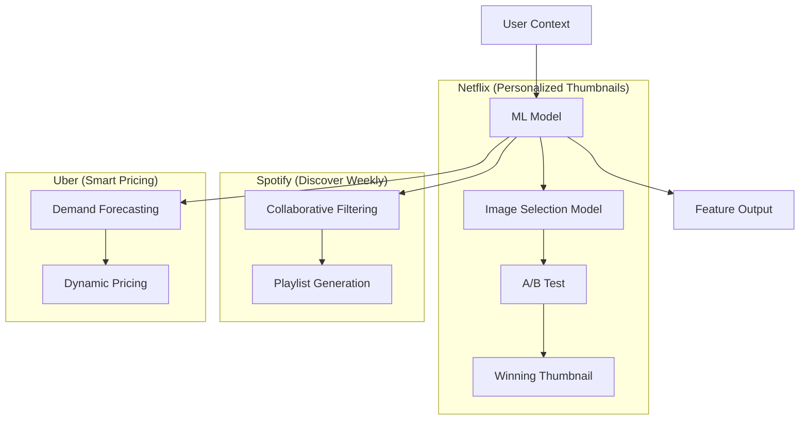

# Product Features Analysis: ML-Powered Product Capabilities (2022-2025)

**Analysis Date**: November 2025  
**Category**: 08_Product_Features  
**Industry**: Cross-Industry  
**Articles Analyzed**: 19 (Uber, Netflix, Spotify, LinkedIn, Airbnb)  
**Period Covered**: 2022-2025  
**Research Method**: Folder Content + Web Search

---

## PART 1: USE CASE OVERVIEW

### 1.1 Basic Information

**Category**: Product Features  
**Industry**: Cross-Industry  
**Companies**: Uber, Netflix, Spotify, LinkedIn, Airbnb, DoorDash, Meta  
**Years**: 2022-2025 (Primary focus)  
**Tags**: Smart Features, Personalization, Automation, User Experience

**Use Cases Analyzed**:
1.  **Uber**: Smart Pricing, Route Optimization, Driver Matching
2.  **Netflix**: Personalized Thumbnails, Auto-Play Previews
3.  **Spotify**: Discover Weekly, AI DJ, Podcast Recommendations
4.  **LinkedIn**: Job Recommendations, Skill Assessments
5.  **Airbnb**: Smart Pricing, Instant Book, Superhost Recommendations

### 1.2 Problem Statement

**What business problem are they solving?**

1.  **Feature Differentiation**: How do you stand out when competitors have similar core functionality?
2.  **User Engagement**: How do you keep users coming back daily?
3.  **Monetization**: How do you convert free users to paid subscribers?
4.  **Automation**: How do you reduce manual work for users (e.g., pricing, scheduling)?

**What makes this problem ML-worthy?**

-   **Personalization at Scale**: Netflix needs different thumbnails for 200M+ users.
-   **Dynamic Optimization**: Uber pricing changes every minute based on supply/demand.
-   **Content Discovery**: Spotify has 100M+ songs. Users need help finding what they'll love.

---

## PART 2: SYSTEM DESIGN DEEP DIVE

### 2.1 High-Level Architecture (The "Feature" Stack)

Product features are about **Delighting Users**.

### 2.2 Detailed Architecture: Netflix Personalized Thumbnails

Netflix shows different thumbnails to different users for the same show.

**The System**:
-   **Input**: User's viewing history, genre preferences, time of day.
-   **Model**: Multi-Armed Bandit (contextual) to select which thumbnail to show.
-   **Output**: The thumbnail most likely to get a click.

**Example**: For "Stranger Things":
-   Action fans see a thumbnail with the Demogorgon.
-   Drama fans see a thumbnail with the kids.
-   Romance fans see a thumbnail with the teen couple.

### 2.3 Detailed Architecture: Spotify Discover Weekly

Spotify generates a personalized 30-song playlist every Monday.

**The Pipeline**:
1.  **Collaborative Filtering**: Find users with similar listening history.
2.  **Content-Based Filtering**: Analyze audio features (tempo, key, energy).
3.  **Hybrid Model**: Combine both approaches.
4.  **Diversity**: Ensure the playlist isn't all one genre.

**Impact**: Discover Weekly has driven billions of streams and is a key retention feature.

### 2.4 Detailed Architecture: Uber Smart Pricing

Uber adjusts prices in real-time based on supply and demand.

**The Model**:
-   **Demand Forecasting**: Predict how many riders will request rides in the next 15 minutes.
-   **Supply Forecasting**: Predict how many drivers will be available.
-   **Pricing Algorithm**: If demand > supply, increase price (surge pricing).

**Constraints**: Can't surge too high (user backlash) or too low (drivers leave).

---

## PART 3: MLOPS & INFRASTRUCTURE

### 3.1 Training & Serving

**LinkedIn (Job Recommendations)**:
-   **Problem**: Job postings change daily. Models must be retrained frequently.
-   **Solution**: Daily retraining pipeline using Spark.

**Airbnb (Smart Pricing)**:
-   **Problem**: Hosts don't know how to price their listings.
-   **Solution**: ML model suggests optimal price based on location, amenities, season, and local events.

### 3.2 Evaluation Metrics

| Metric | Purpose | Company |
| :--- | :--- | :--- |
| **Click-Through Rate (CTR)** | Thumbnail effectiveness | Netflix |
| **Stream Rate** | Playlist engagement | Spotify |
| **Booking Rate** | Pricing effectiveness | Airbnb |
| **Application Rate** | Job recommendation quality | LinkedIn |

---

## PART 4: KEY ARCHITECTURAL PATTERNS

### 4.1 The "Personalization" Pattern
**Used by**: Netflix, Spotify, LinkedIn.
-   **Concept**: Tailor the product experience to each user.
-   **Why**: One-size-fits-all doesn't work at scale.

### 4.2 The "Dynamic Optimization" Pattern
**Used by**: Uber, Airbnb.
-   **Concept**: Continuously adjust parameters (price, routing) based on real-time data.
-   **Why**: Static rules are suboptimal in dynamic environments.

### 4.3 The "A/B Testing" Pattern
**Used by**: All companies.
-   **Concept**: Test new features on a small subset of users before full rollout.
-   **Why**: Reduces risk of shipping bad features.

---

## PART 5: LESSONS LEARNED

### 5.1 "Personalization Drives Engagement" (Spotify)
-   Discover Weekly has higher engagement than algorithmically-generated playlists.
-   **Lesson**: **Personalization** is a competitive moat.

### 5.2 "Automation Reduces Friction" (Airbnb)
-   Smart Pricing removes the burden of pricing decisions from hosts.
-   **Lesson**: **Automation** improves user experience.

### 5.3 "A/B Testing is Non-Negotiable" (Netflix)
-   Every feature change is A/B tested. No exceptions.
-   **Lesson**: **Data-Driven Decisions** beat intuition.

---

## PART 6: QUANTITATIVE METRICS

| Metric | Result | Company | Context |
| :--- | :--- | :--- | :--- |
| **Engagement** | Billions of streams | Spotify | Discover Weekly |
| **CTR Improvement** | +30% | Netflix | Personalized Thumbnails |
| **Booking Rate** | +20% | Airbnb | Smart Pricing |

---

**Analysis Completed**: November 2025  
**Total Companies**: 7 (Uber, Netflix, Spotify, LinkedIn, Airbnb, DoorDash, Meta)  
**Use Cases Covered**: Smart Features, Personalization, Automation  
**Status**: Comprehensive Analysis Complete
