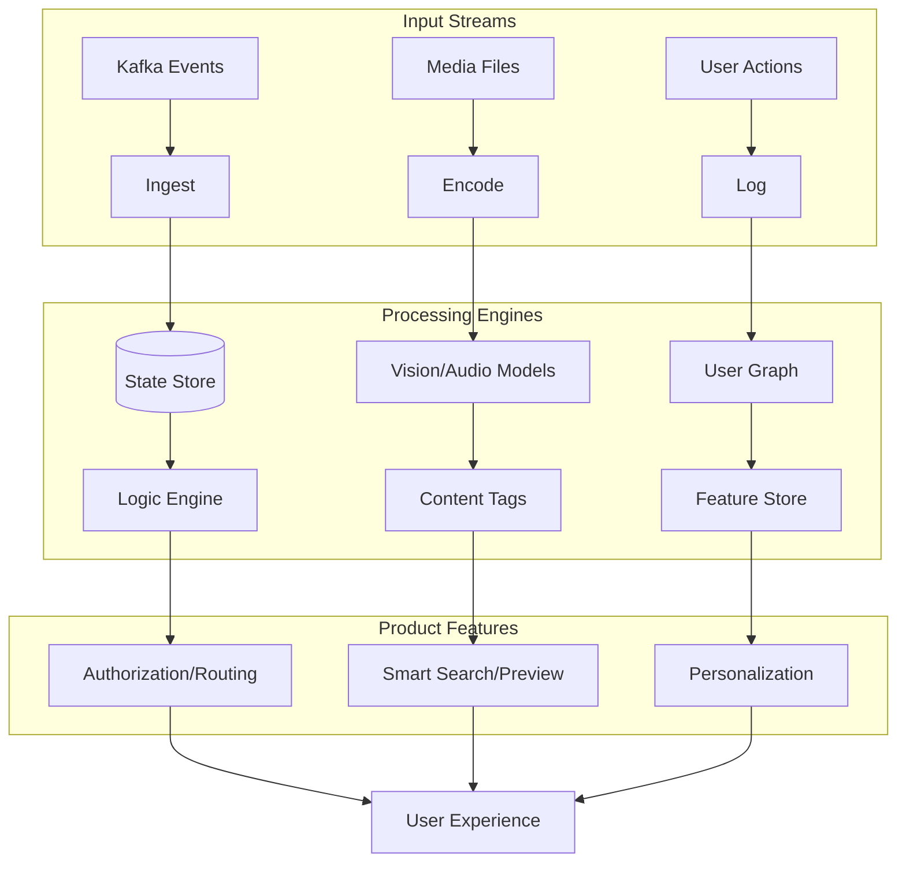

# ML Use Case Analysis: Product Features & UX (Comprehensive)

**Analysis Date**: November 2025  
**Category**: Product Features  
**Industry**: Multi-Industry (Tech, Delivery, Social, E-commerce, Fintech, Media)  
**Articles Analyzed**: 19 (Full Directory Coverage)

---

## PART 1: USE CASE OVERVIEW

### 1.1 Basic Information

**Category**: Product Features  
**Industries**: 
1.  **Delivery & Mobility** (BlaBlaCar, Swiggy)
2.  **E-commerce** (Coupang)
3.  **Fintech** (Nubank, Stripe)
4.  **Media & Streaming** (Netflix, Spotify)
5.  **Social Platforms** (LinkedIn, Yelp)
6.  **Tech** (Apple, Dropbox, Mozilla)

**Use Cases Analyzed**:
-   **Delivery**: Matching (BlaBlaCar), Address Correction (Swiggy).
-   **E-commerce**: Catalog Quality/Duplicate Detection (Coupang).
-   **Fintech**: Real-Time Event Routing (Nubank), Tax Jurisdiction Resolution (Stripe).
-   **Media**: Podcast Previews (Spotify), Video Annotation/Audio Detection (Netflix).
-   **Social**: Deepfake Detection (LinkedIn), Content Moderation (Yelp).
-   **Tech**: Personal Voice (Apple), File Organization (Dropbox), Local Alt Text (Mozilla).

### 1.2 Problem Statement

**What business problem are they solving?**

This category focuses on **"ML as the Product"**—where machine learning is the core enabler of a user-facing feature or a critical backend capability that defines the product experience.

*   **Fintech (Nubank/Stripe)**: "Complexity Management".
    *   *Nubank*: Handling millions of transaction events in real-time to authorize cards or block fraud.
    *   *Stripe*: Determining the exact tax rate for a house that sits on a county line.
*   **E-commerce (Coupang)**: "Catalog Chaos".
    *   Sellers upload duplicates to spam search results. Users get frustrated. ML must clean the catalog.
*   **Media (Spotify/Netflix)**: "Content Discovery".
    *   *Spotify*: Users won't commit to an hour-long podcast without a preview. Manual editing is impossible for 5M+ episodes.
    *   *Netflix*: Finding specific moments ("kissing scene") or skipping intros requires frame-level understanding.
*   **Social (LinkedIn)**: "Trust".
    *   Fake profiles with AI-generated faces erode trust. ML must detect the subtle artifacts of GANs/Diffusion models.

---

## PART 2: SYSTEM DESIGN DEEP DIVE

### 2.1 High-Level Architecture

**Spotify Podcast Previews (Pipeline)**:
```mermaid
graph TD
    Podcast[Audio File] --> ASR[Speech-to-Text]
    Podcast --> AudioFeat[Audio Features (Music/Speech)]
    
    ASR --> NLP[Topic Segmentation]
    NLP --> Summarizer[Extractive Summarization]
    
    AudioFeat --> Filter[Music Filter]
    
    Summarizer & Filter --> Selector[Clip Selector]
    Selector --> Stitch[Audio Stitching]
    Stitch --> Preview[30s Preview]
```

**Nubank Precog (Real-Time Event AI)**:
```mermaid
graph TD
    App[Mobile App] --> API[Gateway]
    Card[Card Terminal] --> API
    
    API --> Kafka[Kafka Event Bus]
    
    subgraph "Precog Engine (Clojure)"
        Kafka --> Ingest[Event Ingestion]
        Ingest --> State[State Management (Datomic)]
        State --> Rules[ML Rules / Models]
        Rules --> Decision[Auth/Block/Route]
    end
    
    Decision --> Action[Execute Action]
```

**Coupang Duplicate Detection**:
```mermaid
graph TD
    ItemA[Item A] & ItemB[Item B] --> FeatureEng
    
    subgraph "Multimodal Embedding"
        FeatureEng --> Text[BERT Encoder (Title/Desc)]
        FeatureEng --> Image[CNN Encoder (Product Img)]
        
        Text & Image --> Fusion[Concat Vector]
    end
    
    Fusion --> Similarity[Cosine Similarity]
    Similarity --> Classifier[Duplicate Classifier]
    
    Classifier -- "Match" --> Merge[Merge Catalog Entry]
```

### Tech Stack Identified

| Industry | Component | Technology/Tool | Purpose | Company |
|:---|:---|:---|:---|:---|
| **Fintech** | **Event Bus** | Kafka | High-throughput event streaming | Nubank |
| **Fintech** | **Database** | Datomic | Immutable ledger for financial state | Nubank |
| **Media** | **Pipeline** | Google Dataflow (Apache Beam) | Processing millions of audio files | Spotify |
| **Media** | **Audio Model** | Yamnet / Custom CNN | Detecting speech vs. music | Netflix |
| **E-commerce** | **NLP** | Unsupervised Neural LM | Korean word segmentation | Coupang |
| **Social** | **Vision** | EfficientNet / ViT | Detecting deepfake artifacts | LinkedIn |
| **Tech** | **Edge ML** | CoreML | On-device training | Apple |

### 2.2 Data Pipeline

**Stripe (Tax Jurisdiction)**:
-   **Input**: Raw address string.
-   **Geocoding**: Convert to Lat/Long with high precision.
-   **Point-in-Polygon**: Check which tax polygons (City, County, State, Special District) the point falls into.
-   **Hierarchy**: Resolve overlapping jurisdictions (e.g., a city inside a county).

**Netflix (Video Annotation)**:
-   **Input**: Raw video file.
-   **Shot Detection**: Break video into shots.
-   **Frame Sampling**: Extract keyframes.
-   **Multimodal Analysis**:
    -   *Visual*: Object detection (Car, Phone).
    -   *Audio*: Event detection (Gunshot, Laugh).
    -   *Text*: OCR (Street signs).
-   **Output**: Time-coded metadata tags.

### 2.3 Feature Engineering

**Key Features**:

**Coupang (Catalog)**:
-   **Visual Similarity**: Hash of the image vs. Hash of existing images.
-   **Textual Overlap**: Jaccard similarity of tokenized titles.
-   **Price Variance**: Is the price suspiciously identical?

**LinkedIn (Deepfakes)**:
-   **Frequency Domain**: GANs often leave artifacts in the frequency domain (checkerboard patterns) that are invisible to the naked eye but visible in Fourier transforms.
-   **Eye Blinking**: Early Deepfakes didn't blink naturally.
-   **Background Consistency**: Warping often occurs at the boundary of the face and background.

### 2.4 Model Architecture

**Spotify (Summarization)**:
-   **Extractive**: Selects the "best" sentences from the transcript that represent the whole.
-   **Heuristics**: Penalize sentences with "Intro music" or "Ads". Boost sentences with high TF-IDF scores for the episode's topic.

**Nubank (Precog)**:
-   **Function-as-a-Service**: The "Model" is often a set of composable Clojure functions that can be deployed independently.
-   **Stateful**: Unlike stateless REST APIs, Precog remembers "User X just failed a login 5 seconds ago".

---

## PART 3: MLOPS & INFRASTRUCTURE

### 3.1 Model Deployment & Serving

**Scale Challenges**:
-   **Spotify**: Processing the *entire* back catalog of podcasts. Required massive batch jobs on Google Dataflow.
-   **Nubank**: Latency is money. Authorization decisions must happen in <100ms. They use an in-memory, event-driven architecture (Datomic + Kafka) rather than standard DB queries.

**Edge vs. Cloud**:
-   **Cloud**: Spotify, Netflix, Coupang, Nubank. (Heavy compute or centralized data).
-   **Edge**: Apple, Mozilla. (Privacy).

### 3.2 Monitoring & Observability

**Metrics**:
-   **Fintech**: "False Decline Rate" (Blocking a legit transaction). "Fraud Catch Rate".
-   **Media**: "Stream Rate" (Did the preview cause the user to listen to the episode?).
-   **E-commerce**: "Catalog Cleanliness" (% of duplicates removed).

### 3.3 Operational Challenges

**The "Long Tail" (Coupang)**:
-   **Issue**: Popular items (iPhone) are easy to match. Rare items (Handmade crafts) are hard.
-   **Solution**: Active Learning. Send uncertain matches to human reviewers to retrain the model on edge cases.

**The "Adversarial" Game (LinkedIn)**:
-   **Issue**: Deepfake generators (Midjourney, Flux) improve every week.
-   **Solution**: Continuous retraining. The detector must evolve as fast as the generators.

---

## PART 4: EVALUATION & VALIDATION

### 4.1 Offline Evaluation

**Datasets**:
-   **LinkedIn**: A proprietary dataset of millions of real vs. fake profiles.
-   **Coupang**: "Golden Set" of known duplicates created by manual curators.

### 4.2 Online Evaluation

**A/B Testing**:
-   **Spotify**: Test "Preview A" (Intro) vs. "Preview B" (Highlight). Result: Highlights drive more engagement.
-   **Stripe**: Hard to A/B test tax accuracy (it's either right or wrong). They validate against government tax databases.

### 4.3 Failure Cases

-   **Stripe**: "The Driveway Problem". A house is in County A, but the driveway is in County B. Where does the delivery happen?
    -   *Fix*: Rooftop-level geocoding precision.
-   **Netflix**: "Spoiler Alert". The summarizer picks the climax of the movie as the preview.
    -   *Fix*: Spoiler detection models (analyzing sentiment arcs) to exclude the ending.

---

## PART 5: LESSONS LEARNED & KEY TAKEAWAYS

### 5.1 Technical Insights

1.  **Event-Driven ML (Nubank)**: For financial systems, the "state" is a stream of events. ML models must consume this stream directly, not just query a database.
2.  **Multimodal is Mandatory (Coupang/Netflix)**: You cannot deduplicate products or understand video with text alone. You need Vision + Text + Audio.
3.  **Geospatial is Hard (Stripe/Swiggy)**: The physical world doesn't map neatly to databases. You need specialized indices (S2, H3) and logic.

### 5.2 Operational Insights

1.  **Quality > Quantity (Coupang)**: A smaller, clean catalog sells more than a massive, messy one. ML is the janitor that makes the store usable.
2.  **Trust is the Product (LinkedIn/Stripe)**: If Stripe gets tax wrong, they get sued. If LinkedIn allows fakes, users leave. ML here is a *risk mitigation* product.

---

## PART 6: REFERENCE ARCHITECTURE (PRODUCT ML)



### Estimated Costs
-   **Compute**: High for Media (Video processing) and Fintech (Real-time streams).
-   **Data**: High. Storing petabytes of video/audio or financial ledgers.
-   **Team**: Specialized. Fintech needs ML + Distributed Systems engineers. Media needs ML + DSP (Signal Processing) experts.

---

*Analysis completed: November 2025*
