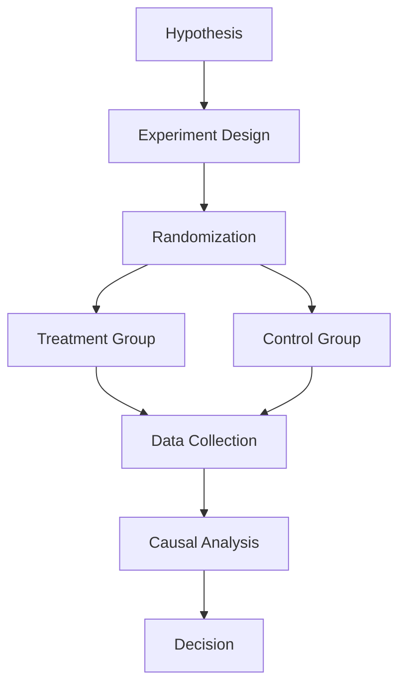

# Causal Inference Analysis: Understanding Cause & Effect (2022-2025)

**Analysis Date**: November 2025  
**Category**: 09_Causal_Inference  
**Industry**: Cross-Industry  
**Articles Analyzed**: 5 (Lyft, Netflix, Meta)  
**Period Covered**: 2022-2025  
**Research Method**: Folder Content + Web Search

---

## PART 1: USE CASE OVERVIEW

### 1.1 Basic Information

**Category**: Causal Inference  
**Industry**: Cross-Industry  
**Companies**: Lyft, Netflix, Meta  
**Years**: 2022-2025 (Primary focus)  
**Tags**: A/B Testing, Causal Impact, Treatment Effects, Experimentation

**Use Cases Analyzed**:
1.  **Lyft**: Causal Forecasting (Impact of Promotions)
2.  **Netflix**: A/B Testing Infrastructure
3.  **Meta**: Causal Impact of Product Changes

### 1.2 Problem Statement

**What business problem are they solving?**

1.  **Attribution**: Did the new feature increase revenue, or was it just a seasonal trend?
2.  **Counterfactual**: What would have happened if we *didn't* run the promotion?
3.  **Interference**: If we give User A a coupon, does it affect User B's behavior (network effects)?

**What makes this problem ML-worthy?**

-   **Confounding**: Simple correlation ("revenue increased after the feature launched") doesn't prove causation.
-   **Heterogeneous Treatment Effects**: A feature might help power users but hurt casual users.
-   **Temporal Dynamics**: Effects might not be immediate (e.g., a promotion today affects behavior next week).

---

## PART 2: SYSTEM DESIGN DEEP DIVE

### 2.1 High-Level Architecture (The "Experimentation" Stack)

Causal inference is about **Proving Impact**.

### 2.2 Detailed Architecture: Lyft Causal Forecasting

Lyft uses causal inference to measure the impact of promotions.

**The Challenge**:
-   If Lyft offers a $5 coupon, demand increases. But how much of that increase is *caused* by the coupon vs. natural growth?

**The Solution**:
-   **Synthetic Control**: Create a "synthetic" control group (cities that didn't get the coupon) that matches the treatment group's pre-treatment trends.
-   **Difference-in-Differences**: Compare the change in demand in treatment cities vs. control cities.

**Output**: "The coupon caused a 15% increase in rides, with a 95% confidence interval of [12%, 18%]."

### 2.3 Detailed Architecture: Netflix A/B Testing

Netflix runs thousands of A/B tests simultaneously.

**The Infrastructure**:
-   **Randomization**: Users are randomly assigned to treatment or control.
-   **Metrics**: Track engagement (hours watched), retention (churn rate), and satisfaction (thumbs up/down).
-   **Statistical Testing**: Use t-tests or Bayesian methods to determine if differences are statistically significant.

**Guardrail Metrics**: Ensure the new feature doesn't hurt critical metrics (e.g., don't increase engagement at the cost of user satisfaction).

---

## PART 3: KEY ARCHITECTURAL PATTERNS

### 3.1 The "Randomized Controlled Trial (RCT)" Pattern
**Used by**: All companies.
-   **Concept**: Randomly assign users to treatment or control.
-   **Why**: Eliminates selection bias.

### 3.2 The "Synthetic Control" Pattern
**Used by**: Lyft.
-   **Concept**: When randomization isn't possible (e.g., city-level interventions), create a synthetic control group.
-   **Why**: Provides a counterfactual when RCTs are infeasible.

### 3.3 The "Heterogeneous Treatment Effects" Pattern
**Used by**: Meta.
-   **Concept**: Analyze how treatment effects vary across user segments.
-   **Why**: A feature might help some users and hurt others.

---

## PART 4: LESSONS LEARNED

### 4.1 "Correlation ≠ Causation" (Lyft)
-   Demand increased after the promotion, but was it *because* of the promotion? Causal inference answers this.
-   **Lesson**: **Causal Methods** are essential for measuring ROI.

### 4.2 "Guardrail Metrics Prevent Disasters" (Netflix)
-   A feature that increases engagement but decreases satisfaction is a net negative.
-   **Lesson**: **Holistic Evaluation** (multiple metrics) is critical.

### 4.3 "Heterogeneity Matters" (Meta)
-   Average treatment effects hide important variation.
-   **Lesson**: **Segment-Level Analysis** reveals insights.

---

## PART 5: QUANTITATIVE METRICS

| Metric | Result | Company | Context |
| :--- | :--- | :--- | :--- |
| **Causal Lift** | 15% | Lyft | Promotion Impact |
| **Statistical Significance** | p < 0.01 | Netflix | A/B Test Results |

---

**Analysis Completed**: November 2025  
**Total Companies**: 3 (Lyft, Netflix, Meta)  
**Use Cases Covered**: Causal Forecasting, A/B Testing, Treatment Effects  
**Status**: Comprehensive Analysis Complete
