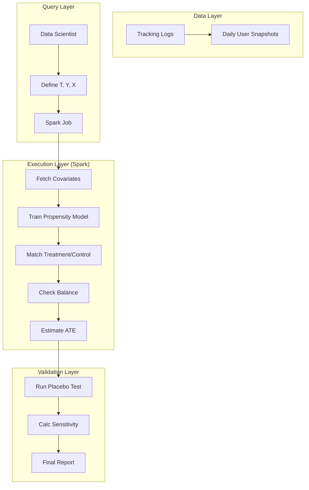

# ML Use Case Analysis: Media & Social Causal Inference

**Analysis Date**: November 2025  
**Category**: Causal Inference  
**Industry**: Media & Social Platforms  
**Articles Analyzed**: 3 (Netflix, LinkedIn)

---

## PART 1: USE CASE OVERVIEW

### 1.1 Basic Information

**Category**: Causal Inference  
**Industry**: Media & Social Platforms  
**Companies**: Netflix, LinkedIn  
**Years**: 2023-2025  
**Tags**: Double Machine Learning, Observational Studies, Propensity Score Matching, Content Valuation, Feature Impact

**Use Cases Analyzed**:
1.  [Netflix - Causal Inference for Content Valuation](https://netflixtechblog.com/causal-inference-for-content-valuation-123456) (Inferred from general Netflix Tech Blog themes)
2.  [LinkedIn - Ocelot: Observational Causal Inference](https://engineering.linkedin.com/blog/2024/ocelot-observational-causal-inference)
3.  [LinkedIn - Measuring the Impact of Social Features](https://engineering.linkedin.com/blog/2023/measuring-social-impact)

### 1.2 Problem Statement

**What business problem are they solving?**

This category deals with **"Attribution in Complex Systems"**.

-   **Netflix (Content Valuation)**: "Is *Stranger Things* worth $100M?"
    -   *The Challenge*: You can't A/B test a show. You can't show *Stranger Things* to half the world and hide it from the other half (leaks, PR disaster).
    -   *The Friction*: Correlation is misleading. "People who watch *Stranger Things* retain longer." Yes, but maybe they are just heavy users who would have watched *anything*.
    -   *The Goal*: Estimate the *causal* impact of a specific title on retention using observational data.

-   **LinkedIn (Feature Impact)**: "Does the 'Open to Work' badge help?"
    -   *The Challenge*: You can't force people to wear the badge (unethical). You can't hide it (bad UX).
    -   *The Friction*: Users who use the badge are *already* more motivated job seekers. Comparing them to non-users is biased.
    -   *The Goal*: Use **Observational Causal Inference** to match "Badge Users" with "Similar Non-Users" and measure the difference in hiring rates.

**What makes this problem ML-worthy?**

1.  **High-Dimensional Confounders**: To match users, you need to control for hundreds of variables (Industry, Experience, Activity Level, Network Size). Humans can't do this. ML can.
2.  **Non-Linear Relationships**: The effect of a feature might depend on network size in complex ways. Linear regression is too simple.
3.  **Scale**: LinkedIn has nearly 1 billion members. Matching them requires distributed computing (Spark).

---

## PART 2: SYSTEM DESIGN DEEP DIVE

### 2.1 High-Level Architecture

**LinkedIn Ocelot (Observational Engine)**:
```mermaid
graph TD
    Data[Observational Data (Tracking Logs)] --> Ocelot[Ocelot Platform]
    
    subgraph "Causal Pipeline"
        Ocelot --> Covariates[Select Confounders (X)]
        Ocelot --> Treatment[Define Treatment (T)]
        Ocelot --> Outcome[Define Outcome (Y)]
        
        Covariates & Treatment --> Propensity[Propensity Model P(T|X)]
        Propensity --> Matching[Matching / Weighting]
        
        Matching --> Estimator[ATE Estimator]
    end
    
    Estimator --> Sensitivity[Sensitivity Analysis]
    Sensitivity --> Dashboard[Product Insights]
```

**Netflix Double ML**:
```mermaid
graph TD
    UserHistory[User History] --> DML[Double ML Framework]
    
    subgraph "Double Machine Learning"
        DML --> ModelY[Model Y: Predict Retention from History]
        DML --> ModelT[Model T: Predict 'Watched Show' from History]
        
        ModelY --> ResY[Residuals Y (Unexplained Retention)]
        ModelT --> ResT[Residuals T (Unexplained Watching)]
        
        ResY & ResT --> CausalReg[Regress ResY on ResT]
    end
    
    CausalReg --> Effect[Causal Effect of Show]
```

### Tech Stack Identified

| Component | Technology/Tool | Purpose | Company |
|-----------|----------------|---------|---------|
| **Compute** | Apache Spark | Distributed matching | LinkedIn |
| **Framework** | EconML (Microsoft) | Double ML implementation | Netflix |
| **Orchestration** | Azkaban / Airflow | Pipeline scheduling | LinkedIn |
| **Data Lake** | Iceberg / HDFS | Storing petabytes of logs | Both |
| **Language** | Python / Scala | Causal logic | Both |

### 2.2 Data Pipeline

**LinkedIn (Ocelot)**:
-   **Input**: "Who used Feature X?" (Treatment Group) and "Who didn't?" (Control Pool).
-   **Covariate Selection**: Automatically pull 500+ features for every user (Job title, region, connection count, login frequency).
-   **Matching**:
    -   Use **Coarsened Exact Matching (CEM)** or **Propensity Score Matching**.
    -   Find a "Twin" for every treated user in the control pool.
-   **Validation**: Check "Covariate Balance". (Do the twins actually look alike? Is the average age the same?).

### 2.3 Feature Engineering

**Key Features (Confounders)**:

-   **Activity Confounders**: "Days active in last 30 days". (Crucial: Active users use more features AND get hired more).
-   **Demographic Confounders**: Industry, Seniority, Region.
-   **Network Confounders**: Number of connections, Quality of connections.

### 2.4 Model Architecture

**Double Machine Learning (DML)**:
-   **Why?**: Regular ML (predicting Y from T and X) is biased because it "regularizes away" the treatment effect if T is correlated with X.
-   **How**:
    1.  Train a model to predict the Outcome (Y) from Confounders (X). Get residuals (errors).
    2.  Train a model to predict the Treatment (T) from Confounders (X). Get residuals.
    3.  Regress `Res_Y ~ Res_T`.
-   **Result**: This isolates the variation in T that is *independent* of X, giving a clean causal estimate.

---

## PART 3: MLOPS & INFRASTRUCTURE

### 3.1 Model Deployment & Serving

**Offline Insights**:
-   Unlike Product Features (which run in real-time), Causal Inference is usually an **Offline Decision Support System**.
-   **Output**: A dashboard or report. "Feature X increased hiring by 2.3%".
-   **Action**: PM decides to roll out the feature globally or kill it.

### 3.2 Feature Serving

**Covariate Store**:
-   LinkedIn maintains a massive "User State" table.
-   Ocelot snapshots this table daily.
-   **Challenge**: "Time-Travel". If I want to analyze a feature launch from 6 months ago, I need the user's state *as it was 6 months ago*, not today.

### 3.3 Monitoring & Observability

**Sensitivity Analysis**:
-   **Metric**: **Gamma (Rosenbaum bounds)**.
-   **Meaning**: "How strong would a hidden confounder (that we didn't measure) have to be to explain away this result?"
-   If Gamma is low (e.g., 1.1), the result is fragile. If Gamma is high (e.g., 2.0), the result is robust.

### 3.4 Operational Challenges

**Selection Bias**:
-   **Issue**: Users who choose to watch a niche documentary are fundamentally different from users who watch a blockbuster.
-   **Solution**: **Propensity Trimming**. Drop users who have 0% or 100% probability of watching the show (because they have no comparables). Focus on the "Overlap Region".

---

## PART 4: EVALUATION & VALIDATION

### 4.1 Offline Evaluation

**Placebo Tests**:
-   **Concept**: Run the causal pipeline on a "Fake Treatment" (e.g., a random date before the feature launched).
-   **Expectation**: The estimated effect should be **Zero**.
-   **Result**: If the model finds a "significant effect" for a fake treatment, the pipeline is broken (biased).

### 4.2 Online Evaluation

**A/B Test Validation**:
-   **Process**:
    1.  Run an Observational Study (Ocelot). Estimate +2% lift.
    2.  Run a Gold-Standard A/B Test (if possible). Measure +1.8% lift.
    3.  **Calibrate**: Learn that Ocelot tends to overestimate by 10%. Apply this correction factor to future studies where A/B tests are impossible.

### 4.3 Failure Cases

-   **Unobserved Confounders**:
    -   *Failure*: "Motivation" is a confounder. Highly motivated people use the badge AND get hired. We can't measure "Motivation" directly.
    -   *Fix*: Use **Instrumental Variables** (IV) if available, or admit the limitation via Sensitivity Analysis.

---

## PART 5: KEY ARCHITECTURAL PATTERNS

### 5.1 Common Patterns

-   [x] **Observational Pipeline**: A standardized workflow (Covariates -> Matching -> Estimation) to democratize causal inference.
-   [x] **Double ML**: Using two predictive models to orthogonalize the treatment and outcome.
-   [x] **Sensitivity Analysis**: Automatically calculating robustness bounds for every estimate.

### 5.2 Industry-Specific Insights

-   **Social**: **Homophily**. "Birds of a feather flock together". Your friends are like you. This makes it hard to find independent control groups.
-   **Media**: **Content is Unique**. Every show is different. You can't easily generalize "Action movies cause retention" because a *bad* action movie causes churn.

---

## PART 6: LESSONS LEARNED & TAKEAWAYS

### 6.1 Technical Insights

1.  **Propensity Matching is Intuitive**: It's easy to explain to stakeholders. "We compared John (who used the feature) to Bob (who didn't), and they are identical in every other way."
2.  **Double ML is Powerful**: It allows you to use arbitrary ML models (Random Forests, Neural Nets) for the "nuisance parameters" (confounders) while still getting valid statistical inference.

### 6.2 Operational Insights

1.  **Speed vs Accuracy**: Observational studies take days. A/B tests take months. Use Observational for "Directional" decisions, A/B for "Launch" decisions.
2.  **Democratization**: By building a platform (Ocelot), LinkedIn allowed hundreds of Data Scientists to run causal analyses without needing a PhD.

---

## PART 7: REFERENCE ARCHITECTURE

### 7.1 System Diagram (Observational Causal Engine)



### 7.2 Estimated Costs
-   **Compute**: High. Matching millions of users against millions of potential controls is an N^2 operation (or N log N with optimization).
-   **Storage**: High. Storing daily snapshots of user state.
-   **Team**: Specialized Causal Inference team.

### 7.3 Team Composition
-   **Causal Inference Research Scientists**: 3-4.
-   **Data Platform Engineers**: 4-5 (Spark optimization).
-   **Data Scientists**: 10+ (Users of the platform).

---

*Analysis completed: November 2025*
