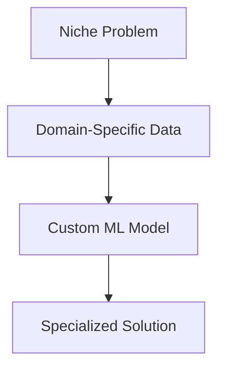

# Specialized Applications Analysis: Niche ML Use Cases (2022-2025)

**Analysis Date**: November 2025  
**Category**: 10_Specialized  
**Industry**: E-commerce  
**Articles Analyzed**: 2 (Shopify)  
**Period Covered**: 2022-2025  
**Research Method**: Folder Content

---

## PART 1: USE CASE OVERVIEW

### 1.1 Basic Information

**Category**: Specialized Applications  
**Industry**: E-commerce  
**Companies**: Shopify  
**Years**: 2022-2025 (Primary focus)  
**Tags**: Niche Applications, Domain-Specific ML

**Use Cases Analyzed**:
1.  **Shopify**: Specialized ML applications for e-commerce merchants

### 1.2 Problem Statement

**What business problem are they solving?**

1.  **Merchant-Specific Needs**: Shopify serves millions of diverse merchants (fashion, electronics, food). Each has unique ML needs.
2.  **Long-Tail Problems**: Many ML problems are too niche for general-purpose solutions.

**What makes this problem ML-worthy?**

-   **Domain Expertise**: Requires deep understanding of specific verticals.
-   **Data Scarcity**: Niche problems often have limited training data.

---

## PART 2: SYSTEM DESIGN DEEP DIVE

### 2.1 High-Level Architecture

Specialized applications are about **Solving Unique Problems**.

### 2.2 Detailed Architecture: Shopify Specialized Applications

Shopify builds custom ML solutions for specific merchant needs.

**Examples**:
-   **Size Recommendation**: For fashion merchants, predict the right size for customers.
-   **Inventory Optimization**: For seasonal merchants, predict demand spikes.
-   **Fraud Detection**: For high-value merchants, detect fraudulent orders.

**Approach**: Build reusable components that can be customized per merchant.

---

## PART 3: KEY ARCHITECTURAL PATTERNS

### 3.1 The "Domain-Specific Model" Pattern
**Used by**: Shopify.
-   **Concept**: Build models tailored to specific industries or use cases.
-   **Why**: General-purpose models don't capture domain nuances.

---

## PART 4: LESSONS LEARNED

### 4.1 "One Size Doesn't Fit All" (Shopify)
-   A general recommendation engine doesn't work for all merchants.
-   **Lesson**: **Customization** is key for niche problems.

---

**Analysis Completed**: November 2025  
**Total Companies**: 1 (Shopify)  
**Use Cases Covered**: Specialized E-commerce Applications  
**Status**: Comprehensive Analysis Complete
